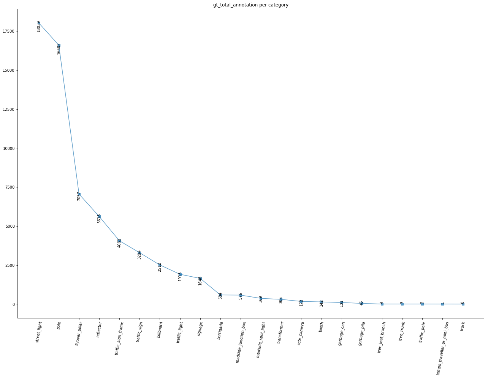
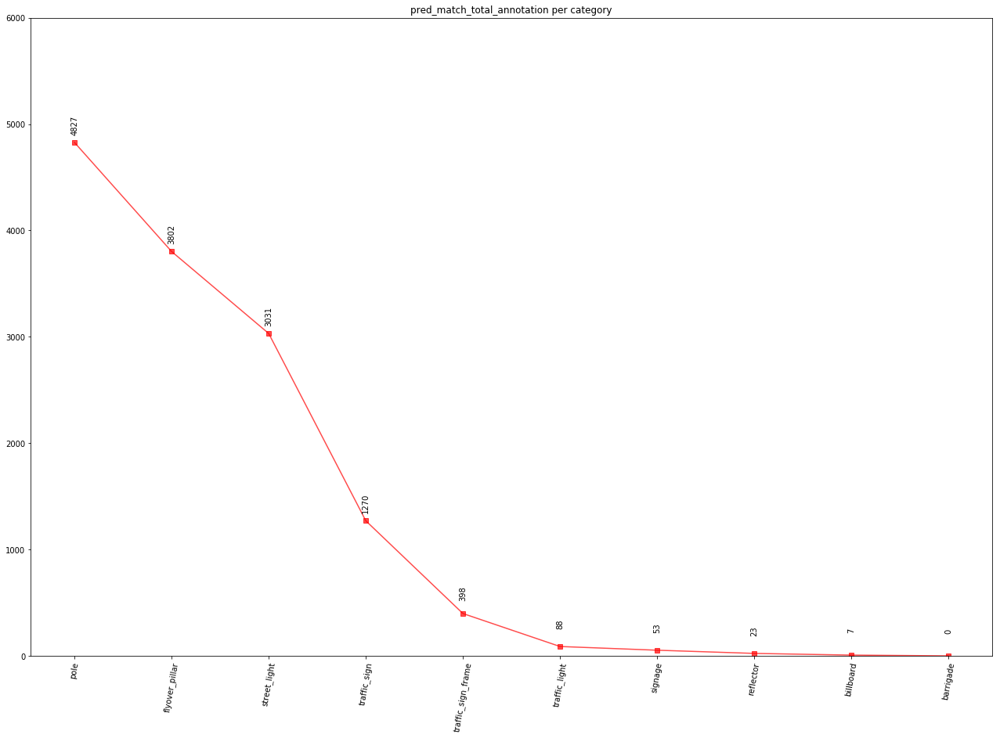
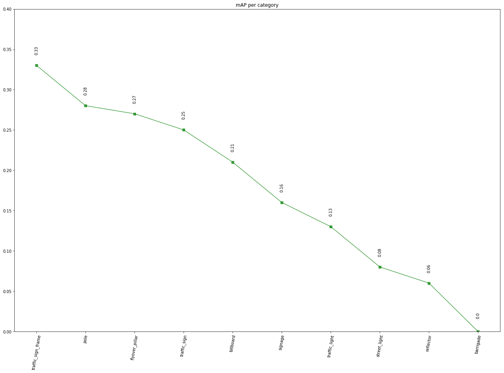

```python
import numpy as np
import json
import matplotlib.pyplot as plt
```


```python
json_file= '/home/nikhil/Documents/ai-ml-dl-data/logs/mask_rcnn/evaluation__hmd_20190329T001052/classification_rpt-train.json'
with open(json_file) as json_file:  
  data = json.load(json_file)
print(data)
```

    {'': {'pred_match_total_annotation': 0, 'f1': [], 'precisions': [], 'recalls': [], 'gt_total_annotation': 0, 'mAP': 0.0, 'support': []}, 'tree_trunk': {'pred_match_total_annotation': 0, 'f1': [], 'precisions': [], 'recalls': [], 'gt_total_annotation': 3, 'mAP': 0.0, 'support': []}, 'flyover_pillar': {'pred_match_total_annotation': 3802, 'f1': [], 'precisions': [1.0, 1.0, 1.0, 1.0, 1.0, 1.0, 1.0, 1.0, 0.0, 1.0, 1.0, 1.0, 1.0, 1.0, 1.0, 0.3333333333333333, 1.0, 0.5, 0.0, 1.0, 1.0, 1.0, 1.0, 1.0, 1.0, 1.0, 1.0, 0.0, 0.0, 1.0, 1.0, 1.0, 1.0, 1.0, 1.0, 1.0, 1.0, 1.0, 1.0, 1.0, 1.0, 1.0, 1.0, 1.0, 1.0, 1.0, 1.0, 0.875, 1.0, 1.0, 1.0, 1.0, 1.0, 1.0, 1.0, 0.8, 0.8333333333333334, 1.0, 0.5, 0.6666666666666666, 0.75, 1.0, 1.0, 1.0, 1.0, 1.0, 1.0, 0.5, 0.6666666666666666, 0.75, 0.6, 0.7142857142857143, 1.0, 1.0, 1.0, 1.0, 1.0, 1.0, 1.0, 1.0, 1.0, 0.5, 0.6666666666666666, 1.0, 1.0, 1.0, 0.75, 1.0, 1.0, 1.0, 1.0, 1.0, 1.0, 1.0, 1.0, 1.0, 1.0, 0.5, 0.0, 1.0, 1.0, 1.0, 1.0, 1.0, 1.0, 1.0, 1.0, 1.0, 0.75, 1.0, 1.0, 0.6666666666666666, 1.0, 1.0, 1.0, 1.0, 1.0, 1.0, 1.0, 1.0, 1.0, 1.0, 1.0, 1.0, 1.0, 1.0, 1.0, 1.0, 1.0, 1.0, 1.0, 1.0, 1.0, 1.0, 0.75, 0.875, 1.0, 1.0, 1.0, 1.0, 1.0, 1.0, 1.0, 1.0, 1.0, 0.6666666666666666, 0.75, 1.0, 1.0, 1.0, 1.0, 1.0, 1.0, 0.5, 1.0, 1.0, 1.0, 1.0, 1.0, 1.0, 1.0, 1.0, 0.6666666666666666, 0.0, 1.0, 1.0, 0.8, 1.0, 1.0, 0.75, 0.0, 1.0, 1.0, 1.0, 1.0, 0.5, 1.0, 1.0, 1.0, 1.0, 1.0, 1.0, 1.0, 0.8, 0.8333333333333334, 0.8571428571428571, 1.0, 1.0, 1.0, 1.0, 0.8, 1.0, 1.0, 1.0, 0.75, 1.0, 1.0, 0.6666666666666666, 0.75, 0.8, 0.6666666666666666, 1.0, 1.0, 1.0, 1.0, 1.0, 1.0, 1.0, 0.8333333333333334, 1.0, 1.0, 1.0, 1.0, 1.0, 1.0, 1.0, 1.0, 1.0, 1.0, 1.0, 1.0, 1.0, 1.0, 0.75, 1.0, 1.0, 1.0, 1.0, 1.0, 0.5, 0.75, 1.0, 1.0, 1.0, 0.5, 1.0, 0.5, 1.0, 1.0, 1.0, 1.0, 1.0, 1.0, 0.8, 0.6666666666666666, 1.0, 1.0, 1.0, 1.0, 1.0, 1.0, 1.0, 1.0, 1.0, 1.0, 0.0, 0.5, 1.0, 1.0, 1.0, 1.0, 0.0, 1.0, 0.0, 1.0, 1.0, 1.0, 1.0, 1.0, 1.0, 1.0, 0.0, 1.0, 1.0, 1.0, 1.0, 1.0, 1.0, 1.0, 1.0, 1.0, 1.0, 1.0, 1.0, 1.0, 0.6666666666666666, 1.0, 1.0, 1.0, 1.0, 1.0, 0.6666666666666666, 1.0, 0.5, 1.0, 0.6666666666666666, 0.75, 1.0, 1.0, 1.0, 1.0, 1.0, 1.0, 1.0, 1.0, 1.0, 1.0, 0.6666666666666666, 0.75, 0.8, 1.0, 1.0, 1.0, 1.0, 1.0, 1.0, 1.0, 1.0, 1.0, 1.0, 1.0, 1.0, 1.0, 0.0, 0.5, 1.0, 1.0, 1.0, 1.0, 1.0, 1.0, 1.0, 1.0, 0.0, 0.5, 0.0, 1.0, 0.6666666666666666, 1.0, 1.0, 1.0, 1.0, 1.0, 1.0, 0.6666666666666666, 0.75, 1.0, 1.0, 1.0, 1.0, 1.0, 1.0, 1.0, 0.75, 0.8333333333333334, 0.0, 0.5, 0.5, 1.0, 1.0, 1.0, 1.0, 1.0, 1.0, 1.0, 1.0, 0.75, 0.8, 0.6666666666666666, 1.0, 1.0, 0.6666666666666666, 1.0, 1.0, 1.0, 1.0, 1.0, 1.0, 1.0, 0.0, 0.5, 0.3333333333333333, 0.0, 1.0, 1.0, 1.0, 1.0, 1.0, 1.0, 1.0, 1.0, 0.5, 0.6666666666666666, 1.0, 1.0, 1.0, 1.0, 1.0, 1.0, 1.0, 1.0, 1.0, 0.6666666666666666, 1.0, 1.0, 1.0, 1.0, 1.0, 1.0, 1.0, 0.5, 1.0, 1.0, 1.0, 1.0, 1.0, 1.0, 1.0, 1.0, 1.0, 1.0, 1.0, 0.8571428571428571, 1.0, 0.0, 1.0, 1.0, 1.0, 1.0, 1.0, 1.0, 1.0, 1.0, 1.0, 1.0, 1.0, 1.0, 1.0, 0.5, 1.0, 1.0, 1.0, 1.0, 1.0, 1.0, 1.0, 1.0, 1.0, 1.0, 0.5, 0.6666666666666666, 1.0, 0.5, 1.0, 1.0, 0.0, 0.5, 0.6666666666666666, 1.0, 1.0, 1.0, 1.0, 1.0, 1.0, 1.0, 0.6666666666666666, 1.0, 1.0, 1.0, 1.0, 1.0, 1.0, 1.0, 1.0, 1.0, 1.0, 1.0, 1.0, 1.0, 1.0, 1.0, 0.5, 0.6666666666666666, 1.0, 1.0, 1.0, 1.0, 1.0, 1.0, 0.0, 1.0, 1.0, 1.0, 1.0, 1.0, 1.0, 1.0, 1.0, 1.0, 1.0, 1.0, 1.0, 1.0, 1.0, 1.0, 1.0, 1.0, 1.0, 1.0, 1.0, 1.0, 0.75, 1.0, 1.0, 1.0, 1.0, 1.0, 1.0, 1.0, 1.0, 0.8, 1.0, 1.0, 1.0, 1.0, 1.0, 1.0, 1.0, 1.0, 1.0, 1.0, 1.0, 1.0, 1.0, 1.0, 1.0, 1.0, 1.0, 1.0, 1.0, 1.0, 1.0, 1.0, 0.5, 0.3333333333333333, 1.0, 0.5, 0.6666666666666666, 0.75, 0.6, 0.5714285714285714, 1.0, 1.0, 0.0, 1.0, 1.0, 1.0, 1.0, 1.0, 0.8, 0.8333333333333334, 1.0, 1.0, 1.0, 1.0, 1.0, 1.0, 1.0, 1.0, 1.0, 1.0, 1.0, 1.0, 1.0, 1.0, 1.0, 1.0, 1.0, 1.0, 1.0, 1.0, 1.0, 1.0, 0.6666666666666666, 1.0, 1.0, 1.0, 1.0, 1.0, 1.0, 1.0, 1.0, 1.0, 1.0, 1.0, 1.0, 0.6666666666666666, 1.0, 1.0, 1.0, 1.0, 0.5, 1.0, 1.0, 0.6666666666666666, 0.75, 0.6, 0.6666666666666666, 1.0, 1.0, 1.0, 1.0, 1.0, 1.0, 1.0, 1.0, 0.75, 0.8333333333333334, 1.0, 1.0, 0.6666666666666666, 1.0, 1.0, 1.0, 0.8, 0.0, 0.6666666666666666, 1.0, 1.0, 1.0, 1.0, 0.0, 0.0, 1.0, 1.0, 1.0, 1.0, 1.0, 1.0, 1.0, 1.0, 1.0, 0.8333333333333334, 1.0, 1.0, 1.0, 0.0, 0.0, 1.0, 1.0, 0.6666666666666666, 1.0, 1.0, 0.0, 0.5, 1.0, 1.0, 0.6666666666666666, 1.0, 1.0, 0.75, 0.6, 1.0, 1.0, 1.0, 1.0, 1.0, 1.0, 1.0, 0.8333333333333334, 1.0, 1.0, 0.6666666666666666, 1.0, 1.0, 0.75, 0.8, 1.0, 1.0, 1.0, 1.0, 1.0, 1.0, 1.0, 1.0, 1.0, 1.0, 0.5, 1.0, 1.0, 1.0, 1.0, 1.0, 1.0, 1.0, 1.0, 1.0, 0.5, 1.0, 1.0, 1.0, 1.0, 1.0, 1.0, 1.0, 1.0, 1.0, 0.6666666666666666, 0.75, 1.0, 0.5, 0.6666666666666666, 0.6, 1.0, 1.0, 1.0, 1.0, 1.0, 1.0, 1.0, 1.0, 1.0, 1.0, 1.0, 1.0, 0.5, 1.0, 1.0, 0.75, 1.0, 1.0, 1.0, 1.0, 1.0, 1.0, 1.0, 1.0, 1.0, 1.0, 1.0, 1.0, 0.8, 0.8333333333333334, 1.0, 1.0, 1.0, 1.0, 1.0, 1.0, 1.0, 0.0, 1.0, 1.0, 1.0, 1.0, 1.0, 1.0, 1.0, 1.0, 0.8, 0.7142857142857143, 1.0, 1.0, 1.0, 1.0, 1.0, 1.0, 1.0, 1.0, 1.0, 1.0, 1.0, 0.6666666666666666, 0.75, 0.8, 0.8333333333333334, 0.8571428571428571, 1.0, 1.0, 1.0, 1.0, 1.0, 1.0, 1.0, 1.0, 1.0, 1.0, 0.8888888888888888, 0.8, 1.0, 1.0, 1.0, 1.0, 0.5, 1.0, 0.0, 1.0, 1.0, 0.6666666666666666, 1.0, 1.0, 1.0, 1.0, 1.0, 1.0, 1.0, 1.0, 1.0, 1.0, 1.0, 1.0, 1.0, 1.0, 1.0, 1.0, 1.0, 0.6666666666666666, 1.0, 1.0, 1.0, 1.0, 1.0, 1.0, 1.0, 1.0, 0.75, 1.0, 1.0, 0.6666666666666666, 0.75, 0.8, 0.875, 1.0, 1.0, 1.0, 1.0, 1.0, 1.0, 0.8, 1.0, 1.0, 1.0, 1.0, 1.0, 1.0, 1.0, 0.5, 1.0, 0.5, 1.0, 1.0, 1.0, 1.0, 1.0, 0.5, 0.3333333333333333, 0.5, 0.6, 0.6666666666666666, 0.7142857142857143, 1.0, 1.0, 1.0, 1.0, 0.0, 0.5, 0.0, 1.0, 1.0, 1.0, 1.0, 1.0, 0.0, 1.0, 1.0, 1.0, 1.0, 1.0, 1.0, 1.0, 1.0, 1.0, 1.0, 1.0, 1.0, 1.0, 1.0, 1.0, 1.0, 1.0, 1.0, 1.0, 1.0, 1.0, 1.0, 1.0, 1.0, 0.75, 1.0, 1.0, 1.0, 1.0, 1.0, 1.0, 1.0, 1.0, 1.0, 1.0, 1.0, 1.0, 1.0, 1.0, 1.0, 1.0, 1.0, 1.0, 1.0, 1.0, 0.8571428571428571, 0.875, 0.0, 1.0, 1.0, 1.0, 1.0, 1.0, 1.0, 1.0, 1.0, 1.0, 1.0, 1.0, 1.0, 1.0, 1.0, 1.0, 1.0, 1.0, 1.0, 1.0, 1.0, 1.0, 0.6666666666666666, 0.75, 0.0, 0.5, 1.0, 1.0, 1.0, 1.0, 0.0, 0.5, 0.6666666666666666, 1.0, 1.0, 1.0, 1.0, 1.0, 1.0, 1.0, 1.0, 1.0, 1.0, 1.0, 0.0, 0.0, 0.3333333333333333, 0.5, 0.6, 0.6666666666666666, 0.5714285714285714, 0.625, 1.0, 1.0, 1.0, 1.0, 1.0, 1.0, 1.0, 1.0, 1.0, 1.0, 0.75, 1.0, 1.0, 0.6666666666666666, 0.75, 1.0, 1.0, 1.0, 1.0, 1.0, 0.6666666666666666, 0.5, 1.0, 1.0, 1.0, 1.0, 1.0, 1.0, 0.8571428571428571, 0.875, 1.0, 1.0, 1.0, 1.0, 1.0, 1.0, 1.0, 1.0, 1.0, 1.0, 1.0, 1.0, 1.0, 1.0, 1.0, 1.0, 1.0, 0.0, 0.5, 1.0, 1.0, 1.0, 1.0, 1.0, 0.0, 0.5, 0.5, 1.0, 1.0, 0.6666666666666666, 1.0, 1.0, 1.0, 1.0, 0.6666666666666666, 1.0, 0.5, 1.0, 1.0, 1.0, 1.0, 1.0, 1.0, 1.0, 1.0, 1.0, 0.8, 1.0, 1.0, 1.0, 1.0, 1.0, 1.0, 1.0, 1.0, 1.0, 1.0, 0.6666666666666666, 0.75, 1.0, 1.0, 1.0, 1.0, 1.0, 1.0, 1.0, 1.0, 1.0, 1.0, 1.0, 1.0, 1.0, 1.0, 1.0, 1.0, 1.0, 1.0, 0.6666666666666666, 0.5, 0.6, 1.0, 1.0, 1.0, 0.6666666666666666, 1.0, 1.0, 1.0, 1.0, 1.0, 1.0, 0.75, 0.8, 1.0, 1.0, 1.0, 1.0, 1.0, 1.0, 1.0, 1.0, 1.0, 1.0, 1.0, 1.0, 1.0, 1.0, 1.0, 0.8, 1.0, 1.0, 1.0, 1.0, 1.0, 1.0, 1.0, 1.0, 1.0, 1.0, 1.0, 0.6666666666666666, 1.0, 1.0, 1.0, 1.0, 1.0, 1.0, 1.0, 1.0, 1.0, 1.0, 1.0, 1.0, 1.0, 1.0, 1.0, 1.0, 1.0, 1.0, 1.0, 1.0, 1.0, 0.75, 0.8, 1.0, 1.0, 1.0, 1.0, 0.8, 0.8333333333333334, 0.8571428571428571, 1.0, 1.0, 1.0, 1.0, 1.0, 1.0, 0.6666666666666666, 0.75, 0.8, 1.0, 0.5, 1.0, 1.0, 1.0, 1.0, 1.0, 1.0, 1.0, 1.0, 1.0, 1.0, 1.0, 1.0, 1.0, 1.0, 1.0, 1.0, 1.0, 1.0, 1.0, 0.0, 0.5, 0.3333333333333333, 0.25, 1.0, 1.0, 1.0, 1.0, 1.0, 1.0, 1.0, 0.0, 0.5, 0.6666666666666666, 1.0, 1.0, 1.0, 1.0, 1.0, 1.0, 1.0, 1.0, 1.0, 1.0, 1.0, 1.0, 1.0, 1.0, 1.0, 1.0, 1.0, 1.0, 1.0, 1.0, 1.0, 1.0, 1.0, 1.0, 1.0, 1.0, 1.0, 1.0, 1.0, 1.0, 1.0, 1.0, 1.0, 1.0, 1.0, 1.0, 1.0, 0.0, 0.5, 0.6666666666666666, 1.0, 1.0, 1.0, 1.0, 1.0, 1.0, 1.0, 1.0, 1.0, 1.0, 1.0, 0.75, 1.0, 1.0, 1.0, 1.0, 1.0, 1.0, 1.0, 1.0, 1.0, 1.0, 1.0, 1.0, 1.0, 0.8571428571428571, 1.0, 0.5, 1.0, 1.0, 1.0, 1.0, 1.0, 1.0, 1.0, 1.0, 1.0, 1.0, 1.0, 1.0, 1.0, 1.0, 1.0, 1.0, 1.0, 1.0, 1.0, 1.0, 1.0, 1.0, 1.0, 1.0, 1.0, 1.0, 1.0, 1.0, 0.6666666666666666, 1.0, 1.0, 1.0, 1.0, 1.0, 1.0, 1.0, 1.0, 0.0, 0.5, 1.0, 1.0, 1.0, 1.0, 1.0, 1.0, 1.0, 0.8, 0.8333333333333334, 1.0, 1.0, 1.0, 0.6666666666666666, 0.5, 0.5, 1.0, 1.0, 1.0, 1.0, 1.0, 1.0, 1.0, 0.8, 1.0, 1.0, 1.0, 1.0, 0.75, 0.8, 0.8333333333333334, 1.0, 1.0, 1.0, 1.0, 1.0, 1.0, 1.0, 1.0, 1.0, 1.0, 1.0, 1.0, 1.0, 1.0, 1.0, 1.0, 1.0, 1.0, 1.0, 0.0, 1.0, 1.0, 1.0, 1.0, 0.5, 1.0, 1.0, 1.0, 1.0, 1.0, 1.0, 1.0, 1.0, 1.0, 0.75, 1.0, 1.0, 0.6666666666666666, 1.0, 1.0, 1.0, 1.0, 1.0, 1.0, 1.0, 1.0, 1.0, 1.0, 0.6666666666666666, 1.0, 1.0, 1.0, 0.75, 1.0, 1.0, 0.0, 0.0, 1.0, 1.0, 1.0, 1.0, 1.0, 1.0, 0.5, 1.0, 1.0, 1.0, 0.75, 1.0, 1.0, 1.0, 1.0, 1.0, 1.0, 1.0, 1.0, 1.0, 1.0, 1.0, 1.0, 1.0, 1.0, 1.0, 1.0, 1.0, 1.0, 1.0, 1.0, 1.0, 1.0, 1.0, 1.0, 1.0, 1.0, 1.0, 1.0, 0.5, 0.6666666666666666, 1.0, 1.0, 0.75, 1.0, 1.0, 1.0, 1.0, 1.0, 1.0, 1.0, 1.0, 1.0, 1.0, 1.0, 1.0, 1.0, 1.0, 1.0, 1.0, 1.0, 1.0, 1.0, 1.0, 1.0, 1.0, 1.0, 1.0, 1.0, 1.0, 1.0, 1.0, 1.0, 1.0, 1.0, 1.0, 1.0, 1.0, 1.0, 1.0, 1.0, 1.0, 1.0, 1.0, 1.0, 1.0, 1.0, 1.0, 1.0, 1.0, 0.5, 1.0, 1.0, 1.0, 1.0, 1.0, 1.0, 1.0, 1.0, 1.0, 1.0, 1.0, 1.0, 1.0, 1.0, 1.0, 1.0, 1.0, 1.0, 1.0, 1.0, 1.0, 1.0, 1.0, 1.0, 1.0, 1.0, 1.0, 1.0, 1.0, 1.0, 1.0, 1.0, 1.0, 1.0, 1.0, 1.0, 1.0, 0.6666666666666666, 1.0, 1.0, 1.0, 1.0, 1.0, 0.75, 0.8, 1.0, 1.0, 1.0, 1.0, 1.0, 1.0, 1.0, 1.0, 1.0, 1.0, 0.6666666666666666, 0.75, 1.0, 1.0, 1.0, 0.8, 1.0, 1.0, 1.0, 1.0, 1.0, 1.0, 1.0, 1.0, 1.0, 1.0, 1.0, 1.0, 0.6666666666666666, 1.0, 1.0, 1.0, 1.0, 1.0, 1.0, 1.0, 1.0, 1.0, 1.0, 1.0, 1.0, 1.0, 1.0, 1.0, 0.8333333333333334, 0.7142857142857143, 0.75, 0.6666666666666666, 1.0, 1.0, 1.0, 1.0, 1.0, 1.0, 1.0, 1.0, 1.0, 1.0, 1.0, 1.0, 1.0, 1.0, 1.0, 1.0, 1.0, 1.0, 1.0, 1.0, 1.0, 0.0, 0.5, 0.5, 0.3333333333333333, 1.0, 1.0, 1.0, 0.75, 0.8, 0.6666666666666666, 1.0, 1.0, 1.0, 1.0, 1.0, 1.0, 1.0, 1.0, 1.0, 1.0, 1.0, 1.0, 1.0, 0.6666666666666666, 0.75, 0.6666666666666666, 0.7142857142857143, 1.0, 1.0, 1.0, 1.0, 1.0, 1.0, 1.0, 1.0, 1.0, 1.0, 1.0, 1.0, 1.0, 1.0, 0.8, 1.0, 1.0, 1.0, 0.6, 1.0, 1.0, 1.0, 1.0, 1.0, 1.0, 0.0, 1.0, 1.0, 1.0, 1.0, 1.0, 1.0, 1.0, 1.0, 1.0, 1.0, 1.0, 1.0, 1.0, 1.0, 1.0, 1.0, 1.0, 0.6666666666666666, 1.0, 1.0, 1.0, 0.8, 1.0, 1.0, 1.0, 1.0, 0.5, 0.3333333333333333, 0.5, 1.0, 1.0, 1.0, 1.0, 1.0, 0.8333333333333334, 0.7142857142857143, 1.0, 1.0, 1.0, 1.0, 1.0, 1.0, 1.0, 1.0, 1.0, 0.8571428571428571, 0.875, 1.0, 1.0, 0.6666666666666666, 1.0, 1.0, 1.0, 1.0, 0.6666666666666666, 0.4, 0.0, 0.0, 0.3333333333333333, 0.6, 0.6666666666666666, 0.7142857142857143, 1.0, 1.0, 1.0, 1.0, 0.5, 0.6666666666666666, 0.75, 1.0, 1.0, 1.0, 1.0, 1.0, 1.0, 1.0, 1.0, 1.0, 1.0, 1.0, 1.0, 0.8, 0.6666666666666666, 1.0, 1.0, 1.0, 1.0, 1.0, 1.0, 1.0, 1.0, 1.0, 1.0, 1.0, 1.0, 1.0, 0.6666666666666666, 1.0, 1.0, 1.0, 1.0, 0.0, 0.0, 1.0, 1.0, 0.6666666666666666, 0.75, 0.8333333333333334, 1.0, 1.0, 0.75, 1.0, 1.0, 1.0, 1.0, 1.0, 1.0, 0.0, 0.0, 1.0, 1.0, 1.0, 1.0, 1.0, 1.0, 1.0, 1.0, 1.0, 1.0, 1.0, 0.6666666666666666, 1.0, 1.0, 1.0, 1.0, 1.0, 1.0, 1.0, 1.0, 0.0, 0.0, 1.0, 1.0, 1.0, 1.0, 1.0, 1.0, 1.0, 1.0, 1.0, 1.0, 1.0, 1.0, 1.0, 0.875, 1.0, 1.0, 1.0, 1.0, 0.6666666666666666, 0.8333333333333334, 1.0, 1.0, 1.0, 1.0, 1.0, 1.0, 1.0, 1.0, 1.0, 1.0, 1.0, 1.0, 1.0, 1.0, 1.0, 1.0, 1.0, 1.0, 1.0, 1.0, 1.0, 1.0, 1.0, 1.0, 1.0, 0.8, 1.0, 1.0, 1.0, 1.0, 1.0, 0.75, 0.8, 1.0, 1.0, 1.0, 1.0, 1.0, 1.0, 0.0, 1.0, 1.0, 0.8, 1.0, 1.0, 1.0, 1.0, 1.0, 1.0, 1.0, 1.0, 1.0, 0.75, 1.0, 1.0, 1.0, 1.0, 1.0, 1.0, 1.0, 1.0, 1.0, 1.0, 1.0, 1.0, 1.0, 1.0, 1.0, 1.0, 1.0, 1.0, 1.0, 1.0, 1.0, 1.0, 1.0, 0.6666666666666666, 0.8, 1.0, 1.0, 1.0, 1.0, 1.0, 1.0, 1.0, 1.0, 1.0, 1.0, 1.0, 1.0, 0.5, 0.6666666666666666, 1.0, 1.0, 1.0, 1.0, 1.0, 1.0, 0.75, 1.0, 1.0, 1.0, 1.0, 1.0, 1.0, 1.0, 1.0, 1.0, 1.0, 0.0, 0.3333333333333333, 0.4, 0.0, 1.0, 1.0, 0.6666666666666666, 1.0, 1.0, 1.0, 1.0, 1.0, 1.0, 1.0, 0.8571428571428571, 1.0, 1.0, 1.0, 1.0, 0.6666666666666666, 1.0, 1.0, 1.0, 1.0, 0.5, 0.6666666666666666, 1.0, 0.5, 0.6666666666666666, 1.0, 1.0, 1.0, 1.0, 1.0, 1.0, 1.0, 0.75, 1.0, 1.0, 1.0, 0.6, 1.0, 1.0, 0.8, 1.0, 1.0, 1.0, 1.0, 1.0, 1.0, 1.0, 1.0, 1.0, 0.5, 0.6666666666666666, 1.0, 1.0, 1.0, 1.0, 1.0, 0.8333333333333334, 1.0, 1.0, 1.0, 1.0, 1.0, 0.5, 1.0, 1.0, 1.0, 0.8, 1.0, 1.0, 0.6666666666666666, 1.0, 1.0, 1.0, 1.0, 0.0, 1.0, 1.0, 1.0, 1.0, 1.0, 1.0, 1.0, 0.75, 1.0, 1.0, 1.0, 1.0, 1.0, 1.0, 1.0, 1.0, 1.0, 1.0, 1.0, 1.0, 0.0, 0.5, 0.0, 0.0, 1.0, 1.0, 1.0, 0.75, 1.0, 1.0, 1.0, 1.0, 1.0, 1.0, 1.0, 1.0, 1.0, 0.5, 1.0, 1.0, 0.5, 1.0, 1.0, 1.0, 1.0, 1.0, 1.0, 1.0, 1.0, 1.0, 1.0, 1.0, 1.0, 1.0, 1.0, 0.0, 0.5, 0.6666666666666666, 0.75, 0.8, 1.0, 1.0, 1.0, 1.0, 1.0, 1.0, 1.0, 1.0, 1.0, 1.0, 1.0, 1.0, 1.0, 1.0, 1.0, 1.0, 1.0, 1.0, 1.0, 1.0, 1.0, 1.0, 0.6666666666666666, 0.0, 1.0, 1.0, 1.0, 1.0, 1.0, 1.0, 1.0, 1.0, 1.0, 1.0, 1.0, 1.0, 1.0, 1.0, 1.0, 1.0, 1.0, 1.0, 1.0, 1.0, 0.6666666666666666, 1.0, 1.0, 1.0, 1.0, 1.0, 1.0, 1.0, 1.0, 1.0, 1.0, 1.0, 0.0, 1.0, 1.0, 1.0, 1.0, 1.0, 1.0, 0.0, 0.5, 0.6666666666666666, 0.75, 0.6, 0.6666666666666666, 0.5714285714285714, 1.0, 1.0, 1.0, 1.0, 1.0, 1.0, 1.0, 1.0, 1.0, 1.0, 1.0, 1.0, 1.0, 1.0, 1.0, 1.0, 1.0, 1.0, 1.0, 0.8, 1.0, 1.0, 1.0, 1.0, 0.8, 1.0, 1.0, 1.0, 1.0, 1.0, 1.0, 1.0, 1.0, 1.0, 1.0, 1.0, 1.0, 1.0, 0.875, 0.8888888888888888, 1.0, 1.0, 0.0, 1.0, 1.0, 0.6666666666666666, 1.0, 1.0, 1.0, 1.0, 0.0, 1.0, 1.0, 1.0, 1.0, 1.0, 1.0, 1.0, 1.0, 1.0, 1.0, 1.0, 1.0, 1.0, 0.6666666666666666, 1.0, 1.0, 1.0, 1.0, 1.0, 1.0, 1.0, 1.0, 1.0, 1.0, 1.0, 1.0, 1.0, 1.0, 1.0, 1.0, 1.0, 1.0, 1.0, 1.0, 1.0, 1.0, 1.0, 1.0, 1.0, 1.0, 1.0, 1.0, 1.0, 1.0, 0.5, 0.6666666666666666, 1.0, 1.0, 1.0, 1.0, 1.0, 1.0, 1.0, 1.0, 1.0, 1.0, 1.0, 1.0, 1.0, 1.0, 1.0, 1.0, 1.0, 0.6666666666666666, 1.0, 1.0, 0.6666666666666666, 0.75, 0.8, 1.0, 1.0, 1.0, 1.0, 1.0, 1.0, 1.0, 1.0, 1.0, 1.0, 0.6666666666666666, 0.8, 1.0, 1.0, 0.6666666666666666, 1.0, 1.0, 1.0, 1.0, 0.5, 1.0, 1.0, 1.0, 0.0, 1.0, 1.0, 1.0, 1.0, 1.0, 1.0, 1.0, 0.0, 0.5, 1.0, 0.0, 1.0, 1.0, 1.0, 1.0, 1.0, 1.0, 1.0, 1.0, 1.0, 1.0, 1.0, 1.0, 1.0, 1.0, 1.0, 1.0, 1.0, 1.0, 1.0, 1.0, 1.0, 1.0, 1.0, 1.0, 1.0, 1.0, 1.0, 1.0, 1.0, 1.0, 1.0, 1.0, 1.0, 1.0, 1.0, 1.0, 1.0, 1.0, 1.0, 1.0, 1.0, 1.0, 1.0, 1.0, 1.0, 1.0, 1.0, 1.0, 1.0, 0.6666666666666666, 0.5, 1.0, 1.0, 1.0, 1.0, 1.0, 1.0, 1.0, 1.0, 1.0, 0.8, 0.8571428571428571, 1.0, 1.0, 1.0, 0.75, 1.0, 1.0, 1.0, 0.5, 1.0, 1.0, 1.0, 1.0, 1.0, 0.5, 0.6666666666666666, 0.5, 0.4, 1.0, 1.0, 1.0, 1.0, 1.0, 1.0, 1.0, 1.0, 1.0, 1.0, 1.0, 1.0, 1.0, 1.0, 1.0, 0.75, 0.0, 0.5, 0.3333333333333333, 1.0, 1.0, 1.0, 1.0, 1.0, 1.0, 1.0, 1.0, 1.0, 1.0, 1.0, 1.0, 1.0, 1.0, 1.0, 1.0, 1.0, 1.0, 1.0, 1.0, 0.8, 0.8333333333333334, 1.0, 1.0, 1.0, 1.0, 1.0, 0.0, 1.0, 1.0, 1.0, 1.0, 1.0, 1.0, 1.0, 1.0, 1.0, 0.75, 0.0, 0.5, 0.6666666666666666, 1.0, 1.0, 1.0, 1.0, 1.0, 1.0, 1.0, 1.0, 0.8, 0.6666666666666666, 1.0, 1.0, 1.0, 0.6, 1.0, 1.0, 1.0, 1.0, 0.6666666666666666, 0.0, 0.5, 1.0, 1.0, 1.0, 1.0, 1.0, 1.0, 1.0, 1.0, 1.0, 1.0, 0.0, 1.0, 0.5, 1.0, 1.0, 1.0, 1.0, 1.0, 1.0, 1.0, 1.0, 0.8571428571428571, 1.0, 1.0, 1.0, 1.0, 0.5, 0.6666666666666666, 0.75, 0.8, 0.8333333333333334, 0.8571428571428571, 1.0, 0.6666666666666666, 0.75, 1.0, 0.5, 1.0, 1.0, 0.6666666666666666, 1.0, 1.0, 1.0, 1.0, 1.0, 1.0, 1.0, 1.0, 1.0, 1.0, 1.0, 1.0, 0.8, 1.0, 1.0, 1.0, 1.0, 1.0, 1.0, 1.0, 0.0, 0.5, 1.0, 1.0, 1.0, 1.0, 1.0, 1.0, 0.8, 1.0, 1.0, 0.6666666666666666, 1.0, 1.0, 1.0, 0.75, 0.8, 1.0, 1.0, 1.0, 1.0, 0.75, 1.0, 1.0, 1.0, 1.0, 1.0, 1.0, 1.0, 1.0, 1.0, 1.0, 1.0, 1.0, 1.0, 1.0, 1.0, 0.0, 0.5, 1.0, 1.0, 1.0, 1.0, 1.0, 1.0, 1.0, 1.0, 1.0, 0.6666666666666666, 0.75, 0.8, 0.6666666666666666, 1.0, 1.0, 0.6666666666666666, 1.0, 1.0, 1.0, 1.0, 1.0, 0.5, 0.6666666666666666, 1.0, 1.0, 1.0, 1.0, 1.0, 1.0, 1.0, 0.8, 1.0, 1.0, 1.0, 1.0, 1.0, 1.0, 1.0, 1.0, 1.0, 1.0, 1.0, 0.75, 1.0, 1.0, 1.0, 1.0, 1.0, 1.0, 1.0, 1.0, 1.0, 1.0, 1.0, 1.0, 0.5, 1.0, 1.0, 1.0, 1.0, 1.0, 1.0, 1.0, 1.0, 1.0, 1.0, 1.0, 1.0, 0.0, 1.0, 1.0, 1.0, 1.0, 0.0, 0.5, 1.0, 1.0, 1.0, 1.0, 1.0, 1.0, 1.0, 1.0, 1.0, 0.5, 1.0, 1.0, 1.0, 0.6666666666666666, 1.0, 1.0, 1.0, 1.0, 1.0, 1.0, 1.0, 0.75, 1.0, 1.0, 1.0, 0.0, 0.0, 1.0, 1.0, 1.0, 1.0, 1.0, 0.0, 1.0, 1.0, 1.0, 1.0, 1.0, 1.0, 1.0, 1.0, 1.0, 1.0, 0.8, 1.0, 1.0, 1.0, 0.8, 1.0, 1.0, 1.0, 0.0, 0.5, 1.0, 1.0, 1.0, 1.0, 1.0, 1.0, 1.0, 1.0, 1.0, 1.0, 1.0, 1.0, 1.0, 1.0, 1.0, 1.0, 1.0, 1.0, 1.0, 1.0, 1.0, 1.0, 1.0, 1.0, 1.0, 1.0, 1.0, 0.0, 1.0, 1.0, 1.0, 1.0, 1.0, 0.8333333333333334, 0.8571428571428571, 1.0, 1.0, 1.0, 1.0, 1.0, 1.0, 1.0, 1.0, 1.0, 0.75, 1.0, 1.0, 0.75, 1.0, 1.0, 0.0, 0.5, 1.0, 1.0, 1.0, 1.0, 1.0, 0.6666666666666666, 1.0, 1.0, 0.8, 0.8333333333333334, 0.0, 0.5, 1.0, 1.0, 1.0, 1.0, 1.0, 1.0, 1.0, 0.8, 0.6666666666666666, 1.0, 1.0, 0.75, 1.0, 1.0, 1.0, 1.0, 1.0, 1.0, 1.0, 1.0, 1.0, 1.0, 1.0, 1.0, 1.0, 1.0, 1.0, 1.0, 1.0, 1.0, 1.0, 0.75, 0.8, 1.0, 1.0, 1.0, 1.0, 1.0, 1.0, 1.0, 1.0, 1.0, 1.0, 1.0, 0.8, 1.0, 1.0, 1.0, 1.0, 1.0, 1.0, 1.0, 1.0, 1.0, 1.0, 1.0, 0.8571428571428571, 1.0, 0.5, 1.0, 1.0, 1.0, 1.0, 1.0, 1.0, 1.0, 1.0, 1.0, 0.8333333333333334, 0.0, 0.6666666666666666, 0.5, 1.0, 1.0, 1.0, 1.0, 1.0, 0.5, 1.0, 1.0, 1.0, 1.0, 1.0, 1.0, 1.0, 1.0, 1.0, 1.0, 1.0, 1.0, 1.0, 1.0, 0.75, 1.0, 1.0, 1.0, 1.0, 1.0, 1.0, 1.0, 1.0, 1.0, 1.0, 1.0, 0.8333333333333334, 1.0, 1.0, 1.0, 1.0, 1.0, 1.0, 1.0, 1.0, 1.0, 0.75, 0.8, 1.0, 1.0, 1.0, 0.75, 1.0, 1.0, 1.0, 1.0, 1.0, 0.5, 1.0, 1.0, 1.0, 1.0, 1.0, 0.0, 1.0, 1.0, 1.0, 1.0, 1.0, 1.0, 1.0, 1.0, 1.0, 1.0, 1.0, 1.0, 0.5, 1.0, 1.0, 1.0, 1.0, 1.0, 1.0, 1.0, 1.0, 1.0, 1.0, 1.0, 1.0, 0.5, 1.0, 1.0, 1.0, 1.0, 1.0, 1.0, 1.0, 0.6666666666666666, 1.0, 1.0, 1.0, 0.75, 1.0, 1.0, 1.0, 1.0, 1.0, 1.0, 1.0, 0.6666666666666666, 0.75, 0.8571428571428571, 1.0, 1.0, 0.6666666666666666, 0.0, 1.0, 1.0, 1.0, 1.0, 1.0, 1.0, 0.75, 0.8, 1.0, 1.0, 1.0, 1.0, 1.0, 1.0, 1.0, 1.0, 1.0, 1.0, 0.5, 1.0, 1.0, 1.0, 1.0, 0.5, 0.6666666666666666, 0.75, 0.6, 1.0, 1.0, 1.0, 1.0, 1.0, 1.0, 1.0, 1.0, 1.0, 1.0, 1.0, 1.0, 0.0, 0.0, 0.3333333333333333, 1.0, 1.0, 1.0, 1.0, 1.0, 1.0, 1.0, 1.0, 1.0, 1.0, 1.0, 1.0, 1.0, 1.0, 1.0, 1.0, 1.0, 1.0, 1.0, 1.0, 1.0, 1.0, 1.0, 1.0, 1.0, 1.0, 1.0, 1.0, 1.0, 1.0, 0.8571428571428571, 1.0, 1.0, 1.0, 0.75, 0.8, 0.0, 0.0, 1.0, 1.0, 1.0, 1.0, 1.0, 1.0, 1.0, 1.0, 1.0, 1.0, 1.0, 1.0, 1.0, 1.0, 1.0, 1.0, 1.0, 1.0, 1.0, 1.0, 1.0, 1.0, 1.0, 1.0, 1.0, 1.0, 1.0, 1.0, 1.0, 1.0, 1.0, 1.0, 1.0, 1.0, 0.6666666666666666, 1.0, 1.0, 1.0, 1.0, 1.0, 1.0, 1.0, 1.0, 1.0, 1.0, 1.0, 1.0, 1.0, 1.0, 1.0, 1.0, 1.0, 1.0, 1.0, 1.0, 1.0, 1.0, 1.0, 1.0, 1.0, 1.0, 1.0, 1.0, 1.0, 1.0, 1.0, 1.0, 1.0, 1.0, 0.0, 1.0, 0.5, 0.6666666666666666, 0.5, 0.0, 0.5, 1.0, 1.0, 1.0, 1.0, 1.0, 0.6666666666666666, 0.5, 0.0, 1.0, 1.0, 1.0, 1.0, 0.6666666666666666, 0.75, 0.6, 0.6666666666666666, 1.0, 0.5, 1.0, 1.0, 0.0, 1.0, 1.0, 1.0, 1.0, 1.0, 1.0, 1.0, 1.0, 1.0, 1.0, 1.0, 1.0, 1.0, 1.0, 1.0, 1.0, 1.0, 0.5, 0.8, 1.0, 1.0, 1.0, 0.75, 1.0, 1.0, 0.6666666666666666, 1.0, 1.0, 1.0, 0.5, 1.0, 1.0, 1.0, 1.0, 1.0, 1.0, 1.0, 1.0, 1.0, 1.0, 1.0, 1.0, 1.0, 1.0, 1.0, 1.0, 1.0, 1.0, 1.0, 1.0, 1.0, 1.0, 1.0, 1.0, 1.0, 1.0, 0.5, 1.0, 1.0, 1.0, 1.0, 0.8333333333333334, 0.0, 0.5, 0.6666666666666666, 1.0, 1.0, 0.6666666666666666, 1.0, 1.0, 1.0, 1.0, 0.5, 0.6666666666666666, 1.0, 1.0, 1.0, 1.0, 1.0, 1.0, 1.0, 1.0, 0.6666666666666666, 1.0, 1.0, 1.0, 1.0, 1.0, 1.0, 1.0, 1.0, 1.0, 1.0, 1.0, 0.0, 1.0, 1.0, 1.0, 1.0, 1.0, 1.0, 1.0, 0.0, 0.5, 0.6666666666666666, 1.0, 1.0, 1.0, 1.0, 1.0, 1.0, 1.0, 0.8571428571428571, 1.0, 1.0, 1.0, 1.0, 1.0, 1.0, 1.0, 0.5, 1.0, 0.6666666666666666, 0.75, 1.0, 1.0, 1.0, 1.0, 1.0, 1.0, 1.0, 1.0, 1.0, 1.0, 1.0, 1.0, 1.0, 0.5, 1.0, 1.0, 1.0, 0.8571428571428571, 1.0, 1.0, 1.0, 1.0, 1.0, 1.0, 1.0, 1.0, 0.6666666666666666, 0.75, 1.0, 1.0, 1.0, 1.0, 0.5, 1.0, 1.0, 1.0, 1.0, 1.0, 1.0, 1.0, 1.0, 1.0, 1.0, 1.0, 1.0, 1.0, 1.0, 0.75, 1.0, 1.0, 1.0, 1.0, 0.6666666666666666, 0.0, 1.0, 1.0, 1.0, 1.0, 1.0, 0.5, 0.6666666666666666, 0.75, 1.0, 1.0, 1.0, 1.0, 1.0, 1.0, 1.0, 1.0, 1.0, 1.0, 1.0, 1.0, 1.0, 1.0, 1.0, 1.0, 0.8, 1.0, 1.0, 1.0, 1.0, 1.0, 1.0, 1.0, 1.0, 1.0, 1.0, 1.0, 1.0, 1.0, 0.5, 1.0, 1.0, 0.5, 0.0, 1.0, 0.5, 0.6666666666666666, 0.5, 0.6, 1.0, 1.0, 0.6, 1.0, 1.0, 0.75, 0.8, 0.0, 0.5, 1.0, 1.0, 1.0, 1.0, 1.0, 1.0, 1.0, 1.0, 1.0, 1.0, 1.0, 1.0, 1.0, 0.75, 1.0, 1.0, 1.0, 1.0, 1.0, 0.6666666666666666, 1.0, 1.0, 1.0, 1.0, 1.0, 1.0, 0.0, 0.5, 0.6666666666666666, 1.0, 0.5, 0.6666666666666666, 0.75, 1.0, 1.0, 1.0, 1.0, 1.0, 1.0, 1.0, 1.0, 1.0, 0.5, 0.6666666666666666, 0.8, 1.0, 1.0, 0.75, 1.0, 1.0, 1.0, 1.0, 1.0, 1.0, 1.0, 1.0, 1.0, 1.0, 0.8571428571428571, 1.0, 1.0, 1.0, 1.0, 1.0, 0.75, 1.0, 1.0, 1.0, 1.0, 1.0, 1.0, 1.0, 0.5, 1.0, 1.0, 1.0, 1.0, 1.0, 1.0, 1.0, 0.875, 0.8888888888888888, 1.0, 1.0, 1.0, 1.0, 1.0, 1.0, 1.0, 1.0, 1.0, 1.0, 1.0, 1.0, 1.0, 1.0, 1.0, 1.0, 1.0, 1.0, 1.0, 1.0, 0.6666666666666666, 1.0, 1.0, 1.0, 0.6666666666666666, 0.75, 1.0, 1.0, 1.0, 1.0, 0.6, 1.0, 1.0, 0.6666666666666666, 1.0, 1.0, 1.0, 1.0, 1.0, 1.0, 0.8, 1.0, 0.0, 1.0, 1.0, 1.0, 1.0, 0.5, 1.0, 1.0, 1.0, 1.0, 1.0, 1.0, 1.0, 1.0, 1.0, 1.0, 1.0, 1.0, 1.0, 1.0, 1.0, 1.0, 1.0, 0.75, 1.0, 0.6666666666666666, 1.0, 1.0, 1.0, 1.0, 1.0, 1.0, 1.0, 1.0, 1.0, 0.8333333333333334, 1.0, 1.0, 1.0, 1.0, 1.0, 1.0, 1.0, 1.0, 0.8333333333333334, 1.0, 1.0, 1.0, 1.0, 1.0, 1.0, 1.0, 1.0, 0.8, 1.0, 1.0, 1.0, 1.0, 1.0, 1.0, 1.0, 1.0, 1.0, 1.0, 1.0, 1.0, 1.0, 1.0, 1.0, 1.0, 1.0, 1.0, 1.0, 1.0, 1.0, 1.0, 1.0, 1.0, 1.0, 0.5, 1.0, 1.0, 0.5, 1.0, 0.5, 1.0, 1.0, 1.0, 1.0, 1.0, 1.0, 1.0, 0.8, 0.8333333333333334, 1.0, 0.5, 0.6666666666666666, 0.75, 0.8, 1.0, 1.0, 1.0, 1.0, 1.0, 1.0, 1.0, 1.0, 1.0, 1.0, 1.0, 1.0, 1.0, 1.0, 1.0, 0.8333333333333334, 1.0, 1.0, 1.0, 1.0, 0.0, 1.0, 1.0, 1.0, 1.0, 1.0, 1.0, 1.0, 1.0, 1.0, 1.0, 1.0, 1.0, 1.0, 0.5, 0.6666666666666666, 0.75, 0.6, 1.0, 1.0, 0.75, 1.0, 0.0, 0.5, 1.0, 0.5, 0.6666666666666666, 0.75, 0.0, 0.0, 0.5, 0.3333333333333333, 1.0, 1.0, 1.0, 1.0, 0.0, 0.3333333333333333, 0.5, 1.0, 1.0, 1.0, 1.0, 1.0, 1.0, 1.0, 1.0, 0.75, 1.0, 1.0, 0.75, 0.5, 0.3333333333333333, 1.0, 1.0, 1.0, 0.6666666666666666, 0.75, 0.0, 0.0, 0.3333333333333333, 1.0, 1.0, 1.0, 1.0, 1.0, 1.0, 1.0, 1.0, 1.0, 1.0, 1.0, 1.0, 1.0, 0.6666666666666666, 0.75, 0.8, 0.8571428571428571, 0.875, 0.8888888888888888, 1.0, 0.5, 1.0, 1.0, 1.0, 1.0, 1.0, 0.5, 1.0, 1.0, 1.0, 0.5, 1.0, 1.0, 0.8, 1.0, 0.3333333333333333, 1.0, 1.0, 1.0, 1.0, 1.0, 1.0, 1.0, 1.0, 1.0, 1.0, 1.0, 1.0, 1.0, 0.5, 0.6666666666666666, 0.5, 1.0, 1.0, 1.0, 1.0, 1.0, 1.0, 0.8571428571428571, 1.0, 1.0, 1.0, 1.0, 1.0, 1.0, 1.0, 1.0, 1.0, 1.0, 1.0, 1.0, 1.0, 1.0, 1.0, 1.0, 1.0, 1.0, 1.0, 0.3333333333333333, 1.0, 0.5, 1.0, 1.0, 1.0, 1.0, 1.0, 1.0, 0.75, 1.0, 1.0, 1.0, 0.8, 1.0, 0.5, 1.0, 1.0, 1.0, 1.0, 1.0, 1.0, 1.0, 1.0, 1.0, 0.75, 0.8, 0.8333333333333334, 1.0, 1.0, 1.0, 1.0, 1.0, 1.0, 0.75, 0.8, 1.0, 1.0, 1.0, 1.0, 0.8, 0.8333333333333334, 0.8571428571428571, 0.875, 0.7777777777777778, 1.0, 1.0, 1.0, 1.0, 1.0, 1.0, 0.8571428571428571, 1.0, 1.0, 1.0, 1.0, 1.0, 1.0, 1.0, 0.5, 1.0, 1.0, 1.0, 1.0, 0.5, 0.0, 1.0, 0.5, 1.0, 1.0, 1.0, 1.0, 1.0, 1.0, 1.0, 1.0, 1.0, 1.0, 1.0, 1.0, 1.0, 1.0, 1.0, 1.0, 1.0, 1.0, 1.0, 1.0, 1.0, 1.0, 1.0], 'recalls': [0.1666666716337204, 0.3333333432674408, 0.5, 0.6666666865348816, 0.0555555559694767, 0.1111111119389534, 0.1666666716337204, 0.1666666716337204, 0.0, 0.1111111119389534, 0.2222222238779068, 0.3333333432674408, 0.09090909361839294, 0.1818181872367859, 0.27272728085517883, 0.05882352963089943, 0.1666666716337204, 0.1666666716337204, 0.0, 0.0625, 0.125, 0.1875, 0.25, 0.1428571492433548, 0.2857142984867096, 0.4285714328289032, 0.125, 0.0, 0.0, 0.04545454680919647, 0.09090909361839294, 0.13636364042758942, 0.095238097012043, 0.1428571492433548, 0.190476194024086, 0.2380952388048172, 0.2857142984867096, 0.1111111119389534, 0.3333333432674408, 0.1666666716337204, 0.3333333432674408, 0.5, 0.06666667014360428, 0.13333334028720856, 0.20000000298023224, 0.2666666805744171, 0.4000000059604645, 0.46666666865348816, 0.1428571492433548, 0.2857142984867096, 0.4285714328289032, 0.029411764815449715, 0.05882352963089943, 0.0882352963089943, 0.11764705926179886, 0.11764705926179886, 0.14705882966518402, 0.09090909361839294, 0.09090909361839294, 0.1818181872367859, 0.27272728085517883, 0.06666667014360428, 0.13333334028720856, 0.20000000298023224, 0.0625, 0.125, 0.024390242993831635, 0.024390242993831635, 0.04878048598766327, 0.0731707289814949, 0.0731707289814949, 0.12195122241973877, 0.09090909361839294, 0.1818181872367859, 0.27272728085517883, 0.1428571492433548, 0.2857142984867096, 0.07692307978868484, 0.1538461595773697, 0.23076923191547394, 0.0555555559694767, 0.0555555559694767, 0.1111111119389534, 0.05000000074505806, 0.10000000149011612, 0.15000000596046448, 0.15000000596046448, 0.04545454680919647, 0.09090909361839294, 0.13636364042758942, 0.09090909361839294, 0.1818181872367859, 0.27272728085517883, 0.3636363744735718, 0.0555555559694767, 0.1111111119389534, 0.0714285746216774, 0.0714285746216774, 0.0, 0.06666667014360428, 0.13333334028720856, 0.09090909361839294, 0.1818181872367859, 0.27272728085517883, 0.07692307978868484, 0.1538461595773697, 0.06666667014360428, 0.13333334028720856, 0.20000000298023224, 0.05882352963089943, 0.11764705926179886, 0.11764705926179886, 0.09090909361839294, 0.1818181872367859, 0.27272728085517883, 0.4545454680919647, 0.0476190485060215, 0.095238097012043, 0.1428571492433548, 0.190476194024086, 0.0833333358168602, 0.1666666716337204, 0.25, 0.0833333358168602, 0.1666666716337204, 0.25, 0.3333333432674408, 0.4166666567325592, 0.125, 0.25, 0.5, 0.07692307978868484, 0.1538461595773697, 0.23076923191547394, 0.23076923191547394, 0.5384615659713745, 0.0833333358168602, 0.1666666716337204, 0.06666667014360428, 0.13333334028720856, 0.20000000298023224, 0.1666666716337204, 0.3333333432674408, 0.05263157933950424, 0.10526315867900848, 0.10526315867900848, 0.15789473056793213, 0.125, 0.25, 0.375, 0.5, 0.625, 0.0833333358168602, 0.0833333358168602, 0.1428571492433548, 0.2857142984867096, 0.4285714328289032, 0.05882352963089943, 0.11764705926179886, 0.1764705926179886, 0.1666666716337204, 0.3333333432674408, 0.3333333432674408, 0.0, 0.07692307978868484, 0.23076923191547394, 0.3076923191547394, 0.10000000149011612, 0.30000001192092896, 0.30000001192092896, 0.0, 0.1111111119389534, 0.2222222238779068, 0.0714285746216774, 0.1428571492433548, 0.1428571492433548, 0.125, 0.25, 0.375, 0.024390242993831635, 0.04878048598766327, 0.0731707289814949, 0.09756097197532654, 0.09756097197532654, 0.12195122241973877, 0.1463414579629898, 0.06666667014360428, 0.13333334028720856, 0.07692307978868484, 0.23076923191547394, 0.3076923191547394, 0.1428571492433548, 0.2857142984867096, 0.4285714328289032, 0.4285714328289032, 0.025641025975346565, 0.05128205195069313, 0.05128205195069313, 0.07692307978868484, 0.10256410390138626, 0.10256410390138626, 0.125, 0.25, 0.375, 0.0833333358168602, 0.1666666716337204, 0.25, 0.4166666567325592, 0.4166666567325592, 0.1428571492433548, 0.2857142984867096, 0.09090909361839294, 0.1818181872367859, 0.20000000298023224, 0.4000000059604645, 0.1111111119389534, 0.2222222238779068, 0.3333333432674408, 0.06666667014360428, 0.13333334028720856, 0.0833333358168602, 0.1666666716337204, 0.25, 0.25, 0.1111111119389534, 0.09090909361839294, 0.1818181872367859, 0.27272728085517883, 0.06666667014360428, 0.06666667014360428, 0.20000000298023224, 0.04545454680919647, 0.09090909361839294, 0.05000000074505806, 0.05000000074505806, 0.09090909361839294, 0.09090909361839294, 0.05263157933950424, 0.10000000149011612, 0.025641025975346565, 0.05128205195069313, 0.07692307978868484, 0.10256410390138626, 0.10256410390138626, 0.10256410390138626, 0.04545454680919647, 0.09090909361839294, 0.1818181872367859, 0.22727273404598236, 0.07692307978868484, 0.1538461595773697, 0.06666667014360428, 0.13333334028720856, 0.20000000298023224, 0.2666666805744171, 0.0, 0.1428571492433548, 0.13333334028720856, 0.20000000298023224, 0.2666666805744171, 0.4000000059604645, 0.0, 0.25, 0.0, 0.0833333358168602, 0.024390242993831635, 0.04878048598766327, 0.0731707289814949, 0.10000000149011612, 0.20000000298023224, 0.30000001192092896, 0.0, 0.1666666716337204, 0.3333333432674408, 0.025641025975346565, 0.05128205195069313, 0.07692307978868484, 0.10256410390138626, 0.12820513546466827, 0.1538461595773697, 0.1794871836900711, 0.20512820780277252, 0.23076923191547394, 0.20000000298023224, 0.4000000059604645, 0.4000000059604645, 0.09090909361839294, 0.1818181872367859, 0.27272728085517883, 0.125, 0.25, 0.25, 0.25, 0.25, 0.0833333358168602, 0.1666666716337204, 0.25, 0.1111111119389534, 0.2222222238779068, 0.3333333432674408, 0.6666666865348816, 0.0833333358168602, 0.1666666716337204, 0.1428571492433548, 0.2857142984867096, 0.03448275849223137, 0.06896551698446274, 0.06896551698446274, 0.1034482792019844, 0.13793103396892548, 0.0833333358168602, 0.1666666716337204, 0.25, 0.3333333432674408, 0.10000000149011612, 0.20000000298023224, 0.30000001192092896, 0.4000000059604645, 0.6000000238418579, 0.0833333358168602, 0.1666666716337204, 0.25, 0.3333333432674408, 0.0, 0.06666667014360428, 0.125, 0.25, 0.09090909361839294, 0.1818181872367859, 0.27272728085517883, 0.1666666716337204, 0.3333333432674408, 0.5, 0.0, 0.0357142873108387, 0.0, 0.0833333358168602, 0.1666666716337204, 0.1666666716337204, 0.05882352963089943, 0.11764705926179886, 0.1764705926179886, 0.06666667014360428, 0.13333334028720856, 0.13333334028720856, 0.20000000298023224, 0.1111111119389534, 0.2222222238779068, 0.06666667014360428, 0.20000000298023224, 0.09090909361839294, 0.1818181872367859, 0.27272728085517883, 0.27272728085517883, 0.4545454680919647, 0.0, 0.032258063554763794, 0.06451612710952759, 0.125, 0.25, 0.375, 0.5, 0.625, 0.021276595070958138, 0.042553190141916275, 0.06382978707551956, 0.06382978707551956, 0.08510638028383255, 0.08510638028383255, 0.03125, 0.0625, 0.0625, 0.04545454680919647, 0.09090909361839294, 0.1818181872367859, 0.07692307978868484, 0.1538461595773697, 0.23076923191547394, 0.3076923191547394, 0.0, 0.03333333507180214, 0.03333333507180214, 0.0, 0.125, 0.25, 0.0833333358168602, 0.125, 0.25, 0.375, 0.05263157933950424, 0.07692307978868484, 0.07692307978868484, 0.1538461595773697, 0.0357142873108387, 0.0714285746216774, 0.1071428582072258, 0.1428571492433548, 0.10000000149011612, 0.20000000298023224, 0.30000001192092896, 0.3333333432674408, 0.6666666865348816, 0.6666666865348816, 0.09090909361839294, 0.1818181872367859, 0.10000000149011612, 0.20000000298023224, 0.30000001192092896, 0.4000000059604645, 0.1111111119389534, 0.1111111119389534, 0.0714285746216774, 0.1428571492433548, 0.1666666716337204, 0.3333333432674408, 0.5, 0.023255813866853714, 0.04651162773370743, 0.06976744532585144, 0.09302325546741486, 0.11627907305955887, 0.13953489065170288, 0.13953489065170288, 0.10000000149011612, 0.0, 0.1111111119389534, 0.2222222238779068, 0.3333333432674408, 0.20000000298023224, 0.0833333358168602, 0.1666666716337204, 0.25, 0.4166666567325592, 0.1428571492433548, 0.2857142984867096, 0.4285714328289032, 0.5714285969734192, 0.06666667014360428, 0.06666667014360428, 0.03448275849223137, 0.06896551698446274, 0.1111111119389534, 0.07999999821186066, 0.11999999731779099, 0.1599999964237213, 0.09090909361839294, 0.1818181872367859, 0.27272728085517883, 0.04545454680919647, 0.04545454680919647, 0.09090909361839294, 0.10000000149011612, 0.10000000149011612, 0.20000000298023224, 0.6000000238418579, 0.0, 0.03333333507180214, 0.06666667014360428, 0.05882352963089943, 0.11764705926179886, 0.1764705926179886, 0.25, 0.5, 0.75, 0.1428571492433548, 0.2857142984867096, 0.25, 0.07692307978868484, 0.1538461595773697, 0.23076923191547394, 0.38461539149284363, 0.1111111119389534, 0.2222222238779068, 0.3333333432674408, 0.4444444477558136, 0.0476190485060215, 0.095238097012043, 0.1428571492433548, 0.125, 0.25, 0.05882352963089943, 0.05882352963089943, 0.11764705926179886, 0.10000000149011612, 0.20000000298023224, 0.20000000298023224, 0.07692307978868484, 0.1538461595773697, 0.23076923191547394, 0.0, 0.09090909361839294, 0.1818181872367859, 0.27272728085517883, 0.0714285746216774, 0.1428571492433548, 0.2142857164144516, 0.0833333358168602, 0.1666666716337204, 0.25, 0.4166666567325592, 0.10000000149011612, 0.20000000298023224, 0.30000001192092896, 0.1428571492433548, 0.2857142984867096, 0.1428571492433548, 0.2857142984867096, 0.5714285969734192, 0.20000000298023224, 0.4000000059604645, 0.6000000238418579, 0.6000000238418579, 0.05000000074505806, 0.10000000149011612, 0.15000000596046448, 0.30000001192092896, 0.025641025975346565, 0.05128205195069313, 0.07692307978868484, 0.10256410390138626, 0.10256410390138626, 0.1111111119389534, 0.2222222238779068, 0.3333333432674408, 0.0833333358168602, 0.1666666716337204, 0.0833333358168602, 0.25, 0.04545454680919647, 0.09090909361839294, 0.13636364042758942, 0.1818181872367859, 0.07692307978868484, 0.1538461595773697, 0.3076923191547394, 0.023255813866853714, 0.04651162773370743, 0.06976744532585144, 0.09302325546741486, 0.11627907305955887, 0.13953489065170288, 0.1627907007932663, 0.06666667014360428, 0.06666667014360428, 0.06666667014360428, 0.021739130839705467, 0.021739130839705467, 0.043478261679410934, 0.06521739065647125, 0.06521739065647125, 0.08695652335882187, 0.10000000149011612, 0.20000000298023224, 0.0, 0.07692307978868484, 0.1538461595773697, 0.0714285746216774, 0.1428571492433548, 0.2142857164144516, 0.2857142984867096, 0.3571428656578064, 0.1111111119389534, 0.2222222238779068, 0.3333333432674408, 0.4444444477558136, 0.1666666716337204, 0.3333333432674408, 0.5, 0.25, 0.5, 0.75, 0.0833333358168602, 0.1666666716337204, 0.25, 0.0833333358168602, 0.1666666716337204, 0.25, 0.0833333358168602, 0.1666666716337204, 0.25, 0.3333333432674408, 0.20000000298023224, 0.4000000059604645, 0.4000000059604645, 0.0714285746216774, 0.1428571492433548, 0.2857142984867096, 0.05882352963089943, 0.11764705926179886, 0.1764705926179886, 0.05882352963089943, 0.11764705926179886, 0.1764705926179886, 0.23529411852359772, 0.07692307978868484, 0.1538461595773697, 0.1538461595773697, 0.10000000149011612, 0.20000000298023224, 0.30000001192092896, 0.4000000059604645, 0.10000000149011612, 0.022727273404598236, 0.04545454680919647, 0.04545454680919647, 0.06818182021379471, 0.06818182021379471, 0.09090909361839294, 0.0555555559694767, 0.1111111119389534, 0.1666666716337204, 0.2222222238779068, 0.1666666716337204, 0.10000000149011612, 0.20000000298023224, 0.30000001192092896, 0.30000001192092896, 0.5, 0.0357142873108387, 0.0714285746216774, 0.0714285746216774, 0.10000000149011612, 0.20000000298023224, 0.30000001192092896, 0.4000000059604645, 0.0, 0.10000000149011612, 0.1428571492433548, 0.05882352963089943, 0.11764705926179886, 0.1764705926179886, 0.0, 0.0, 0.1666666716337204, 0.3333333432674408, 0.5, 0.1111111119389534, 0.021739130839705467, 0.043478261679410934, 0.06521739065647125, 0.08695652335882187, 0.10869564861059189, 0.10869564861059189, 0.02500000037252903, 0.05000000074505806, 0.07500000298023224, 0.0, 0.0, 0.1428571492433548, 0.2857142984867096, 0.2857142984867096, 0.0833333358168602, 0.1666666716337204, 0.0, 0.0714285746216774, 0.20000000298023224, 0.4000000059604645, 0.4000000059604645, 0.10000000149011612, 0.15000000596046448, 0.15000000596046448, 0.15000000596046448, 0.0625, 0.125, 0.1875, 0.0833333358168602, 0.1666666716337204, 0.25, 0.3333333432674408, 0.4166666567325592, 0.0555555559694767, 0.1111111119389534, 0.1111111119389534, 0.07692307978868484, 0.1538461595773697, 0.23076923191547394, 0.3076923191547394, 0.1428571492433548, 0.2857142984867096, 0.4285714328289032, 0.5714285969734192, 0.7142857313156128, 0.0714285746216774, 0.1428571492433548, 0.2857142984867096, 0.3571428656578064, 0.09090909361839294, 0.09090909361839294, 0.10000000149011612, 0.4000000059604645, 0.5, 0.1666666716337204, 0.3333333432674408, 0.5, 0.0714285746216774, 0.1428571492433548, 0.043478261679410934, 0.043478261679410934, 0.20000000298023224, 0.4000000059604645, 0.6000000238418579, 0.0833333358168602, 0.1666666716337204, 0.25, 0.3333333432674408, 0.09090909361839294, 0.1818181872367859, 0.1818181872367859, 0.27272728085517883, 0.02380952425301075, 0.02380952425301075, 0.0476190485060215, 0.0714285746216774, 0.1111111119389534, 0.2222222238779068, 0.3333333432674408, 0.125, 0.09090909361839294, 0.1818181872367859, 0.27272728085517883, 0.1111111119389534, 0.2222222238779068, 0.3333333432674408, 0.10000000149011612, 0.5, 0.10000000149011612, 0.04545454680919647, 0.13636364042758942, 0.13636364042758942, 0.1111111119389534, 0.2222222238779068, 0.3333333432674408, 0.1111111119389534, 0.2222222238779068, 0.3333333432674408, 0.20000000298023224, 0.4000000059604645, 0.6000000238418579, 0.09090909361839294, 0.1818181872367859, 0.27272728085517883, 0.3636363744735718, 0.4545454680919647, 0.09090909361839294, 0.1818181872367859, 0.125, 0.25, 0.375, 0.5, 0.625, 0.0, 0.10000000149011612, 0.20000000298023224, 0.30000001192092896, 0.4000000059604645, 0.02083333395421505, 0.0416666679084301, 0.0625, 0.0833333358168602, 0.0833333358168602, 0.1041666641831398, 0.0833333358168602, 0.1666666716337204, 0.25, 0.125, 0.25, 0.375, 0.5, 0.625, 0.07692307978868484, 0.021276595070958138, 0.042553190141916275, 0.042553190141916275, 0.06382978707551956, 0.08510638028383255, 0.10638298094272614, 0.12765957415103912, 0.1666666716337204, 0.3333333432674408, 0.023255813866853714, 0.04651162773370743, 0.06976744532585144, 0.09302325546741486, 0.11627907305955887, 0.13953489065170288, 0.1627907007932663, 0.1860465109348297, 0.1860465109348297, 0.1860465109348297, 0.125, 0.25, 0.375, 0.07692307978868484, 0.07692307978868484, 0.3333333432674408, 0.0, 0.05882352963089943, 0.11764705926179886, 0.11764705926179886, 0.0625, 0.125, 0.1875, 0.25, 0.10000000149011612, 0.20000000298023224, 0.30000001192092896, 0.125, 0.25, 0.375, 0.5, 0.625, 0.125, 0.07692307978868484, 0.1538461595773697, 0.0555555559694767, 0.1111111119389534, 0.1111111119389534, 0.125, 0.25, 0.375, 0.5, 0.1111111119389534, 0.0476190485060215, 0.095238097012043, 0.1428571492433548, 0.1428571492433548, 0.021276595070958138, 0.042553190141916275, 0.042553190141916275, 0.06382978707551956, 0.08510638028383255, 0.1489361673593521, 0.0833333358168602, 0.1666666716337204, 0.25, 0.04545454680919647, 0.09090909361839294, 0.13636364042758942, 0.1818181872367859, 0.10000000149011612, 0.20000000298023224, 0.30000001192092896, 0.4000000059604645, 0.5, 0.6000000238418579, 0.09090909361839294, 0.09090909361839294, 0.05882352963089943, 0.05882352963089943, 0.0416666679084301, 0.0833333358168602, 0.125, 0.1666666716337204, 0.024390242993831635, 0.024390242993831635, 0.024390242993831635, 0.04878048598766327, 0.0731707289814949, 0.09756097197532654, 0.12195122241973877, 0.07692307978868484, 0.1538461595773697, 0.23076923191547394, 0.3076923191547394, 0.0, 0.03448275849223137, 0.0, 0.0625, 0.125, 0.125, 0.25, 0.375, 0.0, 0.022727273404598236, 0.04545454680919647, 0.06818182021379471, 0.09090909361839294, 0.11363636702299118, 0.13636364042758942, 0.15909090638160706, 0.1818181872367859, 0.10000000149011612, 0.20000000298023224, 0.30000001192092896, 0.05882352963089943, 0.11764705926179886, 0.10000000149011612, 0.20000000298023224, 0.30000001192092896, 0.4000000059604645, 0.3333333432674408, 0.6666666865348816, 0.1428571492433548, 0.20000000298023224, 0.0714285746216774, 0.1428571492433548, 0.2142857164144516, 0.2142857164144516, 0.0416666679084301, 0.0833333358168602, 0.125, 0.02500000037252903, 0.05000000074505806, 0.07500000298023224, 0.10000000149011612, 0.125, 0.15000000596046448, 0.17499999701976776, 0.20000000298023224, 0.22499999403953552, 0.20000000298023224, 0.4000000059604645, 0.022727273404598236, 0.04545454680919647, 0.06818182021379471, 0.09090909361839294, 0.11363636702299118, 0.13636364042758942, 0.13636364042758942, 0.15909090638160706, 0.0, 0.1428571492433548, 0.2857142984867096, 0.07692307978868484, 0.1538461595773697, 0.23076923191547394, 0.4615384638309479, 0.02380952425301075, 0.0476190485060215, 0.0714285746216774, 0.095238097012043, 0.09090909361839294, 0.1818181872367859, 0.27272728085517883, 0.1111111119389534, 0.2222222238779068, 0.3333333432674408, 0.3333333432674408, 0.6666666865348816, 1.0, 0.09090909361839294, 0.1818181872367859, 0.1818181872367859, 0.27272728085517883, 0.0, 0.03999999910593033, 0.022727273404598236, 0.04545454680919647, 0.06818182021379471, 0.09090909361839294, 0.0, 0.125, 0.25, 0.1428571492433548, 0.2857142984867096, 0.4285714328289032, 0.04545454680919647, 0.09090909361839294, 0.13636364042758942, 0.0555555559694767, 0.1666666716337204, 0.2222222238779068, 0.0714285746216774, 0.1428571492433548, 0.0, 0.0, 0.024390242993831635, 0.04878048598766327, 0.0731707289814949, 0.09756097197532654, 0.09756097197532654, 0.12195122241973877, 0.125, 0.25, 0.10000000149011612, 0.20000000298023224, 0.30000001192092896, 0.1111111119389534, 0.2222222238779068, 0.125, 0.25, 0.375, 0.375, 0.07692307978868484, 0.1538461595773697, 0.1538461595773697, 0.23076923191547394, 0.25, 0.5, 0.75, 0.10000000149011612, 0.20000000298023224, 0.20000000298023224, 0.20000000298023224, 0.020408162847161293, 0.040816325694322586, 0.06122449040412903, 0.08163265138864517, 0.10204081982374191, 0.12244898080825806, 0.12244898080825806, 0.1428571492433548, 0.1111111119389534, 0.2222222238779068, 0.3333333432674408, 0.1666666716337204, 0.3333333432674408, 0.5, 0.6666666865348816, 0.8333333134651184, 0.0833333358168602, 0.1666666716337204, 0.09090909361839294, 0.1818181872367859, 0.27272728085517883, 0.3636363744735718, 0.125, 0.25, 0.375, 0.0, 0.07692307978868484, 0.1428571492433548, 0.2857142984867096, 0.4285714328289032, 0.5714285969734192, 0.7142857313156128, 0.0, 0.03999999910593033, 0.07999999821186066, 0.0833333358168602, 0.1666666716337204, 0.1666666716337204, 0.125, 0.25, 0.09090909361839294, 0.1818181872367859, 0.1818181872367859, 0.125, 0.125, 0.1111111119389534, 0.2222222238779068, 0.3333333432674408, 0.20000000298023224, 0.4000000059604645, 0.6000000238418579, 0.043478261679410934, 0.08695652335882187, 0.1304347813129425, 0.17391304671764374, 0.04545454680919647, 0.09090909361839294, 0.13636364042758942, 0.1818181872367859, 0.09090909361839294, 0.09090909361839294, 0.1818181872367859, 0.27272728085517883, 0.07692307978868484, 0.1538461595773697, 0.1538461595773697, 0.23076923191547394, 0.1666666716337204, 0.6666666865348816, 0.8333333134651184, 0.09090909361839294, 0.1818181872367859, 0.07692307978868484, 0.1538461595773697, 0.23076923191547394, 0.3076923191547394, 0.125, 0.25, 0.25, 0.5, 0.1111111119389534, 0.2222222238779068, 0.3333333432674408, 0.023255813866853714, 0.04651162773370743, 0.04651162773370743, 0.04651162773370743, 0.06976744532585144, 0.0833333358168602, 0.024390242993831635, 0.04878048598766327, 0.04878048598766327, 0.0833333358168602, 0.1666666716337204, 0.25, 0.027027027681469917, 0.054054055362939835, 0.0810810774564743, 0.0810810774564743, 0.10810811072587967, 0.09090909361839294, 0.1818181872367859, 0.06666667014360428, 0.13333334028720856, 0.20000000298023224, 0.3333333432674408, 0.07692307978868484, 0.1538461595773697, 0.23076923191547394, 0.1428571492433548, 0.2857142984867096, 0.1111111119389534, 0.2222222238779068, 0.3333333432674408, 0.4444444477558136, 0.4444444477558136, 0.125, 0.25, 0.375, 0.5, 0.05000000074505806, 0.10000000149011612, 0.15000000596046448, 0.20000000298023224, 0.0714285746216774, 0.1428571492433548, 0.07692307978868484, 0.1538461595773697, 0.10000000149011612, 0.20000000298023224, 0.30000001192092896, 0.125, 0.25, 0.375, 0.06666667014360428, 0.13333334028720856, 0.20000000298023224, 0.2666666805744171, 0.0833333358168602, 0.1666666716337204, 0.25, 0.3333333432674408, 0.0625, 0.125, 0.1875, 0.0625, 0.1875, 0.10000000149011612, 0.20000000298023224, 0.30000001192092896, 0.4000000059604645, 0.025641025975346565, 0.05128205195069313, 0.07692307978868484, 0.10256410390138626, 0.10256410390138626, 0.12820513546466827, 0.1538461595773697, 0.0555555559694767, 0.1111111119389534, 0.0833333358168602, 0.1666666716337204, 0.021739130839705467, 0.043478261679410934, 0.043478261679410934, 0.06521739065647125, 0.08695652335882187, 0.07692307978868484, 0.07692307978868484, 0.10000000149011612, 0.20000000298023224, 0.30000001192092896, 0.05882352963089943, 0.11764705926179886, 0.1764705926179886, 0.3529411852359772, 0.0476190485060215, 0.095238097012043, 0.1428571492433548, 0.190476194024086, 0.1666666716337204, 0.10000000149011612, 0.20000000298023224, 0.30000001192092896, 0.1538461595773697, 0.23076923191547394, 0.3076923191547394, 0.38461539149284363, 0.0, 0.025641025975346565, 0.025641025975346565, 0.025641025975346565, 0.043478261679410934, 0.08695652335882187, 0.1428571492433548, 0.2857142984867096, 0.10000000149011612, 0.20000000298023224, 0.30000001192092896, 0.0, 0.09090909361839294, 0.1818181872367859, 0.0714285746216774, 0.0833333358168602, 0.3333333432674408, 0.07692307978868484, 0.1538461595773697, 0.23076923191547394, 0.1666666716337204, 0.3333333432674408, 0.09090909361839294, 0.1818181872367859, 0.27272728085517883, 0.09090909361839294, 0.1818181872367859, 0.27272728085517883, 0.10000000149011612, 0.20000000298023224, 0.0833333358168602, 0.1666666716337204, 0.3333333432674408, 0.125, 0.25, 0.1666666716337204, 0.3333333432674408, 0.5, 0.6666666865348816, 0.1111111119389534, 0.2222222238779068, 0.3333333432674408, 0.4444444477558136, 0.1666666716337204, 0.3333333432674408, 0.0625, 0.125, 0.1875, 0.07692307978868484, 0.1538461595773697, 0.3076923191547394, 0.0, 0.02857142873108387, 0.05714285746216774, 0.0833333358168602, 0.1666666716337204, 0.25, 0.3333333432674408, 0.10000000149011612, 0.20000000298023224, 0.30000001192092896, 0.4000000059604645, 0.125, 0.25, 0.375, 0.375, 0.10000000149011612, 0.20000000298023224, 0.30000001192092896, 0.10000000149011612, 0.20000000298023224, 0.04545454680919647, 0.09090909361839294, 0.13636364042758942, 0.03030303120613098, 0.06060606241226196, 0.09090909361839294, 0.12121212482452393, 0.1515151560306549, 0.1818181872367859, 0.1111111119389534, 0.1111111119389534, 0.07692307978868484, 0.1538461595773697, 0.23076923191547394, 0.38461539149284363, 0.10000000149011612, 0.20000000298023224, 0.125, 0.25, 0.375, 0.10000000149011612, 0.0714285746216774, 0.1428571492433548, 0.0476190485060215, 0.095238097012043, 0.0625, 0.125, 0.20000000298023224, 0.4000000059604645, 0.6000000238418579, 0.0714285746216774, 0.1428571492433548, 0.2142857164144516, 0.2857142984867096, 0.09090909361839294, 0.1818181872367859, 0.27272728085517883, 0.3333333432674408, 0.6666666865348816, 0.6666666865348816, 0.25, 0.5, 0.07692307978868484, 0.1538461595773697, 0.23076923191547394, 0.3076923191547394, 0.5384615659713745, 0.6153846383094788, 0.0, 0.03125, 0.07692307978868484, 0.1538461595773697, 0.23076923191547394, 0.027027027681469917, 0.054054055362939835, 0.0810810774564743, 0.10810811072587967, 0.10810811072587967, 0.13513512909412384, 0.10000000149011612, 0.024390242993831635, 0.04878048598766327, 0.04878048598766327, 0.04878048598766327, 0.0731707289814949, 0.10000000149011612, 0.20000000298023224, 0.30000001192092896, 0.02500000037252903, 0.05000000074505806, 0.07500000298023224, 0.10000000149011612, 0.10000000149011612, 0.05000000074505806, 0.023255813866853714, 0.04651162773370743, 0.06976744532585144, 0.06976744532585144, 0.09302325546741486, 0.11627907305955887, 0.0714285746216774, 0.1428571492433548, 0.2142857164144516, 0.0555555559694767, 0.1111111119389534, 0.1666666716337204, 0.1111111119389534, 0.2222222238779068, 0.3333333432674408, 0.05263157933950424, 0.10526315867900848, 0.15789473056793213, 0.21052631735801697, 0.06666667014360428, 0.13333334028720856, 0.2666666805744171, 0.043478261679410934, 0.08695652335882187, 0.1304347813129425, 0.0, 0.20000000298023224, 0.4000000059604645, 0.6000000238418579, 0.25, 0.25, 0.0833333358168602, 0.125, 0.1666666716337204, 0.1428571492433548, 0.2857142984867096, 0.4285714328289032, 0.09090909361839294, 0.1818181872367859, 0.27272728085517883, 0.27272728085517883, 0.04545454680919647, 0.09090909361839294, 0.09090909361839294, 0.05000000074505806, 0.10000000149011612, 0.20000000298023224, 0.13333334028720856, 0.125, 0.25, 0.375, 0.5, 0.027027027681469917, 0.054054055362939835, 0.054054055362939835, 0.05000000074505806, 0.10000000149011612, 0.15000000596046448, 0.15000000596046448, 0.1666666716337204, 0.3333333432674408, 0.0, 0.0, 0.1111111119389534, 0.2222222238779068, 0.3333333432674408, 0.125, 0.25, 0.03999999910593033, 0.03999999910593033, 0.06666667014360428, 0.13333334028720856, 0.20000000298023224, 0.20000000298023224, 0.07692307978868484, 0.1538461595773697, 0.06666667014360428, 0.13333334028720856, 0.1666666716337204, 0.3333333432674408, 0.20000000298023224, 0.09090909361839294, 0.1818181872367859, 0.27272728085517883, 0.3636363744735718, 0.1111111119389534, 0.2222222238779068, 0.3333333432674408, 0.09090909361839294, 0.1818181872367859, 0.27272728085517883, 0.3636363744735718, 0.0555555559694767, 0.1111111119389534, 0.1666666716337204, 0.1428571492433548, 0.2857142984867096, 0.4285714328289032, 0.5714285969734192, 0.7142857313156128, 0.8571428656578064, 0.05882352963089943, 0.05882352963089943, 0.11764705926179886, 0.06666667014360428, 0.13333334028720856, 0.20000000298023224, 0.07692307978868484, 0.1538461595773697, 0.23076923191547394, 0.125, 0.25, 0.375, 0.07692307978868484, 0.1538461595773697, 0.09090909361839294, 0.1818181872367859, 0.27272728085517883, 0.3636363744735718, 0.10000000149011612, 0.20000000298023224, 0.1111111119389534, 0.2222222238779068, 0.1111111119389534, 0.2222222238779068, 0.03125, 0.0625, 0.09375, 0.125, 0.15625, 0.0357142873108387, 0.0714285746216774, 0.1071428582072258, 0.1428571492433548, 0.1785714328289032, 0.1428571492433548, 0.2857142984867096, 0.125, 0.25, 0.07692307978868484, 0.1538461595773697, 0.23076923191547394, 0.1666666716337204, 0.3333333432674408, 0.024390242993831635, 0.04878048598766327, 0.0731707289814949, 0.09756097197532654, 0.12195122241973877, 0.1463414579629898, 0.17073170840740204, 0.07692307978868484, 0.1538461595773697, 0.1428571492433548, 0.10000000149011612, 0.20000000298023224, 0.30000001192092896, 0.125, 0.25, 0.1111111119389534, 0.0476190485060215, 0.095238097012043, 0.125, 0.25, 0.375, 0.1666666716337204, 0.3333333432674408, 0.5, 0.07692307978868484, 0.1538461595773697, 0.4615384638309479, 0.06666667014360428, 0.13333334028720856, 0.20000000298023224, 0.25, 0.0833333358168602, 0.1666666716337204, 0.02222222276031971, 0.04444444552063942, 0.06666667014360428, 0.08888889104127884, 0.1111111119389534, 0.1666666716337204, 0.3333333432674408, 0.0625, 0.125, 0.0476190485060215, 0.1428571492433548, 0.1428571492433548, 0.043478261679410934, 0.08695652335882187, 0.17391304671764374, 0.07692307978868484, 0.1538461595773697, 0.23076923191547394, 0.3076923191547394, 0.0625, 0.1875, 0.25, 0.1428571492433548, 0.2857142984867096, 0.4285714328289032, 0.5714285969734192, 0.1111111119389534, 0.2222222238779068, 0.3333333432674408, 0.5555555820465088, 0.027027027681469917, 0.054054055362939835, 0.054054055362939835, 0.0810810774564743, 0.0833333358168602, 0.1666666716337204, 0.25, 0.3333333432674408, 0.125, 0.25, 0.0833333358168602, 0.1666666716337204, 0.25, 0.5, 0.0833333358168602, 0.1666666716337204, 0.25, 0.3333333432674408, 0.20000000298023224, 0.4000000059604645, 0.4000000059604645, 0.02500000037252903, 0.05000000074505806, 0.07500000298023224, 0.10000000149011612, 0.125, 0.15000000596046448, 0.17499999701976776, 0.09090909361839294, 0.1818181872367859, 0.27272728085517883, 0.027027027681469917, 0.054054055362939835, 0.0810810774564743, 0.10810811072587967, 0.13513512909412384, 0.13513512909412384, 0.13513512909412384, 0.1621621549129486, 0.1621621549129486, 0.125, 0.25, 0.5, 0.1111111119389534, 0.2222222238779068, 0.3333333432674408, 0.4444444477558136, 0.1111111119389534, 0.2222222238779068, 0.3333333432674408, 0.125, 0.25, 0.375, 0.5, 0.1111111119389534, 0.1111111119389534, 0.2222222238779068, 0.3333333432674408, 0.2857142984867096, 0.0833333358168602, 0.1666666716337204, 0.0, 0.10000000149011612, 0.0714285746216774, 0.0714285746216774, 0.02500000037252903, 0.05000000074505806, 0.07500000298023224, 0.07500000298023224, 0.10000000149011612, 0.10000000149011612, 0.1666666716337204, 0.3333333432674408, 0.0714285746216774, 0.1428571492433548, 0.2142857164144516, 0.3571428656578064, 0.4285714328289032, 0.09090909361839294, 0.1818181872367859, 0.27272728085517883, 0.5454545617103577, 0.02380952425301075, 0.0476190485060215, 0.0476190485060215, 0.0714285746216774, 0.095238097012043, 0.1190476194024086, 0.07692307978868484, 0.1538461595773697, 0.23076923191547394, 0.3076923191547394, 0.125, 0.25, 0.375, 0.06666667014360428, 0.13333334028720856, 0.20000000298023224, 0.2666666805744171, 0.0714285746216774, 0.1428571492433548, 0.2142857164144516, 0.2857142984867096, 0.09090909361839294, 0.1818181872367859, 0.27272728085517883, 0.27272728085517883, 0.3333333432674408, 0.06666667014360428, 0.13333334028720856, 0.2666666805744171, 0.15789473056793213, 0.21052631735801697, 0.0, 0.10000000149011612, 0.20000000298023224, 0.30000001192092896, 0.0833333358168602, 0.1666666716337204, 0.10000000149011612, 0.20000000298023224, 0.30000001192092896, 0.09090909361839294, 0.1818181872367859, 0.27272728085517883, 0.125, 0.25, 0.0833333358168602, 0.1666666716337204, 0.25, 0.125, 0.25, 0.1111111119389534, 0.2222222238779068, 0.3333333432674408, 0.4444444477558136, 0.0833333358168602, 0.1666666716337204, 0.125, 0.021276595070958138, 0.021276595070958138, 0.021276595070958138, 0.042553190141916275, 0.02380952425301075, 0.0476190485060215, 0.0714285746216774, 0.095238097012043, 0.1190476194024086, 0.1190476194024086, 0.1190476194024086, 0.0714285746216774, 0.1428571492433548, 0.2142857164144516, 0.02380952425301075, 0.0476190485060215, 0.0714285746216774, 0.095238097012043, 0.1190476194024086, 0.1428571492433548, 0.1428571492433548, 0.1666666716337204, 0.05263157933950424, 0.10526315867900848, 0.10526315867900848, 0.20000000298023224, 0.4000000059604645, 0.032258063554763794, 0.06451612710952759, 0.06451612710952759, 0.06451612710952759, 0.0, 0.0, 0.025641025975346565, 0.07692307978868484, 0.10256410390138626, 0.12820513546466827, 0.0625, 0.125, 0.1875, 0.023255813866853714, 0.023255813866853714, 0.04651162773370743, 0.06976744532585144, 0.05263157933950424, 0.10526315867900848, 0.2631579041481018, 0.31578946113586426, 0.07692307978868484, 0.10000000149011612, 0.20000000298023224, 0.30000001192092896, 0.027027027681469917, 0.054054055362939835, 0.0810810774564743, 0.10810811072587967, 0.10810811072587967, 0.10810811072587967, 0.10000000149011612, 0.20000000298023224, 0.30000001192092896, 0.0833333358168602, 0.1666666716337204, 0.25, 0.125, 0.25, 0.375, 0.1111111119389534, 0.2222222238779068, 0.0555555559694767, 0.1111111119389534, 0.1111111119389534, 0.09090909361839294, 0.1818181872367859, 0.3636363744735718, 0.4545454680919647, 0.0, 0.0, 0.125, 0.25, 0.25, 0.375, 0.625, 0.0714285746216774, 0.1428571492433548, 0.2142857164144516, 0.06666667014360428, 0.13333334028720856, 0.3333333432674408, 0.1428571492433548, 0.4285714328289032, 0.7142857313156128, 0.0, 0.0, 0.10000000149011612, 0.20000000298023224, 0.30000001192092896, 0.4000000059604645, 0.5, 0.2222222238779068, 0.1111111119389534, 0.2222222238779068, 0.3333333432674408, 0.05263157933950424, 0.10526315867900848, 0.10526315867900848, 0.07692307978868484, 0.1538461595773697, 0.23076923191547394, 0.20000000298023224, 0.4000000059604645, 0.6000000238418579, 0.0833333358168602, 0.1666666716337204, 0.0, 0.0, 0.0625, 0.125, 0.1875, 0.07692307978868484, 0.1538461595773697, 0.23076923191547394, 0.025641025975346565, 0.05128205195069313, 0.07692307978868484, 0.10256410390138626, 0.12820513546466827, 0.1538461595773697, 0.1794871836900711, 0.1794871836900711, 0.06666667014360428, 0.20000000298023224, 0.1428571492433548, 0.2857142984867096, 0.2857142984867096, 0.7142857313156128, 0.0555555559694767, 0.1111111119389534, 0.10000000149011612, 0.20000000298023224, 0.30000001192092896, 0.1428571492433548, 0.2857142984867096, 0.1666666716337204, 0.3333333432674408, 0.05882352963089943, 0.11764705926179886, 0.1764705926179886, 0.29411765933036804, 0.1111111119389534, 0.2222222238779068, 0.3333333432674408, 0.05000000074505806, 0.10000000149011612, 0.15000000596046448, 0.0555555559694767, 0.1111111119389534, 0.1666666716337204, 0.2222222238779068, 0.125, 0.375, 0.5, 0.0555555559694767, 0.1111111119389534, 0.1666666716337204, 0.0476190485060215, 0.095238097012043, 0.1428571492433548, 0.190476194024086, 0.125, 0.25, 0.375, 0.1666666716337204, 0.5, 0.05000000074505806, 0.0, 0.10000000149011612, 0.20000000298023224, 0.4000000059604645, 0.09090909361839294, 0.1818181872367859, 0.27272728085517883, 0.3636363744735718, 0.07692307978868484, 0.1538461595773697, 0.23076923191547394, 0.1111111119389534, 0.2222222238779068, 0.3333333432674408, 0.02500000037252903, 0.05000000074505806, 0.07500000298023224, 0.10000000149011612, 0.125, 0.15000000596046448, 0.17499999701976776, 0.20000000298023224, 0.3333333432674408, 0.6666666865348816, 0.0714285746216774, 0.1428571492433548, 0.2142857164144516, 0.0476190485060215, 0.095238097012043, 0.190476194024086, 0.125, 0.25, 0.375, 0.5, 0.625, 0.05263157933950424, 0.10526315867900848, 0.10526315867900848, 0.21052631735801697, 0.0833333358168602, 0.1666666716337204, 0.1666666716337204, 0.3333333432674408, 0.5, 0.1428571492433548, 0.2857142984867096, 0.4285714328289032, 0.10526315867900848, 0.15789473056793213, 0.2631579041481018, 0.125, 0.125, 0.25, 0.07692307978868484, 0.1538461595773697, 0.23076923191547394, 0.125, 0.25, 0.375, 0.375, 0.1666666716337204, 0.3333333432674408, 0.5, 0.8333333134651184, 0.0476190485060215, 0.095238097012043, 0.190476194024086, 0.09090909361839294, 0.0555555559694767, 0.1111111119389534, 0.0, 0.02857142873108387, 0.05714285746216774, 0.0, 0.05882352963089943, 0.11764705926179886, 0.11764705926179886, 0.09090909361839294, 0.1111111119389534, 0.2222222238779068, 0.10000000149011612, 0.20000000298023224, 0.30000001192092896, 0.4000000059604645, 0.6000000238418579, 0.0555555559694767, 0.1111111119389534, 0.1428571492433548, 0.2857142984867096, 0.2857142984867096, 0.10000000149011612, 0.20000000298023224, 0.30000001192092896, 0.05000000074505806, 0.05000000074505806, 0.10000000149011612, 0.125, 0.125, 0.25, 0.07692307978868484, 0.25, 0.1666666716337204, 0.3333333432674408, 0.5, 0.13333334028720856, 0.20000000298023224, 0.20000000298023224, 0.05882352963089943, 0.11764705926179886, 0.1764705926179886, 0.1764705926179886, 0.0555555559694767, 0.1111111119389534, 0.2222222238779068, 0.1111111119389534, 0.2222222238779068, 0.07692307978868484, 0.1538461595773697, 0.23076923191547394, 0.04545454680919647, 0.09090909361839294, 0.09090909361839294, 0.1111111119389534, 0.1111111119389534, 0.2222222238779068, 0.023255813866853714, 0.04651162773370743, 0.06976744532585144, 0.09302325546741486, 0.11627907305955887, 0.11627907305955887, 0.0476190485060215, 0.095238097012043, 0.1428571492433548, 0.190476194024086, 0.09090909361839294, 0.09090909361839294, 0.0833333358168602, 0.1666666716337204, 0.25, 0.3333333432674408, 0.0833333358168602, 0.1666666716337204, 0.1666666716337204, 0.0476190485060215, 0.095238097012043, 0.190476194024086, 0.2857142984867096, 0.0, 0.1666666716337204, 0.3333333432674408, 0.5, 0.1428571492433548, 0.5714285969734192, 0.1111111119389534, 0.2222222238779068, 0.3333333432674408, 0.09090909361839294, 0.1818181872367859, 0.27272728085517883, 0.3636363744735718, 0.05882352963089943, 0.11764705926179886, 0.1764705926179886, 0.23529411852359772, 0.0833333358168602, 0.1666666716337204, 0.25, 0.4166666567325592, 0.0, 0.1111111119389534, 0.0, 0.0, 0.0476190485060215, 0.125, 0.25, 0.375, 0.07692307978868484, 0.1538461595773697, 0.06666667014360428, 0.13333334028720856, 0.20000000298023224, 0.06666667014360428, 0.20000000298023224, 0.2666666805744171, 0.0833333358168602, 0.0833333358168602, 0.0625, 0.125, 0.0714285746216774, 0.0714285746216774, 0.1428571492433548, 0.2142857164144516, 0.4285714328289032, 0.0416666679084301, 0.05263157933950424, 0.10526315867900848, 0.15789473056793213, 0.21052631735801697, 0.125, 0.25, 0.375, 0.1428571492433548, 0.2857142984867096, 0.0, 0.02222222276031971, 0.04444444552063942, 0.06666667014360428, 0.08888889104127884, 0.0625, 0.1875, 0.3125, 0.05000000074505806, 0.10000000149011612, 0.15000000596046448, 0.20000000298023224, 0.125, 0.1875, 0.25, 0.043478261679410934, 0.08695652335882187, 0.1304347813129425, 0.3478260934352875, 0.03030303120613098, 0.06060606241226196, 0.09090909361839294, 0.12121212482452393, 0.1515151560306549, 0.1818181872367859, 0.0714285746216774, 0.1428571492433548, 0.1428571492433548, 0.0, 0.25, 0.0714285746216774, 0.1428571492433548, 0.2142857164144516, 0.25, 0.5, 0.75, 0.06666667014360428, 0.13333334028720856, 0.20000000298023224, 0.125, 0.25, 0.375, 0.09090909361839294, 0.1818181872367859, 0.3636363744735718, 0.0833333358168602, 0.125, 0.25, 0.1428571492433548, 0.2857142984867096, 0.20000000298023224, 0.4000000059604645, 0.800000011920929, 0.0555555559694767, 0.5, 1.0, 0.0476190485060215, 0.095238097012043, 0.09090909361839294, 0.1818181872367859, 0.27272728085517883, 0.0, 0.022727273404598236, 0.04545454680919647, 0.06818182021379471, 0.09090909361839294, 0.11363636702299118, 0.13636364042758942, 0.0, 0.02380952425301075, 0.0476190485060215, 0.0714285746216774, 0.0714285746216774, 0.095238097012043, 0.095238097012043, 0.09090909361839294, 0.1428571492433548, 0.1111111119389534, 0.2222222238779068, 0.3333333432674408, 0.4444444477558136, 0.09090909361839294, 0.1818181872367859, 0.27272728085517883, 0.3636363744735718, 0.0714285746216774, 0.1428571492433548, 0.2142857164144516, 0.10000000149011612, 0.20000000298023224, 0.30000001192092896, 0.4000000059604645, 0.09090909361839294, 0.1818181872367859, 0.3636363744735718, 0.024390242993831635, 0.04878048598766327, 0.0731707289814949, 0.09756097197532654, 0.09756097197532654, 0.125, 0.25, 0.10000000149011612, 0.20000000298023224, 0.30000001192092896, 0.4000000059604645, 0.024390242993831635, 0.04878048598766327, 0.0731707289814949, 0.09756097197532654, 0.12195122241973877, 0.1463414579629898, 0.17073170840740204, 0.17073170840740204, 0.19512194395065308, 0.05000000074505806, 0.10000000149011612, 0.0, 0.09090909361839294, 0.1818181872367859, 0.1818181872367859, 0.09090909361839294, 0.27272728085517883, 0.3636363744735718, 0.4545454680919647, 0.0, 0.09090909361839294, 0.27272728085517883, 0.3636363744735718, 0.4545454680919647, 0.0555555559694767, 0.1111111119389534, 0.1666666716337204, 0.10000000149011612, 0.0833333358168602, 0.1666666716337204, 0.25, 0.1428571492433548, 0.2857142984867096, 0.2857142984867096, 0.02380952425301075, 0.0476190485060215, 0.0714285746216774, 0.095238097012043, 0.1190476194024086, 0.1428571492433548, 0.1666666716337204, 0.05263157933950424, 0.10526315867900848, 0.15789473056793213, 0.25, 0.5, 0.75, 0.05882352963089943, 0.11764705926179886, 0.1666666716337204, 0.3333333432674408, 0.5, 0.0714285746216774, 0.1428571492433548, 0.2857142984867096, 0.4285714328289032, 0.5714285969734192, 0.20000000298023224, 0.4000000059604645, 0.6000000238418579, 0.0476190485060215, 0.095238097012043, 0.1428571492433548, 0.125, 0.125, 0.25, 0.0714285746216774, 0.1428571492433548, 0.2142857164144516, 0.3571428656578064, 0.05000000074505806, 0.10000000149011612, 0.20000000298023224, 0.25, 0.10000000149011612, 0.20000000298023224, 0.5, 1.0, 0.0833333358168602, 0.1666666716337204, 0.25, 0.1111111119389534, 0.2222222238779068, 0.2222222238779068, 0.03448275849223137, 0.06896551698446274, 0.06896551698446274, 0.1034482792019844, 0.13793103396892548, 0.0833333358168602, 0.1666666716337204, 0.25, 0.3333333432674408, 0.07692307978868484, 0.1538461595773697, 0.23076923191547394, 0.0833333358168602, 0.1666666716337204, 0.07692307978868484, 0.1538461595773697, 0.3076923191547394, 0.1428571492433548, 0.2857142984867096, 0.2857142984867096, 0.125, 0.25, 0.5, 0.125, 0.125, 0.05000000074505806, 0.10000000149011612, 0.15000000596046448, 0.0, 0.09090909361839294, 0.1818181872367859, 0.3636363744735718, 0.5454545617103577, 0.09090909361839294, 0.1818181872367859, 0.27272728085517883, 0.0, 0.05882352963089943, 0.10000000149011612, 0.0, 0.0555555559694767, 0.1111111119389534, 0.03999999910593033, 0.07999999821186066, 0.11999999731779099, 0.05882352963089943, 0.11764705926179886, 0.1764705926179886, 0.23529411852359772, 0.0555555559694767, 0.1111111119389534, 0.1666666716337204, 0.2222222238779068, 0.09090909361839294, 0.1818181872367859, 0.27272728085517883, 0.3636363744735718, 0.4545454680919647, 0.20000000298023224, 0.4000000059604645, 0.6000000238418579, 0.800000011920929, 0.125, 0.25, 0.375, 0.25, 0.07692307978868484, 0.1428571492433548, 0.2857142984867096, 0.4285714328289032, 0.10000000149011612, 0.20000000298023224, 0.30000001192092896, 0.1666666716337204, 0.3333333432674408, 0.5, 0.07692307978868484, 0.1538461595773697, 0.23076923191547394, 0.3076923191547394, 0.07692307978868484, 0.1538461595773697, 0.23076923191547394, 0.07692307978868484, 0.1538461595773697, 0.23076923191547394, 0.6153846383094788, 0.032258063554763794, 0.06451612710952759, 0.06451612710952759, 0.06451612710952759, 0.1111111119389534, 0.3333333432674408, 0.4444444477558136, 0.10000000149011612, 0.30000001192092896, 0.4000000059604645, 0.10000000149011612, 0.20000000298023224, 0.30000001192092896, 0.4000000059604645, 0.6000000238418579, 0.1428571492433548, 0.2857142984867096, 0.4285714328289032, 0.4285714328289032, 0.1666666716337204, 0.3333333432674408, 0.1666666716337204, 0.1666666716337204, 0.07692307978868484, 0.1538461595773697, 0.23076923191547394, 0.3076923191547394, 0.027027027681469917, 0.027027027681469917, 0.054054055362939835, 0.054054055362939835, 0.054054055362939835, 0.1666666716337204, 0.3333333432674408, 0.5, 0.6666666865348816, 0.8333333134651184, 0.02631578966975212, 0.05263157933950424, 0.07894736528396606, 0.10526315867900848, 0.1315789520740509, 0.15789473056793213, 0.18421052396297455, 0.09090909361839294, 0.1818181872367859, 0.27272728085517883, 0.27272728085517883, 0.0, 0.03703703731298447, 0.03703703731298447, 0.1666666716337204, 0.3333333432674408, 0.5, 0.10000000149011612, 0.20000000298023224, 0.30000001192092896, 0.1666666716337204, 0.3333333432674408, 0.5, 0.07692307978868484, 0.1538461595773697, 0.38461539149284363, 0.4615384638309479, 0.09090909361839294, 0.1818181872367859, 0.0476190485060215, 0.022727273404598236, 0.04545454680919647, 0.06818182021379471, 0.09090909361839294, 0.09090909361839294, 0.11363636702299118, 0.0714285746216774, 0.1428571492433548, 0.2142857164144516, 0.06666667014360428, 0.13333334028720856, 0.0, 0.08695652335882187, 0.1304347813129425, 0.21739129722118378, 0.260869562625885, 0.10000000149011612, 0.20000000298023224, 0.125, 0.25, 0.375, 0.375, 0.0, 0.0714285746216774, 0.1428571492433548, 0.20000000298023224, 0.4000000059604645, 0.6000000238418579, 0.800000011920929, 0.019607843831181526, 0.03921568766236305, 0.05882352963089943, 0.0784313753247261, 0.0784313753247261, 0.0784313753247261, 0.0833333358168602, 0.1666666716337204, 0.25, 0.25, 0.10526315867900848, 0.15789473056793213, 0.10000000149011612, 0.20000000298023224, 0.20000000298023224, 0.0, 0.05882352963089943, 0.10000000149011612, 0.20000000298023224, 0.1111111119389534, 0.2222222238779068, 0.3333333432674408, 0.4444444477558136, 0.10000000149011612, 0.20000000298023224, 0.30000001192092896, 0.4000000059604645, 0.0, 0.1666666716337204, 0.1666666716337204, 0.5, 0.1428571492433548, 0.2857142984867096, 0.4285714328289032, 0.1111111119389534, 0.1666666716337204, 0.2777777910232544, 0.3333333432674408, 0.3333333432674408, 0.07692307978868484, 0.1538461595773697, 0.23076923191547394, 0.02777777798473835, 0.02777777798473835, 0.0555555559694767, 0.0833333358168602, 0.1111111119389534, 0.1388888955116272, 0.1666666716337204, 0.20000000298023224, 0.20000000298023224, 0.30000001192092896, 0.1111111119389534, 0.1111111119389534, 0.1428571492433548, 0.2857142984867096, 0.2857142984867096, 0.10000000149011612, 0.20000000298023224, 0.20000000298023224, 0.30000001192092896, 0.4000000059604645, 0.04545454680919647, 0.09090909361839294, 0.1818181872367859, 0.22727273404598236, 0.25, 0.0625, 0.125, 0.25, 0.25, 0.5, 0.0833333358168602, 0.1666666716337204, 0.25, 0.3333333432674408, 0.4166666567325592, 0.0, 0.125, 0.1666666716337204, 0.3333333432674408, 0.5, 0.05882352963089943, 0.11764705926179886, 0.1764705926179886, 0.23529411852359772, 0.09090909361839294, 0.1818181872367859, 0.1818181872367859, 0.0555555559694767, 0.1111111119389534, 0.1666666716337204, 0.1666666716337204, 0.2222222238779068, 0.125, 0.024390242993831635, 0.04878048598766327, 0.0731707289814949, 0.0731707289814949, 0.1666666716337204, 0.3333333432674408, 0.5, 0.09090909361839294, 0.1818181872367859, 0.27272728085517883, 0.3636363744735718, 0.3333333432674408, 0.25, 0.0833333358168602, 0.1666666716337204, 0.25, 0.0833333358168602, 0.1666666716337204, 0.25, 0.0, 0.07692307978868484, 0.05882352963089943, 0.11764705926179886, 0.1764705926179886, 0.23529411852359772, 0.05882352963089943, 0.11764705926179886, 0.1764705926179886, 0.0357142873108387, 0.0714285746216774, 0.0714285746216774, 0.1071428582072258, 0.1428571492433548, 0.1428571492433548, 0.125, 0.25, 0.25, 0.09090909361839294, 0.1818181872367859, 0.27272728085517883, 0.3636363744735718, 0.20000000298023224, 0.20000000298023224, 0.4000000059604645, 0.09090909361839294, 0.10000000149011612, 0.15000000596046448, 0.20000000298023224, 0.0476190485060215, 0.095238097012043, 0.1428571492433548, 0.190476194024086, 0.04545454680919647, 0.09090909361839294, 0.13636364042758942, 0.10000000149011612, 0.05263157933950424, 0.10526315867900848, 0.15789473056793213, 0.2631579041481018, 0.1428571492433548, 0.2857142984867096, 0.4285714328289032, 0.4285714328289032, 0.1428571492433548, 0.2857142984867096, 0.4285714328289032, 0.5714285969734192, 0.7142857313156128, 0.10000000149011612, 0.20000000298023224, 1.0, 0.09090909361839294, 0.1818181872367859, 0.3636363744735718, 0.0555555559694767, 0.0555555559694767, 0.05000000074505806, 0.10000000149011612, 0.15000000596046448, 0.20000000298023224, 0.1428571492433548, 0.10000000149011612, 0.125, 0.25, 0.10000000149011612, 0.30000001192092896, 0.4000000059604645, 0.5, 0.0, 0.1111111119389534, 0.2222222238779068, 0.20000000298023224, 0.4000000059604645, 0.0, 0.0714285746216774, 0.1666666716337204, 0.10000000149011612, 0.20000000298023224, 0.30000001192092896, 0.125, 0.25, 0.375, 0.5, 0.0625, 0.0625, 0.3333333432674408, 0.6666666865348816, 0.06666667014360428, 0.13333334028720856, 0.0833333358168602, 0.1666666716337204, 0.25, 1.0, 0.0714285746216774, 0.1428571492433548, 0.2142857164144516, 0.2142857164144516, 0.0833333358168602, 0.1666666716337204, 0.25, 0.0, 0.0, 0.0625, 0.125, 0.1875, 0.25, 0.0833333358168602, 0.0, 0.125, 0.25, 0.10000000149011612, 0.20000000298023224, 0.30000001192092896, 0.4000000059604645, 0.01666666753590107, 0.03333333507180214, 0.05000000074505806, 0.06666667014360428, 0.06666667014360428, 0.05263157933950424, 0.10526315867900848, 0.21052631735801697, 0.21052631735801697, 0.0833333358168602, 0.1666666716337204, 0.25, 0.0, 0.125, 0.0833333358168602, 0.1666666716337204, 0.25, 0.1428571492433548, 0.4285714328289032, 0.20000000298023224, 0.6000000238418579, 0.1111111119389534, 0.2222222238779068, 0.3333333432674408, 0.4444444477558136, 0.10000000149011612, 0.20000000298023224, 0.09090909361839294, 0.1818181872367859, 0.1428571492433548, 0.2857142984867096, 0.4285714328289032, 0.7142857313156128, 0.05882352963089943, 0.11764705926179886, 0.1764705926179886, 0.07692307978868484, 0.1538461595773697, 0.23076923191547394, 0.38461539149284363, 0.5384615659713745, 0.0, 0.022727273404598236, 0.04545454680919647, 0.06818182021379471, 0.09090909361839294, 0.11363636702299118, 0.11363636702299118, 0.13636364042758942, 0.07692307978868484, 0.1538461595773697, 0.23076923191547394, 0.3076923191547394, 0.20000000298023224, 0.4000000059604645, 0.0833333358168602, 0.1666666716337204, 0.25, 0.25, 0.0714285746216774, 0.1428571492433548, 0.2142857164144516, 0.125, 0.25, 0.0, 0.10000000149011612, 0.0555555559694767, 0.1111111119389534, 0.1666666716337204, 0.2777777910232544, 0.07692307978868484, 0.1538461595773697, 0.07692307978868484, 0.1538461595773697, 0.3076923191547394, 0.38461539149284363, 0.0, 0.0833333358168602, 0.05263157933950424, 0.10526315867900848, 0.15789473056793213, 0.02500000037252903, 0.05000000074505806, 0.07500000298023224, 0.10000000149011612, 0.10000000149011612, 0.10000000149011612, 0.07692307978868484, 0.1538461595773697, 0.23076923191547394, 0.10000000149011612, 0.20000000298023224, 0.30000001192092896, 0.09090909361839294, 0.1818181872367859, 0.27272728085517883, 0.10526315867900848, 0.15789473056793213, 0.21052631735801697, 0.2631579041481018, 0.125, 0.05000000074505806, 0.10000000149011612, 0.1111111119389534, 0.2222222238779068, 0.3333333432674408, 0.1111111119389534, 0.2222222238779068, 0.3333333432674408, 0.3333333432674408, 0.4444444477558136, 0.0833333358168602, 0.1666666716337204, 0.25, 0.3333333432674408, 0.4166666567325592, 0.1428571492433548, 0.2857142984867096, 0.5714285969734192, 0.7142857313156128, 0.09090909361839294, 0.1818181872367859, 0.3636363744735718, 0.125, 0.25, 0.375, 0.5, 0.625, 0.024390242993831635, 0.04878048598766327, 0.0731707289814949, 0.09756097197532654, 0.12195122241973877, 0.1463414579629898, 0.1463414579629898, 0.06666667014360428, 0.06666667014360428, 0.25, 0.06666667014360428, 0.13333334028720856, 0.20000000298023224, 0.1666666716337204, 0.3333333432674408, 0.125, 0.25, 0.375, 0.625, 0.0, 0.1538461595773697, 0.1538461595773697, 0.23076923191547394, 0.3076923191547394, 0.20000000298023224, 0.4000000059604645, 0.07692307978868484, 0.07692307978868484, 0.1111111119389534, 0.2222222238779068, 0.3333333432674408, 0.0833333358168602, 0.1666666716337204, 0.3333333432674408, 0.4166666567325592, 0.09090909361839294, 0.1818181872367859, 0.27272728085517883, 0.4545454680919647, 0.0833333358168602, 0.1666666716337204, 0.25, 0.25, 0.09090909361839294, 0.27272728085517883, 0.024390242993831635, 0.04878048598766327, 0.0731707289814949, 0.09756097197532654, 0.12195122241973877, 0.1463414579629898, 0.06666667014360428, 0.13333334028720856, 0.20000000298023224, 0.3333333432674408, 0.10000000149011612, 0.0625, 0.125, 0.1111111119389534, 0.3333333432674408, 0.5555555820465088, 0.09090909361839294, 0.1818181872367859, 0.27272728085517883, 0.27272728085517883, 0.3636363744735718, 0.02777777798473835, 0.0555555559694767, 0.0833333358168602, 0.0833333358168602, 0.1428571492433548, 0.2857142984867096, 0.4285714328289032, 0.1428571492433548, 0.2857142984867096, 0.2857142984867096, 0.0625, 0.125, 0.0833333358168602, 0.1666666716337204, 0.25, 0.0, 0.09090909361839294, 0.1818181872367859, 0.27272728085517883, 0.3636363744735718, 0.05263157933950424, 0.10526315867900848, 0.15789473056793213, 0.1111111119389534, 0.2222222238779068, 0.3333333432674408, 0.4444444477558136, 0.125, 0.125, 0.07692307978868484, 0.1538461595773697, 0.23076923191547394, 0.38461539149284363, 0.1111111119389534, 0.0833333358168602, 0.1666666716337204, 0.25, 0.09090909361839294, 0.27272728085517883, 0.6363636255264282, 0.125, 0.125, 0.1428571492433548, 0.2857142984867096, 0.4285714328289032, 0.5714285969734192, 0.8571428656578064, 0.0625, 0.125, 0.125, 0.10000000149011612, 0.20000000298023224, 0.30000001192092896, 0.30000001192092896, 0.0714285746216774, 0.1428571492433548, 0.2142857164144516, 0.05882352963089943, 0.11764705926179886, 0.0555555559694767, 0.1111111119389534, 0.1111111119389534, 0.1666666716337204, 0.3333333432674408, 0.0714285746216774, 0.1428571492433548, 0.1428571492433548, 0.0, 0.06666667014360428, 0.13333334028720856, 0.20000000298023224, 0.025641025975346565, 0.05128205195069313, 0.07692307978868484, 0.07692307978868484, 0.10256410390138626, 0.09090909361839294, 0.1818181872367859, 0.27272728085517883, 0.3636363744735718, 0.10000000149011612, 0.20000000298023224, 0.30000001192092896, 0.10000000149011612, 0.20000000298023224, 0.1111111119389534, 0.1111111119389534, 0.07692307978868484, 0.1538461595773697, 0.23076923191547394, 0.022727273404598236, 0.022727273404598236, 0.04545454680919647, 0.06818182021379471, 0.06818182021379471, 0.5, 0.125, 0.25, 0.375, 0.07692307978868484, 0.1538461595773697, 0.20000000298023224, 0.4000000059604645, 0.0833333358168602, 0.1666666716337204, 0.25, 0.3333333432674408, 0.0, 0.0, 0.0833333358168602, 0.09090909361839294, 0.1818181872367859, 0.27272728085517883, 0.3636363744735718, 0.06666667014360428, 0.13333334028720856, 0.20000000298023224, 0.06666667014360428, 0.20000000298023224, 0.4000000059604645, 0.125, 0.25, 0.375, 0.021276595070958138, 0.042553190141916275, 0.06382978707551956, 0.08510638028383255, 0.07692307978868484, 0.1538461595773697, 0.23076923191547394, 0.043478261679410934, 0.08695652335882187, 0.1304347813129425, 0.17391304671764374, 0.025641025975346565, 0.05128205195069313, 0.07692307978868484, 0.10256410390138626, 0.12820513546466827, 0.1538461595773697, 0.1538461595773697, 0.027027027681469917, 0.054054055362939835, 0.0810810774564743, 0.0810810774564743, 0.10810811072587967, 0.0, 0.0, 0.1666666716337204, 0.3333333432674408, 0.5, 0.1428571492433548, 0.2857142984867096, 0.4285714328289032, 0.1666666716337204, 0.3333333432674408, 0.5, 0.0833333358168602, 0.1666666716337204, 0.25, 0.125, 0.25, 0.375, 0.1428571492433548, 0.2857142984867096, 0.4285714328289032, 0.5714285969734192, 0.0833333358168602, 0.1666666716337204, 0.25, 0.0833333358168602, 0.1666666716337204, 0.25, 0.3333333432674408, 0.1111111119389534, 0.2222222238779068, 0.3333333432674408, 0.4444444477558136, 0.06666667014360428, 0.20000000298023224, 0.06666667014360428, 0.13333334028720856, 0.13333334028720856, 0.05882352963089943, 0.11764705926179886, 0.0416666679084301, 0.0833333358168602, 0.125, 0.20000000298023224, 0.4000000059604645, 0.1111111119389534, 0.2222222238779068, 0.3333333432674408, 0.10000000149011612, 0.30000001192092896, 0.0555555559694767, 0.1111111119389534, 0.125, 0.25, 0.07692307978868484, 0.10000000149011612, 0.20000000298023224, 0.30000001192092896, 0.4000000059604645, 0.0476190485060215, 0.095238097012043, 0.125, 0.25, 0.375, 0.5, 0.1111111119389534, 0.2222222238779068, 0.3333333432674408, 0.0476190485060215, 0.095238097012043, 0.1428571492433548, 0.1666666716337204, 0.0, 0.0357142873108387, 0.0357142873108387, 0.0714285746216774, 0.0714285746216774, 0.0, 0.0833333358168602, 0.09090909361839294, 0.1818181872367859, 0.27272728085517883, 0.05882352963089943, 0.11764705926179886, 0.11764705926179886, 0.1666666716337204, 0.0, 0.125, 0.25, 0.029411764815449715, 0.05882352963089943, 0.05882352963089943, 0.0882352963089943, 0.0882352963089943, 0.11764705926179886, 0.04545454680919647, 0.04545454680919647, 0.0833333358168602, 0.09090909361839294, 0.0, 0.0555555559694767, 0.1111111119389534, 0.1666666716337204, 0.10000000149011612, 0.20000000298023224, 0.30000001192092896, 0.06666667014360428, 0.13333334028720856, 0.20000000298023224, 0.2666666805744171, 0.125, 0.08695652335882187, 0.1304347813129425, 0.21739129722118378, 0.0833333358168602, 0.1666666716337204, 0.0833333358168602, 0.0833333358168602, 0.3333333432674408, 0.1428571492433548, 0.2857142984867096, 0.4285714328289032, 0.4285714328289032, 0.20000000298023224, 0.4000000059604645, 0.4000000059604645, 0.3333333432674408, 0.6666666865348816, 0.1666666716337204, 0.1666666716337204, 0.10000000149011612, 0.20000000298023224, 0.30000001192092896, 0.4000000059604645, 0.125, 0.25, 0.375, 0.0625, 0.125, 0.0833333358168602, 0.1666666716337204, 0.25, 0.20000000298023224, 0.4000000059604645, 0.6000000238418579, 0.800000011920929, 1.0, 0.0714285746216774, 0.1428571492433548, 0.2142857164144516, 0.1666666716337204, 0.3333333432674408, 0.125, 0.20000000298023224, 0.4000000059604645, 0.1111111119389534, 0.1111111119389534, 0.09090909361839294, 0.10000000149011612, 0.20000000298023224, 0.30000001192092896, 0.5, 0.0, 0.0416666679084301, 0.0833333358168602, 0.03333333507180214, 0.06666667014360428, 0.06666667014360428, 0.1111111119389534, 0.2222222238779068, 0.4444444477558136, 0.5555555820465088, 0.03999999910593033, 0.07999999821186066, 0.05000000074505806, 0.10000000149011612, 0.15000000596046448, 0.25, 0.0714285746216774, 0.1428571492433548, 0.2142857164144516, 0.2857142984867096, 0.1666666716337204, 0.0476190485060215, 0.1428571492433548, 0.190476194024086, 0.043478261679410934, 0.20000000298023224, 0.4000000059604645, 0.20000000298023224, 0.4000000059604645, 0.1111111119389534, 0.2222222238779068, 0.4444444477558136, 0.0, 0.1666666716337204, 0.3333333432674408, 0.05882352963089943, 0.11764705926179886, 0.23529411852359772, 0.09090909361839294, 0.1818181872367859, 0.0, 0.0833333358168602, 0.1666666716337204, 0.125, 0.25, 0.125, 0.25, 0.375, 0.5, 0.625, 0.75, 0.09090909361839294, 0.1818181872367859, 0.27272728085517883, 0.1111111119389534, 0.2222222238779068, 0.3333333432674408, 0.4444444477558136, 0.07692307978868484, 0.03999999910593033, 0.07999999821186066, 0.11999999731779099, 0.03333333507180214, 0.06666667014360428, 0.10000000149011612, 0.13333334028720856, 0.1428571492433548, 0.2857142984867096, 0.125, 0.25, 0.375, 0.5, 0.3333333432674408, 0.6666666865348816, 0.125, 0.125, 0.1111111119389534, 0.2222222238779068, 0.3333333432674408, 0.6666666865348816, 0.05263157933950424, 0.10526315867900848, 0.15789473056793213, 0.1111111119389534, 0.2222222238779068, 0.5555555820465088, 0.02380952425301075, 0.0476190485060215, 0.0476190485060215, 0.0714285746216774, 0.20000000298023224, 0.4000000059604645, 0.6000000238418579, 0.1666666716337204, 0.1666666716337204, 0.07692307978868484, 0.1538461595773697, 0.3076923191547394, 0.022727273404598236, 0.04545454680919647, 0.06818182021379471, 0.09090909361839294, 0.11363636702299118, 0.13636364042758942, 0.15909090638160706, 0.1818181872367859, 0.1428571492433548, 0.2857142984867096, 0.4285714328289032, 0.4285714328289032, 0.09090909361839294, 0.1818181872367859, 0.1111111119389534, 0.2222222238779068, 0.2222222238779068, 0.0, 0.10000000149011612, 0.20000000298023224, 0.30000001192092896, 0.4000000059604645, 0.05882352963089943, 0.05882352963089943, 0.11764705926179886, 0.1764705926179886, 0.0833333358168602, 0.1666666716337204, 0.25, 0.0555555559694767, 0.1111111119389534, 0.1666666716337204, 0.2222222238779068, 0.06666667014360428, 0.13333334028720856, 0.2666666805744171, 0.0181818176060915, 0.036363635212183, 0.05454545468091965, 0.072727270424366, 0.05882352963089943, 0.11764705926179886, 0.23529411852359772, 0.1666666716337204, 0.3333333432674408, 0.024390242993831635, 0.04878048598766327, 0.0731707289814949, 0.09756097197532654, 0.12195122241973877, 0.09090909361839294, 0.3333333432674408, 0.0833333358168602, 0.1666666716337204, 0.25, 0.4166666567325592, 0.1666666716337204, 0.04545454680919647, 0.20000000298023224, 0.20000000298023224, 0.0, 0.03030303120613098, 0.03030303120613098, 0.06060606241226196, 0.06060606241226196, 0.09090909361839294, 0.0476190485060215, 0.095238097012043, 0.1428571492433548, 0.0476190485060215, 0.095238097012043, 0.1428571492433548, 0.190476194024086, 0.0, 0.20000000298023224, 0.25, 0.5, 0.0714285746216774, 0.1428571492433548, 0.2142857164144516, 0.3571428656578064, 0.1428571492433548, 0.2857142984867096, 0.4285714328289032, 0.5, 1.0, 0.0416666679084301, 0.0833333358168602, 0.125, 0.125, 0.0625, 0.125, 0.10000000149011612, 0.20000000298023224, 0.20000000298023224, 0.1111111119389534, 0.2222222238779068, 0.3333333432674408, 0.0833333358168602, 0.1666666716337204, 0.25, 0.0, 0.0714285746216774, 0.1428571492433548, 0.05263157933950424, 0.05263157933950424, 0.10526315867900848, 0.15789473056793213, 0.1666666716337204, 0.3333333432674408, 0.5, 0.0714285746216774, 0.1428571492433548, 0.2142857164144516, 0.05882352963089943, 0.11764705926179886, 0.1764705926179886, 0.1428571492433548, 0.2857142984867096, 0.5714285969734192, 0.1111111119389534, 0.2222222238779068, 0.3333333432674408, 0.1428571492433548, 0.2857142984867096, 0.4285714328289032, 0.3333333432674408, 0.6666666865348816, 0.03030303120613098, 0.06060606241226196, 0.09090909361839294, 0.12121212482452393, 0.1515151560306549, 0.1818181872367859, 0.1428571492433548, 0.2857142984867096, 0.09090909361839294, 0.1818181872367859, 0.27272728085517883, 0.27272728085517883, 0.07692307978868484, 0.23076923191547394, 0.1666666716337204, 0.5, 0.1111111119389534, 0.2222222238779068, 0.1428571492433548, 0.1428571492433548, 0.02380952425301075, 0.0476190485060215, 0.0714285746216774, 0.095238097012043, 0.1190476194024086, 0.1428571492433548, 0.1666666716337204, 0.1666666716337204, 0.190476194024086, 0.1428571492433548, 0.06666667014360428, 0.13333334028720856, 0.20000000298023224, 0.125, 0.25, 0.375, 0.125, 0.25, 0.375, 0.5, 0.1111111119389534, 0.2222222238779068, 0.3333333432674408, 0.06666667014360428, 0.13333334028720856, 0.20000000298023224, 0.2666666805744171, 0.1428571492433548, 0.2857142984867096, 0.2857142984867096, 0.07692307978868484, 0.09090909361839294, 0.1818181872367859, 0.1818181872367859, 0.27272728085517883, 0.10000000149011612, 0.05263157933950424, 0.10526315867900848, 0.15789473056793213, 0.15789473056793213, 0.1428571492433548, 0.2857142984867096, 0.2857142984867096, 0.05882352963089943, 0.11764705926179886, 0.1764705926179886, 0.0555555559694767, 0.1111111119389534, 0.1666666716337204, 0.2222222238779068, 0.0833333358168602, 0.0, 0.09090909361839294, 0.1818181872367859, 0.27272728085517883, 0.0625, 0.0625, 0.1428571492433548, 0.2857142984867096, 0.1666666716337204, 0.3333333432674408, 0.0416666679084301, 0.0833333358168602, 0.1666666716337204, 0.3333333432674408, 0.5, 0.25, 0.06666667014360428, 0.13333334028720856, 0.20000000298023224, 0.3333333432674408, 0.10000000149011612, 0.20000000298023224, 0.30000001192092896, 0.30000001192092896, 0.07692307978868484, 0.1538461595773697, 0.09090909361839294, 0.1818181872367859, 0.27272728085517883, 0.3636363744735718, 0.022727273404598236, 0.04545454680919647, 0.06818182021379471, 0.09090909361839294, 0.11363636702299118, 0.11363636702299118, 0.125, 0.25, 0.375, 0.020408162847161293, 0.040816325694322586, 0.06122449040412903, 0.08163265138864517, 0.10204081982374191, 0.10204081982374191, 0.0625, 0.125, 0.1875, 0.25, 0.10000000149011612, 0.20000000298023224, 0.30000001192092896, 0.4000000059604645, 0.4000000059604645, 0.125, 0.25, 0.375, 0.0625, 0.125, 0.1875, 0.25, 0.10000000149011612, 0.20000000298023224, 0.125, 0.25, 0.06666667014360428, 0.13333334028720856, 0.20000000298023224, 0.0416666679084301, 0.0833333358168602, 0.1666666716337204, 0.0476190485060215, 0.095238097012043, 0.1428571492433548, 0.0555555559694767, 0.1111111119389534, 0.09090909361839294, 0.1818181872367859, 0.1111111119389534, 0.1111111119389534, 0.1666666716337204, 0.3333333432674408, 0.3333333432674408, 0.1666666716337204, 0.1666666716337204, 0.05000000074505806, 0.10000000149011612, 0.15000000596046448, 0.029411764815449715, 0.05882352963089943, 0.0882352963089943, 0.11764705926179886, 0.11764705926179886, 0.14705882966518402, 0.025641025975346565, 0.025641025975346565, 0.05128205195069313, 0.07692307978868484, 0.10256410390138626, 0.05882352963089943, 0.09090909361839294, 0.1818181872367859, 0.27272728085517883, 0.4545454680919647, 0.1428571492433548, 0.2857142984867096, 0.4285714328289032, 0.7142857313156128, 0.8571428656578064, 0.02380952425301075, 0.0476190485060215, 0.0714285746216774, 0.095238097012043, 0.1190476194024086, 0.1190476194024086, 0.10000000149011612, 0.15000000596046448, 0.20000000298023224, 0.3499999940395355, 0.0, 0.0476190485060215, 0.095238097012043, 0.1428571492433548, 0.0714285746216774, 0.1428571492433548, 0.2142857164144516, 0.2857142984867096, 0.0357142873108387, 0.0714285746216774, 0.1071428582072258, 0.1428571492433548, 0.1785714328289032, 0.025641025975346565, 0.025641025975346565, 0.05128205195069313, 0.07692307978868484, 0.07692307978868484, 0.07692307978868484, 0.23076923191547394, 0.23076923191547394, 0.1666666716337204, 0.0, 0.0625, 0.027027027681469917, 0.027027027681469917, 0.054054055362939835, 0.0810810774564743, 0.0, 0.0, 0.06060606241226196, 0.06060606241226196, 0.07692307978868484, 0.1538461595773697, 0.23076923191547394, 0.3076923191547394, 0.0, 0.02631578966975212, 0.05263157933950424, 0.09090909361839294, 0.1818181872367859, 0.27272728085517883, 0.125, 0.25, 0.375, 0.05882352963089943, 0.11764705926179886, 0.1764705926179886, 0.1666666716337204, 0.3333333432674408, 0.5, 0.06666667014360428, 0.06666667014360428, 0.1111111119389534, 0.09090909361839294, 0.1818181872367859, 0.1818181872367859, 0.27272728085517883, 0.0, 0.0, 0.04545454680919647, 0.0833333358168602, 0.1666666716337204, 0.25, 0.3333333432674408, 0.1111111119389534, 0.2222222238779068, 0.25, 0.5, 0.0714285746216774, 0.1428571492433548, 0.2142857164144516, 0.02380952425301075, 0.0476190485060215, 0.0476190485060215, 0.0714285746216774, 0.095238097012043, 0.1428571492433548, 0.1666666716337204, 0.190476194024086, 0.125, 0.125, 0.025641025975346565, 0.05128205195069313, 0.07692307978868484, 0.10256410390138626, 0.07692307978868484, 0.07692307978868484, 0.0555555559694767, 0.1111111119389534, 0.1666666716337204, 0.1666666716337204, 0.1111111119389534, 0.3333333432674408, 0.4444444477558136, 0.0476190485060215, 0.0476190485060215, 0.09090909361839294, 0.1818181872367859, 0.27272728085517883, 0.05000000074505806, 0.10000000149011612, 0.15000000596046448, 0.023255813866853714, 0.04651162773370743, 0.06976744532585144, 0.09302325546741486, 0.11627907305955887, 0.13953489065170288, 0.02777777798473835, 0.02777777798473835, 0.0555555559694767, 0.0555555559694767, 0.024390242993831635, 0.04878048598766327, 0.0731707289814949, 0.09756097197532654, 0.12195122241973877, 0.1463414579629898, 0.1463414579629898, 0.0833333358168602, 0.1666666716337204, 0.25, 0.4166666567325592, 0.10000000149011612, 0.05882352963089943, 0.11764705926179886, 0.1764705926179886, 0.1666666716337204, 0.3333333432674408, 0.1428571492433548, 0.5714285969734192, 0.25, 0.5, 0.75, 0.0833333358168602, 0.1666666716337204, 0.25, 0.05882352963089943, 0.05882352963089943, 0.05000000074505806, 0.05000000074505806, 0.125, 0.25, 0.375, 0.05263157933950424, 0.10526315867900848, 0.15789473056793213, 0.15789473056793213, 0.05882352963089943, 0.11764705926179886, 0.1764705926179886, 0.23529411852359772, 0.1111111119389534, 0.1111111119389534, 0.10000000149011612, 0.20000000298023224, 0.0833333358168602, 0.1666666716337204, 0.25, 0.3333333432674408, 0.02631578966975212, 0.05263157933950424, 0.07894736528396606, 0.07894736528396606, 0.10526315867900848, 0.1315789520740509, 0.1666666716337204, 0.3333333432674408, 0.5, 0.02857142873108387, 0.05714285746216774, 0.08571428805589676, 0.08571428805589676, 0.11428571492433548, 0.02631578966975212, 0.05263157933950424, 0.07894736528396606, 0.10526315867900848, 0.10526315867900848, 0.1315789520740509, 0.15789473056793213, 0.18421052396297455, 0.18421052396297455, 0.022727273404598236, 0.04545454680919647, 0.06818182021379471, 0.09090909361839294, 0.11363636702299118, 0.13636364042758942, 0.13636364042758942, 0.0714285746216774, 0.1428571492433548, 0.2142857164144516, 0.0625, 0.125, 0.1875, 0.07692307978868484, 0.07692307978868484, 0.1666666716337204, 0.3333333432674408, 0.5, 0.1428571492433548, 0.1428571492433548, 0.0, 0.1111111119389534, 0.1111111119389534, 0.0714285746216774, 0.1428571492433548, 0.2142857164144516, 0.20000000298023224, 0.4000000059604645, 0.6000000238418579, 0.10000000149011612, 0.20000000298023224, 0.30000001192092896, 0.10000000149011612, 0.20000000298023224, 0.30000001192092896, 0.0476190485060215, 0.0714285746216774, 0.1428571492433548, 0.2142857164144516, 0.1428571492433548, 0.0714285746216774, 0.1428571492433548, 0.2857142984867096, 0.09090909361839294, 0.1818181872367859, 0.27272728085517883], 'gt_total_annotation': 7057, 'mAP': 0.27272728085517883, 'support': []}, 'garbage_pile': {'pred_match_total_annotation': 0, 'f1': [], 'precisions': [], 'recalls': [], 'gt_total_annotation': 45, 'mAP': 0.0, 'support': []}, 'roadside_junction_box': {'pred_match_total_annotation': 0, 'f1': [], 'precisions': [], 'recalls': [], 'gt_total_annotation': 576, 'mAP': 0.0, 'support': []}, 'tempo_traveller_or_mini_bus': {'pred_match_total_annotation': 0, 'f1': [], 'precisions': [], 'recalls': [], 'gt_total_annotation': 1, 'mAP': 0.0, 'support': []}, 'booth': {'pred_match_total_annotation': 0, 'f1': [], 'precisions': [], 'recalls': [], 'gt_total_annotation': 142, 'mAP': 0.0, 'support': []}, 'billboard': {'pred_match_total_annotation': 7, 'f1': [], 'precisions': [1.0, 0.0, 1.0, 0.75, 1.0, 0.0, 0.3333333333333333], 'recalls': [0.3125, 0.0, 0.1666666716337204, 0.1764705926179886, 0.2857142984867096, 0.0, 0.05263157933950424], 'gt_total_annotation': 2512, 'mAP': 0.2080200587709745, 'support': []}, 'traffic_pole': {'pred_match_total_annotation': 0, 'f1': [], 'precisions': [], 'recalls': [], 'gt_total_annotation': 2, 'mAP': 0.0, 'support': []}, 'vegetation': {'pred_match_total_annotation': 0, 'f1': [], 'precisions': [], 'recalls': [], 'gt_total_annotation': 0, 'mAP': 0.0, 'support': []}, 'traffic_sign_frame': {'pred_match_total_annotation': 398, 'f1': [], 'precisions': [1.0, 1.0, 1.0, 0.8, 1.0, 0.6666666666666666, 1.0, 0.6, 0.6666666666666666, 0.3333333333333333, 0.8571428571428571, 0.5, 1.0, 0.6666666666666666, 0.5, 1.0, 1.0, 0.6666666666666666, 0.5, 0.6666666666666666, 1.0, 0.5, 1.0, 1.0, 0.3333333333333333, 0.0, 1.0, 1.0, 0.8, 1.0, 0.5, 1.0, 0.0, 1.0, 1.0, 1.0, 0.75, 1.0, 1.0, 0.75, 0.3333333333333333, 0.5, 0.6666666666666666, 1.0, 1.0, 1.0, 1.0, 0.5, 0.6666666666666666, 0.6666666666666666, 1.0, 0.0, 0.0, 0.8571428571428571, 0.5, 0.6666666666666666, 1.0, 0.6666666666666666, 1.0, 0.75, 1.0, 1.0, 0.6666666666666666, 1.0, 1.0, 0.8, 1.0, 1.0, 0.75, 0.75, 1.0, 0.6666666666666666, 1.0, 0.0, 0.5, 0.5, 0.0, 0.6666666666666666, 1.0, 1.0, 1.0, 0.75, 0.0, 1.0, 1.0, 1.0, 1.0, 1.0, 1.0, 1.0, 1.0, 0.6666666666666666, 1.0, 0.75, 1.0, 0.6666666666666666, 1.0, 1.0, 1.0, 0.0, 0.5, 1.0, 0.0, 0.5, 1.0, 0.75, 0.6, 0.0, 0.75, 1.0, 0.8, 0.0, 0.4, 0.6666666666666666, 1.0, 1.0, 0.6, 1.0, 1.0, 1.0, 1.0, 1.0, 0.0, 0.6666666666666666, 0.6666666666666666, 1.0, 1.0, 1.0, 0.6666666666666666, 0.5, 0.5, 1.0, 1.0, 1.0, 0.3333333333333333, 0.5, 1.0, 0.5, 0.4, 1.0, 1.0, 0.6666666666666666, 0.8, 0.5, 1.0, 1.0, 1.0, 1.0, 0.8, 1.0, 0.0, 0.75, 0.8, 0.8571428571428571, 0.75, 0.8, 1.0, 1.0, 0.6666666666666666, 1.0, 0.8, 1.0, 1.0, 1.0, 1.0, 1.0, 1.0, 1.0, 1.0, 0.6666666666666666, 1.0, 1.0, 1.0, 1.0, 0.75, 0.75, 0.2, 0.5, 0.0, 0.5, 0.6666666666666666, 1.0, 0.5, 1.0, 0.6666666666666666, 1.0, 1.0, 0.6666666666666666, 0.0, 0.6666666666666666, 0.5, 0.5, 0.75, 1.0, 0.5, 0.75, 0.5, 1.0, 1.0, 1.0, 1.0, 1.0, 0.6666666666666666, 1.0, 1.0, 1.0, 0.8, 0.25, 1.0, 0.75, 0.0, 1.0, 0.5, 1.0, 0.6666666666666666, 0.0, 1.0, 1.0, 0.0, 0.5, 1.0, 1.0, 1.0, 0.0, 0.0, 1.0, 0.75, 1.0, 0.75, 1.0, 1.0, 1.0, 0.5, 0.0, 1.0, 0.6666666666666666, 0.75, 1.0, 1.0, 1.0, 1.0, 1.0, 0.5, 0.6666666666666666, 1.0, 1.0, 1.0, 0.5, 1.0, 1.0, 1.0, 1.0, 1.0, 1.0, 0.75, 1.0, 1.0, 0.75, 0.6666666666666666, 0.5, 1.0, 1.0, 1.0, 0.5, 0.0, 0.8, 1.0, 0.5, 0.0, 0.0, 0.75, 0.5, 0.6666666666666666, 0.0, 0.0, 0.0, 0.8333333333333334, 1.0, 0.6666666666666666, 0.0, 0.5, 1.0, 0.75, 0.6666666666666666, 1.0, 0.5, 1.0, 0.0, 1.0, 0.75, 1.0, 1.0, 1.0, 0.5, 0.3333333333333333, 0.5, 0.5, 0.6, 0.8571428571428571, 1.0, 1.0, 1.0, 1.0, 1.0, 1.0, 1.0, 0.0, 1.0, 1.0, 1.0, 1.0, 0.5, 0.42857142857142855, 0.8571428571428571, 0.0, 1.0, 0.8, 0.8333333333333334, 1.0, 0.75, 0.5, 1.0, 1.0, 0.5, 1.0, 1.0, 1.0, 1.0, 1.0, 1.0, 0.5, 0.5, 0.6666666666666666, 0.75, 1.0, 1.0, 1.0, 0.5, 1.0, 1.0, 1.0, 0.5, 1.0, 0.6666666666666666, 1.0, 1.0, 1.0, 0.5, 0.6666666666666666, 0.3333333333333333, 1.0, 1.0, 0.0, 1.0, 0.0, 0.3333333333333333, 0.0, 1.0, 1.0, 0.4, 0.5, 0.75, 0.6666666666666666, 1.0, 1.0, 1.0, 1.0, 0.5, 0.5, 1.0, 0.5, 1.0, 1.0, 0.4, 1.0, 0.0, 0.0, 1.0, 0.0, 1.0, 1.0, 1.0, 0.5, 1.0, 0.0, 1.0, 1.0, 1.0, 1.0, 1.0, 1.0, 1.0, 0.6666666666666666, 0.75, 0.0, 0.0, 1.0, 0.5], 'recalls': [0.25, 0.375, 0.4444444477558136, 0.5, 0.1111111119389534, 0.1666666716337204, 0.30000001192092896, 0.30000001192092896, 0.4000000059604645, 0.0625, 0.2857142984867096, 0.05882352963089943, 0.5, 0.1538461595773697, 0.1428571492433548, 0.1111111119389534, 0.13333334028720856, 0.13333334028720856, 0.0714285746216774, 0.1428571492433548, 0.125, 0.125, 0.4000000059604645, 0.1666666716337204, 0.0625, 0.0, 0.6666666865348816, 0.09090909361839294, 0.2666666805744171, 0.1111111119389534, 0.1666666716337204, 0.4444444477558136, 0.0, 0.30000001192092896, 0.3333333432674408, 0.1428571492433548, 0.15789473056793213, 0.20000000298023224, 0.09090909361839294, 0.27272728085517883, 0.032258063554763794, 0.09677419066429138, 0.2666666805744171, 0.30000001192092896, 0.4000000059604645, 0.3333333432674408, 1.0, 0.06666667014360428, 0.13333334028720856, 0.6666666865348816, 0.2857142984867096, 0.0, 0.0, 0.75, 0.0714285746216774, 0.1428571492433548, 0.4000000059604645, 0.1428571492433548, 0.1818181872367859, 0.27272728085517883, 0.1428571492433548, 0.7142857313156128, 0.5, 0.25, 0.1666666716337204, 0.2857142984867096, 0.375, 0.20000000298023224, 0.375, 0.3333333432674408, 0.20000000298023224, 0.2857142984867096, 0.11764705926179886, 0.0, 0.0476190485060215, 0.1666666716337204, 0.0, 0.2857142984867096, 0.27272728085517883, 0.125, 0.23076923191547394, 0.23076923191547394, 0.0, 0.2222222238779068, 0.10000000149011612, 0.125, 0.1428571492433548, 0.20000000298023224, 0.5, 0.3333333432674408, 0.3333333432674408, 0.125, 0.5555555820465088, 0.1875, 0.27272728085517883, 0.0833333358168602, 0.6666666865348816, 0.25, 0.1666666716337204, 0.0, 0.07692307978868484, 0.21052631735801697, 0.0, 0.3333333432674408, 0.10000000149011612, 0.0731707289814949, 0.0731707289814949, 0.0, 0.1304347813129425, 0.75, 0.5, 0.0, 0.11764705926179886, 0.1428571492433548, 0.5, 0.1818181872367859, 0.25, 0.1111111119389534, 0.5, 0.10526315867900848, 0.1428571492433548, 0.75, 0.0, 0.4000000059604645, 0.10526315867900848, 0.1875, 0.1428571492433548, 0.3333333432674408, 0.3333333432674408, 0.0714285746216774, 0.05882352963089943, 0.5, 0.20000000298023224, 0.8333333134651184, 0.03125, 0.09375, 0.1764705926179886, 0.06666667014360428, 0.04878048598766327, 0.2083333283662796, 0.125, 0.1428571492433548, 0.2857142984867096, 0.25, 0.4000000059604645, 0.5, 0.1764705926179886, 0.29411765933036804, 0.2857142984867096, 0.5, 0.0, 0.2142857164144516, 0.2857142984867096, 0.4285714328289032, 0.375, 0.5714285969734192, 0.375, 0.3333333432674408, 0.1538461595773697, 0.4444444477558136, 0.4444444477558136, 0.5, 0.23076923191547394, 0.3636363744735718, 0.1428571492433548, 0.2857142984867096, 0.3333333432674408, 0.4000000059604645, 0.125, 0.2857142984867096, 0.5, 1.0, 0.3333333432674408, 0.1818181872367859, 0.27272728085517883, 0.4285714328289032, 0.06666667014360428, 0.05000000074505806, 0.0, 0.1666666716337204, 0.1818181872367859, 0.1428571492433548, 0.05128205195069313, 0.375, 0.095238097012043, 0.13333334028720856, 0.5, 0.1428571492433548, 0.0, 0.10000000149011612, 0.07692307978868484, 0.09090909361839294, 0.27272728085517883, 0.10000000149011612, 0.10000000149011612, 0.25, 0.0833333358168602, 0.5, 0.1428571492433548, 0.25, 0.4166666567325592, 0.3333333432674408, 0.125, 0.2857142984867096, 0.125, 0.4285714328289032, 0.5714285969734192, 0.02857142873108387, 0.5, 0.25, 0.0, 0.03846153989434242, 0.125, 0.5714285969734192, 0.20000000298023224, 0.0, 0.25, 0.125, 0.0, 0.07692307978868484, 1.0, 0.20000000298023224, 0.2666666805744171, 0.0, 0.0, 0.15789473056793213, 0.09375, 0.1538461595773697, 0.23076923191547394, 0.5, 0.3499999940395355, 0.1428571492433548, 0.05263157933950424, 0.0, 0.125, 0.20000000298023224, 0.15789473056793213, 0.05263157933950424, 0.23076923191547394, 0.4000000059604645, 0.5, 0.6666666865348816, 0.06666667014360428, 0.1818181872367859, 0.1428571492433548, 0.5, 0.3333333432674408, 0.125, 1.0, 0.2666666805744171, 0.1818181872367859, 0.4000000059604645, 0.1818181872367859, 0.2222222238779068, 0.2142857164144516, 0.3333333432674408, 0.4285714328289032, 0.375, 0.10000000149011612, 0.09090909361839294, 0.6666666865348816, 0.3333333432674408, 0.5, 0.05263157933950424, 0.0, 0.4444444477558136, 0.5, 0.07692307978868484, 0.0, 0.0, 0.1666666716337204, 0.3333333432674408, 0.11764705926179886, 0.0, 0.0, 0.0, 0.7142857313156128, 0.29411765933036804, 0.20000000298023224, 0.0, 0.10000000149011612, 0.25, 0.25, 0.2222222238779068, 0.6000000238418579, 0.07692307978868484, 0.20000000298023224, 0.0, 0.05263157933950424, 0.23076923191547394, 0.375, 0.4000000059604645, 0.375, 0.0714285746216774, 0.0714285746216774, 0.05882352963089943, 0.10000000149011612, 0.30000001192092896, 0.1463414579629898, 0.3333333432674408, 0.7142857313156128, 0.0625, 0.25, 0.4375, 0.3333333432674408, 0.5, 0.0, 0.08695652335882187, 0.25, 0.2222222238779068, 0.2142857164144516, 0.06818182021379471, 0.06818182021379471, 0.375, 0.0, 0.07407407462596893, 0.2222222238779068, 0.2777777910232544, 0.2857142984867096, 0.3333333432674408, 0.07692307978868484, 0.1111111119389534, 0.4285714328289032, 0.1111111119389534, 0.2857142984867096, 1.0, 0.2222222238779068, 0.5555555820465088, 0.1428571492433548, 0.23076923191547394, 0.07999999821186066, 0.0714285746216774, 0.1428571492433548, 0.11999999731779099, 0.3333333432674408, 0.11764705926179886, 0.2142857164144516, 0.1666666716337204, 0.25, 0.800000011920929, 0.5, 0.06666667014360428, 0.07692307978868484, 0.25, 0.3333333432674408, 0.1428571492433548, 0.4444444477558136, 0.0833333358168602, 0.1666666716337204, 0.10000000149011612, 0.1875, 0.25, 0.0, 0.11764705926179886, 0.0, 0.125, 0.0, 0.23076923191547394, 0.3076923191547394, 0.1428571492433548, 0.20000000298023224, 0.12244898080825806, 0.3333333432674408, 0.125, 0.4285714328289032, 0.09090909361839294, 0.0714285746216774, 0.0714285746216774, 0.25, 0.15789473056793213, 0.1111111119389534, 0.2222222238779068, 0.25, 0.06060606241226196, 0.190476194024086, 0.0, 0.0, 0.07407407462596893, 0.0, 0.3333333432674408, 0.260869562625885, 0.1666666716337204, 0.0714285746216774, 0.1666666716337204, 0.0, 0.75, 1.0, 0.125, 0.1875, 0.6000000238418579, 0.1428571492433548, 0.05263157933950424, 0.05882352963089943, 0.0882352963089943, 0.0, 0.0, 0.5, 0.1666666716337204], 'gt_total_annotation': 4061, 'mAP': 0.3333333358168602, 'support': []}, 'transformer': {'pred_match_total_annotation': 0, 'f1': [], 'precisions': [], 'recalls': [], 'gt_total_annotation': 305, 'mAP': 0.0, 'support': []}, 'traffic_sign': {'pred_match_total_annotation': 1270, 'f1': [], 'precisions': [1.0, 1.0, 1.0, 0.75, 1.0, 1.0, 1.0, 1.0, 1.0, 1.0, 1.0, 1.0, 1.0, 1.0, 0.5, 1.0, 1.0, 1.0, 1.0, 0.3333333333333333, 1.0, 1.0, 1.0, 1.0, 0.5, 1.0, 0.0, 1.0, 1.0, 0.0, 0.8, 0.0, 0.0, 1.0, 1.0, 0.8571428571428571, 1.0, 1.0, 0.6666666666666666, 1.0, 1.0, 0.5, 1.0, 1.0, 1.0, 1.0, 0.5, 1.0, 1.0, 1.0, 1.0, 0.5, 1.0, 1.0, 1.0, 1.0, 1.0, 1.0, 1.0, 1.0, 1.0, 1.0, 0.0, 0.6666666666666666, 0.6666666666666666, 0.0, 0.0, 1.0, 1.0, 1.0, 1.0, 1.0, 0.0, 1.0, 1.0, 1.0, 1.0, 1.0, 1.0, 0.8, 1.0, 0.0, 0.0, 0.5, 1.0, 0.6666666666666666, 0.6666666666666666, 0.5, 0.8, 1.0, 1.0, 1.0, 1.0, 1.0, 1.0, 1.0, 1.0, 0.0, 1.0, 0.0, 0.5, 0.6666666666666666, 0.6666666666666666, 1.0, 0.8333333333333334, 1.0, 0.5, 0.5, 1.0, 1.0, 0.0, 1.0, 1.0, 1.0, 1.0, 0.75, 0.5, 0.5, 1.0, 1.0, 1.0, 1.0, 1.0, 1.0, 1.0, 1.0, 1.0, 0.5, 1.0, 0.75, 0.0, 1.0, 1.0, 1.0, 1.0, 1.0, 1.0, 1.0, 1.0, 1.0, 0.0, 0.75, 1.0, 0.5, 1.0, 0.0, 1.0, 1.0, 1.0, 1.0, 1.0, 1.0, 1.0, 1.0, 1.0, 1.0, 1.0, 1.0, 1.0, 1.0, 1.0, 0.0, 1.0, 1.0, 1.0, 1.0, 1.0, 1.0, 0.5, 1.0, 1.0, 1.0, 0.6666666666666666, 0.5, 1.0, 1.0, 1.0, 1.0, 1.0, 0.3333333333333333, 1.0, 1.0, 1.0, 1.0, 1.0, 1.0, 1.0, 1.0, 1.0, 1.0, 1.0, 0.5, 1.0, 0.75, 1.0, 1.0, 1.0, 1.0, 0.0, 1.0, 1.0, 0.0, 0.5, 1.0, 1.0, 1.0, 1.0, 1.0, 1.0, 0.0, 0.5, 0.0, 0.5, 1.0, 1.0, 0.75, 0.5, 1.0, 1.0, 1.0, 1.0, 0.5, 1.0, 1.0, 1.0, 1.0, 1.0, 1.0, 0.6666666666666666, 1.0, 1.0, 1.0, 1.0, 1.0, 0.0, 0.0, 0.5, 0.5, 1.0, 1.0, 1.0, 1.0, 1.0, 1.0, 1.0, 0.0, 1.0, 1.0, 1.0, 1.0, 1.0, 1.0, 1.0, 1.0, 1.0, 1.0, 1.0, 1.0, 1.0, 1.0, 1.0, 1.0, 1.0, 0.0, 1.0, 1.0, 0.0, 1.0, 1.0, 1.0, 1.0, 1.0, 0.6666666666666666, 0.0, 0.5, 1.0, 1.0, 1.0, 1.0, 1.0, 1.0, 0.0, 1.0, 1.0, 1.0, 1.0, 1.0, 1.0, 1.0, 1.0, 1.0, 1.0, 1.0, 0.6666666666666666, 1.0, 1.0, 1.0, 1.0, 1.0, 1.0, 0.0, 1.0, 1.0, 1.0, 1.0, 1.0, 1.0, 1.0, 0.0, 1.0, 1.0, 1.0, 1.0, 1.0, 1.0, 1.0, 0.75, 0.5, 1.0, 1.0, 1.0, 1.0, 1.0, 1.0, 1.0, 1.0, 0.0, 0.5, 1.0, 1.0, 1.0, 1.0, 1.0, 1.0, 1.0, 1.0, 0.5, 0.6666666666666666, 1.0, 1.0, 1.0, 0.0, 1.0, 1.0, 1.0, 1.0, 1.0, 1.0, 1.0, 1.0, 1.0, 1.0, 1.0, 0.0, 1.0, 1.0, 1.0, 1.0, 1.0, 1.0, 1.0, 1.0, 0.0, 0.3333333333333333, 1.0, 0.0, 1.0, 0.0, 1.0, 1.0, 1.0, 1.0, 1.0, 1.0, 0.0, 1.0, 1.0, 1.0, 1.0, 1.0, 1.0, 1.0, 1.0, 1.0, 0.75, 1.0, 0.0, 0.0, 0.5, 0.25, 1.0, 0.5, 1.0, 1.0, 1.0, 0.0, 1.0, 1.0, 1.0, 1.0, 1.0, 1.0, 1.0, 1.0, 1.0, 1.0, 1.0, 1.0, 1.0, 1.0, 1.0, 0.5, 0.0, 1.0, 1.0, 1.0, 1.0, 1.0, 1.0, 0.5, 1.0, 1.0, 1.0, 0.75, 1.0, 0.5, 1.0, 1.0, 0.0, 1.0, 1.0, 1.0, 1.0, 1.0, 1.0, 1.0, 1.0, 0.5, 1.0, 1.0, 1.0, 1.0, 0.5, 1.0, 1.0, 1.0, 1.0, 1.0, 1.0, 1.0, 1.0, 1.0, 1.0, 1.0, 1.0, 1.0, 1.0, 0.8571428571428571, 1.0, 0.6666666666666666, 0.5, 0.6666666666666666, 1.0, 1.0, 1.0, 1.0, 1.0, 1.0, 1.0, 1.0, 1.0, 1.0, 1.0, 1.0, 1.0, 1.0, 0.5, 1.0, 1.0, 1.0, 1.0, 0.0, 1.0, 1.0, 1.0, 1.0, 0.5, 0.6666666666666666, 0.5, 1.0, 1.0, 0.5, 1.0, 1.0, 1.0, 1.0, 1.0, 0.0, 1.0, 1.0, 0.0, 0.0, 1.0, 1.0, 0.0, 1.0, 1.0, 1.0, 1.0, 1.0, 1.0, 1.0, 0.0, 1.0, 1.0, 1.0, 1.0, 1.0, 1.0, 1.0, 1.0, 1.0, 1.0, 1.0, 1.0, 0.5, 1.0, 1.0, 0.0, 1.0, 1.0, 0.0, 1.0, 0.0, 1.0, 1.0, 1.0, 1.0, 1.0, 1.0, 1.0, 1.0, 1.0, 1.0, 1.0, 1.0, 1.0, 1.0, 1.0, 0.6, 1.0, 0.5, 1.0, 1.0, 1.0, 1.0, 0.0, 1.0, 1.0, 1.0, 0.75, 1.0, 1.0, 1.0, 1.0, 0.0, 0.25, 1.0, 1.0, 1.0, 1.0, 0.0, 0.5, 0.5, 0.6666666666666666, 1.0, 1.0, 1.0, 0.3333333333333333, 1.0, 1.0, 1.0, 1.0, 1.0, 1.0, 0.5, 1.0, 1.0, 1.0, 1.0, 1.0, 1.0, 1.0, 1.0, 0.4, 1.0, 1.0, 1.0, 1.0, 1.0, 1.0, 1.0, 0.6666666666666666, 0.0, 1.0, 1.0, 1.0, 1.0, 1.0, 1.0, 0.6666666666666666, 1.0, 1.0, 1.0, 1.0, 1.0, 1.0, 0.8, 1.0, 1.0, 1.0, 1.0, 1.0, 0.0, 1.0, 1.0, 0.0, 1.0, 1.0, 1.0, 1.0, 1.0, 1.0, 1.0, 1.0, 1.0, 1.0, 1.0, 1.0, 1.0, 1.0, 1.0, 0.5, 1.0, 1.0, 0.5, 1.0, 1.0, 1.0, 1.0, 1.0, 1.0, 1.0, 1.0, 1.0, 1.0, 0.0, 1.0, 1.0, 1.0, 0.0, 1.0, 1.0, 1.0, 1.0, 1.0, 1.0, 1.0, 1.0, 1.0, 1.0, 1.0, 1.0, 1.0, 1.0, 1.0, 0.5, 1.0, 1.0, 0.0, 1.0, 1.0, 1.0, 1.0, 0.0, 1.0, 1.0, 1.0, 1.0, 0.0, 1.0, 1.0, 1.0, 1.0, 1.0, 1.0, 0.5, 1.0, 1.0, 1.0, 1.0, 1.0, 1.0, 1.0, 0.5, 0.5, 1.0, 0.0, 1.0, 1.0, 1.0, 1.0, 0.5, 0.0, 1.0, 1.0, 1.0, 1.0, 1.0, 1.0, 1.0, 1.0, 1.0, 1.0, 0.0, 0.75, 1.0, 1.0, 1.0, 1.0, 1.0, 1.0, 1.0, 1.0, 0.6666666666666666, 1.0, 1.0, 1.0, 0.75, 1.0, 1.0, 1.0, 1.0, 0.3333333333333333, 1.0, 1.0, 0.0, 1.0, 1.0, 1.0, 0.3333333333333333, 1.0, 1.0, 1.0, 1.0, 1.0, 0.0, 1.0, 1.0, 1.0, 0.0, 1.0, 1.0, 1.0, 1.0, 1.0, 1.0, 1.0, 1.0, 1.0, 0.0, 1.0, 1.0, 1.0, 0.0, 1.0, 1.0, 1.0, 1.0, 1.0, 1.0, 0.0, 0.0, 0.3333333333333333, 1.0, 1.0, 1.0, 1.0, 1.0, 1.0, 1.0, 1.0, 1.0, 1.0, 0.5, 1.0, 0.75, 1.0, 0.5, 1.0, 1.0, 1.0, 1.0, 1.0, 1.0, 1.0, 0.5, 1.0, 1.0, 1.0, 1.0, 0.8333333333333334, 0.4, 1.0, 0.5, 1.0, 1.0, 1.0, 1.0, 1.0, 1.0, 1.0, 1.0, 1.0, 1.0, 0.0, 1.0, 1.0, 0.75, 0.0, 1.0, 0.5, 1.0, 1.0, 1.0, 1.0, 1.0, 1.0, 1.0, 1.0, 1.0, 1.0, 1.0, 1.0, 1.0, 1.0, 1.0, 1.0, 1.0, 1.0, 1.0, 1.0, 1.0, 0.0, 1.0, 1.0, 1.0, 1.0, 1.0, 1.0, 1.0, 1.0, 1.0, 1.0, 1.0, 1.0, 1.0, 1.0, 1.0, 0.5, 1.0, 1.0, 1.0, 1.0, 1.0, 1.0, 1.0, 0.6666666666666666, 1.0, 1.0, 0.0, 1.0, 1.0, 0.5, 1.0, 1.0, 1.0, 1.0, 1.0, 1.0, 1.0, 0.0, 0.8, 0.0, 1.0, 1.0, 1.0, 1.0, 0.6666666666666666, 1.0, 1.0, 1.0, 1.0, 1.0, 0.75, 1.0, 0.0, 1.0, 1.0, 1.0, 1.0, 0.5, 1.0, 1.0, 1.0, 1.0, 1.0, 1.0, 1.0, 1.0, 1.0, 1.0, 1.0, 0.6666666666666666, 1.0, 1.0, 1.0, 1.0, 1.0, 0.0, 1.0, 0.6666666666666666, 1.0, 1.0, 1.0, 1.0, 1.0, 1.0, 1.0, 1.0, 1.0, 1.0, 1.0, 1.0, 1.0, 0.0, 1.0, 0.0, 1.0, 1.0, 1.0, 1.0, 1.0, 1.0, 1.0, 1.0, 1.0, 1.0, 1.0, 1.0, 1.0, 1.0, 1.0, 1.0, 1.0, 1.0, 1.0, 0.0, 0.5, 1.0, 1.0, 1.0, 1.0, 0.8, 1.0, 1.0, 1.0, 1.0, 1.0, 0.5, 0.0, 0.5, 0.8333333333333334, 1.0, 1.0, 1.0, 1.0, 1.0, 1.0, 1.0, 0.0, 1.0, 1.0, 0.0, 1.0, 1.0, 1.0, 1.0, 1.0, 1.0, 1.0, 1.0, 1.0, 1.0, 1.0, 1.0, 1.0, 0.8, 1.0, 0.5, 0.0, 1.0, 1.0, 1.0, 1.0, 1.0, 0.5, 1.0, 1.0, 1.0, 1.0, 1.0, 1.0, 1.0, 1.0, 1.0, 1.0, 1.0, 0.75, 1.0, 1.0, 1.0, 1.0, 1.0, 1.0, 1.0, 1.0, 0.0, 1.0, 1.0, 1.0, 1.0, 0.3333333333333333, 0.0, 1.0, 0.6666666666666666, 0.5, 1.0, 1.0, 0.6666666666666666, 1.0, 1.0, 1.0, 1.0, 1.0, 0.0, 0.0, 1.0, 1.0, 1.0, 0.0, 1.0, 1.0, 1.0, 1.0, 1.0, 0.75, 0.75, 1.0, 1.0, 1.0, 1.0, 1.0, 0.6666666666666666, 1.0, 1.0, 1.0, 1.0, 1.0, 1.0, 1.0, 1.0, 1.0, 1.0, 0.5, 0.0, 1.0, 1.0, 0.6666666666666666, 1.0, 1.0, 0.0, 1.0, 0.0, 1.0, 1.0, 1.0, 1.0, 1.0, 1.0, 1.0, 1.0, 1.0, 1.0, 0.6666666666666666, 1.0, 1.0, 1.0, 1.0, 1.0, 1.0, 0.5, 1.0, 0.0, 1.0, 1.0, 1.0, 0.0, 1.0, 1.0, 1.0, 1.0, 0.75, 0.5, 1.0, 1.0, 0.0, 1.0, 1.0, 0.6666666666666666, 1.0, 1.0, 1.0, 1.0, 1.0, 1.0, 0.0, 0.75, 1.0, 1.0, 1.0, 1.0, 1.0, 1.0, 1.0, 1.0, 0.0, 0.8, 1.0, 1.0, 1.0, 1.0, 1.0, 0.0, 1.0, 0.6666666666666666, 1.0, 1.0, 0.6666666666666666, 1.0, 1.0, 1.0, 1.0, 1.0, 1.0, 1.0, 0.5, 1.0, 1.0, 0.0, 0.0, 1.0, 1.0, 0.6666666666666666, 1.0, 0.0, 1.0, 1.0, 1.0, 1.0, 0.6666666666666666, 0.6666666666666666, 0.0, 1.0, 1.0, 1.0, 1.0, 1.0, 0.8, 1.0, 1.0, 0.8333333333333334, 0.0, 0.0, 1.0, 1.0, 1.0, 0.0, 0.5, 0.8333333333333334, 0.0, 0.0, 1.0, 0.8333333333333334, 1.0, 1.0, 1.0, 0.0, 1.0, 1.0, 1.0, 1.0, 1.0, 0.0, 0.0, 0.5, 1.0, 1.0, 1.0, 1.0, 0.0, 0.0, 1.0, 1.0, 1.0, 0.0, 1.0, 0.0, 1.0, 1.0, 1.0, 1.0, 1.0, 0.0, 1.0, 0.6666666666666666, 1.0, 1.0, 1.0, 1.0, 1.0, 1.0, 1.0, 1.0, 0.0, 0.5, 0.0, 0.5, 1.0, 1.0, 1.0, 1.0, 1.0, 1.0, 1.0, 1.0, 1.0, 1.0, 1.0, 1.0, 0.5, 0.8333333333333334, 1.0, 1.0, 1.0, 1.0, 1.0, 1.0, 1.0, 1.0], 'recalls': [0.0625, 0.125, 0.1875, 0.1666666716337204, 0.07692307978868484, 0.06666667014360428, 0.04545454680919647, 0.09090909361839294, 0.13636364042758942, 0.1111111119389534, 0.2222222238779068, 0.3333333432674408, 0.0714285746216774, 1.0, 0.09090909361839294, 0.1111111119389534, 0.2222222238779068, 0.25, 0.043478261679410934, 0.0555555559694767, 0.0833333358168602, 0.10000000149011612, 0.20000000298023224, 0.1666666716337204, 0.125, 0.0476190485060215, 0.0, 0.05882352963089943, 0.25, 0.0, 0.3076923191547394, 0.0, 0.0, 0.2222222238779068, 0.3333333432674408, 0.4285714328289032, 0.06666667014360428, 0.06666667014360428, 0.1111111119389534, 0.25, 0.1111111119389534, 0.1666666716337204, 0.0714285746216774, 0.0625, 0.05882352963089943, 0.125, 0.2222222238779068, 0.125, 0.0833333358168602, 0.0833333358168602, 0.1666666716337204, 0.07692307978868484, 0.1111111119389534, 0.1111111119389534, 0.10000000149011612, 0.125, 0.20000000298023224, 0.5, 0.0833333358168602, 0.25, 0.25, 0.20000000298023224, 0.0, 0.2222222238779068, 0.125, 0.0, 0.0, 0.0625, 0.3333333432674408, 0.1428571492433548, 0.2857142984867096, 0.25, 0.0, 0.125, 0.1666666716337204, 0.25, 0.0714285746216774, 0.10000000149011612, 0.4000000059604645, 0.4000000059604645, 0.25, 0.0, 0.0, 0.05882352963089943, 0.1666666716337204, 0.13333334028720856, 0.13333334028720856, 0.1111111119389534, 0.2666666805744171, 0.1428571492433548, 0.1666666716337204, 0.5, 0.15789473056793213, 0.2222222238779068, 0.10000000149011612, 0.4000000059604645, 0.06666667014360428, 0.0, 0.20000000298023224, 0.0, 0.10000000149011612, 0.20000000298023224, 0.2857142984867096, 0.1666666716337204, 0.4166666567325592, 0.05263157933950424, 0.05263157933950424, 0.0833333358168602, 0.1666666716337204, 0.1428571492433548, 0.0, 0.1428571492433548, 0.06666667014360428, 0.2857142984867096, 0.05263157933950424, 0.15789473056793213, 0.20000000298023224, 0.25, 0.3333333432674408, 0.6000000238418579, 0.1818181872367859, 0.27272728085517883, 0.3333333432674408, 0.6666666865348816, 0.3333333432674408, 0.09090909361839294, 0.0555555559694767, 0.0625, 0.06666667014360428, 0.20000000298023224, 0.0, 0.10000000149011612, 0.20000000298023224, 0.20000000298023224, 0.6666666865348816, 0.25, 0.5, 0.75, 0.10000000149011612, 0.20000000298023224, 0.0, 0.30000001192092896, 0.3333333432674408, 0.06666667014360428, 0.375, 0.0, 0.1428571492433548, 0.1428571492433548, 0.03999999910593033, 0.125, 0.20000000298023224, 0.5, 0.5, 0.23529411852359772, 0.1428571492433548, 0.2857142984867096, 0.4285714328289032, 0.10000000149011612, 0.25, 0.0714285746216774, 0.09090909361839294, 0.0, 0.03846153989434242, 0.20000000298023224, 0.0555555559694767, 0.1111111119389534, 0.125, 0.0714285746216774, 0.1111111119389534, 0.125, 0.1428571492433548, 0.1111111119389534, 0.1538461595773697, 0.1538461595773697, 0.25, 0.5, 0.75, 0.4285714328289032, 0.20000000298023224, 0.07692307978868484, 0.20000000298023224, 0.04545454680919647, 0.1111111119389534, 0.2222222238779068, 0.1428571492433548, 0.2857142984867096, 0.4285714328289032, 0.125, 0.125, 0.3333333432674408, 0.1111111119389534, 0.1111111119389534, 0.0714285746216774, 0.2142857164144516, 0.1111111119389534, 0.05263157933950424, 0.2857142984867096, 0.25, 0.0, 0.0714285746216774, 0.15000000596046448, 0.0, 0.0833333358168602, 0.125, 0.25, 0.05263157933950424, 0.4000000059604645, 0.0625, 0.125, 0.0, 0.1111111119389534, 0.0, 0.125, 0.5, 0.1666666716337204, 0.23076923191547394, 0.06666667014360428, 0.05263157933950424, 0.25, 0.09090909361839294, 0.10000000149011612, 0.10000000149011612, 0.25, 0.3333333432674408, 0.25, 0.1428571492433548, 0.2857142984867096, 0.125, 0.25, 0.1111111119389534, 0.2222222238779068, 0.3333333432674408, 0.25, 0.4000000059604645, 0.0, 0.0, 0.05882352963089943, 0.0714285746216774, 0.1428571492433548, 0.125, 0.09090909361839294, 0.1818181872367859, 0.2142857164144516, 0.05882352963089943, 0.1666666716337204, 0.0, 0.20000000298023224, 0.0555555559694767, 0.1111111119389534, 0.6666666865348816, 0.09090909361839294, 0.09090909361839294, 0.1428571492433548, 0.2857142984867096, 0.09090909361839294, 0.1818181872367859, 0.0555555559694767, 0.1111111119389534, 0.07692307978868484, 0.1538461595773697, 0.06666667014360428, 0.1666666716337204, 0.10000000149011612, 0.0, 0.125, 0.07692307978868484, 0.0, 0.1111111119389534, 0.10000000149011612, 0.07692307978868484, 0.125, 0.1538461595773697, 0.2222222238779068, 0.0, 0.10000000149011612, 0.3125, 0.1428571492433548, 0.2857142984867096, 0.375, 0.25, 0.375, 0.0, 0.0476190485060215, 0.0714285746216774, 0.06666667014360428, 0.13333334028720856, 0.0555555559694767, 0.125, 0.1111111119389534, 0.25, 0.125, 0.0714285746216774, 0.1111111119389534, 0.2222222238779068, 0.1428571492433548, 0.1666666716337204, 0.04545454680919647, 0.10000000149011612, 0.1666666716337204, 0.1666666716337204, 0.0, 0.1818181872367859, 0.3333333432674408, 0.03125, 0.0625, 0.0833333358168602, 0.09090909361839294, 0.27272728085517883, 0.0, 0.0625, 0.125, 0.10000000149011612, 0.20000000298023224, 0.3333333432674408, 0.10000000149011612, 0.20000000298023224, 0.20000000298023224, 0.0625, 0.1428571492433548, 0.125, 0.1111111119389534, 0.1428571492433548, 0.09090909361839294, 0.1818181872367859, 0.1666666716337204, 0.25, 0.0, 0.0416666679084301, 0.10000000149011612, 0.125, 0.25, 0.09090909361839294, 0.13333334028720856, 0.3333333432674408, 0.25, 0.125, 0.09090909361839294, 0.1818181872367859, 0.05263157933950424, 0.15789473056793213, 0.3333333432674408, 0.0, 0.0555555559694767, 0.125, 0.09090909361839294, 0.1428571492433548, 0.1428571492433548, 0.09090909361839294, 0.05263157933950424, 0.10526315867900848, 0.3333333432674408, 0.3636363744735718, 0.6666666865348816, 0.0, 0.10000000149011612, 0.3333333432674408, 0.10000000149011612, 0.1111111119389534, 0.13333334028720856, 0.5714285969734192, 0.1428571492433548, 0.2857142984867096, 0.0, 0.1111111119389534, 0.27272728085517883, 0.0, 0.5, 0.0, 0.1111111119389534, 0.3333333432674408, 0.1666666716337204, 0.5, 0.3333333432674408, 0.4000000059604645, 0.0, 0.09090909361839294, 0.1818181872367859, 0.27272728085517883, 0.08695652335882187, 0.5, 0.07692307978868484, 0.25, 0.09090909361839294, 0.1818181872367859, 0.1875, 0.25, 0.0, 0.0, 0.05882352963089943, 0.05882352963089943, 0.20000000298023224, 0.1666666716337204, 0.07692307978868484, 0.0714285746216774, 1.0, 0.0, 0.09090909361839294, 0.1666666716337204, 0.20000000298023224, 0.25, 0.1666666716337204, 0.0833333358168602, 0.09090909361839294, 0.0555555559694767, 0.1666666716337204, 0.20000000298023224, 0.125, 0.23076923191547394, 0.0714285746216774, 0.25, 0.20000000298023224, 0.09090909361839294, 0.0, 0.25, 0.20000000298023224, 0.20000000298023224, 0.4000000059604645, 0.05263157933950424, 0.10526315867900848, 0.0714285746216774, 0.0625, 0.125, 0.10000000149011612, 0.27272728085517883, 0.09090909361839294, 0.09090909361839294, 0.1666666716337204, 0.25, 0.0, 0.0833333358168602, 0.1666666716337204, 0.3333333432674408, 0.05882352963089943, 0.3333333432674408, 0.1666666716337204, 0.125, 0.25, 0.09090909361839294, 0.3333333432674408, 0.0555555559694767, 0.1111111119389534, 0.1818181872367859, 0.10000000149011612, 0.11764705926179886, 0.23529411852359772, 0.06666667014360428, 0.1428571492433548, 0.0625, 0.03846153989434242, 0.1666666716337204, 0.5, 0.0833333358168602, 0.1666666716337204, 0.1666666716337204, 0.1111111119389534, 0.1428571492433548, 0.0416666679084301, 0.25, 0.1111111119389534, 0.1111111119389534, 0.07692307978868484, 0.1538461595773697, 0.375, 0.1666666716337204, 0.3333333432674408, 0.0714285746216774, 0.1428571492433548, 0.25, 0.09090909361839294, 0.10000000149011612, 0.20000000298023224, 0.3333333432674408, 0.05882352963089943, 0.11764705926179886, 0.10000000149011612, 0.20000000298023224, 0.07692307978868484, 0.0714285746216774, 0.0714285746216774, 0.0625, 0.125, 0.0, 0.0714285746216774, 0.1428571492433548, 0.2142857164144516, 0.125, 0.125, 0.25, 0.1111111119389534, 0.30000001192092896, 0.0476190485060215, 0.1428571492433548, 0.0625, 0.125, 0.3333333432674408, 0.1666666716337204, 0.06666667014360428, 0.0, 0.25, 0.20000000298023224, 0.0, 0.0, 0.23076923191547394, 0.38461539149284363, 0.0, 0.20000000298023224, 0.1111111119389534, 0.2222222238779068, 0.05882352963089943, 0.0833333358168602, 1.0, 0.25, 0.0, 0.095238097012043, 0.07692307978868484, 0.1428571492433548, 0.2857142984867096, 0.5, 0.2222222238779068, 0.20000000298023224, 0.09090909361839294, 0.1818181872367859, 0.27272728085517883, 0.0714285746216774, 0.2142857164144516, 0.20000000298023224, 0.10000000149011612, 0.5, 0.0, 0.1428571492433548, 0.20000000298023224, 0.0, 0.05263157933950424, 0.0, 0.1666666716337204, 0.0555555559694767, 0.1111111119389534, 0.20000000298023224, 0.1428571492433548, 0.2857142984867096, 0.4285714328289032, 0.1666666716337204, 0.09090909361839294, 0.1818181872367859, 0.2857142984867096, 0.1666666716337204, 0.0625, 0.05882352963089943, 0.11764705926179886, 0.0714285746216774, 0.3333333432674408, 0.1428571492433548, 0.1666666716337204, 0.3333333432674408, 0.6666666865348816, 0.1666666716337204, 0.0, 0.20000000298023224, 0.0555555559694767, 0.1111111119389534, 0.27272728085517883, 0.5, 0.09090909361839294, 0.09090909361839294, 0.1818181872367859, 0.0, 0.06666667014360428, 0.0555555559694767, 0.05000000074505806, 0.1428571492433548, 0.2857142984867096, 0.0, 0.0833333358168602, 0.125, 0.2222222238779068, 0.125, 0.09090909361839294, 0.1428571492433548, 0.05000000074505806, 0.4285714328289032, 0.20000000298023224, 0.3125, 0.5, 0.1666666716337204, 0.0476190485060215, 0.0476190485060215, 0.20000000298023224, 0.06666667014360428, 0.375, 0.06666667014360428, 0.25, 0.1428571492433548, 0.0833333358168602, 0.1666666716337204, 0.1538461595773697, 0.10000000149011612, 0.20000000298023224, 0.2666666805744171, 0.05000000074505806, 0.25, 0.0714285746216774, 0.20000000298023224, 0.1538461595773697, 0.0, 0.1666666716337204, 0.800000011920929, 0.09090909361839294, 0.20000000298023224, 0.06666667014360428, 0.20000000298023224, 0.1818181872367859, 0.1666666716337204, 0.3333333432674408, 0.6666666865348816, 0.1538461595773697, 0.2857142984867096, 0.25, 0.25, 0.1666666716337204, 0.5, 0.043478261679410934, 0.3333333432674408, 0.125, 0.0, 0.0833333358168602, 0.1666666716337204, 0.0, 0.25, 0.4444444477558136, 0.1666666716337204, 0.05263157933950424, 0.0555555559694767, 0.1111111119389534, 0.10000000149011612, 0.09090909361839294, 0.125, 0.0625, 0.125, 0.1428571492433548, 0.1428571492433548, 0.0625, 0.1428571492433548, 0.1428571492433548, 0.4444444477558136, 0.0833333358168602, 0.09090909361839294, 0.0833333358168602, 0.1666666716337204, 0.1666666716337204, 0.1666666716337204, 0.3333333432674408, 0.6666666865348816, 0.1428571492433548, 0.2857142984867096, 0.0833333358168602, 0.25, 0.0, 0.1428571492433548, 0.25, 0.3333333432674408, 0.0, 0.07692307978868484, 0.1428571492433548, 0.2857142984867096, 0.06666667014360428, 0.13333334028720856, 0.10000000149011612, 0.20000000298023224, 0.75, 0.2857142984867096, 0.0714285746216774, 0.10000000149011612, 0.20000000298023224, 0.30000001192092896, 0.1428571492433548, 0.3333333432674408, 0.125, 0.0555555559694767, 0.1666666716337204, 0.0, 0.1428571492433548, 0.5, 0.25, 0.0833333358168602, 0.0, 0.10000000149011612, 0.5, 0.1428571492433548, 0.27272728085517883, 0.0, 0.3333333432674408, 0.1111111119389534, 0.0476190485060215, 0.13333334028720856, 0.03846153989434242, 0.07692307978868484, 0.1428571492433548, 0.1428571492433548, 0.3636363744735718, 0.09090909361839294, 0.5, 0.05882352963089943, 0.1666666716337204, 0.25, 0.06666667014360428, 0.0555555559694767, 0.0555555559694767, 0.0, 0.1818181872367859, 0.05263157933950424, 0.10526315867900848, 0.1111111119389534, 0.1111111119389534, 0.0, 0.0714285746216774, 0.1666666716337204, 0.03125, 0.0625, 0.09375, 0.0714285746216774, 0.1428571492433548, 0.21052631735801697, 0.07692307978868484, 0.1428571492433548, 0.0, 0.30000001192092896, 0.1666666716337204, 0.3333333432674408, 0.03703703731298447, 0.07407407462596893, 0.15000000596046448, 0.3333333432674408, 0.2857142984867096, 0.05263157933950424, 0.25, 0.375, 0.20000000298023224, 0.1538461595773697, 0.23076923191547394, 0.25, 0.375, 0.05263157933950424, 0.15789473056793213, 0.0833333358168602, 0.23076923191547394, 0.25, 0.0, 0.10526315867900848, 0.15789473056793213, 0.20000000298023224, 0.1111111119389534, 0.043478261679410934, 0.08695652335882187, 0.06666667014360428, 0.20000000298023224, 0.06666667014360428, 0.0, 0.1428571492433548, 0.1428571492433548, 0.1666666716337204, 0.0, 0.1666666716337204, 0.3333333432674408, 0.06666667014360428, 0.25, 0.1666666716337204, 0.25, 0.1666666716337204, 0.10000000149011612, 0.0833333358168602, 0.0, 0.5, 0.5, 0.0625, 0.0, 0.25, 0.06666667014360428, 0.1428571492433548, 0.043478261679410934, 0.09090909361839294, 0.125, 0.0, 0.0, 0.05263157933950424, 0.1111111119389534, 0.20000000298023224, 0.10000000149011612, 0.09090909361839294, 0.5, 0.0714285746216774, 0.1428571492433548, 0.5, 0.0555555559694767, 0.0714285746216774, 0.0714285746216774, 0.10000000149011612, 0.30000001192092896, 0.0625, 0.0625, 0.1428571492433548, 0.2857142984867096, 0.20000000298023224, 0.06666667014360428, 0.10000000149011612, 0.1666666716337204, 0.1111111119389534, 0.1111111119389534, 0.25, 0.05000000074505806, 0.10000000149011612, 0.07692307978868484, 0.29411765933036804, 0.1666666716337204, 0.09090909361839294, 0.07692307978868484, 0.3333333432674408, 0.1666666716337204, 0.25, 0.09090909361839294, 0.1818181872367859, 0.27272728085517883, 0.1111111119389534, 0.25, 0.125, 0.5, 0.0, 0.0833333358168602, 0.2222222238779068, 0.3333333432674408, 0.0, 0.10000000149011612, 0.10000000149011612, 0.1111111119389534, 0.05000000074505806, 0.0476190485060215, 0.095238097012043, 0.1666666716337204, 0.3333333432674408, 0.6666666865348816, 0.05000000074505806, 0.04545454680919647, 0.09090909361839294, 0.05882352963089943, 0.1764705926179886, 0.0625, 0.125, 0.3333333432674408, 0.1428571492433548, 0.2857142984867096, 0.20000000298023224, 0.0833333358168602, 0.4545454680919647, 0.3333333432674408, 0.0, 0.125, 0.4000000059604645, 0.1428571492433548, 0.25, 0.1666666716337204, 0.0833333358168602, 0.05263157933950424, 0.1428571492433548, 0.1428571492433548, 0.1111111119389534, 0.1666666716337204, 0.3333333432674408, 0.0714285746216774, 0.0555555559694767, 0.1111111119389534, 0.0833333358168602, 0.05263157933950424, 0.125, 0.0555555559694767, 0.1111111119389534, 0.20000000298023224, 0.1666666716337204, 0.3333333432674408, 0.3333333432674408, 0.1111111119389534, 0.2222222238779068, 0.0, 0.125, 0.5555555820465088, 0.1111111119389534, 0.25, 0.5714285969734192, 0.05882352963089943, 0.11764705926179886, 0.0714285746216774, 0.1428571492433548, 0.2142857164144516, 0.0, 0.4000000059604645, 0.0, 0.1111111119389534, 0.10000000149011612, 0.1666666716337204, 0.0833333358168602, 0.1428571492433548, 0.25, 0.1111111119389534, 0.2222222238779068, 0.0714285746216774, 0.0555555559694767, 0.1666666716337204, 0.20000000298023224, 0.0, 0.5, 0.3333333432674408, 0.0833333358168602, 0.10000000149011612, 0.3333333432674408, 0.10526315867900848, 0.07692307978868484, 0.5, 0.20000000298023224, 0.07692307978868484, 0.3333333432674408, 0.3333333432674408, 0.07692307978868484, 0.05882352963089943, 0.11764705926179886, 0.20000000298023224, 0.13333334028720856, 0.3333333432674408, 0.0625, 0.125, 0.25, 0.05882352963089943, 0.0, 0.10000000149011612, 0.25, 0.0625, 0.0714285746216774, 0.1111111119389534, 0.2857142984867096, 0.3333333432674408, 0.1818181872367859, 0.07692307978868484, 0.5, 0.0625, 0.1875, 0.125, 0.25, 0.0833333358168602, 0.0, 0.125, 0.0, 0.2857142984867096, 0.0833333358168602, 0.1666666716337204, 0.3333333432674408, 0.0833333358168602, 0.0714285746216774, 0.0555555559694767, 0.1666666716337204, 0.0833333358168602, 0.25, 0.09090909361839294, 0.1111111119389534, 0.04545454680919647, 0.20000000298023224, 0.0833333358168602, 0.10000000149011612, 0.0555555559694767, 0.043478261679410934, 0.1304347813129425, 0.0, 0.03846153989434242, 0.375, 0.4444444477558136, 0.0714285746216774, 0.1428571492433548, 0.2857142984867096, 0.0714285746216774, 0.1428571492433548, 0.10000000149011612, 0.20000000298023224, 0.09090909361839294, 0.1428571492433548, 0.0, 0.0625, 0.3125, 0.1111111119389534, 0.2222222238779068, 0.09090909361839294, 0.20000000298023224, 0.1111111119389534, 0.2222222238779068, 0.3333333432674408, 0.0, 0.13333334028720856, 0.2666666805744171, 0.0, 0.125, 0.1666666716337204, 0.125, 0.25, 0.03703703731298447, 0.1111111119389534, 0.0555555559694767, 0.1111111119389534, 0.1428571492433548, 0.20000000298023224, 0.13333334028720856, 0.2083333283662796, 0.1111111119389534, 0.3076923191547394, 0.1111111119389534, 0.1666666716337204, 0.0, 0.05263157933950424, 0.10526315867900848, 0.125, 0.1428571492433548, 0.09090909361839294, 0.09090909361839294, 0.0555555559694767, 0.1428571492433548, 0.25, 0.05000000074505806, 0.1428571492433548, 0.1111111119389534, 0.1428571492433548, 0.5, 0.09090909361839294, 0.1818181872367859, 0.1111111119389534, 0.1666666716337204, 0.043478261679410934, 0.260869562625885, 0.3333333432674408, 0.09090909361839294, 0.2857142984867096, 0.2222222238779068, 0.0625, 0.0833333358168602, 0.0, 0.09090909361839294, 0.1818181872367859, 0.07692307978868484, 0.1538461595773697, 0.06666667014360428, 0.0, 0.1818181872367859, 0.2222222238779068, 0.07692307978868484, 0.1666666716337204, 0.0714285746216774, 0.1428571492433548, 0.095238097012043, 0.1428571492433548, 0.05882352963089943, 0.1666666716337204, 0.5, 0.0, 0.0, 0.1764705926179886, 0.20000000298023224, 0.0714285746216774, 0.0, 0.1111111119389534, 0.1666666716337204, 0.125, 0.5, 0.10000000149011612, 0.1666666716337204, 0.20000000298023224, 0.20000000298023224, 0.1666666716337204, 0.04545454680919647, 0.125, 0.06666667014360428, 0.13333334028720856, 0.07692307978868484, 0.04545454680919647, 0.0714285746216774, 0.1428571492433548, 0.2142857164144516, 0.03846153989434242, 0.11538461595773697, 0.125, 0.06666667014360428, 0.125, 0.125, 0.0, 0.20000000298023224, 0.2857142984867096, 0.11764705926179886, 0.1428571492433548, 0.2857142984867096, 0.0, 0.05882352963089943, 0.0, 0.1666666716337204, 0.3333333432674408, 0.1111111119389534, 0.2222222238779068, 0.25, 0.25, 0.1666666716337204, 0.0833333358168602, 0.1428571492433548, 0.2857142984867096, 0.3333333432674408, 0.10000000149011612, 0.0833333358168602, 0.10000000149011612, 0.20000000298023224, 0.1666666716337204, 0.20000000298023224, 0.20000000298023224, 0.05882352963089943, 0.0, 0.25, 0.3333333432674408, 0.1428571492433548, 0.0, 0.25, 0.125, 0.125, 0.20000000298023224, 0.23076923191547394, 0.20000000298023224, 0.07692307978868484, 0.05882352963089943, 0.0, 0.0833333358168602, 0.1666666716337204, 0.1666666716337204, 0.1111111119389534, 0.20000000298023224, 0.0833333358168602, 0.1818181872367859, 0.1666666716337204, 0.07692307978868484, 0.0, 0.30000001192092896, 0.0833333358168602, 0.1666666716337204, 0.125, 0.5, 0.25, 0.05882352963089943, 0.06666667014360428, 0.13333334028720856, 0.0, 0.3636363744735718, 0.3333333432674408, 0.25, 0.125, 0.125, 0.0555555559694767, 0.0, 0.0625, 0.4000000059604645, 0.1428571492433548, 0.0833333358168602, 0.1666666716337204, 0.07692307978868484, 0.5, 0.09090909361839294, 0.1818181872367859, 0.20000000298023224, 0.1428571492433548, 0.10000000149011612, 0.1666666716337204, 0.07692307978868484, 0.1666666716337204, 0.0, 0.0, 0.25, 0.5, 0.5, 0.3333333432674408, 0.0, 0.07692307978868484, 0.1428571492433548, 0.3571428656578064, 0.5, 0.1818181872367859, 0.20000000298023224, 0.0, 0.0833333358168602, 0.05263157933950424, 0.1111111119389534, 0.5, 0.1111111119389534, 0.2857142984867096, 0.05000000074505806, 0.190476194024086, 0.3571428656578064, 0.0, 0.0, 0.0476190485060215, 0.095238097012043, 0.06666667014360428, 0.0, 0.0625, 0.1190476194024086, 0.0, 0.0, 0.20000000298023224, 0.2777777910232544, 0.3076923191547394, 0.1666666716337204, 0.1875, 0.0, 0.1666666716337204, 0.3333333432674408, 0.043478261679410934, 0.1304347813129425, 0.3333333432674408, 0.0, 0.0, 0.2222222238779068, 0.3333333432674408, 0.06666667014360428, 0.1111111119389534, 0.09090909361839294, 0.0, 0.0, 0.10000000149011612, 0.3333333432674408, 0.25, 0.0, 0.1818181872367859, 0.0, 0.3333333432674408, 0.1666666716337204, 0.3333333432674408, 0.05263157933950424, 0.3333333432674408, 0.0, 0.2222222238779068, 0.3333333432674408, 0.125, 0.25, 0.5, 0.1111111119389534, 0.043478261679410934, 0.08695652335882187, 0.1304347813129425, 0.2857142984867096, 0.0, 0.0833333358168602, 0.0, 0.07692307978868484, 0.25, 0.25, 0.5, 0.4000000059604645, 0.27272728085517883, 0.20000000298023224, 0.4000000059604645, 0.1428571492433548, 0.1666666716337204, 0.10526315867900848, 0.21052631735801697, 0.029411764815449715, 0.029411764815449715, 0.14705882966518402, 0.03448275849223137, 0.20000000298023224, 0.07692307978868484, 0.1538461595773697, 0.25, 0.1666666716337204, 0.125, 0.25], 'gt_total_annotation': 3294, 'mAP': 0.25, 'support': []}, 'reflector': {'pred_match_total_annotation': 23, 'f1': [], 'precisions': [1.0, 0.0, 1.0, 0.6666666666666666, 0.75, 1.0, 0.5, 1.0, 0.6666666666666666, 0.0, 1.0, 1.0, 0.0, 0.0, 0.0, 0.8571428571428571, 1.0, 0.0, 1.0, 0.5, 0.0, 1.0, 1.0], 'recalls': [0.0714285746216774, 0.0, 0.1428571492433548, 0.2857142984867096, 0.15789473056793213, 0.6666666865348816, 0.25, 0.05263157933950424, 0.20000000298023224, 0.0, 0.125, 0.1818181872367859, 0.0, 0.0, 0.0, 0.3333333432674408, 0.25, 0.0, 0.20000000298023224, 0.13333334028720856, 0.0, 0.3333333432674408, 0.0625], 'gt_total_annotation': 5618, 'mAP': 0.0625, 'support': []}, 'BG': {'pred_match_total_annotation': 0, 'f1': [], 'precisions': [], 'recalls': [], 'gt_total_annotation': 0, 'mAP': 0.0, 'support': []}, 'garbage_can': {'pred_match_total_annotation': 0, 'f1': [], 'precisions': [], 'recalls': [], 'gt_total_annotation': 101, 'mAP': 0.0, 'support': []}, 'tree_leaf_branch': {'pred_match_total_annotation': 0, 'f1': [], 'precisions': [], 'recalls': [], 'gt_total_annotation': 4, 'mAP': 0.0, 'support': []}, 'traffic_light': {'pred_match_total_annotation': 88, 'f1': [], 'precisions': [0.75, 0.75, 1.0, 1.0, 1.0, 1.0, 1.0, 1.0, 0.0, 0.0, 0.8, 0.8333333333333334, 1.0, 1.0, 1.0, 0.3333333333333333, 0.6666666666666666, 1.0, 1.0, 0.5, 1.0, 0.5, 1.0, 0.0, 1.0, 0.6666666666666666, 1.0, 0.0, 1.0, 0.0, 0.5, 1.0, 0.6666666666666666, 0.6, 0.5, 1.0, 0.8333333333333334, 1.0, 0.8333333333333334, 1.0, 0.8, 0.6666666666666666, 0.8, 1.0, 1.0, 0.0, 0.5, 1.0, 0.5, 0.0, 0.0, 0.5, 1.0, 0.5, 1.0, 0.5, 0.5, 0.5, 1.0, 1.0, 0.0, 1.0, 1.0, 0.75, 1.0, 0.75, 0.5, 1.0, 1.0, 0.6666666666666666, 1.0, 1.0, 0.3333333333333333, 0.3333333333333333, 0.0, 0.75, 0.8, 0.8, 1.0, 1.0, 0.3333333333333333, 1.0, 1.0, 0.5, 0.0, 1.0, 1.0, 0.6666666666666666], 'recalls': [0.30000001192092896, 0.2142857164144516, 0.25, 0.15789473056793213, 0.0625, 0.125, 0.05000000074505806, 0.10000000149011612, 0.0, 0.0, 0.3636363744735718, 0.4545454680919647, 0.1428571492433548, 0.1428571492433548, 0.2222222238779068, 0.06666667014360428, 0.20000000298023224, 0.20000000298023224, 0.3333333432674408, 0.125, 0.09375, 0.1875, 0.10526315867900848, 0.0, 0.25, 0.1111111119389534, 0.3636363744735718, 0.0, 0.3333333432674408, 0.0, 0.1428571492433548, 0.05263157933950424, 0.125, 0.20000000298023224, 0.09090909361839294, 0.20000000298023224, 0.3571428656578064, 0.25, 0.5555555820465088, 0.1666666716337204, 0.3636363744735718, 0.1111111119389534, 0.3076923191547394, 0.20000000298023224, 0.5, 0.0, 0.0833333358168602, 0.07692307978868484, 0.07692307978868484, 0.0, 0.0, 0.05263157933950424, 0.125, 0.1111111119389534, 0.1304347813129425, 0.10526315867900848, 0.10000000149011612, 0.1111111119389534, 0.3636363744735718, 0.5, 0.0, 0.05882352963089943, 0.1428571492433548, 0.2142857164144516, 0.1666666716337204, 0.3333333432674408, 0.20000000298023224, 0.1111111119389534, 0.2857142984867096, 0.07692307978868484, 0.2857142984867096, 0.1428571492433548, 0.09090909361839294, 0.1111111119389534, 0.0, 0.2142857164144516, 0.2857142984867096, 0.3333333432674408, 0.0625, 0.125, 0.03999999910593033, 0.0714285746216774, 0.1666666716337204, 0.10000000149011612, 0.0, 0.1428571492433548, 0.0625, 0.1666666716337204], 'gt_total_annotation': 1913, 'mAP': 0.1319444477558136, 'support': []}, 'pole': {'pred_match_total_annotation': 4827, 'f1': [], 'precisions': [1.0, 0.6666666666666666, 1.0, 0.0, 1.0, 1.0, 1.0, 1.0, 0.5, 0.6666666666666666, 1.0, 1.0, 1.0, 0.0, 0.3333333333333333, 1.0, 1.0, 1.0, 0.0, 0.5, 1.0, 1.0, 1.0, 1.0, 1.0, 1.0, 1.0, 0.75, 0.5, 0.0, 1.0, 1.0, 1.0, 0.6666666666666666, 0.75, 0.8, 0.0, 1.0, 1.0, 1.0, 1.0, 1.0, 0.75, 0.0, 0.5, 0.3333333333333333, 0.0, 1.0, 0.0, 0.0, 0.0, 0.0, 0.5, 0.5, 0.6666666666666666, 1.0, 0.6666666666666666, 0.8, 0.8333333333333334, 0.8571428571428571, 0.0, 1.0, 1.0, 1.0, 1.0, 0.5, 0.6, 1.0, 0.5, 1.0, 0.5, 0.3333333333333333, 0.5, 1.0, 0.5, 1.0, 0.5, 0.0, 1.0, 1.0, 1.0, 1.0, 1.0, 1.0, 0.75, 0.75, 0.5, 1.0, 0.6666666666666666, 0.5, 1.0, 0.0, 0.5, 1.0, 0.6666666666666666, 0.6, 0.0, 0.0, 0.75, 1.0, 1.0, 1.0, 0.0, 0.75, 0.0, 1.0, 0.5, 0.75, 0.8, 0.8333333333333334, 1.0, 1.0, 0.5, 0.75, 1.0, 0.6666666666666666, 1.0, 1.0, 0.75, 0.8, 1.0, 1.0, 1.0, 1.0, 1.0, 1.0, 1.0, 1.0, 1.0, 1.0, 1.0, 0.0, 0.0, 0.5, 0.6666666666666666, 1.0, 0.8, 0.5, 0.0, 0.5, 0.3333333333333333, 1.0, 1.0, 1.0, 1.0, 1.0, 0.0, 0.5, 0.6666666666666666, 1.0, 1.0, 0.75, 0.0, 0.0, 0.0, 0.0, 0.3333333333333333, 1.0, 1.0, 1.0, 1.0, 0.0, 0.5, 1.0, 1.0, 0.6666666666666666, 0.5, 1.0, 0.5, 0.3333333333333333, 0.5, 0.6666666666666666, 0.75, 0.0, 0.0, 0.8333333333333334, 0.8571428571428571, 0.75, 1.0, 1.0, 0.0, 0.3333333333333333, 0.5, 0.6666666666666666, 0.75, 0.8, 1.0, 0.75, 0.6, 0.6666666666666666, 0.0, 1.0, 1.0, 0.0, 0.3333333333333333, 1.0, 1.0, 0.5, 0.8, 1.0, 0.0, 1.0, 1.0, 0.5, 1.0, 1.0, 0.6666666666666666, 1.0, 1.0, 0.6666666666666666, 0.75, 0.3333333333333333, 0.25, 0.0, 0.0, 0.5, 0.75, 0.6, 0.6666666666666666, 0.5, 0.5, 0.5, 1.0, 0.0, 0.0, 0.0, 1.0, 1.0, 1.0, 1.0, 1.0, 0.0, 0.0, 1.0, 1.0, 1.0, 1.0, 1.0, 0.0, 0.5, 0.75, 1.0, 1.0, 1.0, 0.0, 1.0, 0.6666666666666666, 0.5, 0.4, 1.0, 1.0, 1.0, 1.0, 0.75, 1.0, 1.0, 0.8333333333333334, 0.8571428571428571, 0.75, 1.0, 1.0, 1.0, 1.0, 1.0, 1.0, 1.0, 0.8, 0.0, 1.0, 1.0, 1.0, 1.0, 1.0, 1.0, 1.0, 1.0, 0.0, 0.0, 0.3333333333333333, 0.0, 1.0, 1.0, 1.0, 1.0, 1.0, 0.5, 1.0, 1.0, 1.0, 1.0, 1.0, 1.0, 1.0, 0.0, 0.5, 0.5, 1.0, 0.5, 1.0, 0.0, 0.5, 0.6666666666666666, 0.6666666666666666, 0.0, 1.0, 1.0, 1.0, 0.0, 0.5, 1.0, 1.0, 1.0, 1.0, 1.0, 1.0, 1.0, 1.0, 0.0, 0.0, 0.5, 0.6666666666666666, 1.0, 0.6666666666666666, 0.75, 0.6666666666666666, 1.0, 1.0, 0.8, 1.0, 1.0, 1.0, 1.0, 1.0, 0.6666666666666666, 0.0, 0.0, 1.0, 1.0, 1.0, 1.0, 1.0, 0.0, 0.5, 1.0, 1.0, 0.6666666666666666, 0.5, 1.0, 0.6666666666666666, 0.5, 0.6666666666666666, 0.75, 0.0, 0.0, 1.0, 0.6666666666666666, 0.75, 0.0, 0.5, 0.5, 1.0, 0.8, 1.0, 1.0, 0.6666666666666666, 0.0, 0.5, 1.0, 1.0, 0.75, 0.6, 1.0, 1.0, 1.0, 1.0, 1.0, 1.0, 0.8571428571428571, 1.0, 1.0, 1.0, 1.0, 1.0, 0.6666666666666666, 0.75, 0.6, 1.0, 1.0, 0.0, 0.0, 1.0, 0.6666666666666666, 0.5, 1.0, 0.0, 0.6666666666666666, 0.0, 1.0, 1.0, 0.6666666666666666, 0.75, 0.8, 0.0, 0.5, 1.0, 1.0, 1.0, 1.0, 1.0, 1.0, 0.5, 0.8, 0.6666666666666666, 0.0, 1.0, 1.0, 1.0, 0.0, 0.5, 0.6666666666666666, 0.75, 1.0, 1.0, 1.0, 0.5, 1.0, 1.0, 1.0, 1.0, 1.0, 1.0, 0.8571428571428571, 0.0, 0.5, 0.0, 1.0, 0.0, 1.0, 0.0, 1.0, 1.0, 1.0, 0.8, 1.0, 1.0, 1.0, 1.0, 0.5, 0.75, 0.8, 1.0, 0.75, 1.0, 0.0, 1.0, 0.5, 0.6666666666666666, 0.75, 1.0, 1.0, 1.0, 0.0, 0.5, 1.0, 1.0, 0.0, 1.0, 1.0, 1.0, 0.5, 1.0, 1.0, 1.0, 1.0, 1.0, 0.8333333333333334, 0.6, 0.5714285714285714, 0.0, 0.0, 1.0, 0.6666666666666666, 0.75, 1.0, 1.0, 1.0, 1.0, 1.0, 1.0, 1.0, 1.0, 1.0, 0.0, 1.0, 0.5, 1.0, 0.6666666666666666, 1.0, 0.0, 0.5, 0.6666666666666666, 0.3333333333333333, 0.25, 0.5, 0.6666666666666666, 0.8, 0.0, 0.0, 1.0, 0.25, 0.2, 0.5, 1.0, 1.0, 0.5, 0.0, 0.5, 0.0, 0.0, 0.3333333333333333, 0.0, 0.5, 1.0, 1.0, 0.6666666666666666, 1.0, 1.0, 1.0, 0.8, 0.8333333333333334, 0.8571428571428571, 1.0, 0.5, 0.0, 0.6666666666666666, 0.75, 0.6666666666666666, 0.75, 1.0, 0.0, 0.0, 1.0, 0.0, 0.6666666666666666, 0.75, 1.0, 0.75, 1.0, 1.0, 1.0, 0.0, 0.0, 0.5, 1.0, 0.6666666666666666, 0.75, 1.0, 1.0, 1.0, 1.0, 1.0, 0.6666666666666666, 0.75, 0.8, 0.8333333333333334, 1.0, 1.0, 1.0, 1.0, 1.0, 1.0, 1.0, 0.5, 0.5, 1.0, 1.0, 1.0, 1.0, 1.0, 1.0, 0.75, 1.0, 1.0, 1.0, 1.0, 1.0, 0.8, 0.0, 1.0, 1.0, 0.5, 1.0, 1.0, 0.6666666666666666, 0.8, 1.0, 1.0, 0.75, 1.0, 0.6666666666666666, 1.0, 0.5, 1.0, 0.8333333333333334, 0.0, 0.8, 1.0, 1.0, 1.0, 1.0, 1.0, 0.0, 0.6666666666666666, 0.0, 1.0, 1.0, 1.0, 1.0, 1.0, 1.0, 1.0, 1.0, 0.5, 1.0, 1.0, 0.0, 1.0, 0.75, 1.0, 0.8, 1.0, 0.0, 1.0, 1.0, 0.75, 1.0, 1.0, 1.0, 1.0, 1.0, 0.5, 1.0, 1.0, 1.0, 1.0, 1.0, 1.0, 1.0, 1.0, 0.0, 0.5, 0.3333333333333333, 0.5, 1.0, 1.0, 0.8571428571428571, 1.0, 1.0, 1.0, 1.0, 0.8, 1.0, 0.0, 1.0, 1.0, 0.0, 0.6666666666666666, 0.0, 0.5, 1.0, 1.0, 1.0, 1.0, 1.0, 1.0, 1.0, 0.5, 0.0, 0.5, 1.0, 1.0, 0.0, 1.0, 1.0, 1.0, 1.0, 0.5, 0.6, 0.7142857142857143, 1.0, 1.0, 1.0, 1.0, 1.0, 1.0, 1.0, 1.0, 0.5, 0.3333333333333333, 0.5, 0.6666666666666666, 1.0, 1.0, 1.0, 1.0, 1.0, 1.0, 0.0, 1.0, 0.3333333333333333, 1.0, 1.0, 0.6666666666666666, 0.75, 1.0, 1.0, 1.0, 0.5, 1.0, 1.0, 1.0, 1.0, 1.0, 1.0, 0.875, 1.0, 1.0, 1.0, 0.0, 1.0, 1.0, 1.0, 1.0, 1.0, 1.0, 1.0, 1.0, 0.75, 0.8, 0.8333333333333334, 1.0, 1.0, 0.6666666666666666, 1.0, 1.0, 0.0, 1.0, 1.0, 1.0, 1.0, 0.5, 0.3333333333333333, 1.0, 0.0, 0.0, 1.0, 1.0, 1.0, 0.8, 0.8333333333333334, 1.0, 1.0, 0.5, 0.0, 0.0, 0.6666666666666666, 1.0, 1.0, 1.0, 1.0, 0.6666666666666666, 1.0, 1.0, 1.0, 1.0, 1.0, 1.0, 0.6666666666666666, 0.0, 0.0, 1.0, 1.0, 1.0, 0.0, 1.0, 0.0, 0.5, 0.0, 1.0, 0.0, 0.5, 0.6666666666666666, 1.0, 1.0, 0.0, 1.0, 0.7142857142857143, 0.5, 1.0, 1.0, 1.0, 1.0, 0.0, 0.0, 1.0, 1.0, 0.5, 1.0, 1.0, 0.0, 0.5, 0.6666666666666666, 1.0, 0.6666666666666666, 0.75, 1.0, 0.6666666666666666, 0.75, 0.75, 0.0, 0.5, 0.6666666666666666, 1.0, 0.6666666666666666, 1.0, 1.0, 1.0, 1.0, 1.0, 1.0, 0.0, 0.0, 0.0, 0.5, 1.0, 0.6666666666666666, 1.0, 1.0, 0.0, 0.75, 0.6, 0.0, 1.0, 0.0, 1.0, 1.0, 0.75, 1.0, 1.0, 0.5, 0.0, 1.0, 1.0, 0.8333333333333334, 0.6666666666666666, 0.0, 1.0, 1.0, 1.0, 1.0, 0.8, 0.8571428571428571, 1.0, 1.0, 1.0, 1.0, 1.0, 1.0, 0.6666666666666666, 0.75, 1.0, 1.0, 1.0, 1.0, 1.0, 1.0, 0.3333333333333333, 0.5, 1.0, 1.0, 1.0, 0.6666666666666666, 0.0, 1.0, 1.0, 1.0, 1.0, 0.5, 1.0, 1.0, 0.5, 0.3333333333333333, 0.5, 1.0, 1.0, 0.6666666666666666, 0.75, 1.0, 1.0, 1.0, 0.3333333333333333, 0.5, 1.0, 1.0, 1.0, 0.0, 0.6666666666666666, 0.5, 0.0, 1.0, 1.0, 1.0, 1.0, 0.0, 0.0, 0.5, 1.0, 0.5, 0.6666666666666666, 1.0, 1.0, 0.6, 0.5, 0.0, 0.0, 0.3333333333333333, 0.5, 0.3333333333333333, 0.0, 0.5, 0.0, 0.5, 0.0, 0.3333333333333333, 0.6666666666666666, 0.5, 0.3333333333333333, 1.0, 1.0, 1.0, 1.0, 1.0, 0.0, 1.0, 0.5, 0.0, 1.0, 1.0, 1.0, 1.0, 1.0, 1.0, 0.6666666666666666, 1.0, 1.0, 1.0, 0.6666666666666666, 1.0, 1.0, 1.0, 1.0, 1.0, 1.0, 0.8, 0.0, 0.5, 0.3333333333333333, 0.6666666666666666, 0.0, 0.0, 0.6666666666666666, 0.0, 0.0, 0.5, 0.6666666666666666, 0.5, 0.6, 0.0, 1.0, 1.0, 1.0, 0.8, 0.0, 0.6666666666666666, 0.75, 1.0, 1.0, 1.0, 1.0, 1.0, 0.0, 0.0, 1.0, 0.5, 0.0, 1.0, 1.0, 1.0, 1.0, 0.6666666666666666, 0.5, 0.3333333333333333, 1.0, 0.5, 0.5, 0.5, 0.3333333333333333, 1.0, 0.75, 0.8, 1.0, 1.0, 1.0, 1.0, 1.0, 0.0, 0.0, 1.0, 0.5, 0.5, 0.3333333333333333, 1.0, 1.0, 0.0, 0.5, 0.6666666666666666, 0.75, 1.0, 1.0, 1.0, 1.0, 1.0, 1.0, 1.0, 0.0, 1.0, 1.0, 0.0, 0.5, 1.0, 0.0, 1.0, 0.75, 0.0, 0.0, 0.5, 0.3333333333333333, 1.0, 1.0, 1.0, 1.0, 0.0, 1.0, 1.0, 1.0, 0.6666666666666666, 1.0, 0.5, 0.0, 0.3333333333333333, 0.5, 0.5, 1.0, 1.0, 1.0, 1.0, 1.0, 1.0, 1.0, 1.0, 0.5, 0.5, 1.0, 1.0, 1.0, 1.0, 1.0, 1.0, 1.0, 0.5, 0.6666666666666666, 0.75, 0.8, 0.5, 0.6666666666666666, 0.6666666666666666, 0.5, 0.6, 1.0, 1.0, 0.8, 0.8333333333333334, 0.8571428571428571, 0.0, 0.0, 0.0, 0.5, 0.8571428571428571, 1.0, 1.0, 0.5, 1.0, 0.8, 0.5, 0.75, 0.0, 1.0, 1.0, 1.0, 0.75, 0.0, 0.0, 0.0, 0.0, 1.0, 1.0, 0.6666666666666666, 0.75, 0.5, 1.0, 1.0, 0.5, 0.6666666666666666, 1.0, 1.0, 1.0, 1.0, 1.0, 1.0, 1.0, 0.0, 1.0, 1.0, 1.0, 1.0, 1.0, 1.0, 1.0, 1.0, 0.75, 0.6666666666666666, 1.0, 0.0, 0.75, 0.6, 0.0, 0.8333333333333334, 0.8571428571428571, 0.0, 1.0, 0.6666666666666666, 0.75, 1.0, 1.0, 1.0, 1.0, 1.0, 1.0, 1.0, 1.0, 1.0, 0.0, 0.0, 1.0, 1.0, 0.8, 1.0, 1.0, 1.0, 0.5, 0.6666666666666666, 1.0, 1.0, 1.0, 1.0, 1.0, 1.0, 0.5, 1.0, 1.0, 1.0, 0.6666666666666666, 1.0, 0.0, 0.5, 1.0, 0.75, 0.8, 0.8333333333333334, 1.0, 1.0, 1.0, 1.0, 0.0, 0.5, 1.0, 1.0, 1.0, 1.0, 1.0, 1.0, 1.0, 1.0, 1.0, 1.0, 0.6666666666666666, 1.0, 1.0, 0.5, 0.6666666666666666, 0.8, 1.0, 0.5, 1.0, 0.8, 1.0, 1.0, 1.0, 1.0, 1.0, 1.0, 0.0, 0.5, 0.6666666666666666, 0.75, 0.8, 0.8333333333333334, 1.0, 1.0, 1.0, 1.0, 0.8571428571428571, 0.5, 0.6666666666666666, 1.0, 0.0, 0.0, 0.0, 1.0, 0.5, 1.0, 1.0, 1.0, 0.0, 0.75, 1.0, 0.0, 0.5, 0.8, 1.0, 1.0, 0.0, 1.0, 1.0, 1.0, 0.0, 0.5, 0.7777777777777778, 1.0, 1.0, 0.0, 0.5, 0.75, 1.0, 0.5, 1.0, 0.6666666666666666, 0.0, 0.3333333333333333, 0.0, 0.0, 1.0, 1.0, 1.0, 1.0, 0.5, 1.0, 1.0, 1.0, 1.0, 1.0, 0.0, 0.5, 1.0, 1.0, 0.5, 1.0, 1.0, 0.75, 1.0, 1.0, 1.0, 0.0, 0.5, 0.6666666666666666, 0.5, 0.6, 0.0, 1.0, 0.5, 0.0, 1.0, 1.0, 1.0, 1.0, 0.0, 0.6666666666666666, 0.75, 0.8, 1.0, 0.0, 0.5, 0.6666666666666666, 0.75, 0.8, 0.8333333333333334, 0.0, 1.0, 0.5, 0.3333333333333333, 0.5, 1.0, 1.0, 0.75, 1.0, 1.0, 1.0, 1.0, 0.5, 0.6666666666666666, 1.0, 1.0, 1.0, 1.0, 1.0, 1.0, 1.0, 1.0, 1.0, 0.5, 0.75, 0.0, 1.0, 0.5, 0.0, 1.0, 1.0, 1.0, 0.75, 0.0, 1.0, 1.0, 1.0, 1.0, 0.0, 1.0, 1.0, 0.6666666666666666, 0.3333333333333333, 0.5, 0.0, 1.0, 1.0, 1.0, 1.0, 1.0, 1.0, 1.0, 1.0, 1.0, 1.0, 0.5, 0.6, 0.6666666666666666, 0.0, 1.0, 1.0, 1.0, 1.0, 1.0, 0.0, 0.6666666666666666, 0.0, 0.5, 0.6666666666666666, 1.0, 1.0, 1.0, 1.0, 1.0, 1.0, 0.75, 0.8, 1.0, 1.0, 0.0, 0.5, 1.0, 1.0, 1.0, 1.0, 1.0, 0.0, 0.5, 0.3333333333333333, 1.0, 1.0, 1.0, 1.0, 1.0, 1.0, 0.3333333333333333, 0.5, 0.0, 0.5, 0.3333333333333333, 0.5, 1.0, 1.0, 1.0, 1.0, 1.0, 1.0, 1.0, 1.0, 1.0, 1.0, 1.0, 1.0, 1.0, 1.0, 1.0, 1.0, 1.0, 1.0, 1.0, 1.0, 1.0, 0.5, 1.0, 1.0, 1.0, 1.0, 1.0, 1.0, 1.0, 1.0, 1.0, 0.0, 1.0, 1.0, 1.0, 1.0, 0.3333333333333333, 1.0, 0.0, 1.0, 0.6666666666666666, 0.6666666666666666, 0.75, 1.0, 0.6666666666666666, 0.5, 0.6, 0.6666666666666666, 0.7142857142857143, 0.625, 0.5, 0.75, 0.8, 1.0, 1.0, 0.0, 0.6666666666666666, 0.75, 1.0, 0.75, 0.5, 0.3333333333333333, 0.5, 0.0, 1.0, 1.0, 0.5, 1.0, 1.0, 1.0, 0.8, 0.8333333333333334, 0.8571428571428571, 1.0, 1.0, 0.6666666666666666, 0.75, 0.5, 1.0, 0.0, 1.0, 1.0, 1.0, 0.0, 1.0, 1.0, 1.0, 1.0, 0.6666666666666666, 1.0, 1.0, 0.75, 0.0, 0.5, 0.6666666666666666, 0.75, 0.8, 1.0, 1.0, 1.0, 0.0, 1.0, 1.0, 1.0, 1.0, 1.0, 1.0, 1.0, 1.0, 1.0, 0.0, 0.5, 0.0, 1.0, 1.0, 1.0, 1.0, 1.0, 0.5, 0.6666666666666666, 0.75, 1.0, 1.0, 1.0, 1.0, 0.5, 1.0, 1.0, 1.0, 1.0, 1.0, 1.0, 0.75, 0.6, 0.75, 1.0, 1.0, 1.0, 1.0, 1.0, 1.0, 1.0, 0.5, 1.0, 1.0, 1.0, 1.0, 1.0, 0.6666666666666666, 0.75, 0.0, 0.0, 0.0, 1.0, 1.0, 1.0, 1.0, 1.0, 1.0, 1.0, 1.0, 1.0, 1.0, 0.8333333333333334, 0.0, 0.5, 0.6666666666666666, 1.0, 0.8, 0.6666666666666666, 0.5714285714285714, 0.0, 1.0, 0.0, 0.6666666666666666, 1.0, 0.5, 1.0, 1.0, 1.0, 0.75, 1.0, 1.0, 1.0, 1.0, 0.3333333333333333, 0.0, 0.5, 0.6666666666666666, 0.8, 0.0, 0.5, 0.6666666666666666, 0.5, 1.0, 1.0, 1.0, 0.75, 0.8, 0.5, 0.6666666666666666, 0.0, 0.0, 1.0, 1.0, 0.5, 1.0, 1.0, 0.0, 0.5, 0.5, 0.0, 0.5, 0.6666666666666666, 0.0, 1.0, 1.0, 1.0, 0.75, 0.8333333333333334, 0.8571428571428571, 1.0, 0.5, 0.6666666666666666, 1.0, 1.0, 1.0, 1.0, 1.0, 0.6666666666666666, 0.75, 1.0, 1.0, 1.0, 0.5, 1.0, 1.0, 0.0, 1.0, 1.0, 1.0, 1.0, 1.0, 1.0, 0.8888888888888888, 1.0, 1.0, 0.25, 0.4, 1.0, 0.5, 1.0, 1.0, 1.0, 0.0, 1.0, 1.0, 1.0, 1.0, 1.0, 1.0, 0.0, 0.0, 0.5, 0.0, 0.5, 0.3333333333333333, 0.5, 0.5, 0.3333333333333333, 0.5, 0.5, 1.0, 1.0, 1.0, 1.0, 1.0, 0.5, 1.0, 1.0, 1.0, 0.6666666666666666, 0.0, 0.0, 0.5, 0.8571428571428571, 0.75, 1.0, 1.0, 1.0, 1.0, 0.0, 0.5, 0.6666666666666666, 0.75, 1.0, 1.0, 0.5, 1.0, 1.0, 0.8333333333333334, 1.0, 1.0, 0.6666666666666666, 0.75, 0.5, 0.0, 1.0, 1.0, 1.0, 0.0, 0.0, 1.0, 0.5, 1.0, 1.0, 1.0, 1.0, 0.6666666666666666, 0.75, 0.8, 0.6666666666666666, 1.0, 0.5, 0.5, 0.5, 0.6666666666666666, 0.75, 1.0, 1.0, 1.0, 0.75, 1.0, 0.75, 0.5, 1.0, 1.0, 0.6666666666666666, 1.0, 1.0, 1.0, 1.0, 1.0, 1.0, 1.0, 1.0, 0.0, 1.0, 0.5, 1.0, 1.0, 1.0, 0.75, 0.0, 1.0, 1.0, 1.0, 0.5, 0.6666666666666666, 0.75, 0.0, 0.5, 0.0, 1.0, 1.0, 1.0, 1.0, 0.0, 0.5, 0.6666666666666666, 0.0, 0.6666666666666666, 1.0, 0.5, 0.6666666666666666, 0.8, 0.6666666666666666, 0.7142857142857143, 1.0, 1.0, 0.6666666666666666, 0.5, 1.0, 1.0, 0.6666666666666666, 0.0, 0.5, 1.0, 1.0, 1.0, 0.8333333333333334, 1.0, 0.5, 0.6666666666666666, 0.0, 0.0, 0.5, 1.0, 1.0, 1.0, 1.0, 1.0, 1.0, 0.0, 0.5, 0.6666666666666666, 0.75, 1.0, 0.5, 0.6666666666666666, 0.5, 0.6, 0.0, 0.0, 0.5, 0.6666666666666666, 1.0, 0.75, 1.0, 1.0, 1.0, 1.0, 1.0, 1.0, 1.0, 0.5, 0.6666666666666666, 0.75, 0.0, 1.0, 0.0, 1.0, 0.0, 1.0, 1.0, 1.0, 0.8, 0.0, 0.6, 0.0, 0.5, 0.6666666666666666, 0.0, 0.0, 1.0, 1.0, 1.0, 1.0, 0.0, 0.0, 1.0, 1.0, 1.0, 1.0, 1.0, 1.0, 1.0, 0.0, 0.5, 0.6666666666666666, 0.75, 0.8, 0.8333333333333334, 1.0, 1.0, 0.0, 0.5, 0.5, 0.0, 0.0, 0.3333333333333333, 0.6666666666666666, 0.75, 1.0, 1.0, 1.0, 1.0, 1.0, 1.0, 1.0, 1.0, 0.8571428571428571, 1.0, 1.0, 1.0, 1.0, 1.0, 1.0, 1.0, 1.0, 1.0, 1.0, 0.6666666666666666, 0.5, 0.75, 0.0, 0.0, 0.3333333333333333, 0.5, 0.3333333333333333, 1.0, 1.0, 1.0, 1.0, 1.0, 1.0, 1.0, 1.0, 0.0, 1.0, 1.0, 1.0, 1.0, 1.0, 1.0, 0.5, 0.0, 0.6666666666666666, 0.0, 1.0, 0.0, 0.0, 1.0, 1.0, 1.0, 1.0, 1.0, 1.0, 0.6666666666666666, 0.0, 1.0, 0.6666666666666666, 0.75, 0.8, 0.0, 1.0, 1.0, 1.0, 1.0, 1.0, 1.0, 1.0, 1.0, 1.0, 0.5, 1.0, 1.0, 1.0, 1.0, 1.0, 1.0, 0.0, 1.0, 1.0, 1.0, 1.0, 1.0, 0.75, 1.0, 0.0, 1.0, 1.0, 1.0, 1.0, 1.0, 0.5, 0.0, 1.0, 1.0, 1.0, 1.0, 1.0, 1.0, 1.0, 1.0, 1.0, 1.0, 1.0, 0.5, 0.6666666666666666, 1.0, 0.6, 0.5, 1.0, 0.5, 0.3333333333333333, 0.5, 1.0, 1.0, 0.6666666666666666, 0.75, 0.8, 0.7142857142857143, 0.75, 0.0, 1.0, 1.0, 1.0, 1.0, 0.5, 0.6666666666666666, 1.0, 0.0, 0.0, 0.6666666666666666, 0.5, 1.0, 1.0, 0.6666666666666666, 1.0, 1.0, 1.0, 1.0, 1.0, 1.0, 1.0, 1.0, 1.0, 1.0, 0.5, 0.6666666666666666, 0.75, 0.0, 0.0, 1.0, 1.0, 1.0, 1.0, 1.0, 0.8571428571428571, 1.0, 0.0, 0.5, 0.0, 1.0, 0.6666666666666666, 0.75, 0.8, 1.0, 0.5, 0.6666666666666666, 1.0, 1.0, 1.0, 0.8, 0.8333333333333334, 1.0, 1.0, 1.0, 1.0, 1.0, 1.0, 1.0, 0.6666666666666666, 0.5, 0.6666666666666666, 0.0, 0.0, 0.0, 1.0, 1.0, 0.75, 0.0, 1.0, 1.0, 0.5, 0.6666666666666666, 0.5, 1.0, 1.0, 0.5, 0.6666666666666666, 1.0, 0.0, 0.0, 0.3333333333333333, 0.5, 0.6666666666666666, 1.0, 1.0, 0.6666666666666666, 0.0, 1.0, 1.0, 0.0, 0.0, 1.0, 1.0, 1.0, 1.0, 1.0, 1.0, 1.0, 1.0, 0.5, 0.6666666666666666, 0.75, 0.6, 1.0, 1.0, 0.5, 0.6666666666666666, 1.0, 1.0, 1.0, 1.0, 1.0, 0.0, 0.8, 0.5, 1.0, 1.0, 0.5, 0.3333333333333333, 0.5, 0.6, 1.0, 0.0, 1.0, 0.8333333333333334, 0.0, 0.5, 1.0, 0.0, 1.0, 1.0, 0.5, 0.6666666666666666, 1.0, 1.0, 1.0, 1.0, 1.0, 1.0, 0.0, 0.0, 0.0, 1.0, 1.0, 0.5, 1.0, 0.5, 0.0, 1.0, 0.6666666666666666, 0.75, 0.8, 1.0, 0.5, 0.6666666666666666, 0.0, 0.5, 1.0, 1.0, 1.0, 0.0, 0.0, 1.0, 0.0, 1.0, 1.0, 1.0, 1.0, 1.0, 1.0, 1.0, 1.0, 1.0, 1.0, 0.0, 1.0, 0.6666666666666666, 1.0, 0.5, 1.0, 1.0, 1.0, 1.0, 1.0, 1.0, 1.0, 0.75, 0.8, 0.5, 0.0, 0.5, 0.6666666666666666, 0.75, 0.8, 1.0, 0.0, 0.5, 1.0, 1.0, 0.3333333333333333, 1.0, 0.0, 1.0, 1.0, 0.75, 0.6, 0.5, 0.0, 0.5, 1.0, 1.0, 1.0, 0.0, 0.5, 0.0, 0.5, 0.6666666666666666, 0.5, 0.5, 0.0, 1.0, 1.0, 1.0, 1.0, 1.0, 1.0, 0.5, 0.6666666666666666, 0.0, 0.5, 1.0, 1.0, 1.0, 0.5, 0.0, 1.0, 0.0, 1.0, 1.0, 0.5, 0.3333333333333333, 0.5, 1.0, 0.6666666666666666, 0.6666666666666666, 1.0, 1.0, 1.0, 1.0, 0.8333333333333334, 1.0, 0.8, 0.6, 0.3333333333333333, 1.0, 0.5, 0.6666666666666666, 0.75, 1.0, 1.0, 1.0, 0.0, 0.0, 0.25, 0.0, 0.5, 0.6666666666666666, 1.0, 1.0, 1.0, 0.0, 0.0, 0.0, 1.0, 1.0, 0.5, 0.5, 0.6666666666666666, 1.0, 1.0, 0.75, 0.5, 1.0, 1.0, 1.0, 1.0, 1.0, 1.0, 0.5, 0.6666666666666666, 1.0, 1.0, 0.6666666666666666, 0.6666666666666666, 1.0, 1.0, 1.0, 1.0, 1.0, 0.8571428571428571, 0.3333333333333333, 1.0, 1.0, 0.0, 1.0, 1.0, 1.0, 1.0, 1.0, 1.0, 1.0, 1.0, 1.0, 1.0, 1.0, 0.5, 0.6666666666666666, 0.75, 1.0, 1.0, 0.0, 0.0, 0.0, 0.5, 0.6666666666666666, 0.5, 1.0, 1.0, 1.0, 1.0, 1.0, 1.0, 1.0, 1.0, 0.75, 0.8, 0.8333333333333334, 0.5, 1.0, 0.0, 1.0, 0.5, 0.6666666666666666, 0.75, 0.8, 1.0, 0.0, 0.5, 0.6666666666666666, 0.75, 0.8, 1.0, 1.0, 1.0, 1.0, 1.0, 0.0, 1.0, 1.0, 1.0, 1.0, 1.0, 0.5, 0.3333333333333333, 0.0, 0.0, 1.0, 1.0, 1.0, 1.0, 1.0, 1.0, 1.0, 1.0, 1.0, 0.0, 0.5, 0.6666666666666666, 0.0, 0.0, 1.0, 1.0, 1.0, 1.0, 1.0, 1.0, 1.0, 0.6666666666666666, 0.75, 1.0, 1.0, 1.0, 0.0, 0.5, 1.0, 0.3333333333333333, 0.25, 0.75, 0.5, 1.0, 1.0, 0.8, 0.0, 0.0, 1.0, 1.0, 0.0, 0.0, 1.0, 1.0, 1.0, 0.0, 0.5, 0.75, 0.8571428571428571, 1.0, 1.0, 1.0, 1.0, 1.0, 1.0, 1.0, 1.0, 1.0, 1.0, 1.0, 1.0, 1.0, 1.0, 1.0, 1.0, 1.0, 1.0, 0.5, 1.0, 1.0, 1.0, 1.0, 1.0, 1.0, 1.0, 1.0, 1.0, 1.0, 1.0, 1.0, 0.5, 0.3333333333333333, 0.6666666666666666, 1.0, 1.0, 1.0, 1.0, 1.0, 0.0, 0.6666666666666666, 0.6666666666666666, 0.6666666666666666, 0.0, 1.0, 1.0, 0.0, 1.0, 1.0, 0.0, 0.0, 0.0, 0.3333333333333333, 0.5, 0.6666666666666666, 0.75, 1.0, 1.0, 1.0, 0.75, 0.5, 1.0, 1.0, 1.0, 1.0, 1.0, 0.0, 1.0, 0.6666666666666666, 1.0, 1.0, 1.0, 1.0, 1.0, 1.0, 0.6666666666666666, 0.0, 0.0, 1.0, 1.0, 0.5, 0.75, 0.0, 1.0, 1.0, 1.0, 0.0, 1.0, 1.0, 1.0, 1.0, 0.75, 1.0, 0.6666666666666666, 0.6, 1.0, 1.0, 1.0, 1.0, 1.0, 1.0, 1.0, 0.0, 0.6666666666666666, 0.75, 1.0, 0.0, 0.5, 1.0, 1.0, 1.0, 0.8333333333333334, 0.75, 1.0, 0.75, 0.5, 0.3333333333333333, 1.0, 0.0, 0.5, 0.6666666666666666, 0.5, 1.0, 1.0, 1.0, 1.0, 1.0, 1.0, 1.0, 1.0, 1.0, 1.0, 1.0, 1.0, 0.5, 0.5, 0.6666666666666666, 0.8333333333333334, 0.0, 1.0, 1.0, 1.0, 0.0, 0.0, 1.0, 1.0, 1.0, 0.6666666666666666, 1.0, 1.0, 1.0, 1.0, 1.0, 1.0, 0.8333333333333334, 0.0, 0.0, 1.0, 1.0, 1.0, 1.0, 1.0, 1.0, 1.0, 1.0, 0.3333333333333333, 0.5, 0.5, 0.3333333333333333, 1.0, 0.8, 0.8333333333333334, 1.0, 1.0, 1.0, 1.0, 1.0, 1.0, 1.0, 0.0, 0.0, 1.0, 1.0, 0.8, 0.8333333333333334, 0.6666666666666666, 0.75, 1.0, 0.5, 1.0, 0.0, 1.0, 1.0, 1.0, 1.0, 1.0, 1.0, 1.0, 0.5, 0.0, 1.0, 1.0, 1.0, 0.5, 0.8333333333333334, 1.0, 1.0, 1.0, 1.0, 1.0, 0.8, 1.0, 1.0, 1.0, 1.0, 1.0, 0.8888888888888888, 0.9, 1.0, 0.6666666666666666, 1.0, 0.6, 0.5, 0.0, 0.5, 0.3333333333333333, 0.0, 0.5, 0.0, 1.0, 1.0, 1.0, 1.0, 1.0, 0.6666666666666666, 1.0, 0.0, 0.5, 0.6666666666666666, 0.75, 0.5, 0.5, 0.3333333333333333, 0.5, 0.0, 0.5, 1.0, 1.0, 1.0, 1.0, 0.6666666666666666, 1.0, 1.0, 1.0, 1.0, 1.0, 1.0, 0.0, 1.0, 1.0, 1.0, 1.0, 1.0, 1.0, 1.0, 0.0, 1.0, 1.0, 1.0, 1.0, 1.0, 1.0, 0.6666666666666666, 0.75, 0.0, 0.5, 1.0, 1.0, 0.5, 0.3333333333333333, 1.0, 0.6666666666666666, 1.0, 0.0, 0.6666666666666666, 0.75, 0.8, 0.8333333333333334, 0.7142857142857143, 1.0, 1.0, 0.0, 1.0, 1.0, 1.0, 0.5, 0.6666666666666666, 1.0, 0.6666666666666666, 0.75, 1.0, 1.0, 1.0, 1.0, 0.875, 1.0, 1.0, 1.0, 1.0, 1.0, 1.0, 0.6666666666666666, 1.0, 1.0, 0.6666666666666666, 0.0, 0.3333333333333333, 0.0, 1.0, 0.6666666666666666, 0.0, 0.5, 0.0, 0.0, 1.0, 0.6666666666666666, 0.6666666666666666, 1.0, 1.0, 1.0, 0.0, 0.5, 0.0, 0.5, 0.3333333333333333, 0.0, 1.0, 1.0, 1.0, 1.0, 0.0, 0.0, 0.5, 0.6666666666666666, 0.5, 1.0, 1.0, 1.0, 0.0, 0.5, 0.6666666666666666, 1.0, 0.8, 0.8333333333333334, 1.0, 1.0, 1.0, 0.5, 1.0, 1.0, 0.0, 0.0, 0.0, 1.0, 1.0, 1.0, 1.0, 1.0, 0.6666666666666666, 1.0, 0.6666666666666666, 1.0, 1.0, 1.0, 0.0, 1.0, 1.0, 0.5, 0.6666666666666666, 0.75, 1.0, 0.8333333333333334, 1.0, 1.0, 0.5, 0.6666666666666666, 0.0, 0.0, 0.0, 0.6666666666666666, 1.0, 1.0, 0.0, 1.0, 1.0, 1.0, 0.0, 0.0, 0.0, 1.0, 1.0, 0.8, 0.0, 1.0, 1.0, 1.0, 0.8, 0.6666666666666666, 0.8, 0.0, 1.0, 1.0, 1.0, 0.6666666666666666, 1.0, 1.0, 1.0, 0.0, 1.0, 1.0, 1.0, 0.75, 1.0, 1.0, 1.0, 0.6666666666666666, 1.0, 0.5, 1.0, 1.0, 1.0, 1.0, 1.0, 1.0, 1.0, 1.0, 1.0, 0.0, 1.0, 1.0, 1.0, 1.0, 1.0, 1.0, 1.0, 1.0, 0.8, 1.0, 1.0, 0.0, 0.5, 0.5, 0.5, 1.0, 1.0, 1.0, 1.0, 1.0, 0.5, 0.0, 0.0, 1.0, 0.6666666666666666, 1.0, 1.0, 1.0, 1.0, 1.0, 1.0, 0.0, 0.75, 1.0, 0.0, 1.0, 1.0, 1.0, 1.0, 0.5, 0.5, 1.0, 1.0, 1.0, 1.0, 1.0, 1.0, 1.0, 0.0, 0.5, 0.5, 1.0, 1.0, 0.0, 1.0, 1.0, 1.0, 1.0, 1.0, 0.75, 0.8, 1.0, 1.0, 0.0, 1.0, 1.0, 1.0, 1.0, 0.0, 1.0, 1.0, 0.6666666666666666, 1.0, 0.5, 0.6666666666666666, 0.5, 0.6, 0.5, 1.0, 1.0, 1.0, 0.5, 1.0, 1.0, 1.0, 0.0, 0.5, 0.0, 0.0, 1.0, 0.8, 1.0, 0.5, 0.6666666666666666, 0.0, 0.0, 1.0, 1.0, 1.0, 0.75, 0.5, 0.3333333333333333, 0.5, 1.0, 1.0, 1.0, 0.0, 0.0, 0.5, 0.0, 0.0, 1.0, 0.0, 1.0, 1.0, 0.5, 0.6666666666666666, 0.5, 1.0, 1.0, 0.0, 0.5, 1.0, 1.0, 1.0, 1.0, 1.0, 0.0, 1.0, 1.0, 1.0, 1.0, 1.0, 0.6666666666666666, 1.0, 0.0, 1.0, 1.0, 0.0, 0.0, 0.5, 0.3333333333333333, 1.0, 1.0, 0.0, 1.0, 1.0, 1.0, 1.0, 1.0, 1.0, 1.0, 1.0, 1.0, 1.0, 1.0, 0.5, 0.5, 1.0, 0.8571428571428571, 1.0, 0.0, 0.3333333333333333, 1.0, 1.0, 1.0, 1.0, 0.75, 1.0, 0.5, 1.0, 0.0, 0.0, 1.0, 1.0, 1.0, 1.0, 1.0, 1.0, 1.0, 0.0, 0.0, 0.0, 0.3333333333333333, 0.5, 1.0, 1.0, 1.0, 1.0, 1.0, 1.0, 1.0, 0.5, 0.6, 0.0, 1.0, 0.5, 0.6666666666666666, 1.0, 1.0, 1.0, 1.0, 0.75, 1.0, 1.0, 1.0, 0.6666666666666666, 1.0, 1.0, 1.0, 0.0, 0.0, 1.0, 1.0, 0.6666666666666666, 1.0, 0.5, 1.0, 1.0, 0.0, 0.5, 1.0, 0.0, 1.0, 1.0, 1.0, 0.0, 0.5, 1.0, 1.0, 0.75, 0.6666666666666666, 0.8, 1.0, 0.6666666666666666, 0.0, 1.0, 1.0, 0.5, 0.5, 0.0, 1.0, 1.0, 1.0, 1.0, 1.0, 1.0, 1.0, 1.0, 1.0, 1.0, 1.0, 1.0, 1.0, 1.0, 1.0, 1.0, 0.75, 0.8333333333333334, 1.0, 0.5, 0.6666666666666666, 1.0, 0.5, 0.0, 1.0, 1.0, 0.0, 1.0, 1.0, 0.75, 1.0, 1.0, 0.6666666666666666, 0.75, 0.0, 0.3333333333333333, 0.5, 0.3333333333333333, 1.0, 1.0, 0.6666666666666666, 0.5, 0.6666666666666666, 1.0, 0.8, 0.5, 1.0, 0.6666666666666666, 0.0, 1.0, 1.0, 1.0, 1.0, 1.0, 0.0, 1.0, 1.0, 0.0, 0.0, 0.0, 1.0, 0.6666666666666666, 0.75, 0.5, 1.0, 1.0, 1.0, 1.0, 0.0, 0.6666666666666666, 1.0, 0.3333333333333333, 0.5, 1.0, 1.0, 1.0, 1.0, 1.0, 1.0, 1.0, 0.5, 0.3333333333333333, 0.0, 0.5, 0.75, 1.0, 1.0, 0.6666666666666666, 0.0, 1.0, 1.0, 1.0, 0.6666666666666666, 1.0, 1.0, 0.5, 0.8, 1.0, 0.5, 1.0, 0.0, 0.5, 1.0, 1.0, 1.0, 1.0, 1.0, 0.75, 0.6666666666666666, 0.8333333333333334, 0.75, 1.0, 1.0, 0.6666666666666666, 0.75, 0.8, 0.8333333333333334, 1.0, 1.0, 1.0, 0.75, 1.0, 0.5, 0.6666666666666666, 0.5, 0.0, 1.0, 0.5, 1.0, 1.0, 0.5, 0.5, 0.6666666666666666, 1.0, 1.0, 1.0, 1.0, 0.6666666666666666, 1.0, 1.0, 1.0, 0.8333333333333334, 1.0, 1.0, 1.0, 1.0, 0.6666666666666666, 1.0, 1.0, 0.5, 1.0, 1.0, 0.5, 0.6666666666666666, 1.0, 0.5, 0.3333333333333333, 0.0, 0.0, 1.0, 1.0, 1.0, 0.75, 0.6, 0.0, 0.0, 1.0, 1.0, 1.0, 0.0, 0.0, 0.5, 0.6666666666666666, 0.6, 1.0, 1.0, 1.0, 1.0, 1.0, 1.0, 1.0, 1.0, 1.0, 0.5, 0.5, 1.0, 1.0, 1.0, 1.0, 1.0, 0.5, 1.0, 1.0, 0.5, 0.6666666666666666, 1.0, 1.0, 1.0, 0.8571428571428571, 1.0, 0.6666666666666666, 0.0, 1.0, 1.0, 1.0, 0.0, 1.0, 0.5, 0.6666666666666666, 1.0, 1.0, 1.0, 1.0, 0.0, 0.5, 1.0, 1.0, 1.0, 1.0, 1.0, 0.0, 0.0, 1.0, 1.0, 1.0, 1.0, 0.75, 0.6, 1.0, 0.0, 1.0, 1.0, 0.8, 0.5, 0.6666666666666666, 0.0, 1.0, 1.0, 1.0, 0.875, 0.0, 0.5, 0.6666666666666666, 0.5, 0.6666666666666666, 0.75, 1.0, 1.0, 1.0, 0.6666666666666666, 0.75, 0.0, 1.0, 0.6666666666666666, 0.75, 0.8, 0.8333333333333334, 0.8, 1.0, 0.0, 1.0, 1.0, 1.0, 0.5, 0.6666666666666666, 1.0, 0.0, 0.0, 0.0, 0.3333333333333333, 1.0, 0.75, 0.8, 0.8333333333333334, 0.0, 1.0, 0.8, 1.0, 1.0, 0.5, 1.0, 1.0, 0.5, 0.6666666666666666, 1.0, 1.0, 1.0, 1.0, 1.0, 1.0, 1.0, 1.0, 0.25, 0.4, 0.5, 0.0, 1.0, 0.75, 0.6666666666666666, 0.75, 1.0, 1.0, 0.0, 1.0, 1.0, 0.0, 1.0, 1.0, 0.6666666666666666, 0.5, 0.6666666666666666, 0.5, 1.0, 1.0, 0.6666666666666666, 0.75, 1.0, 1.0, 0.5, 1.0, 0.0, 0.5, 1.0, 0.0, 0.5, 0.6666666666666666, 0.6666666666666666, 0.75, 0.0, 0.5, 0.3333333333333333, 1.0, 0.0, 0.5, 1.0, 0.5, 0.0, 1.0, 0.5, 1.0, 0.0, 0.0, 1.0, 1.0, 0.0, 1.0, 1.0, 1.0, 1.0, 1.0, 0.25, 1.0, 1.0, 1.0, 1.0, 0.0, 1.0, 1.0, 1.0, 1.0, 0.0, 0.5, 1.0, 1.0, 0.5, 0.6666666666666666, 0.8571428571428571, 0.0, 1.0, 1.0, 1.0, 0.0, 1.0, 1.0, 1.0, 0.8571428571428571, 1.0, 0.6666666666666666, 1.0, 1.0, 1.0, 1.0, 0.0, 1.0, 0.75, 1.0, 1.0, 1.0, 1.0, 0.0, 0.0, 1.0, 1.0, 0.8333333333333334, 1.0, 0.8, 0.8571428571428571, 1.0, 0.6666666666666666, 0.5, 0.6, 1.0, 1.0, 0.0, 1.0, 0.8333333333333334, 1.0, 1.0, 1.0, 1.0, 1.0, 1.0, 1.0, 1.0, 1.0, 1.0, 1.0, 1.0, 0.0, 1.0, 0.5, 0.5, 1.0, 1.0, 1.0, 0.8333333333333334, 0.0, 0.0, 0.5, 0.3333333333333333, 1.0, 0.5, 1.0, 1.0, 1.0, 1.0, 1.0, 0.0, 1.0, 1.0, 1.0, 1.0, 1.0, 0.75, 0.8, 1.0, 0.5, 0.6666666666666666, 0.5, 0.5, 1.0, 1.0, 1.0, 0.0, 0.5, 0.6666666666666666, 0.8, 1.0, 1.0, 1.0, 1.0, 1.0, 1.0, 1.0, 1.0, 1.0, 1.0, 1.0, 0.0, 0.5, 1.0, 1.0, 1.0, 0.6666666666666666, 0.75, 1.0, 1.0, 0.5, 0.6666666666666666, 0.75, 0.8, 1.0, 0.5, 0.5, 0.3333333333333333, 0.25, 1.0, 0.0, 0.5, 0.6666666666666666, 0.75, 0.0, 0.0, 1.0, 1.0, 0.5, 0.6666666666666666, 0.0, 0.5, 0.6666666666666666, 0.75, 0.8, 1.0, 1.0, 1.0, 1.0, 1.0, 0.75, 1.0, 1.0, 1.0, 1.0, 1.0, 1.0, 1.0, 1.0, 0.875, 0.0, 0.5, 1.0, 1.0, 0.5, 0.0, 1.0, 1.0, 1.0, 1.0, 0.8, 1.0, 1.0, 0.875, 0.5, 0.3333333333333333, 0.5, 0.6, 1.0, 1.0, 1.0, 0.3333333333333333, 0.0, 1.0, 1.0, 0.5, 1.0, 1.0, 1.0, 1.0, 1.0, 1.0, 0.0, 0.6666666666666666, 1.0, 1.0, 0.0, 0.0, 1.0, 0.75, 0.8, 1.0, 1.0, 1.0, 1.0, 1.0, 1.0, 1.0, 0.6666666666666666, 1.0, 1.0, 1.0, 0.5, 1.0, 1.0, 0.6666666666666666, 0.75, 0.8, 1.0, 0.5, 1.0, 1.0, 1.0, 0.6666666666666666, 1.0, 0.6666666666666666, 0.0, 1.0, 0.5, 0.6666666666666666, 0.5, 0.6, 1.0, 1.0, 1.0, 0.8, 0.0, 0.5, 0.6666666666666666, 0.5, 0.75, 0.8, 1.0, 1.0, 0.8333333333333334, 0.8571428571428571, 1.0, 1.0, 0.0, 0.5, 1.0, 0.0, 0.0, 1.0, 1.0, 1.0, 0.75, 0.0, 1.0, 1.0, 1.0, 1.0, 1.0, 1.0, 1.0, 0.6666666666666666, 0.75, 1.0, 1.0, 1.0, 0.5, 0.8, 1.0, 1.0, 1.0, 1.0, 1.0, 1.0, 1.0, 0.0, 1.0, 0.5, 0.6666666666666666, 0.5, 0.6, 0.5, 0.6666666666666666, 0.75, 0.8, 0.8333333333333334, 0.0, 0.0, 0.3333333333333333, 0.5, 1.0, 1.0, 0.0, 1.0, 0.6666666666666666, 1.0, 0.0, 1.0, 0.75, 0.75, 0.0, 0.0, 1.0, 1.0, 1.0, 1.0, 0.5, 1.0, 0.6666666666666666, 1.0, 1.0, 1.0, 1.0, 1.0, 1.0, 1.0, 1.0, 1.0, 1.0, 0.8333333333333334, 1.0, 0.5, 0.0, 0.5, 0.6666666666666666, 0.5, 0.6666666666666666, 1.0, 1.0, 1.0, 1.0, 0.5, 1.0, 1.0, 1.0, 1.0, 1.0, 0.75, 1.0, 0.75, 0.8, 0.0, 0.6666666666666666, 0.75, 0.6666666666666666, 1.0, 1.0, 0.5, 0.6666666666666666, 0.0, 0.5, 1.0, 0.0, 1.0, 1.0, 1.0, 1.0, 1.0, 1.0, 0.6666666666666666, 0.0, 0.6666666666666666, 1.0, 0.0, 1.0, 1.0, 1.0, 1.0, 0.6666666666666666, 0.75, 0.6, 1.0, 1.0, 0.8, 0.8333333333333334, 0.8571428571428571, 1.0, 0.5, 0.3333333333333333, 0.25, 1.0, 1.0, 1.0, 0.0, 1.0, 1.0, 0.5, 0.3333333333333333, 0.0, 1.0, 1.0, 1.0, 0.5, 0.3333333333333333, 0.5, 0.6, 0.0, 1.0, 0.0, 0.0, 1.0, 1.0, 1.0, 0.5, 1.0, 0.0, 0.5, 0.6666666666666666, 0.5, 1.0, 0.5, 1.0, 0.75, 1.0, 1.0, 1.0, 1.0, 1.0, 1.0, 1.0, 1.0, 1.0, 1.0, 1.0, 1.0, 0.75, 0.8, 0.8333333333333334, 1.0, 0.5, 0.75, 1.0, 0.5, 1.0, 1.0, 1.0, 1.0, 0.0, 0.5, 0.6666666666666666, 0.6666666666666666, 0.75, 1.0, 0.6666666666666666, 0.75, 1.0, 1.0, 1.0, 1.0, 1.0, 1.0, 1.0, 1.0, 0.6666666666666666, 0.75, 0.5, 1.0, 1.0, 1.0, 1.0, 0.0, 0.5, 1.0, 1.0, 0.0, 0.5, 0.5, 0.6666666666666666, 0.5, 0.0, 0.5, 0.6666666666666666, 1.0, 0.0, 1.0, 1.0, 0.6666666666666666, 0.75, 0.8, 0.8333333333333334, 0.8571428571428571, 0.875, 0.7777777777777778, 0.0, 0.0, 0.0, 0.5, 0.6666666666666666, 0.75, 0.5, 0.6666666666666666, 0.5, 0.6, 0.6666666666666666, 0.8571428571428571, 1.0, 1.0, 0.75, 0.75, 1.0, 1.0, 1.0, 1.0, 1.0, 1.0, 1.0, 0.0, 0.5, 0.6666666666666666, 1.0, 0.5, 0.5, 0.6666666666666666, 0.75, 1.0, 0.0, 0.6666666666666666, 0.75, 0.6666666666666666, 0.75, 0.8, 1.0, 0.0, 0.0, 0.8, 1.0, 1.0, 1.0, 1.0, 0.0, 1.0, 0.5, 1.0, 0.0, 1.0, 1.0, 1.0, 0.0, 0.3333333333333333, 0.5, 0.6, 1.0, 1.0, 1.0, 1.0, 1.0, 1.0, 1.0, 1.0, 1.0, 1.0, 1.0, 1.0, 1.0, 1.0, 1.0, 1.0, 1.0, 0.5, 0.6666666666666666, 1.0, 0.5, 1.0, 1.0, 0.0, 1.0, 1.0, 1.0, 0.0, 1.0, 0.0, 1.0, 1.0, 1.0, 1.0, 1.0, 0.5, 0.3333333333333333, 1.0, 0.0, 1.0, 0.6666666666666666, 0.75, 0.5, 0.6, 1.0, 0.5, 1.0, 1.0, 1.0, 0.6, 0.0, 0.5, 0.6666666666666666, 0.8333333333333334, 0.5, 0.6666666666666666, 1.0, 1.0, 1.0, 1.0, 1.0, 1.0, 1.0, 1.0, 1.0, 1.0, 1.0, 0.75, 0.8, 0.8333333333333334, 0.8571428571428571, 0.875, 1.0, 1.0, 0.8, 0.0, 1.0, 1.0, 1.0, 1.0, 1.0, 1.0, 1.0, 0.8333333333333334, 0.7142857142857143, 0.0, 1.0, 0.0, 0.5, 0.6666666666666666, 0.0, 1.0, 1.0, 1.0, 1.0, 1.0, 0.0, 0.0, 1.0, 1.0, 0.5, 1.0, 0.6666666666666666, 0.75, 0.8333333333333334, 1.0, 1.0, 1.0, 0.5, 0.6666666666666666, 0.0, 1.0, 1.0, 0.0, 0.3333333333333333, 1.0, 1.0, 1.0, 1.0, 1.0, 1.0, 0.0, 0.5, 0.3333333333333333, 0.8, 0.8333333333333334, 1.0, 1.0, 0.5, 1.0, 1.0, 0.0, 0.3333333333333333, 0.5, 1.0, 0.8571428571428571, 1.0, 0.5, 0.3333333333333333, 1.0, 1.0, 0.75, 0.8, 0.6666666666666666, 1.0, 1.0, 1.0, 0.5, 0.6666666666666666, 1.0, 1.0, 0.0, 1.0, 0.0, 1.0, 1.0, 1.0, 1.0, 1.0, 0.0, 1.0, 1.0, 0.0, 0.0, 1.0, 1.0, 1.0, 1.0, 1.0, 1.0, 0.0, 0.75, 1.0, 1.0, 1.0, 1.0, 1.0, 1.0, 0.6666666666666666, 0.0, 1.0, 1.0, 1.0, 1.0, 0.5, 1.0, 0.6666666666666666, 0.75, 0.0, 1.0, 1.0, 0.6666666666666666, 1.0, 0.0, 0.5, 0.0, 0.5, 1.0, 0.5, 1.0, 1.0, 0.6666666666666666, 0.75, 1.0, 0.0, 0.0, 1.0, 0.5, 0.75, 1.0, 0.6666666666666666, 0.5, 0.75, 0.0, 0.0, 1.0, 1.0, 1.0, 1.0, 0.0, 0.0, 0.5, 1.0, 1.0, 1.0, 1.0, 0.5, 1.0, 0.8, 0.0, 0.0, 0.5, 1.0, 1.0, 0.6666666666666666, 1.0, 1.0, 1.0, 1.0, 0.0, 1.0, 1.0, 0.0, 1.0, 1.0, 1.0, 1.0, 0.8, 1.0, 0.75, 0.75, 1.0, 1.0, 1.0, 0.6666666666666666, 0.0, 0.3333333333333333, 1.0, 0.8333333333333334, 0.5, 1.0, 1.0, 1.0, 1.0, 0.6666666666666666, 0.75, 0.8, 1.0, 0.0, 1.0, 1.0, 0.0, 1.0, 1.0, 0.5, 0.6666666666666666, 0.75, 1.0, 1.0, 0.0, 1.0, 1.0, 1.0, 1.0, 0.0, 1.0, 1.0, 1.0, 1.0, 1.0, 1.0, 1.0, 1.0, 0.6, 0.5, 0.6666666666666666, 0.75, 1.0, 1.0, 1.0, 1.0, 1.0, 1.0, 1.0, 0.8333333333333334, 0.75, 0.8, 1.0, 0.8, 0.6666666666666666, 1.0, 0.0, 1.0, 1.0, 1.0, 0.0, 0.25, 0.5, 0.0, 0.0, 1.0, 0.0, 0.5, 0.5, 1.0, 1.0, 0.0, 0.0, 1.0, 1.0, 1.0, 1.0, 1.0, 1.0, 0.0, 0.0, 1.0, 0.6666666666666666, 0.75, 0.8, 0.8333333333333334, 1.0, 1.0, 0.5, 0.6666666666666666, 1.0, 0.75, 1.0, 1.0, 1.0, 0.8, 1.0, 0.0, 0.0, 0.0, 0.5, 0.5, 0.6666666666666666, 0.75, 0.0, 0.0, 1.0, 1.0, 0.75, 0.8, 0.6666666666666666, 1.0, 1.0, 1.0, 1.0, 1.0, 1.0, 0.75, 0.6666666666666666, 0.75, 0.8, 0.6666666666666666, 0.7142857142857143, 0.75, 1.0, 0.5, 1.0, 1.0, 1.0, 0.6666666666666666, 0.0, 1.0, 1.0, 1.0, 0.0, 0.5, 0.6666666666666666, 0.0, 1.0, 1.0, 0.6666666666666666, 1.0, 0.75, 0.0, 0.0, 0.3333333333333333, 1.0, 0.6666666666666666, 0.75, 0.5, 1.0, 0.8, 1.0, 1.0, 1.0, 1.0, 1.0, 1.0, 1.0, 1.0, 1.0, 0.0, 0.0, 0.7142857142857143, 1.0, 0.0, 0.0, 0.25, 0.0, 0.5, 0.3333333333333333, 1.0, 1.0, 0.0, 0.5, 1.0, 1.0, 0.8, 0.8333333333333334, 1.0, 0.8, 0.5, 0.3333333333333333, 0.0, 0.75, 1.0, 1.0, 1.0, 0.0, 1.0, 0.0, 0.5, 1.0, 0.5, 1.0, 1.0, 0.6666666666666666, 0.75, 0.6, 1.0, 1.0, 1.0, 0.75, 0.5, 0.6666666666666666, 1.0, 1.0, 0.6666666666666666, 1.0, 0.0, 1.0, 0.0, 0.0, 1.0, 0.0, 0.0, 0.0, 0.75, 1.0, 1.0, 0.0, 0.5, 0.5, 1.0, 1.0, 1.0, 1.0, 1.0, 1.0, 1.0, 1.0, 1.0, 0.875, 1.0, 0.6666666666666666, 1.0, 1.0, 1.0, 1.0, 1.0, 1.0, 0.6666666666666666, 0.0, 1.0, 1.0, 1.0, 1.0, 1.0, 1.0, 1.0, 1.0, 0.5, 0.3333333333333333, 0.25, 0.4, 0.5714285714285714, 0.75, 0.8, 0.6666666666666666, 1.0, 1.0, 0.0, 0.5, 1.0, 1.0, 1.0, 0.75, 1.0, 0.0, 0.5, 0.3333333333333333, 0.25, 0.4, 0.5, 0.0, 0.5, 0.6666666666666666, 0.0, 0.0, 0.8, 1.0, 1.0, 1.0, 1.0, 1.0, 0.5, 0.0, 0.0, 1.0, 0.6666666666666666, 0.3333333333333333, 0.0, 0.5, 0.6, 1.0, 1.0, 1.0, 0.5, 1.0, 1.0, 1.0, 0.5, 0.6666666666666666, 1.0, 1.0, 1.0, 0.75, 1.0, 1.0, 1.0, 1.0, 1.0, 0.8, 0.5, 0.0, 0.0, 0.6666666666666666, 0.0, 0.0, 0.0, 0.5, 0.75, 0.0, 0.0, 0.6666666666666666, 0.75, 0.0, 1.0, 1.0, 0.5, 0.3333333333333333, 0.25, 1.0, 0.5, 0.75, 0.8, 1.0, 1.0, 1.0, 1.0, 1.0, 1.0, 1.0, 1.0, 1.0, 1.0, 1.0, 0.5, 0.0, 0.5, 0.6666666666666666, 1.0, 1.0, 0.75, 1.0, 1.0, 1.0, 1.0, 1.0, 0.5, 0.5, 0.6, 0.0, 0.0, 1.0, 1.0, 0.8571428571428571, 1.0, 1.0, 1.0, 1.0, 1.0, 1.0, 1.0, 1.0, 1.0, 1.0, 1.0, 1.0, 0.0, 1.0, 1.0, 1.0, 1.0, 1.0, 1.0, 0.6666666666666666, 0.0, 0.3333333333333333, 0.5, 0.75, 1.0, 0.5, 0.6666666666666666, 1.0, 1.0, 1.0, 1.0, 1.0, 0.6666666666666666, 0.75, 0.8, 0.5, 0.5, 0.5, 1.0, 0.5, 1.0, 0.0, 0.0, 0.0, 0.0, 0.25, 1.0, 1.0, 1.0, 1.0, 0.0, 0.8333333333333334, 1.0, 0.0, 0.5, 1.0, 0.5, 1.0, 0.6666666666666666, 0.0, 0.5, 1.0, 1.0, 1.0, 0.0, 1.0, 0.5, 0.6666666666666666, 1.0, 1.0, 1.0, 0.0, 0.75, 0.8, 0.8333333333333334, 1.0, 1.0, 1.0, 1.0, 0.0, 0.0, 0.3333333333333333, 0.0, 1.0, 0.0, 0.6666666666666666, 1.0, 1.0, 1.0, 1.0, 1.0, 1.0, 1.0, 1.0, 0.0, 0.5, 1.0, 1.0, 1.0, 1.0, 0.8, 1.0, 1.0, 1.0, 0.6, 1.0, 1.0, 1.0, 1.0, 1.0, 1.0, 0.5, 0.5, 0.6666666666666666, 0.75, 1.0, 1.0, 1.0, 1.0, 1.0, 1.0, 0.8571428571428571, 0.75, 0.7777777777777778, 1.0, 0.75, 0.0, 0.5, 1.0, 1.0, 1.0, 1.0, 1.0, 0.6666666666666666, 1.0, 1.0, 0.0, 1.0, 1.0, 1.0, 1.0, 1.0, 1.0, 0.5, 0.5, 0.6666666666666666, 0.5, 0.6666666666666666, 1.0, 0.0, 1.0, 1.0, 1.0, 1.0, 1.0, 0.8, 1.0, 0.6666666666666666, 0.0, 0.8, 0.0, 0.5, 1.0, 1.0, 1.0, 1.0, 0.0, 0.5, 0.5, 1.0, 0.0, 0.0, 0.0, 1.0, 1.0, 1.0, 0.6666666666666666, 1.0, 1.0, 1.0, 1.0, 1.0, 0.0, 1.0, 0.5, 1.0, 1.0, 1.0, 1.0, 0.0, 0.0, 1.0, 0.75, 1.0, 1.0, 0.6666666666666666, 0.75], 'recalls': [0.2857142984867096, 0.2857142984867096, 0.3125, 0.0, 0.3333333432674408, 0.6666666865348816, 1.0, 0.1666666716337204, 0.1666666716337204, 0.3333333432674408, 0.1666666716337204, 0.10000000149011612, 0.20000000298023224, 0.0, 0.06666667014360428, 0.2857142984867096, 0.3333333432674408, 0.6666666865348816, 0.0, 0.05882352963089943, 0.1428571492433548, 0.2142857164144516, 0.1666666716337204, 0.5, 0.5, 0.8333333134651184, 1.0, 0.4285714328289032, 0.3333333432674408, 0.0, 0.1666666716337204, 0.3333333432674408, 0.09090909361839294, 0.1818181872367859, 0.27272728085517883, 0.3636363744735718, 0.0, 0.125, 0.5, 0.1666666716337204, 0.3333333432674408, 0.5, 0.5, 0.0, 0.125, 0.125, 0.0, 0.06666667014360428, 0.0, 0.0, 0.0, 0.0, 0.0555555559694767, 0.0833333358168602, 0.20000000298023224, 0.13333334028720856, 0.13333334028720856, 0.2666666805744171, 0.3333333432674408, 0.4000000059604645, 0.0, 0.25, 0.5, 0.75, 0.0625, 0.0625, 0.1875, 0.1111111119389534, 0.1111111119389534, 0.0625, 0.0625, 0.0625, 0.125, 0.1111111119389534, 0.1111111119389534, 0.1428571492433548, 0.1428571492433548, 0.0, 0.5, 0.2222222238779068, 0.1428571492433548, 0.46666666865348816, 0.1428571492433548, 0.2857142984867096, 0.4285714328289032, 0.20000000298023224, 0.1666666716337204, 0.20000000298023224, 0.09756097197532654, 0.1666666716337204, 1.0, 0.0, 0.0714285746216774, 0.10526315867900848, 0.10526315867900848, 0.15789473056793213, 0.0, 0.0, 0.23076923191547394, 0.1111111119389534, 0.2222222238779068, 0.3333333432674408, 0.0, 0.27272728085517883, 0.0, 0.4444444477558136, 0.0714285746216774, 0.2142857164144516, 0.2857142984867096, 0.3571428656578064, 0.5, 0.1111111119389534, 0.1111111119389534, 0.1666666716337204, 0.125, 0.13333334028720856, 0.13333334028720856, 0.20000000298023224, 0.20000000298023224, 0.2222222238779068, 0.3333333432674408, 0.1111111119389534, 0.2222222238779068, 0.1666666716337204, 0.3333333432674408, 0.5, 1.0, 0.0833333358168602, 0.125, 0.25, 0.375, 0.0, 0.0, 0.0625, 0.1538461595773697, 0.125, 0.2666666805744171, 0.1666666716337204, 0.0, 0.1111111119389534, 0.1111111119389534, 0.0833333358168602, 0.1428571492433548, 0.2857142984867096, 0.4285714328289032, 0.5714285969734192, 0.0, 0.20000000298023224, 0.4000000059604645, 0.10000000149011612, 0.3636363744735718, 0.25, 0.0, 0.0, 0.0, 0.0, 0.0714285746216774, 0.1875, 0.20000000298023224, 0.20000000298023224, 0.4000000059604645, 0.0, 0.0833333358168602, 0.1428571492433548, 0.1538461595773697, 0.1538461595773697, 0.1538461595773697, 0.07692307978868484, 0.07692307978868484, 0.07692307978868484, 0.1538461595773697, 0.1666666716337204, 0.25, 0.0, 0.0, 0.38461539149284363, 0.4615384638309479, 0.15789473056793213, 0.25, 0.5, 0.0, 0.07692307978868484, 0.1111111119389534, 0.20000000298023224, 0.30000001192092896, 0.4000000059604645, 0.125, 0.1875, 0.1875, 0.25, 0.0, 0.5, 0.5, 0.0, 0.09090909361839294, 0.3333333432674408, 0.6666666865348816, 0.1111111119389534, 0.4444444477558136, 0.25, 0.0, 0.75, 1.0, 0.1428571492433548, 0.5, 0.23529411852359772, 0.3333333432674408, 0.0625, 0.125, 0.125, 0.1875, 0.0555555559694767, 0.0555555559694767, 0.0, 0.0, 0.1111111119389534, 0.3333333432674408, 0.3333333432674408, 0.4444444477558136, 0.20000000298023224, 0.0625, 0.125, 0.07692307978868484, 0.0, 0.0, 0.0, 0.3333333432674408, 0.3333333432674408, 0.6666666865348816, 0.5, 0.6666666865348816, 0.0, 0.0, 0.1428571492433548, 0.2857142984867096, 0.4285714328289032, 0.25, 0.5, 0.0, 0.0625, 0.1875, 0.125, 0.25, 0.375, 0.0, 0.125, 0.125, 0.125, 0.125, 0.0714285746216774, 0.1428571492433548, 0.2142857164144516, 0.20000000298023224, 0.20000000298023224, 0.1538461595773697, 0.3076923191547394, 0.38461539149284363, 0.4615384638309479, 0.1538461595773697, 0.4285714328289032, 0.25, 0.09090909361839294, 0.1818181872367859, 0.20000000298023224, 0.4000000059604645, 0.6000000238418579, 0.800000011920929, 0.0, 0.20000000298023224, 0.4000000059604645, 0.1111111119389534, 0.2222222238779068, 0.3333333432674408, 0.1111111119389534, 0.25, 0.3333333432674408, 0.0, 0.0, 0.0555555559694767, 0.0, 0.27272728085517883, 0.3636363744735718, 0.4545454680919647, 0.1666666716337204, 0.09090909361839294, 0.09090909361839294, 0.2857142984867096, 0.3571428656578064, 0.4285714328289032, 0.20000000298023224, 0.1666666716337204, 0.10000000149011612, 0.20000000298023224, 0.0, 0.09090909361839294, 0.20000000298023224, 0.25, 0.13333334028720856, 0.2222222238779068, 0.0, 0.09090909361839294, 0.1818181872367859, 0.13333334028720856, 0.0, 0.25, 0.5, 0.75, 0.0, 0.3333333432674408, 0.1428571492433548, 0.20000000298023224, 0.30000001192092896, 0.05263157933950424, 0.10526315867900848, 0.21052631735801697, 0.1111111119389534, 0.3333333432674408, 0.0, 0.0, 0.25, 0.5, 0.20000000298023224, 0.20000000298023224, 0.30000001192092896, 0.1538461595773697, 0.20000000298023224, 0.4000000059604645, 0.4000000059604645, 0.3333333432674408, 0.4000000059604645, 0.20000000298023224, 0.1111111119389534, 0.2222222238779068, 0.2222222238779068, 0.0, 0.0, 0.07692307978868484, 0.23076923191547394, 0.3076923191547394, 0.38461539149284363, 0.4615384638309479, 0.0, 0.06666667014360428, 0.25, 0.5, 0.5, 0.20000000298023224, 0.1666666716337204, 0.1666666716337204, 0.20000000298023224, 0.4000000059604645, 0.6000000238418579, 0.0, 0.0, 0.1111111119389534, 0.1111111119389534, 0.1666666716337204, 0.0, 0.0833333358168602, 0.1666666716337204, 0.2857142984867096, 0.3333333432674408, 0.10000000149011612, 0.20000000298023224, 0.20000000298023224, 0.0, 0.0714285746216774, 0.15000000596046448, 0.2142857164144516, 0.2142857164144516, 0.2142857164144516, 0.4444444477558136, 0.5555555820465088, 0.25, 0.3333333432674408, 0.4166666567325592, 0.5, 0.5, 0.20000000298023224, 0.30000001192092896, 0.09090909361839294, 0.1818181872367859, 0.1111111119389534, 0.1666666716337204, 0.25, 0.25, 0.125, 0.25, 0.0, 0.0, 0.4166666567325592, 0.13333334028720856, 0.13333334028720856, 1.0, 0.0, 0.2857142984867096, 0.0, 0.20000000298023224, 0.4000000059604645, 0.25, 0.375, 0.5, 0.0, 0.1428571492433548, 0.09090909361839294, 0.4285714328289032, 0.7142857313156128, 0.1111111119389534, 0.3333333432674408, 0.05263157933950424, 0.05263157933950424, 0.21052631735801697, 0.21052631735801697, 0.0, 0.1111111119389534, 0.2222222238779068, 0.2857142984867096, 0.0, 0.1428571492433548, 0.2857142984867096, 0.4285714328289032, 0.5, 1.0, 0.1428571492433548, 0.1428571492433548, 0.1111111119389534, 0.2222222238779068, 0.125, 0.20000000298023224, 0.4000000059604645, 0.5, 0.6000000238418579, 0.0, 0.0833333358168602, 0.0, 0.1111111119389534, 0.0, 0.10000000149011612, 0.0, 0.5, 0.1428571492433548, 0.5, 0.2666666805744171, 0.3333333432674408, 0.4444444477558136, 0.5555555820465088, 0.0833333358168602, 0.0833333358168602, 0.25, 0.3333333432674408, 0.1818181872367859, 0.27272728085517883, 0.5, 0.0, 0.09090909361839294, 0.09090909361839294, 0.1818181872367859, 0.27272728085517883, 0.6666666865348816, 0.1111111119389534, 0.2222222238779068, 0.0, 0.1428571492433548, 0.25, 0.25, 0.0, 0.25, 0.20000000298023224, 0.25, 0.25, 0.5, 0.75, 0.0833333358168602, 0.25, 0.3333333432674408, 0.4166666567325592, 0.09677419066429138, 0.12903225421905518, 0.0, 0.0, 0.09090909361839294, 0.1818181872367859, 0.27272728085517883, 0.09090909361839294, 0.1818181872367859, 0.1818181872367859, 0.25, 0.5, 0.1111111119389534, 0.2222222238779068, 0.5555555820465088, 0.6666666865348816, 0.0, 0.05000000074505806, 0.10000000149011612, 0.1111111119389534, 0.1111111119389534, 0.5, 0.0, 0.1666666716337204, 0.3333333432674408, 0.0625, 0.0625, 0.06666667014360428, 0.13333334028720856, 0.2666666805744171, 0.0, 0.0, 0.13636364042758942, 0.03333333507180214, 0.03333333507180214, 0.0416666679084301, 0.1428571492433548, 0.1111111119389534, 0.1111111119389534, 0.0, 0.1111111119389534, 0.0, 0.0, 0.09090909361839294, 0.0, 0.125, 0.20000000298023224, 0.10526315867900848, 0.10526315867900848, 0.1666666716337204, 0.6666666865348816, 0.20000000298023224, 0.4000000059604645, 0.5, 0.6000000238418579, 0.1666666716337204, 0.1666666716337204, 0.0, 0.13333334028720856, 0.20000000298023224, 0.2222222238779068, 0.3333333432674408, 0.1666666716337204, 0.0, 0.0, 0.25, 0.0, 0.1428571492433548, 0.2142857164144516, 0.5, 0.375, 0.125, 0.25, 0.375, 0.0, 0.0, 0.0625, 0.10000000149011612, 0.20000000298023224, 0.30000001192092896, 0.1428571492433548, 0.2857142984867096, 0.1111111119389534, 0.3333333432674408, 0.6666666865348816, 0.2222222238779068, 0.3333333432674408, 0.4444444477558136, 0.5555555820465088, 0.125, 0.1875, 0.25, 0.1428571492433548, 0.2857142984867096, 0.25, 0.07692307978868484, 0.07692307978868484, 0.10000000149011612, 0.0714285746216774, 0.0555555559694767, 0.1111111119389534, 0.2222222238779068, 0.0714285746216774, 0.20000000298023224, 0.3333333432674408, 0.25, 0.4000000059604645, 0.4000000059604645, 0.125, 0.375, 0.5, 0.0, 0.1666666716337204, 0.3333333432674408, 0.07692307978868484, 0.1428571492433548, 0.2857142984867096, 0.2857142984867096, 0.23529411852359772, 0.1428571492433548, 0.2857142984867096, 0.4285714328289032, 0.1428571492433548, 0.2857142984867096, 0.1111111119389534, 0.1111111119389534, 0.3076923191547394, 0.38461539149284363, 0.0, 0.4444444477558136, 0.3333333432674408, 0.1111111119389534, 0.2222222238779068, 0.20000000298023224, 0.30000001192092896, 0.0, 0.1818181872367859, 0.0, 0.1111111119389534, 0.2222222238779068, 0.3333333432674408, 0.30000001192092896, 0.4000000059604645, 0.5, 0.6000000238418579, 1.0, 0.03846153989434242, 0.10000000149011612, 0.1666666716337204, 0.0, 0.09090909361839294, 0.1666666716337204, 0.375, 0.5, 0.1666666716337204, 0.0, 0.1666666716337204, 0.3636363744735718, 0.2142857164144516, 0.25, 0.1666666716337204, 0.2857142984867096, 0.4285714328289032, 0.1428571492433548, 0.1428571492433548, 0.5, 1.0, 0.3333333432674408, 0.6666666865348816, 1.0, 0.1111111119389534, 0.25, 0.75, 0.0, 0.06666667014360428, 0.06666667014360428, 0.13333334028720856, 0.07692307978868484, 0.38461539149284363, 0.4615384638309479, 0.5, 0.3333333432674408, 0.6000000238418579, 0.800000011920929, 0.800000011920929, 0.5, 0.0, 0.25, 0.3499999940395355, 0.0, 0.2222222238779068, 0.0, 0.04545454680919647, 0.06666667014360428, 0.20000000298023224, 0.2666666805744171, 0.3333333432674408, 0.25, 0.3333333432674408, 0.1666666716337204, 0.1666666716337204, 0.0, 0.1666666716337204, 0.03999999910593033, 0.3333333432674408, 0.0, 0.1666666716337204, 0.3333333432674408, 0.22727273404598236, 0.20000000298023224, 0.125, 0.375, 0.625, 0.3333333432674408, 0.5, 0.23076923191547394, 0.0833333358168602, 0.1666666716337204, 0.25, 0.3333333432674408, 0.4166666567325592, 0.05882352963089943, 0.05882352963089943, 0.125, 0.125, 0.20000000298023224, 0.4000000059604645, 0.6000000238418579, 0.800000011920929, 1.0, 0.25, 0.0, 0.3333333432674408, 0.1111111119389534, 0.1428571492433548, 0.4000000059604645, 0.4000000059604645, 0.6000000238418579, 0.1111111119389534, 0.2222222238779068, 0.10526315867900848, 0.10000000149011612, 0.1666666716337204, 0.20000000298023224, 0.4000000059604645, 0.1666666716337204, 0.3333333432674408, 0.4166666567325592, 0.5833333134651184, 0.1428571492433548, 0.5, 0.1666666716337204, 0.0, 0.1428571492433548, 0.2142857164144516, 0.23076923191547394, 0.3076923191547394, 0.38461539149284363, 0.06666667014360428, 0.13333334028720856, 0.20000000298023224, 0.20000000298023224, 0.2666666805744171, 0.3333333432674408, 0.0625, 0.125, 0.125, 0.2857142984867096, 0.10000000149011612, 0.0, 0.05000000074505806, 0.10000000149011612, 0.20000000298023224, 0.09090909361839294, 0.09090909361839294, 0.09090909361839294, 0.3333333432674408, 0.0, 0.0, 0.25, 0.5, 0.2142857164144516, 0.2857142984867096, 0.3571428656578064, 0.25, 0.125, 0.125, 0.0, 0.0, 0.20000000298023224, 0.20000000298023224, 0.4000000059604645, 0.6000000238418579, 0.1666666716337204, 0.3333333432674408, 0.10526315867900848, 0.1428571492433548, 0.2857142984867096, 0.4285714328289032, 0.0833333358168602, 0.1666666716337204, 0.1666666716337204, 0.0, 0.0, 0.5, 0.6000000238418579, 0.10000000149011612, 0.0, 0.1428571492433548, 0.0, 0.10000000149011612, 0.0, 0.5, 0.0, 0.125, 0.25, 0.125, 0.25, 0.0, 0.2777777910232544, 0.2777777910232544, 0.1666666716337204, 0.5, 0.75, 0.09090909361839294, 0.4545454680919647, 0.0, 0.0, 0.1111111119389534, 0.2222222238779068, 0.05000000074505806, 0.3333333432674408, 0.6666666865348816, 0.0, 0.07692307978868484, 0.1538461595773697, 0.10526315867900848, 0.10526315867900848, 0.15789473056793213, 0.2857142984867096, 0.2857142984867096, 0.4285714328289032, 0.1764705926179886, 0.0, 0.125, 0.25, 0.20000000298023224, 0.4000000059604645, 0.10000000149011612, 0.20000000298023224, 0.30000001192092896, 0.125, 0.375, 0.5, 0.0, 0.0, 0.0, 0.25, 0.1428571492433548, 0.2857142984867096, 0.1428571492433548, 0.2857142984867096, 0.0, 0.07500000298023224, 0.07500000298023224, 0.0, 0.5, 0.0, 0.3333333432674408, 1.0, 0.4285714328289032, 0.1666666716337204, 0.5, 0.5, 0.0, 0.1428571492433548, 0.5714285969734192, 0.7142857313156128, 0.1428571492433548, 0.0, 0.10000000149011612, 0.20000000298023224, 0.05000000074505806, 0.25, 0.3333333432674408, 0.5, 0.09090909361839294, 0.27272728085517883, 0.23076923191547394, 0.6000000238418579, 0.25, 0.375, 0.11764705926179886, 0.1764705926179886, 0.4285714328289032, 0.20000000298023224, 0.30000001192092896, 0.6000000238418579, 0.699999988079071, 0.0714285746216774, 0.0714285746216774, 0.1428571492433548, 0.25, 0.5, 0.75, 0.25, 0.0, 0.0833333358168602, 0.1666666716337204, 0.3333333432674408, 0.3333333432674408, 0.125, 0.1818181872367859, 0.27272728085517883, 0.1428571492433548, 0.1428571492433548, 0.2857142984867096, 0.20000000298023224, 0.20000000298023224, 0.20000000298023224, 0.30000001192092896, 0.1818181872367859, 0.27272728085517883, 0.3636363744735718, 0.043478261679410934, 0.08695652335882187, 1.0, 0.25, 0.5, 0.0, 0.1818181872367859, 0.1818181872367859, 0.0, 0.1428571492433548, 0.3333333432674408, 0.6666666865348816, 0.1666666716337204, 0.0, 0.0, 0.1428571492433548, 0.25, 0.25, 0.5, 0.0833333358168602, 0.1764705926179886, 0.27272728085517883, 0.1428571492433548, 0.0, 0.0, 0.1111111119389534, 0.1111111119389534, 0.1111111119389534, 0.0, 0.1111111119389534, 0.0, 0.1111111119389534, 0.0, 0.1666666716337204, 0.4000000059604645, 0.20000000298023224, 0.20000000298023224, 0.6666666865348816, 1.0, 0.1428571492433548, 0.4285714328289032, 0.125, 0.0, 0.10000000149011612, 0.10000000149011612, 0.0, 0.6666666865348816, 0.1111111119389534, 0.2222222238779068, 0.5555555820465088, 0.5, 0.1818181872367859, 0.1818181872367859, 1.0, 0.125, 0.25, 0.25, 0.1111111119389534, 0.2222222238779068, 0.3333333432674408, 0.20000000298023224, 0.30000001192092896, 0.4000000059604645, 0.1818181872367859, 0.0, 0.06666667014360428, 0.06666667014360428, 0.2222222238779068, 0.0, 0.0, 0.1111111119389534, 0.0, 0.0, 0.06666667014360428, 0.1818181872367859, 0.1818181872367859, 0.27272728085517883, 0.0, 0.1428571492433548, 0.4285714328289032, 0.5714285969734192, 0.5714285969734192, 0.0, 0.2857142984867096, 0.4285714328289032, 0.25, 0.2142857164144516, 0.2857142984867096, 0.09090909361839294, 0.1818181872367859, 0.0, 0.0, 0.20000000298023224, 0.20000000298023224, 0.0, 0.75, 0.5, 0.1538461595773697, 0.23076923191547394, 0.2222222238779068, 0.20000000298023224, 0.20000000298023224, 0.125, 0.10000000149011612, 0.1666666716337204, 0.07692307978868484, 0.125, 0.07692307978868484, 0.23076923191547394, 0.3076923191547394, 0.20000000298023224, 0.4000000059604645, 0.20000000298023224, 0.4000000059604645, 0.6000000238418579, 0.0, 0.0, 0.1111111119389534, 0.1111111119389534, 0.09090909361839294, 0.09090909361839294, 0.25, 0.5, 0.0, 0.20000000298023224, 0.4000000059604645, 0.6000000238418579, 0.06666667014360428, 0.13333334028720856, 0.2666666805744171, 0.3333333432674408, 0.20000000298023224, 0.30000001192092896, 0.4000000059604645, 0.0, 0.1428571492433548, 0.2857142984867096, 0.0, 0.1666666716337204, 0.4000000059604645, 0.0, 0.25, 0.375, 0.0, 0.0, 0.1428571492433548, 0.1428571492433548, 0.125, 0.5, 0.25, 0.375, 0.0, 0.1666666716337204, 0.5, 0.6666666865348816, 0.1538461595773697, 0.043478261679410934, 0.043478261679410934, 0.0, 0.07692307978868484, 0.0476190485060215, 0.1111111119389534, 0.2857142984867096, 0.10000000149011612, 0.3333333432674408, 0.1666666716337204, 0.5, 0.6666666865348816, 0.2666666805744171, 0.3333333432674408, 0.0555555559694767, 0.125, 0.1111111119389534, 0.2222222238779068, 0.09090909361839294, 0.1818181872367859, 0.27272728085517883, 0.0833333358168602, 0.1666666716337204, 0.125, 0.25, 0.375, 0.5, 0.1111111119389534, 0.2222222238779068, 0.1428571492433548, 0.1428571492433548, 0.2142857164144516, 0.1818181872367859, 0.3636363744735718, 0.3636363744735718, 0.4545454680919647, 0.5454545617103577, 0.0, 0.0, 0.0, 0.04545454680919647, 0.12765957415103912, 0.3333333432674408, 0.3333333432674408, 0.0833333358168602, 0.3333333432674408, 0.3333333432674408, 0.1666666716337204, 0.13636364042758942, 0.0, 0.1666666716337204, 0.3333333432674408, 0.5, 0.5, 0.0, 0.0, 0.0, 0.0, 0.0833333358168602, 0.1666666716337204, 0.1666666716337204, 0.25, 0.0833333358168602, 0.09090909361839294, 0.6666666865348816, 0.09090909361839294, 0.3333333432674408, 0.1111111119389534, 0.2222222238779068, 0.1818181872367859, 0.25, 0.1666666716337204, 0.4000000059604645, 0.6000000238418579, 0.0, 0.1666666716337204, 0.20000000298023224, 0.6000000238418579, 1.0, 0.3333333432674408, 0.5, 0.13333334028720856, 0.20000000298023224, 0.20000000298023224, 0.2666666805744171, 0.1111111119389534, 0.0, 0.1875, 0.1875, 0.0, 0.3571428656578064, 0.4285714328289032, 0.0, 0.6666666865348816, 0.20000000298023224, 0.30000001192092896, 0.5, 0.1666666716337204, 0.2083333283662796, 0.25, 0.2916666567325592, 0.3333333432674408, 0.375, 0.4166666567325592, 0.1428571492433548, 0.0, 0.0, 0.1428571492433548, 0.4285714328289032, 0.2666666805744171, 0.3333333432674408, 0.6666666865348816, 1.0, 0.0714285746216774, 0.125, 0.0714285746216774, 0.2142857164144516, 0.2857142984867096, 0.3571428656578064, 0.3333333432674408, 0.25, 0.25, 0.10000000149011612, 0.20000000298023224, 0.2222222238779068, 0.2222222238779068, 0.0714285746216774, 0.0, 0.10000000149011612, 0.1111111119389534, 0.3333333432674408, 0.4444444477558136, 0.5555555820465088, 0.3076923191547394, 0.38461539149284363, 0.5384615659713745, 0.6153846383094788, 0.0, 0.3333333432674408, 0.3333333432674408, 0.10000000149011612, 0.20000000298023224, 0.125, 0.3636363744735718, 0.1111111119389534, 0.5, 0.1666666716337204, 0.6666666865348816, 1.0, 0.07999999821186066, 0.20000000298023224, 0.4000000059604645, 0.09090909361839294, 0.1818181872367859, 0.3636363744735718, 0.1111111119389534, 0.1111111119389534, 0.30000001192092896, 0.4000000059604645, 0.375, 0.5, 0.625, 0.75, 0.875, 1.0, 0.0, 0.0833333358168602, 0.1666666716337204, 0.25, 0.3333333432674408, 0.4166666567325592, 0.06666667014360428, 0.20000000298023224, 0.2666666805744171, 0.4000000059604645, 0.4000000059604645, 0.25, 0.5, 0.10000000149011612, 0.0, 0.0, 0.0, 0.25, 0.25, 1.0, 0.3333333432674408, 0.1111111119389534, 0.0, 0.27272728085517883, 0.4000000059604645, 0.0, 0.07692307978868484, 0.5, 1.0, 0.1111111119389534, 0.0, 0.1428571492433548, 0.2857142984867096, 0.0833333358168602, 0.0, 0.1666666716337204, 0.1428571492433548, 0.09090909361839294, 0.1818181872367859, 0.0, 0.0714285746216774, 0.375, 0.10000000149011612, 0.10000000149011612, 0.09090909361839294, 0.1818181872367859, 0.0, 0.03999999910593033, 0.0, 0.0, 0.06666667014360428, 0.125, 0.1666666716337204, 0.07692307978868484, 0.07692307978868484, 0.15789473056793213, 0.2631579041481018, 0.125, 0.25, 0.375, 0.0, 0.3333333432674408, 0.1428571492433548, 0.2857142984867096, 0.1666666716337204, 0.5, 0.5, 0.6000000238418579, 0.17391304671764374, 0.1818181872367859, 0.27272728085517883, 0.0, 0.0833333358168602, 0.1666666716337204, 0.1666666716337204, 0.25, 0.0, 0.5, 0.5, 0.0, 0.5, 0.3333333432674408, 0.6666666865348816, 0.3333333432674408, 0.0, 0.20000000298023224, 0.30000001192092896, 0.4000000059604645, 0.07692307978868484, 0.0, 0.0833333358168602, 0.1666666716337204, 0.25, 0.1818181872367859, 0.22727273404598236, 0.0, 0.043478261679410934, 0.043478261679410934, 0.043478261679410934, 0.10000000149011612, 0.06666667014360428, 0.20000000298023224, 0.20000000298023224, 0.1428571492433548, 0.2857142984867096, 0.3571428656578064, 0.1111111119389534, 0.1111111119389534, 0.2222222238779068, 0.2857142984867096, 0.4285714328289032, 0.7142857313156128, 0.8571428656578064, 0.13333334028720856, 0.20000000298023224, 0.2666666805744171, 0.3333333432674408, 0.0714285746216774, 0.0714285746216774, 0.27272728085517883, 0.0, 1.0, 0.1666666716337204, 0.0, 0.2857142984867096, 0.1428571492433548, 0.2142857164144516, 0.2142857164144516, 0.0, 0.0714285746216774, 0.2142857164144516, 0.2857142984867096, 0.3571428656578064, 0.0, 0.07692307978868484, 0.23076923191547394, 0.09756097197532654, 0.06666667014360428, 0.13333334028720856, 0.0, 0.5, 0.20000000298023224, 0.30000001192092896, 0.4000000059604645, 0.6000000238418579, 0.2222222238779068, 0.4444444477558136, 0.6666666865348816, 0.7777777910232544, 0.06666667014360428, 0.13333334028720856, 0.20000000298023224, 0.2666666805744171, 0.0, 0.2666666805744171, 0.0833333358168602, 0.1666666716337204, 0.3076923191547394, 0.38461539149284363, 0.0, 0.1818181872367859, 0.0, 0.25, 0.08695652335882187, 0.20000000298023224, 0.25, 0.1538461595773697, 0.23076923191547394, 0.4000000059604645, 0.1818181872367859, 0.27272728085517883, 0.3636363744735718, 0.4000000059604645, 0.5, 0.0, 0.25, 0.27272728085517883, 0.13333334028720856, 0.25, 0.25, 0.5, 0.0, 0.1428571492433548, 0.1428571492433548, 0.10000000149011612, 0.20000000298023224, 0.3333333432674408, 0.125, 0.5, 0.04545454680919647, 0.04545454680919647, 0.09090909361839294, 0.0, 0.0833333358168602, 0.0833333358168602, 0.1666666716337204, 0.20000000298023224, 0.30000001192092896, 0.6000000238418579, 0.699999988079071, 0.1666666716337204, 0.2222222238779068, 0.3333333432674408, 0.5555555820465088, 0.6666666865348816, 0.125, 0.625, 0.75, 0.875, 0.125, 0.5, 0.5, 0.1666666716337204, 0.3333333432674408, 0.1428571492433548, 0.5, 0.2222222238779068, 0.05882352963089943, 0.3333333432674408, 0.1666666716337204, 0.3333333432674408, 0.5, 0.125, 0.1111111119389534, 0.2222222238779068, 0.3333333432674408, 0.3333333432674408, 0.0, 0.3333333432674408, 0.6666666865348816, 0.23529411852359772, 0.29411765933036804, 0.0714285746216774, 0.1428571492433548, 0.0, 0.1666666716337204, 0.3333333432674408, 0.1666666716337204, 0.25, 0.25, 0.08695652335882187, 0.08695652335882187, 0.1304347813129425, 0.17391304671764374, 0.21739129722118378, 0.21739129722118378, 0.0714285746216774, 0.2142857164144516, 0.2857142984867096, 0.1111111119389534, 0.5, 0.0, 0.11764705926179886, 0.1764705926179886, 0.1111111119389534, 0.27272728085517883, 0.10000000149011612, 0.10000000149011612, 0.20000000298023224, 0.0, 0.125, 0.25, 0.09090909361839294, 0.1666666716337204, 0.25, 0.4166666567325592, 0.23529411852359772, 0.29411765933036804, 0.3529411852359772, 0.125, 0.20000000298023224, 0.20000000298023224, 0.30000001192092896, 0.20000000298023224, 0.3333333432674408, 0.0, 0.10000000149011612, 0.30000001192092896, 0.4000000059604645, 0.0, 0.0833333358168602, 0.30000001192092896, 0.0833333358168602, 0.1666666716337204, 0.1666666716337204, 0.0833333358168602, 0.1666666716337204, 0.25, 0.0, 0.07692307978868484, 0.1538461595773697, 0.23076923191547394, 0.3076923191547394, 0.5, 0.375, 1.0, 0.0, 0.20000000298023224, 0.30000001192092896, 0.4000000059604645, 0.07692307978868484, 0.1538461595773697, 0.25, 0.25, 0.3333333432674408, 0.6666666865348816, 0.0, 0.10000000149011612, 0.0, 0.1818181872367859, 0.3333333432674408, 0.5, 0.1666666716337204, 0.10000000149011612, 0.0833333358168602, 0.1666666716337204, 0.25, 0.3333333432674408, 0.5, 0.8333333134651184, 0.5, 0.5, 0.20000000298023224, 0.3333333432674408, 0.6000000238418579, 0.25, 0.07692307978868484, 0.4285714328289032, 0.4285714328289032, 0.4285714328289032, 0.08571428805589676, 0.15789473056793213, 0.5, 0.5, 1.0, 0.1666666716337204, 0.20000000298023224, 0.800000011920929, 0.1111111119389534, 0.25, 0.625, 0.1111111119389534, 0.2222222238779068, 0.125, 0.125, 0.1875, 0.0, 0.0, 0.0, 0.2857142984867096, 0.5, 0.10000000149011612, 0.5, 0.1111111119389534, 0.2222222238779068, 0.3333333432674408, 0.3333333432674408, 0.6666666865348816, 0.8333333134651184, 0.8333333134651184, 0.0, 0.1428571492433548, 0.2857142984867096, 0.1818181872367859, 0.1818181872367859, 0.1818181872367859, 0.1818181872367859, 0.0, 0.4000000059604645, 0.0, 0.4000000059604645, 0.1818181872367859, 0.1428571492433548, 0.5, 0.10000000149011612, 0.20000000298023224, 0.30000001192092896, 0.25, 0.1111111119389534, 0.2222222238779068, 0.3076923191547394, 0.0714285746216774, 0.0, 0.09090909361839294, 0.1818181872367859, 0.3636363744735718, 0.0, 0.20000000298023224, 0.1818181872367859, 0.1818181872367859, 0.20000000298023224, 0.4000000059604645, 0.6000000238418579, 0.6000000238418579, 0.800000011920929, 0.10000000149011612, 0.20000000298023224, 0.0, 0.0, 1.0, 0.5, 0.25, 0.09090909361839294, 0.2142857164144516, 0.0, 0.09090909361839294, 0.1818181872367859, 0.0, 0.07692307978868484, 0.1538461595773697, 0.0, 0.07692307978868484, 0.1538461595773697, 0.23076923191547394, 0.23076923191547394, 0.38461539149284363, 0.4615384638309479, 0.09090909361839294, 0.09090909361839294, 0.1818181872367859, 0.30000001192092896, 0.4000000059604645, 0.1666666716337204, 0.0625, 0.125, 0.125, 0.1875, 0.1428571492433548, 0.1666666716337204, 0.06666667014360428, 0.3333333432674408, 0.0714285746216774, 0.1428571492433548, 0.0, 0.10000000149011612, 0.3333333432674408, 0.1428571492433548, 0.2857142984867096, 0.75, 1.0, 0.6153846383094788, 0.1666666716337204, 0.5, 0.03125, 0.0625, 0.09090909361839294, 0.20000000298023224, 0.1111111119389534, 0.2222222238779068, 0.125, 0.0, 0.10000000149011612, 0.20000000298023224, 0.20000000298023224, 0.09090909361839294, 0.27272728085517883, 0.3636363744735718, 0.0, 0.0, 0.1666666716337204, 0.0, 0.0476190485060215, 0.0476190485060215, 0.095238097012043, 0.1666666716337204, 0.1666666716337204, 0.3333333432674408, 0.0625, 0.25, 0.5, 0.75, 1.0, 0.05882352963089943, 0.13333334028720856, 0.0714285746216774, 0.2142857164144516, 0.1111111119389534, 0.10000000149011612, 0.0, 0.0, 0.0833333358168602, 0.13953489065170288, 0.13953489065170288, 0.2857142984867096, 0.1111111119389534, 0.2222222238779068, 0.3333333432674408, 0.0, 0.07692307978868484, 0.1538461595773697, 0.23076923191547394, 0.25, 0.5, 0.03846153989434242, 0.20000000298023224, 0.3333333432674408, 0.3333333432674408, 0.3333333432674408, 0.10000000149011612, 0.20000000298023224, 0.30000001192092896, 0.06666667014360428, 0.0, 0.6666666865348816, 0.25, 0.3333333432674408, 0.0, 0.0, 0.3333333432674408, 0.0833333358168602, 0.3333333432674408, 0.6666666865348816, 0.8333333134651184, 0.05000000074505806, 0.10000000149011612, 0.15000000596046448, 0.20000000298023224, 0.20000000298023224, 0.1428571492433548, 0.1428571492433548, 0.2857142984867096, 0.09090909361839294, 0.1818181872367859, 0.27272728085517883, 0.2857142984867096, 0.3333333432674408, 0.25, 0.4285714328289032, 0.0555555559694767, 0.1666666716337204, 0.0625, 0.125, 0.25, 0.25, 0.15000000596046448, 0.30000001192092896, 0.3499999940395355, 0.4000000059604645, 0.5, 0.1666666716337204, 0.3333333432674408, 0.1666666716337204, 0.0, 0.1428571492433548, 0.1428571492433548, 0.3333333432674408, 0.6666666865348816, 0.25, 0.375, 0.0, 0.1428571492433548, 0.125, 0.375, 0.25, 0.5, 0.75, 0.0, 0.25, 0.0, 0.1818181872367859, 0.27272728085517883, 0.3333333432674408, 0.1666666716337204, 0.0, 0.1111111119389534, 0.2222222238779068, 0.0, 0.2857142984867096, 0.1666666716337204, 0.1666666716337204, 0.3333333432674408, 0.20000000298023224, 0.20000000298023224, 0.25, 0.20000000298023224, 0.30000001192092896, 0.2222222238779068, 0.2222222238779068, 0.09090909361839294, 0.1818181872367859, 0.1818181872367859, 0.0, 0.125, 0.2222222238779068, 0.3333333432674408, 0.4444444477558136, 0.5555555820465088, 0.1666666716337204, 0.0833333358168602, 0.1666666716337204, 0.0, 0.0, 0.20000000298023224, 0.1666666716337204, 0.3333333432674408, 0.1818181872367859, 0.23076923191547394, 0.23529411852359772, 0.3529411852359772, 0.0, 0.0555555559694767, 0.1111111119389534, 0.1666666716337204, 0.0714285746216774, 0.0714285746216774, 0.1428571492433548, 0.1428571492433548, 0.2142857164144516, 0.0, 0.0, 0.1666666716337204, 0.3333333432674408, 0.1428571492433548, 0.2142857164144516, 0.2857142984867096, 0.4285714328289032, 0.5714285969734192, 0.7142857313156128, 0.20000000298023224, 0.4000000059604645, 0.6000000238418579, 0.0714285746216774, 0.1428571492433548, 0.2142857164144516, 0.0, 0.125, 0.0, 0.0625, 0.0, 0.4444444477558136, 0.10000000149011612, 0.2222222238779068, 0.2222222238779068, 0.0, 0.1764705926179886, 0.0, 0.10000000149011612, 0.20000000298023224, 0.0, 0.0, 0.3333333432674408, 0.4444444477558136, 0.20000000298023224, 0.20000000298023224, 0.0, 0.0, 0.3333333432674408, 0.4444444477558136, 0.5555555820465088, 0.3333333432674408, 0.3076923191547394, 0.38461539149284363, 0.23076923191547394, 0.0, 0.07692307978868484, 0.1538461595773697, 0.23076923191547394, 0.3076923191547394, 0.38461539149284363, 0.3333333432674408, 0.4545454680919647, 0.0, 0.20000000298023224, 0.0476190485060215, 0.0, 0.0, 0.1428571492433548, 0.2857142984867096, 0.4285714328289032, 1.0, 0.125, 0.05882352963089943, 0.3333333432674408, 0.4444444477558136, 0.1875, 0.25, 0.3125, 0.375, 0.10000000149011612, 0.30000001192092896, 0.4000000059604645, 1.0, 0.6666666865348816, 0.8333333134651184, 0.13333334028720856, 0.20000000298023224, 0.3333333432674408, 1.0, 0.2857142984867096, 0.07692307978868484, 0.23076923191547394, 0.0, 0.0, 0.10000000149011612, 0.09090909361839294, 0.09090909361839294, 0.125, 0.05263157933950424, 0.10526315867900848, 0.15789473056793213, 0.21052631735801697, 0.3333333432674408, 0.6666666865348816, 0.10000000149011612, 0.0, 0.1428571492433548, 0.2857142984867096, 0.4285714328289032, 0.5714285969734192, 0.23076923191547394, 0.3076923191547394, 0.25, 0.0, 0.1428571492433548, 0.0, 0.1428571492433548, 0.0, 0.0, 0.1538461595773697, 0.23076923191547394, 0.3076923191547394, 0.38461539149284363, 0.1111111119389534, 0.2222222238779068, 0.2222222238779068, 0.0, 0.3333333432674408, 0.095238097012043, 0.1428571492433548, 0.190476194024086, 0.0, 0.10000000149011612, 0.3076923191547394, 0.25, 0.5, 0.3333333432674408, 0.5, 0.6666666865348816, 0.8333333134651184, 1.0, 0.1666666716337204, 0.09090909361839294, 0.3333333432674408, 1.0, 0.1428571492433548, 0.30000001192092896, 0.5, 0.0, 0.5, 0.125, 0.25, 0.375, 0.25, 0.25, 0.13333334028720856, 0.0, 0.07692307978868484, 0.1111111119389534, 0.4444444477558136, 0.5555555820465088, 0.3333333432674408, 0.0555555559694767, 0.0, 0.10000000149011612, 0.09090909361839294, 0.5, 0.10000000149011612, 0.20000000298023224, 0.0833333358168602, 0.1666666716337204, 0.3333333432674408, 0.4166666567325592, 0.20000000298023224, 0.4000000059604645, 0.20000000298023224, 0.4000000059604645, 0.5, 0.1875, 0.10000000149011612, 0.09090909361839294, 0.09090909361839294, 0.09090909361839294, 0.1818181872367859, 0.190476194024086, 0.1538461595773697, 0.08695652335882187, 0.1304347813129425, 0.17391304671764374, 0.21739129722118378, 0.260869562625885, 0.0, 0.10000000149011612, 0.20000000298023224, 0.30000001192092896, 0.4000000059604645, 0.0625, 0.125, 0.5, 0.0, 0.0, 0.2222222238779068, 0.20000000298023224, 0.10000000149011612, 0.20000000298023224, 0.20000000298023224, 0.2857142984867096, 0.125, 0.25, 0.3333333432674408, 0.3333333432674408, 0.6666666865348816, 1.0, 0.3333333432674408, 0.4166666567325592, 0.125, 0.09090909361839294, 0.1818181872367859, 0.27272728085517883, 0.0, 0.0, 0.05000000074505806, 0.10000000149011612, 0.20000000298023224, 0.25, 0.30000001192092896, 0.30000001192092896, 0.3333333432674408, 0.0, 0.25, 0.0, 0.1428571492433548, 0.1428571492433548, 0.2142857164144516, 0.2857142984867096, 0.125, 0.125, 0.25, 0.0714285746216774, 0.1428571492433548, 0.2857142984867096, 0.2857142984867096, 0.3571428656578064, 0.375, 0.625, 0.20000000298023224, 0.4000000059604645, 0.800000011920929, 0.20000000298023224, 0.4000000059604645, 0.4000000059604645, 0.07692307978868484, 0.1538461595773697, 0.0, 0.0, 0.0, 0.4285714328289032, 0.20000000298023224, 0.20000000298023224, 0.0, 0.07692307978868484, 0.23076923191547394, 0.05263157933950424, 0.10526315867900848, 0.25, 0.6666666865348816, 0.8333333134651184, 0.1111111119389534, 0.2222222238779068, 0.6000000238418579, 0.0, 0.0, 0.09090909361839294, 0.125, 0.125, 0.09090909361839294, 0.20000000298023224, 0.6666666865348816, 0.0, 0.3333333432674408, 0.6666666865348816, 0.0, 0.0, 0.1111111119389534, 0.2222222238779068, 0.3333333432674408, 0.3333333432674408, 0.6666666865348816, 0.1428571492433548, 0.2857142984867096, 0.06666667014360428, 0.06666667014360428, 0.13333334028720856, 0.20000000298023224, 0.20000000298023224, 0.3333333432674408, 0.3636363744735718, 0.1666666716337204, 0.3333333432674408, 0.1875, 0.1428571492433548, 0.2857142984867096, 0.4285714328289032, 0.5714285969734192, 0.0, 0.4444444477558136, 0.1111111119389534, 0.3333333432674408, 0.0833333358168602, 0.0833333358168602, 0.0833333358168602, 0.1666666716337204, 0.25, 0.5, 0.0, 0.2857142984867096, 0.3571428656578064, 0.0, 0.20000000298023224, 0.20000000298023224, 0.0, 0.125, 0.25, 0.1428571492433548, 0.2857142984867096, 0.20000000298023224, 0.3333333432674408, 0.4000000059604645, 0.05263157933950424, 0.10526315867900848, 0.2631579041481018, 0.0, 0.0, 0.0, 0.09090909361839294, 0.1666666716337204, 0.1666666716337204, 0.1666666716337204, 0.0555555559694767, 0.0, 0.09090909361839294, 0.1818181872367859, 0.27272728085517883, 0.3636363744735718, 0.10000000149011612, 0.10000000149011612, 0.20000000298023224, 0.0, 0.06666667014360428, 0.0833333358168602, 0.25, 0.3333333432674408, 0.0, 0.0, 0.25, 0.0, 0.1111111119389534, 0.4444444477558136, 0.6666666865348816, 0.8888888955116272, 1.0, 0.2857142984867096, 0.4285714328289032, 0.7142857313156128, 0.8571428656578064, 1.0, 0.0, 0.3333333432674408, 0.1666666716337204, 0.1111111119389534, 0.1111111119389534, 0.07692307978868484, 0.1538461595773697, 0.10000000149011612, 0.20000000298023224, 0.30000001192092896, 0.07692307978868484, 0.1538461595773697, 0.23076923191547394, 0.3076923191547394, 0.125, 0.0, 0.09090909361839294, 0.1818181872367859, 0.27272728085517883, 0.3636363744735718, 0.1428571492433548, 0.0, 0.10000000149011612, 1.0, 0.20000000298023224, 0.10000000149011612, 0.10000000149011612, 0.0, 0.1666666716337204, 0.1818181872367859, 0.2142857164144516, 0.2142857164144516, 0.05000000074505806, 0.0, 0.1666666716337204, 0.5714285969734192, 0.7142857313156128, 0.8571428656578064, 0.0, 0.09090909361839294, 0.0, 0.20000000298023224, 0.4000000059604645, 0.06451612710952759, 0.09677419066429138, 0.0, 0.20000000298023224, 0.5, 1.0, 0.25, 0.4375, 0.07692307978868484, 0.07692307978868484, 0.1538461595773697, 0.0, 0.20000000298023224, 0.3333333432674408, 0.5, 0.1428571492433548, 0.1428571492433548, 0.0, 0.15789473056793213, 0.0, 0.25, 0.07692307978868484, 0.07692307978868484, 0.07692307978868484, 0.1538461595773697, 0.10000000149011612, 0.20000000298023224, 0.13333334028720856, 0.5, 0.125, 0.25, 0.27272728085517883, 0.4545454680919647, 0.3333333432674408, 0.4000000059604645, 0.2142857164144516, 0.1111111119389534, 0.1111111119389534, 0.1111111119389534, 0.2222222238779068, 0.3333333432674408, 0.25, 0.5, 1.0, 0.0, 0.0, 0.07692307978868484, 0.0, 0.1428571492433548, 0.2857142984867096, 0.25, 0.5, 0.75, 0.0, 0.0, 0.0, 0.20000000298023224, 0.4000000059604645, 0.07692307978868484, 0.0714285746216774, 0.1428571492433548, 0.1111111119389534, 0.25, 0.23076923191547394, 0.1666666716337204, 0.1428571492433548, 0.2222222238779068, 0.4444444477558136, 0.5555555820465088, 0.7777777910232544, 0.8888888955116272, 0.1666666716337204, 0.3333333432674408, 0.4000000059604645, 0.6000000238418579, 0.1818181872367859, 0.20000000298023224, 0.1111111119389534, 0.1428571492433548, 0.2142857164144516, 0.2857142984867096, 0.3571428656578064, 0.4285714328289032, 0.10000000149011612, 0.25, 0.2222222238779068, 0.0, 0.10000000149011612, 0.20000000298023224, 0.30000001192092896, 0.4000000059604645, 0.3333333432674408, 0.3333333432674408, 0.13333334028720856, 0.2666666805744171, 0.3333333432674408, 0.4000000059604645, 0.1428571492433548, 0.1428571492433548, 0.2857142984867096, 0.4285714328289032, 0.1666666716337204, 0.3333333432674408, 0.0, 0.0, 0.0, 0.0833333358168602, 0.1666666716337204, 0.1666666716337204, 0.1111111119389534, 0.2222222238779068, 0.3333333432674408, 0.1428571492433548, 0.4285714328289032, 0.13333334028720856, 0.5, 0.1818181872367859, 0.27272728085517883, 0.3636363744735718, 0.4545454680919647, 0.20000000298023224, 0.8333333134651184, 0.0, 0.0833333358168602, 0.0833333358168602, 0.1666666716337204, 0.25, 0.3333333432674408, 0.2222222238779068, 0.0, 0.10000000149011612, 0.20000000298023224, 0.30000001192092896, 0.4000000059604645, 0.5, 0.1428571492433548, 0.0625, 0.125, 0.25, 0.0, 0.0714285746216774, 0.1428571492433548, 0.07692307978868484, 0.1538461595773697, 0.20000000298023224, 0.20000000298023224, 0.20000000298023224, 0.0, 0.0, 0.25, 0.5, 0.75, 1.0, 0.3333333432674408, 0.25, 0.3333333432674408, 0.10000000149011612, 0.20000000298023224, 0.0, 0.1666666716337204, 0.3333333432674408, 0.0, 0.0, 0.20000000298023224, 0.125, 0.30000001192092896, 0.4000000059604645, 0.3076923191547394, 0.20000000298023224, 0.08695652335882187, 0.08695652335882187, 0.1304347813129425, 0.0833333358168602, 0.1666666716337204, 0.25, 0.0, 0.1666666716337204, 0.3333333432674408, 0.05882352963089943, 0.05882352963089943, 0.2142857164144516, 0.1666666716337204, 0.3333333432674408, 0.5, 0.190476194024086, 0.0, 0.0, 0.09090909361839294, 0.1818181872367859, 0.0, 0.0, 0.1428571492433548, 0.2857142984867096, 0.5, 0.0, 0.09090909361839294, 0.15789473056793213, 0.31578946113586426, 0.1111111119389534, 0.2222222238779068, 0.1111111119389534, 0.20000000298023224, 0.4000000059604645, 0.6000000238418579, 0.4285714328289032, 0.5714285969734192, 0.7142857313156128, 0.8571428656578064, 0.3333333432674408, 0.31578946113586426, 0.10000000149011612, 0.1666666716337204, 0.3333333432674408, 0.6666666865348816, 0.8333333134651184, 0.3076923191547394, 0.1428571492433548, 0.1666666716337204, 0.2222222238779068, 0.3333333432674408, 0.5, 0.1428571492433548, 0.2857142984867096, 0.3333333432674408, 1.0, 0.5, 0.75, 0.125, 0.25, 0.1428571492433548, 0.1428571492433548, 0.25, 0.1818181872367859, 0.27272728085517883, 0.3636363744735718, 0.4545454680919647, 0.5454545617103577, 0.0, 0.1111111119389534, 0.2857142984867096, 0.125, 0.0, 0.1666666716337204, 0.3333333432674408, 0.0, 0.5, 0.2857142984867096, 0.0, 0.0, 0.0, 0.0833333358168602, 0.1666666716337204, 0.2857142984867096, 0.4285714328289032, 0.0714285746216774, 0.1428571492433548, 0.2142857164144516, 0.2142857164144516, 0.02857142873108387, 0.2222222238779068, 0.3333333432674408, 0.5555555820465088, 0.2222222238779068, 0.3333333432674408, 0.0, 0.3333333432674408, 0.3333333432674408, 0.1818181872367859, 0.27272728085517883, 0.3636363744735718, 0.4545454680919647, 0.5454545617103577, 0.1666666716337204, 0.3333333432674408, 0.0, 0.0, 0.0833333358168602, 0.0625, 0.0833333358168602, 0.15000000596046448, 0.0, 0.1666666716337204, 0.09090909361839294, 0.1818181872367859, 0.0, 0.3333333432674408, 0.125, 0.25, 0.0833333358168602, 0.4285714328289032, 0.1666666716337204, 0.1666666716337204, 0.25, 0.125, 0.5, 0.75, 0.5, 0.1428571492433548, 0.09090909361839294, 0.27272728085517883, 0.0, 0.1111111119389534, 0.1666666716337204, 0.5, 0.0, 0.125, 0.3333333432674408, 0.4444444477558136, 0.5555555820465088, 0.5555555820465088, 0.23076923191547394, 0.13636364042758942, 0.13636364042758942, 0.09090909361839294, 0.09090909361839294, 0.375, 0.0, 0.10000000149011612, 0.20000000298023224, 0.20000000298023224, 0.2380952388048172, 0.2857142984867096, 0.3333333432674408, 0.380952388048172, 0.4285714328289032, 0.4761904776096344, 0.0625, 0.125, 0.20000000298023224, 0.4000000059604645, 0.6000000238418579, 0.800000011920929, 0.25, 0.0833333358168602, 0.1666666716337204, 0.4166666567325592, 0.0, 0.1428571492433548, 0.5, 0.4000000059604645, 0.0, 0.0, 0.25, 0.0833333358168602, 0.1666666716337204, 0.1666666716337204, 0.0555555559694767, 0.1111111119389534, 0.125, 0.25, 0.375, 0.29411765933036804, 0.29411765933036804, 0.0, 0.0, 0.3333333432674408, 0.5, 0.25, 0.5, 0.3333333432674408, 0.20000000298023224, 0.4000000059604645, 0.6000000238418579, 0.0833333358168602, 0.07692307978868484, 0.20000000298023224, 0.20000000298023224, 0.375, 0.5, 0.625, 0.4285714328289032, 0.1111111119389534, 0.2222222238779068, 0.2666666805744171, 0.3333333432674408, 0.1428571492433548, 0.1666666716337204, 0.0, 0.0, 0.375, 0.5, 0.5, 0.625, 0.1666666716337204, 0.1875, 0.25, 0.25, 0.25, 0.0, 0.3571428656578064, 0.6666666865348816, 0.1111111119389534, 0.2222222238779068, 0.4444444477558136, 0.0833333358168602, 0.1111111119389534, 0.1111111119389534, 0.0, 0.20000000298023224, 0.10000000149011612, 0.3333333432674408, 0.3333333432674408, 0.3125, 0.25, 0.30000001192092896, 0.3499999940395355, 0.4000000059604645, 0.1111111119389534, 0.2222222238779068, 0.3125, 0.17391304671764374, 0.21739129722118378, 0.260869562625885, 0.30434781312942505, 0.3478260934352875, 0.3913043439388275, 0.2857142984867096, 0.2857142984867096, 0.75, 0.375, 0.07692307978868484, 0.0, 0.10000000149011612, 0.10000000149011612, 0.0, 0.1666666716337204, 0.0, 0.2857142984867096, 0.4285714328289032, 0.09090909361839294, 0.07692307978868484, 0.1538461595773697, 0.1538461595773697, 0.3333333432674408, 0.0, 0.1111111119389534, 0.095238097012043, 0.1428571492433548, 0.1666666716337204, 0.0833333358168602, 0.0833333358168602, 0.1666666716337204, 0.0, 0.125, 0.10000000149011612, 0.20000000298023224, 0.4000000059604645, 0.10000000149011612, 0.20000000298023224, 0.5, 1.0, 0.25, 0.5, 0.75, 1.0, 0.0, 0.3333333432674408, 0.2857142984867096, 0.1111111119389534, 0.2222222238779068, 0.3333333432674408, 0.3333333432674408, 0.5, 0.0, 0.20000000298023224, 0.4000000059604645, 0.4000000059604645, 0.6000000238418579, 0.800000011920929, 0.20000000298023224, 0.20000000298023224, 0.30000001192092896, 0.0, 0.10000000149011612, 0.5, 0.6000000238418579, 0.0833333358168602, 0.0833333358168602, 0.1428571492433548, 0.2857142984867096, 0.1666666716337204, 0.0, 0.095238097012043, 0.1428571492433548, 0.190476194024086, 0.2380952388048172, 0.2380952388048172, 0.125, 0.25, 0.0, 0.1666666716337204, 0.06666667014360428, 0.125, 0.125, 0.25, 0.1111111119389534, 0.1111111119389534, 0.1666666716337204, 0.4000000059604645, 0.5, 0.6000000238418579, 0.699999988079071, 0.699999988079071, 0.27272728085517883, 0.3636363744735718, 0.3333333432674408, 0.11764705926179886, 0.3333333432674408, 0.5, 0.09756097197532654, 0.1666666716337204, 0.3333333432674408, 0.3333333432674408, 0.0, 0.06666667014360428, 0.0, 0.0555555559694767, 0.10000000149011612, 0.0, 0.125, 0.0, 0.0, 0.1111111119389534, 0.1111111119389534, 0.2857142984867096, 0.5, 0.6666666865348816, 0.8333333134651184, 0.0, 0.09090909361839294, 0.0, 0.10000000149011612, 0.10000000149011612, 0.0, 0.1818181872367859, 0.3636363744735718, 0.5454545617103577, 0.25, 0.0, 0.0, 0.07692307978868484, 0.1538461595773697, 0.1538461595773697, 0.5454545617103577, 0.1818181872367859, 0.5454545617103577, 0.0, 0.20000000298023224, 0.4000000059604645, 0.21052631735801697, 0.21052631735801697, 0.2631579041481018, 0.1111111119389534, 0.2222222238779068, 0.3333333432674408, 0.10000000149011612, 0.1111111119389534, 0.2222222238779068, 0.0, 0.0, 0.0, 0.20000000298023224, 0.30000001192092896, 0.4000000059604645, 0.06666667014360428, 0.13333334028720856, 0.13333334028720856, 0.1428571492433548, 0.1428571492433548, 0.3333333432674408, 0.3333333432674408, 0.3333333432674408, 0.0, 0.1666666716337204, 0.1428571492433548, 0.0714285746216774, 0.1428571492433548, 0.2142857164144516, 0.2631579041481018, 0.2631579041481018, 0.25, 0.5, 0.1666666716337204, 0.11764705926179886, 0.0, 0.0, 0.0, 0.1538461595773697, 0.3333333432674408, 0.0833333358168602, 0.0, 1.0, 0.1428571492433548, 0.20000000298023224, 0.0, 0.0, 0.0, 0.1111111119389534, 0.3333333432674408, 0.4444444477558136, 0.0, 0.0833333358168602, 0.1666666716337204, 0.3333333432674408, 0.3333333432674408, 0.20000000298023224, 0.4000000059604645, 0.0, 0.125, 0.25, 0.3333333432674408, 0.3333333432674408, 0.1111111119389534, 0.14814814925193787, 0.2857142984867096, 0.0, 0.0714285746216774, 0.1428571492433548, 0.2142857164144516, 0.2142857164144516, 0.125, 0.25, 0.5, 0.2222222238779068, 0.1111111119389534, 0.1111111119389534, 0.25, 1.0, 0.125, 0.375, 0.5, 0.625, 0.25, 0.625, 0.875, 0.0, 0.07692307978868484, 0.23076923191547394, 0.0416666679084301, 0.0833333358168602, 0.125, 1.0, 0.4000000059604645, 0.10526315867900848, 0.21052631735801697, 0.1666666716337204, 0.3333333432674408, 0.0, 0.0833333358168602, 0.0833333358168602, 0.1666666716337204, 0.20000000298023224, 0.125, 0.25, 0.375, 0.20000000298023224, 0.20000000298023224, 0.0, 0.0, 0.4545454680919647, 0.1428571492433548, 0.05882352963089943, 0.11764705926179886, 0.1764705926179886, 0.23529411852359772, 0.07692307978868484, 0.1538461595773697, 0.0, 0.3333333432674408, 0.21052631735801697, 0.0, 0.2777777910232544, 0.3333333432674408, 0.3333333432674408, 0.6666666865348816, 0.20000000298023224, 0.0833333358168602, 0.0714285746216774, 0.5, 0.05882352963089943, 0.11764705926179886, 0.1764705926179886, 0.23529411852359772, 1.0, 0.0, 0.1111111119389534, 0.2222222238779068, 0.5, 0.125, 0.0, 0.07692307978868484, 0.0833333358168602, 0.25, 0.3333333432674408, 0.13333334028720856, 0.20000000298023224, 0.2666666805744171, 0.800000011920929, 0.1428571492433548, 0.0, 0.10000000149011612, 0.30000001192092896, 0.4000000059604645, 0.5, 0.0, 0.5, 0.1666666716337204, 0.1666666716337204, 0.07692307978868484, 0.07692307978868484, 0.1538461595773697, 0.1538461595773697, 0.23076923191547394, 0.1428571492433548, 0.20000000298023224, 0.1666666716337204, 0.20000000298023224, 0.125, 0.4000000059604645, 0.4615384638309479, 0.5384615659713745, 0.0, 0.0833333358168602, 0.0, 0.0, 0.2222222238779068, 0.4444444477558136, 0.1428571492433548, 0.1666666716337204, 0.3333333432674408, 0.0, 0.0, 0.3333333432674408, 0.10000000149011612, 0.20000000298023224, 0.30000001192092896, 0.1428571492433548, 0.06666667014360428, 0.13333334028720856, 0.5, 0.38461539149284363, 0.3333333432674408, 0.0, 0.0, 0.05263157933950424, 0.0, 0.0, 0.20000000298023224, 0.0, 0.3333333432674408, 0.6666666865348816, 0.07407407462596893, 0.3333333432674408, 0.1666666716337204, 0.4000000059604645, 0.5, 0.0, 0.09090909361839294, 0.1428571492433548, 0.10000000149011612, 0.0714285746216774, 0.2142857164144516, 0.1428571492433548, 0.0, 0.125, 0.5, 0.23076923191547394, 0.3076923191547394, 0.3333333432674408, 0.2222222238779068, 0.3333333432674408, 0.0, 0.5, 0.75, 0.0, 0.0, 0.1111111119389534, 0.1111111119389534, 0.1666666716337204, 0.25, 0.0, 0.4000000059604645, 0.800000011920929, 0.25, 0.1111111119389534, 0.5555555820465088, 0.6666666865348816, 0.7777777910232544, 0.09090909361839294, 0.1818181872367859, 0.27272728085517883, 0.125, 0.0476190485060215, 0.1111111119389534, 0.1666666716337204, 0.13636364042758942, 0.3333333432674408, 0.0, 0.0833333358168602, 0.125, 0.5, 0.3333333432674408, 0.20000000298023224, 0.20000000298023224, 0.3333333432674408, 0.1428571492433548, 0.17391304671764374, 0.0, 0.0, 0.10000000149011612, 0.20000000298023224, 0.30000001192092896, 0.4000000059604645, 0.1666666716337204, 0.25, 0.27272728085517883, 0.0, 0.0, 0.0, 0.0714285746216774, 0.1428571492433548, 0.125, 0.0625, 0.1875, 0.25, 0.125, 0.25, 0.375, 0.125, 0.15789473056793213, 0.0, 0.1666666716337204, 0.1666666716337204, 0.3333333432674408, 0.20000000298023224, 0.3333333432674408, 0.6666666865348816, 1.0, 0.25, 0.6000000238418579, 0.05263157933950424, 0.043478261679410934, 0.08695652335882187, 0.27272728085517883, 0.05882352963089943, 0.0833333358168602, 0.0, 0.0, 0.125, 0.3636363744735718, 0.11764705926179886, 0.2857142984867096, 0.20000000298023224, 0.09090909361839294, 0.1818181872367859, 0.0, 0.1666666716337204, 0.20000000298023224, 0.0, 0.2142857164144516, 0.2857142984867096, 0.20000000298023224, 0.0, 0.25, 0.2857142984867096, 0.4285714328289032, 0.4285714328289032, 0.1428571492433548, 0.2857142984867096, 0.10000000149011612, 0.2222222238779068, 0.0, 0.3333333432674408, 0.3333333432674408, 0.3333333432674408, 0.0555555559694767, 0.0, 1.0, 0.13636364042758942, 0.1111111119389534, 0.1428571492433548, 0.2857142984867096, 0.125, 0.25, 0.25, 0.5, 0.75, 0.1111111119389534, 0.4444444477558136, 0.5555555820465088, 0.6666666865348816, 0.20000000298023224, 0.1875, 0.1875, 0.3125, 0.20000000298023224, 0.1428571492433548, 0.2857142984867096, 0.09090909361839294, 0.09090909361839294, 0.0, 0.3333333432674408, 0.1818181872367859, 0.0, 0.5, 0.3333333432674408, 0.1764705926179886, 0.0625, 0.125, 0.125, 0.1875, 0.0, 0.0833333358168602, 0.1666666716337204, 0.1666666716337204, 0.20000000298023224, 0.4000000059604645, 0.1818181872367859, 0.125, 0.25, 0.5, 0.09756097197532654, 0.10000000149011612, 0.07692307978868484, 0.1538461595773697, 0.0, 0.4545454680919647, 0.5, 0.1428571492433548, 0.75, 1.0, 0.0, 0.3333333432674408, 0.6666666865348816, 0.0, 0.0, 0.0, 0.125, 0.25, 0.375, 0.3333333432674408, 0.1428571492433548, 0.25, 0.5, 0.1666666716337204, 0.0, 0.2857142984867096, 0.3333333432674408, 0.0833333358168602, 0.1666666716337204, 0.1666666716337204, 0.25, 0.0555555559694767, 0.1111111119389534, 0.3333333432674408, 0.07692307978868484, 0.23076923191547394, 0.0357142873108387, 0.0357142873108387, 0.0, 0.0625, 0.1875, 0.125, 0.25, 0.25, 0.0, 0.0833333358168602, 0.1666666716337204, 0.25, 0.25, 0.1428571492433548, 0.0555555559694767, 0.0555555559694767, 0.20000000298023224, 0.3333333432674408, 0.3333333432674408, 0.190476194024086, 0.0, 0.06666667014360428, 0.1818181872367859, 0.20000000298023224, 0.30000001192092896, 0.10000000149011612, 0.10000000149011612, 0.15000000596046448, 0.09090909361839294, 0.2631579041481018, 0.31578946113586426, 0.5, 0.06666667014360428, 0.13333334028720856, 0.20000000298023224, 0.2666666805744171, 0.3333333432674408, 0.1428571492433548, 0.2857142984867096, 0.11764705926179886, 0.1764705926179886, 0.20000000298023224, 0.20000000298023224, 0.125, 0.125, 0.0, 0.1666666716337204, 0.1666666716337204, 0.5, 0.125, 0.125, 0.125, 0.25, 0.5, 0.3333333432674408, 0.10000000149011612, 0.20000000298023224, 0.20000000298023224, 0.125, 0.25, 0.4166666567325592, 0.4166666567325592, 0.27272728085517883, 0.125, 0.1111111119389534, 0.1666666716337204, 0.1666666716337204, 0.3333333432674408, 0.6666666865348816, 0.1428571492433548, 0.3333333432674408, 0.25, 0.25, 0.5, 0.1666666716337204, 0.1666666716337204, 0.1666666716337204, 0.0, 0.0, 0.25, 0.10000000149011612, 0.20000000298023224, 0.30000001192092896, 0.30000001192092896, 0.0, 0.0, 0.20000000298023224, 0.6000000238418579, 0.20000000298023224, 0.0, 0.0, 0.20000000298023224, 0.1428571492433548, 0.1875, 0.06666667014360428, 0.10000000149011612, 0.20000000298023224, 0.3333333432674408, 0.0833333358168602, 0.1666666716337204, 0.2857142984867096, 0.1666666716337204, 0.1666666716337204, 0.1666666716337204, 0.5, 0.0833333358168602, 0.25, 0.3333333432674408, 0.5, 0.125, 0.125, 0.2142857164144516, 0.3333333432674408, 0.0555555559694767, 0.1111111119389534, 0.2222222238779068, 0.3333333432674408, 0.5555555820465088, 0.6666666865348816, 0.0833333358168602, 0.1666666716337204, 0.0, 0.1666666716337204, 0.20000000298023224, 0.4000000059604645, 0.0, 0.5, 0.1111111119389534, 0.2222222238779068, 0.1111111119389534, 0.6666666865348816, 0.15789473056793213, 0.1428571492433548, 0.0, 0.05000000074505806, 0.3333333432674408, 0.05882352963089943, 0.11764705926179886, 0.2857142984867096, 0.20000000298023224, 0.0, 0.0, 0.20000000298023224, 0.09090909361839294, 0.1818181872367859, 0.27272728085517883, 0.27272728085517883, 0.27272728085517883, 0.27272728085517883, 0.0, 0.2857142984867096, 0.4285714328289032, 0.5714285969734192, 0.25, 0.5, 0.0, 0.1764705926179886, 0.23529411852359772, 0.4117647111415863, 0.4117647111415863, 0.0, 0.3333333432674408, 0.2857142984867096, 0.1111111119389534, 0.2222222238779068, 0.3333333432674408, 0.6153846383094788, 0.125, 0.20000000298023224, 0.20000000298023224, 0.30000001192092896, 0.0, 0.38461539149284363, 0.20000000298023224, 0.30000001192092896, 0.4000000059604645, 0.5, 0.3333333432674408, 0.3333333432674408, 0.0, 0.125, 0.25, 0.375, 0.1666666716337204, 0.3333333432674408, 0.20000000298023224, 0.0, 0.0, 0.0, 0.05882352963089943, 0.1111111119389534, 0.3333333432674408, 0.4444444477558136, 0.5555555820465088, 0.0, 0.375, 0.4444444477558136, 0.20000000298023224, 0.25, 0.0714285746216774, 0.1538461595773697, 0.10000000149011612, 0.0555555559694767, 0.2222222238779068, 0.09090909361839294, 0.1818181872367859, 0.27272728085517883, 0.3636363744735718, 0.0833333358168602, 0.1666666716337204, 0.4000000059604645, 1.0, 0.05882352963089943, 0.11764705926179886, 0.1764705926179886, 0.0, 0.23076923191547394, 0.23076923191547394, 0.1666666716337204, 0.25, 0.25, 0.5, 0.0, 0.5, 1.0, 0.0, 0.5, 0.1666666716337204, 0.1538461595773697, 0.20000000298023224, 0.4000000059604645, 0.25, 0.6666666865348816, 0.05263157933950424, 0.10526315867900848, 0.15789473056793213, 0.1666666716337204, 0.3333333432674408, 0.07692307978868484, 0.15000000596046448, 0.0, 0.20000000298023224, 0.1428571492433548, 0.0, 0.25, 0.5, 0.1818181872367859, 0.27272728085517883, 0.0, 0.10000000149011612, 0.10000000149011612, 0.75, 0.0, 0.1428571492433548, 0.25, 0.07692307978868484, 0.0, 0.4000000059604645, 0.25, 0.3333333432674408, 0.0, 0.0, 0.20000000298023224, 0.800000011920929, 0.0, 0.2666666805744171, 0.46666666865348816, 0.5333333611488342, 0.0714285746216774, 0.1428571492433548, 0.07692307978868484, 0.06666667014360428, 0.20000000298023224, 0.09090909361839294, 0.1818181872367859, 0.0, 0.20000000298023224, 0.4000000059604645, 0.6000000238418579, 0.25, 0.0, 0.04545454680919647, 0.3333333432674408, 1.0, 0.125, 0.25, 0.5454545617103577, 0.0, 0.0714285746216774, 0.125, 0.1428571492433548, 0.0, 0.1818181872367859, 0.27272728085517883, 0.3636363744735718, 0.5454545617103577, 0.5, 0.20000000298023224, 0.25, 0.4285714328289032, 0.25, 0.5, 0.0, 0.1818181872367859, 0.27272728085517883, 0.0625, 0.125, 0.1875, 0.1111111119389534, 0.0, 0.0, 0.10000000149011612, 0.20000000298023224, 0.5, 0.2666666805744171, 0.2666666805744171, 0.4000000059604645, 0.20000000298023224, 0.20000000298023224, 0.20000000298023224, 0.30000001192092896, 0.2222222238779068, 0.4444444477558136, 0.0, 0.3333333432674408, 0.4545454680919647, 0.2222222238779068, 0.4285714328289032, 0.5714285969734192, 0.8571428656578064, 0.1111111119389534, 0.2222222238779068, 0.3333333432674408, 0.2857142984867096, 0.5714285969734192, 0.09090909361839294, 0.27272728085517883, 0.3636363744735718, 0.0, 0.3333333432674408, 0.04545454680919647, 0.0625, 0.10000000149011612, 0.4000000059604645, 0.5, 0.5, 0.0, 0.0, 0.10000000149011612, 0.10000000149011612, 0.1111111119389534, 0.1111111119389534, 0.07692307978868484, 0.1538461595773697, 0.23076923191547394, 0.1666666716337204, 0.3333333432674408, 0.0, 0.3333333432674408, 0.125, 0.3125, 0.375, 0.1428571492433548, 0.2142857164144516, 0.2857142984867096, 0.27272728085517883, 0.0833333358168602, 0.1666666716337204, 0.1666666716337204, 0.125, 0.4285714328289032, 0.3333333432674408, 1.0, 0.0, 0.1666666716337204, 0.3333333432674408, 0.6666666865348816, 0.05882352963089943, 0.11764705926179886, 0.23529411852359772, 0.29411765933036804, 0.3529411852359772, 0.3333333432674408, 1.0, 0.125, 0.375, 0.5, 0.75, 0.0, 0.09090909361839294, 0.3076923191547394, 0.4615384638309479, 0.1666666716337204, 0.1666666716337204, 0.25, 0.1666666716337204, 0.09090909361839294, 0.09090909361839294, 0.1818181872367859, 0.27272728085517883, 0.3636363744735718, 0.2222222238779068, 0.20000000298023224, 0.0833333358168602, 0.0833333358168602, 0.0833333358168602, 0.10000000149011612, 0.0, 0.1666666716337204, 0.3333333432674408, 0.5, 0.0, 0.0, 0.125, 0.25, 0.0714285746216774, 0.1428571492433548, 0.0, 0.0555555559694767, 0.1111111119389534, 0.1666666716337204, 0.2222222238779068, 0.0833333358168602, 0.1666666716337204, 0.25, 0.0833333358168602, 0.1666666716337204, 0.25, 0.6666666865348816, 0.8333333134651184, 0.3333333432674408, 0.6666666865348816, 0.1818181872367859, 0.3636363744735718, 0.4545454680919647, 0.5454545617103577, 0.6363636255264282, 0.0, 0.05882352963089943, 0.09090909361839294, 0.1818181872367859, 0.25, 0.0, 0.7142857313156128, 0.1818181872367859, 0.27272728085517883, 0.3636363744735718, 0.3636363744735718, 0.2857142984867096, 0.07692307978868484, 0.3888888955116272, 0.04545454680919647, 0.04545454680919647, 0.09090909361839294, 0.13636364042758942, 0.20000000298023224, 0.4000000059604645, 0.6000000238418579, 0.0833333358168602, 0.0, 0.09090909361839294, 0.1818181872367859, 0.0416666679084301, 0.20000000298023224, 0.4285714328289032, 0.1428571492433548, 0.2857142984867096, 0.20000000298023224, 0.4000000059604645, 0.0, 0.1111111119389534, 0.25, 0.5, 0.0, 0.0, 0.6666666865348816, 0.1304347813129425, 0.17391304671764374, 0.5, 0.125, 0.5, 0.125, 0.375, 0.1428571492433548, 0.4285714328289032, 0.20000000298023224, 0.25, 0.09090909361839294, 0.27272728085517883, 0.06666667014360428, 0.125, 0.25, 0.25, 0.375, 0.5, 0.0833333358168602, 0.0833333358168602, 0.6000000238418579, 0.800000011920929, 0.3076923191547394, 0.20000000298023224, 0.05000000074505806, 0.1818181872367859, 0.0, 0.10000000149011612, 0.10000000149011612, 0.20000000298023224, 0.20000000298023224, 0.30000001192092896, 0.1666666716337204, 0.3333333432674408, 0.5, 0.6666666865348816, 0.0, 0.0555555559694767, 0.1111111119389534, 0.1111111119389534, 0.1875, 0.25, 0.20000000298023224, 0.4000000059604645, 0.5, 0.6000000238418579, 0.3333333432674408, 0.25, 0.0, 0.1428571492433548, 0.25, 0.0, 0.0, 0.6000000238418579, 0.1818181872367859, 0.20000000298023224, 0.3333333432674408, 0.0, 0.4545454680919647, 0.0625, 0.3333333432674408, 0.3333333432674408, 0.6666666865348816, 0.07692307978868484, 0.1538461595773697, 0.1538461595773697, 0.23076923191547394, 0.25, 0.75, 0.20000000298023224, 0.0833333358168602, 0.08510638028383255, 0.11764705926179886, 0.21739129722118378, 0.260869562625885, 0.30434781312942505, 0.3478260934352875, 0.3913043439388275, 0.43478259444236755, 0.0, 0.06666667014360428, 0.06666667014360428, 0.13333334028720856, 0.13333334028720856, 0.20000000298023224, 0.07692307978868484, 0.1538461595773697, 0.23076923191547394, 0.3076923191547394, 0.38461539149284363, 0.0, 0.0, 0.07692307978868484, 0.1538461595773697, 0.1111111119389534, 0.2222222238779068, 0.0, 0.3333333432674408, 0.25, 0.20000000298023224, 0.0, 0.14814814925193787, 0.1666666716337204, 0.25, 0.0, 0.0, 0.3333333432674408, 0.25, 0.2142857164144516, 0.5555555820465088, 0.20000000298023224, 0.07692307978868484, 0.1538461595773697, 0.2666666805744171, 0.125, 0.25, 0.375, 0.10000000149011612, 0.20000000298023224, 0.30000001192092896, 0.4000000059604645, 0.5, 0.1666666716337204, 0.2083333283662796, 0.3333333432674408, 0.3333333432674408, 0.0, 0.05000000074505806, 0.10000000149011612, 0.10000000149011612, 0.20000000298023224, 0.3333333432674408, 0.25, 0.4000000059604645, 0.800000011920929, 0.1111111119389534, 0.20000000298023224, 0.4000000059604645, 0.07692307978868484, 0.1538461595773697, 0.23076923191547394, 0.23076923191547394, 0.20000000298023224, 0.30000001192092896, 0.4000000059604645, 0.0, 0.4000000059604645, 0.6000000238418579, 0.2222222238779068, 0.1666666716337204, 0.1666666716337204, 0.1666666716337204, 0.3333333432674408, 0.0, 0.1428571492433548, 0.1666666716337204, 0.0, 0.1111111119389534, 0.4444444477558136, 0.5555555820465088, 0.6666666865348816, 0.25, 0.6000000238418579, 0.10526315867900848, 0.0, 0.25, 0.2857142984867096, 0.0, 0.5, 0.0714285746216774, 1.0, 0.3333333432674408, 0.095238097012043, 0.1428571492433548, 0.1428571492433548, 0.1428571492433548, 0.190476194024086, 0.190476194024086, 0.2380952388048172, 0.2857142984867096, 0.07692307978868484, 0.07692307978868484, 0.07692307978868484, 0.07692307978868484, 0.1666666716337204, 0.1111111119389534, 0.2222222238779068, 0.0, 0.25, 0.25, 0.25, 0.25, 0.0, 0.6666666865348816, 0.0833333358168602, 0.05000000074505806, 0.05000000074505806, 0.05000000074505806, 0.10000000149011612, 0.15000000596046448, 0.0, 0.15000000596046448, 0.0, 0.0, 0.125, 0.2857142984867096, 0.5714285969734192, 0.2222222238779068, 0.1666666716337204, 0.0, 0.1111111119389534, 0.2222222238779068, 0.125, 0.05000000074505806, 0.20000000298023224, 0.10000000149011612, 0.30000001192092896, 0.05882352963089943, 0.11764705926179886, 0.1764705926179886, 0.1818181872367859, 0.27272728085517883, 0.3636363744735718, 0.4545454680919647, 0.1666666716337204, 0.25, 0.3333333432674408, 0.4166666567325592, 0.10000000149011612, 0.30000001192092896, 0.4000000059604645, 0.5, 0.0714285746216774, 0.0714285746216774, 0.2142857164144516, 0.1666666716337204, 0.1666666716337204, 0.3333333432674408, 0.0833333358168602, 0.1666666716337204, 0.17391304671764374, 0.0, 0.10000000149011612, 0.20000000298023224, 0.1666666716337204, 0.25, 0.1666666716337204, 0.1666666716337204, 0.25, 0.1111111119389534, 0.2222222238779068, 0.3333333432674408, 0.4444444477558136, 0.09090909361839294, 0.3333333432674408, 0.09090909361839294, 0.1818181872367859, 0.125, 0.1875, 0.0833333358168602, 0.10000000149011612, 0.20000000298023224, 0.1875, 0.25, 0.0, 0.06666667014360428, 0.1428571492433548, 0.2857142984867096, 0.0, 0.06666667014360428, 0.03999999910593033, 0.07999999821186066, 0.125, 0.0, 0.25, 0.5, 0.09090909361839294, 0.0, 0.1818181872367859, 0.05882352963089943, 0.11764705926179886, 0.1764705926179886, 0.23529411852359772, 0.29411765933036804, 0.3529411852359772, 0.4117647111415863, 0.4117647111415863, 0.0, 0.0, 0.0, 0.1428571492433548, 0.2857142984867096, 0.4285714328289032, 0.0714285746216774, 0.1428571492433548, 0.1428571492433548, 0.2142857164144516, 0.2857142984867096, 0.6000000238418579, 0.20000000298023224, 0.4000000059604645, 0.125, 0.10000000149011612, 0.25, 0.03999999910593033, 0.20000000298023224, 0.3333333432674408, 0.5, 0.5, 0.20000000298023224, 0.0, 0.0714285746216774, 0.1428571492433548, 0.0714285746216774, 0.0714285746216774, 0.1111111119389534, 0.2222222238779068, 0.3333333432674408, 0.08695652335882187, 0.0, 0.20000000298023224, 0.30000001192092896, 0.25, 0.375, 0.5, 0.10000000149011612, 0.0, 0.0, 0.4444444477558136, 0.1428571492433548, 0.5714285969734192, 0.7142857313156128, 0.8571428656578064, 0.0, 0.20000000298023224, 0.09090909361839294, 0.0833333358168602, 0.0, 0.1428571492433548, 0.2857142984867096, 0.5714285969734192, 0.0, 0.05882352963089943, 0.11764705926179886, 0.1764705926179886, 0.07692307978868484, 0.1538461595773697, 0.1111111119389534, 0.3333333432674408, 0.4444444477558136, 0.6666666865348816, 0.1428571492433548, 0.2857142984867096, 0.1111111119389534, 0.2222222238779068, 0.3333333432674408, 0.5, 0.25, 0.5, 0.1111111119389534, 0.4444444477558136, 0.25, 0.25, 0.5, 0.1111111119389534, 0.1111111119389534, 0.125, 0.25, 0.0, 0.1818181872367859, 0.27272728085517883, 0.3636363744735718, 0.0, 0.3333333432674408, 0.0, 0.1428571492433548, 0.3333333432674408, 0.4444444477558136, 0.6666666865348816, 0.7777777910232544, 0.10000000149011612, 0.10000000149011612, 0.1428571492433548, 0.0, 0.4000000059604645, 0.4000000059604645, 0.6000000238418579, 0.03999999910593033, 0.11999999731779099, 0.75, 0.10000000149011612, 0.0555555559694767, 0.1111111119389534, 0.1666666716337204, 0.1666666716337204, 0.0, 0.1428571492433548, 0.2857142984867096, 0.5555555820465088, 0.06666667014360428, 0.13333334028720856, 0.1111111119389534, 0.2222222238779068, 0.3333333432674408, 0.4000000059604645, 0.6000000238418579, 0.6666666865348816, 0.8333333134651184, 0.3333333432674408, 0.6666666865348816, 0.3333333432674408, 0.13636364042758942, 0.13636364042758942, 0.1818181872367859, 0.22727273404598236, 0.27272728085517883, 0.3181818127632141, 0.20000000298023224, 0.23076923191547394, 0.3076923191547394, 0.0, 0.125, 0.25, 0.375, 0.5, 0.23076923191547394, 0.3076923191547394, 0.38461539149284363, 0.38461539149284363, 0.38461539149284363, 0.0, 0.125, 0.0, 0.09090909361839294, 0.1818181872367859, 0.0, 0.30000001192092896, 0.1428571492433548, 0.2857142984867096, 0.25, 0.5, 0.0, 0.0, 0.1666666716337204, 0.1538461595773697, 0.125, 0.125, 0.25, 0.375, 0.625, 0.25, 0.5, 0.06666667014360428, 0.06666667014360428, 0.13333334028720856, 0.0, 0.13333334028720856, 0.20000000298023224, 0.0, 0.1666666716337204, 0.2777777910232544, 0.20000000298023224, 0.30000001192092896, 0.4000000059604645, 0.6000000238418579, 0.699999988079071, 0.0, 0.1428571492433548, 0.1428571492433548, 0.072727270424366, 0.09090909361839294, 0.20000000298023224, 0.6000000238418579, 0.1428571492433548, 0.03846153989434242, 0.1428571492433548, 0.0, 0.1111111119389534, 0.2222222238779068, 0.1463414579629898, 0.1463414579629898, 0.1666666716337204, 0.09090909361839294, 0.09090909361839294, 0.1111111119389534, 0.11764705926179886, 0.1764705926179886, 0.23529411852359772, 0.23529411852359772, 0.125, 0.25, 0.375, 0.0833333358168602, 0.1666666716337204, 0.3333333432674408, 0.25, 0.0, 0.3333333432674408, 0.0, 0.25, 0.375, 0.1111111119389534, 0.1666666716337204, 0.3333333432674408, 0.0, 0.10000000149011612, 0.20000000298023224, 0.0, 0.0, 0.09090909361839294, 0.1666666716337204, 0.25, 0.4166666567325592, 0.25, 0.375, 0.0, 0.25, 0.3333333432674408, 0.6666666865348816, 0.8333333134651184, 0.20000000298023224, 0.30000001192092896, 0.4000000059604645, 0.12121212482452393, 0.0, 0.09090909361839294, 0.27272728085517883, 0.4545454680919647, 0.5454545617103577, 0.1428571492433548, 1.0, 0.095238097012043, 0.1428571492433548, 0.0, 0.4000000059604645, 0.6000000238418579, 0.095238097012043, 0.2857142984867096, 0.0, 0.1666666716337204, 0.0, 0.10000000149011612, 0.1666666716337204, 0.1666666716337204, 0.125, 0.09090909361839294, 0.1818181872367859, 0.27272728085517883, 0.0833333358168602, 0.0, 0.0, 0.10000000149011612, 0.10000000149011612, 0.30000001192092896, 0.07692307978868484, 0.0833333358168602, 0.125, 0.30000001192092896, 0.0, 0.0, 0.6666666865348816, 0.1111111119389534, 0.2222222238779068, 0.3333333432674408, 0.0, 0.0, 0.25, 0.3333333432674408, 0.6666666865348816, 1.0, 0.25, 0.25, 0.1666666716337204, 0.6666666865348816, 0.0, 0.0, 0.09090909361839294, 0.4000000059604645, 0.6000000238418579, 0.25, 0.25, 0.5, 0.0833333358168602, 0.1666666716337204, 0.0, 0.0833333358168602, 0.3333333432674408, 0.0, 0.3333333432674408, 0.1111111119389534, 0.1666666716337204, 0.2222222238779068, 0.2222222238779068, 0.1764705926179886, 0.1764705926179886, 0.4285714328289032, 0.3333333432674408, 0.6666666865348816, 0.2857142984867096, 0.2857142984867096, 0.0, 0.25, 0.07692307978868484, 0.1515151560306549, 0.25, 0.1538461595773697, 0.05000000074505806, 0.125, 0.25, 0.25, 0.375, 0.5, 0.38461539149284363, 0.0, 1.0, 0.1666666716337204, 0.0, 0.11764705926179886, 0.23529411852359772, 0.1111111119389534, 0.2222222238779068, 0.3333333432674408, 0.10000000149011612, 0.20000000298023224, 0.0, 0.09090909361839294, 0.1666666716337204, 0.3333333432674408, 0.5, 0.0, 0.3333333432674408, 0.4000000059604645, 0.125, 0.25, 0.5, 0.10000000149011612, 0.20000000298023224, 0.30000001192092896, 0.30000001192092896, 0.1111111119389534, 0.2222222238779068, 0.3333333432674408, 0.125, 0.5, 0.75, 0.11764705926179886, 0.1764705926179886, 0.23529411852359772, 0.29411765933036804, 0.29411765933036804, 0.23076923191547394, 0.3076923191547394, 0.2666666805744171, 0.2666666805744171, 0.2666666805744171, 0.09090909361839294, 0.0, 0.25, 0.3333333432674408, 0.3333333432674408, 0.0, 0.0714285746216774, 0.2142857164144516, 0.0, 0.0, 0.25, 0.0, 0.3333333432674408, 0.25, 0.25, 0.375, 0.0, 0.0, 0.20000000298023224, 0.10000000149011612, 0.20000000298023224, 0.5, 0.75, 1.0, 0.0, 0.0, 0.25, 0.25, 0.375, 0.5, 0.625, 0.10000000149011612, 0.20000000298023224, 0.05000000074505806, 0.10000000149011612, 0.125, 0.1875, 0.1666666716337204, 0.25, 0.3333333432674408, 0.3333333432674408, 0.3636363744735718, 0.0, 0.0, 0.0, 0.125, 0.07692307978868484, 0.1538461595773697, 0.23076923191547394, 0.0, 0.0, 0.0555555559694767, 0.1111111119389534, 0.1666666716337204, 0.2222222238779068, 0.2222222238779068, 0.09090909361839294, 0.1818181872367859, 0.3636363744735718, 0.4545454680919647, 0.0714285746216774, 0.2142857164144516, 0.2142857164144516, 0.0833333358168602, 0.125, 0.1666666716337204, 0.1666666716337204, 0.2083333283662796, 0.25, 0.07692307978868484, 0.07692307978868484, 0.1666666716337204, 0.1428571492433548, 0.125, 0.1538461595773697, 0.0, 0.125, 0.375, 0.5, 0.0, 0.1111111119389534, 0.2222222238779068, 0.0, 0.125, 0.2666666805744171, 0.1818181872367859, 0.1538461595773697, 0.23076923191547394, 0.0, 0.0, 0.0714285746216774, 0.20000000298023224, 0.4000000059604645, 0.6000000238418579, 0.20000000298023224, 0.5, 0.5, 0.125, 0.25, 0.07692307978868484, 0.10000000149011612, 0.20000000298023224, 0.4000000059604645, 0.6000000238418579, 0.0625, 0.4285714328289032, 0.0, 0.0, 0.10204081982374191, 0.20000000298023224, 0.0, 0.0, 0.07692307978868484, 0.0, 0.1111111119389534, 0.1111111119389534, 0.043478261679410934, 0.30000001192092896, 0.0, 0.20000000298023224, 0.1538461595773697, 0.2666666805744171, 0.2666666805744171, 0.3333333432674408, 0.125, 0.1666666716337204, 0.1666666716337204, 0.1666666716337204, 0.0, 0.1428571492433548, 0.1428571492433548, 0.2857142984867096, 0.4285714328289032, 0.0, 0.20000000298023224, 0.0, 0.10000000149011612, 0.07692307978868484, 0.07692307978868484, 0.25, 0.20000000298023224, 0.1818181872367859, 0.27272728085517883, 0.27272728085517883, 0.0833333358168602, 0.1666666716337204, 0.1666666716337204, 0.2142857164144516, 0.1111111119389534, 0.2222222238779068, 0.1538461595773697, 0.23076923191547394, 0.1538461595773697, 0.3333333432674408, 0.0, 0.2857142984867096, 0.0, 0.0, 0.0833333358168602, 0.0, 0.0, 0.0, 0.1764705926179886, 0.1428571492433548, 0.2857142984867096, 0.0, 0.10000000149011612, 0.10000000149011612, 0.20000000298023224, 0.1666666716337204, 0.3333333432674408, 0.5, 0.1666666716337204, 0.10000000149011612, 0.20000000298023224, 0.30000001192092896, 0.5, 0.699999988079071, 0.1428571492433548, 0.2857142984867096, 0.25, 0.125, 0.1875, 0.25, 0.0714285746216774, 0.1428571492433548, 0.1428571492433548, 0.0, 0.25, 0.75, 1.0, 0.125, 0.11764705926179886, 0.3636363744735718, 0.3333333432674408, 0.5714285969734192, 0.0833333358168602, 0.0833333358168602, 0.0833333358168602, 0.1666666716337204, 0.3333333432674408, 0.15789473056793213, 0.21052631735801697, 0.2222222238779068, 1.0, 0.5, 0.0, 0.1666666716337204, 0.0714285746216774, 0.1428571492433548, 0.2142857164144516, 0.2142857164144516, 0.4000000059604645, 0.0, 0.0476190485060215, 0.0476190485060215, 0.0476190485060215, 0.095238097012043, 0.1428571492433548, 0.0, 0.25, 0.5, 0.0, 0.0, 0.2857142984867096, 0.3333333432674408, 0.6666666865348816, 1.0, 0.375, 0.5, 0.1428571492433548, 0.0, 0.0, 0.125, 0.125, 0.03030303120613098, 0.0, 0.02631578966975212, 0.1764705926179886, 0.20000000298023224, 0.6000000238418579, 0.20000000298023224, 0.20000000298023224, 0.20000000298023224, 0.125, 0.25, 0.1111111119389534, 0.2222222238779068, 0.4166666567325592, 0.5, 0.3333333432674408, 0.3333333432674408, 0.13333334028720856, 0.0625, 0.125, 0.1875, 0.25, 0.25, 0.06666667014360428, 0.0, 0.0, 0.125, 0.0, 0.0, 0.0, 0.125, 0.375, 0.0, 0.0, 0.1818181872367859, 0.27272728085517883, 0.0, 0.20000000298023224, 0.4000000059604645, 0.04545454680919647, 0.04545454680919647, 0.04545454680919647, 0.1111111119389534, 0.1111111119389534, 0.1666666716337204, 0.2222222238779068, 0.1111111119389534, 0.2222222238779068, 0.07692307978868484, 0.1538461595773697, 0.23076923191547394, 0.03703703731298447, 0.10000000149011612, 0.6666666865348816, 0.4444444477558136, 0.6666666865348816, 0.8333333134651184, 0.10000000149011612, 0.0, 0.10000000149011612, 0.20000000298023224, 0.0625, 0.125, 0.1875, 0.25, 0.5, 0.10000000149011612, 0.20000000298023224, 0.30000001192092896, 0.0476190485060215, 0.095238097012043, 0.1428571492433548, 0.0, 0.0, 0.1111111119389534, 0.2222222238779068, 0.13953489065170288, 0.08695652335882187, 0.17391304671764374, 0.21739129722118378, 0.0714285746216774, 0.0476190485060215, 0.095238097012043, 0.190476194024086, 0.2380952388048172, 0.25, 0.25, 0.2857142984867096, 0.5714285969734192, 0.0, 0.3333333432674408, 0.06666667014360428, 0.2857142984867096, 0.4285714328289032, 0.1428571492433548, 0.4285714328289032, 0.25, 0.0, 0.1111111119389534, 0.20000000298023224, 0.25, 0.0833333358168602, 0.0833333358168602, 0.1666666716337204, 0.0714285746216774, 0.1428571492433548, 0.25, 0.75, 0.6666666865348816, 0.2222222238779068, 0.3333333432674408, 0.4444444477558136, 0.06666667014360428, 0.05882352963089943, 0.0833333358168602, 0.20000000298023224, 0.3333333432674408, 0.06666667014360428, 0.0, 0.0, 0.0, 0.0, 0.0714285746216774, 0.1538461595773697, 0.23076923191547394, 0.1428571492433548, 0.2857142984867096, 0.0, 0.29411765933036804, 0.5, 0.0, 0.0625, 0.0833333358168602, 0.0833333358168602, 0.1818181872367859, 0.1818181872367859, 0.0, 0.1666666716337204, 0.25, 0.09090909361839294, 0.3333333432674408, 0.0, 0.3333333432674408, 0.05263157933950424, 0.10526315867900848, 0.0833333358168602, 0.1666666716337204, 0.25, 0.0, 0.23076923191547394, 0.3076923191547394, 0.38461539149284363, 0.27272728085517883, 0.3636363744735718, 0.5, 0.6666666865348816, 0.0, 0.0, 0.03333333507180214, 0.0, 0.07692307978868484, 0.0, 0.2222222238779068, 1.0, 0.1111111119389534, 0.2222222238779068, 0.3333333432674408, 0.5555555820465088, 0.06666667014360428, 0.1428571492433548, 0.2857142984867096, 0.0, 0.1666666716337204, 0.2857142984867096, 0.375, 0.5, 0.25, 0.25, 0.06666667014360428, 0.13333334028720856, 0.20000000298023224, 0.20000000298023224, 1.0, 0.0714285746216774, 0.1428571492433548, 0.2142857164144516, 0.2857142984867096, 0.3571428656578064, 0.1111111119389534, 0.0833333358168602, 0.1666666716337204, 0.25, 0.1428571492433548, 0.2857142984867096, 0.4285714328289032, 0.1111111119389534, 0.1818181872367859, 0.4545454680919647, 0.5454545617103577, 0.5454545617103577, 0.6363636255264282, 0.07692307978868484, 0.1304347813129425, 0.0, 0.5, 0.4285714328289032, 0.1538461595773697, 0.23076923191547394, 0.3076923191547394, 0.38461539149284363, 0.1538461595773697, 0.6666666865348816, 1.0, 0.0, 0.375, 0.5, 0.20000000298023224, 0.09090909361839294, 0.1818181872367859, 0.09090909361839294, 0.09090909361839294, 0.1666666716337204, 0.3333333432674408, 0.10000000149011612, 0.20000000298023224, 0.6666666865348816, 0.0, 0.15789473056793213, 0.2631579041481018, 0.31578946113586426, 0.27272728085517883, 0.3636363744735718, 0.3636363744735718, 0.2222222238779068, 0.2222222238779068, 0.0, 0.11764705926179886, 0.0, 0.05000000074505806, 0.06896551698446274, 0.1034482792019844, 0.20000000298023224, 0.25, 0.0, 0.0476190485060215, 0.1428571492433548, 0.5, 0.0, 0.0, 0.0, 0.3333333432674408, 1.0, 0.20000000298023224, 0.20000000298023224, 0.75, 0.05882352963089943, 0.11764705926179886, 0.1764705926179886, 0.23529411852359772, 0.0, 0.09090909361839294, 0.09090909361839294, 0.5, 1.0, 0.2142857164144516, 0.3571428656578064, 0.0, 0.0, 0.20000000298023224, 0.27272728085517883, 0.20000000298023224, 0.1111111119389534, 0.2222222238779068, 0.3333333432674408], 'gt_total_annotation': 16602, 'mAP': 0.27777778543531895, 'support': []}, 'signage': {'pred_match_total_annotation': 53, 'f1': [], 'precisions': [1.0, 0.0, 1.0, 0.6666666666666666, 1.0, 0.6666666666666666, 0.75, 1.0, 0.0, 1.0, 1.0, 1.0, 1.0, 0.0, 1.0, 0.3333333333333333, 0.6666666666666666, 0.75, 0.0, 0.5, 1.0, 0.5, 1.0, 1.0, 0.6666666666666666, 1.0, 1.0, 0.0, 0.0, 1.0, 1.0, 1.0, 1.0, 1.0, 0.0, 1.0, 1.0, 1.0, 0.0, 1.0, 0.6666666666666666, 0.75, 0.5, 0.0, 0.75, 1.0, 0.0, 0.0, 1.0, 0.0, 1.0, 1.0, 0.75], 'recalls': [0.3333333432674408, 0.0, 0.2222222238779068, 0.125, 0.1428571492433548, 0.13333334028720856, 0.20000000298023224, 0.25, 0.0, 0.3333333432674408, 0.4285714328289032, 0.20000000298023224, 0.4000000059604645, 0.0, 0.3571428656578064, 0.10000000149011612, 0.1428571492433548, 0.20000000298023224, 0.0, 0.1111111119389534, 0.3333333432674408, 0.06666667014360428, 0.3125, 0.20000000298023224, 0.1666666716337204, 0.3333333432674408, 0.20000000298023224, 0.0, 0.0, 0.1666666716337204, 0.25, 0.2857142984867096, 0.20000000298023224, 0.1666666716337204, 0.0, 0.20000000298023224, 0.3636363744735718, 0.27272728085517883, 0.0, 0.4000000059604645, 0.2222222238779068, 0.30000001192092896, 0.1428571492433548, 0.0, 0.2142857164144516, 0.09090909361839294, 0.0, 0.0, 0.2666666805744171, 0.0, 0.10000000149011612, 0.05882352963089943, 0.1875], 'gt_total_annotation': 1648, 'mAP': 0.15533088240772486, 'support': []}, 'cctv_camera': {'pred_match_total_annotation': 0, 'f1': [], 'precisions': [], 'recalls': [], 'gt_total_annotation': 172, 'mAP': 0.0, 'support': []}, 'truck': {'pred_match_total_annotation': 0, 'f1': [], 'precisions': [], 'recalls': [], 'gt_total_annotation': 0, 'mAP': 0.0, 'support': []}, 'roadside_spot_light': {'pred_match_total_annotation': 0, 'f1': [], 'precisions': [], 'recalls': [], 'gt_total_annotation': 369, 'mAP': 0.0, 'support': []}, 'street_light': {'pred_match_total_annotation': 3031, 'f1': [], 'precisions': [1.0, 1.0, 0.0, 0.3333333333333333, 0.0, 1.0, 0.5, 1.0, 0.0, 1.0, 1.0, 1.0, 0.0, 0.0, 1.0, 1.0, 1.0, 1.0, 1.0, 0.0, 1.0, 1.0, 0.5, 1.0, 0.5, 0.0, 0.0, 0.0, 1.0, 0.5, 1.0, 0.75, 1.0, 1.0, 0.5, 1.0, 1.0, 1.0, 1.0, 0.0, 0.5, 1.0, 1.0, 1.0, 1.0, 0.75, 0.0, 0.5, 0.0, 0.5, 1.0, 0.5, 0.0, 0.6666666666666666, 1.0, 1.0, 1.0, 0.75, 1.0, 1.0, 1.0, 1.0, 1.0, 1.0, 1.0, 0.0, 0.5, 0.0, 1.0, 1.0, 0.0, 1.0, 0.3333333333333333, 0.5, 1.0, 1.0, 1.0, 0.6666666666666666, 1.0, 0.5, 0.3333333333333333, 0.5, 0.6, 0.6666666666666666, 0.5, 1.0, 1.0, 1.0, 1.0, 1.0, 0.5, 1.0, 1.0, 0.8, 1.0, 1.0, 0.8, 1.0, 1.0, 0.0, 1.0, 1.0, 0.6666666666666666, 1.0, 1.0, 1.0, 1.0, 0.5, 1.0, 1.0, 0.0, 0.6666666666666666, 0.75, 1.0, 1.0, 1.0, 1.0, 0.0, 0.0, 0.3333333333333333, 1.0, 1.0, 0.0, 1.0, 0.75, 0.0, 1.0, 0.8, 1.0, 1.0, 0.6666666666666666, 1.0, 0.0, 1.0, 1.0, 0.7142857142857143, 0.0, 1.0, 1.0, 1.0, 1.0, 1.0, 1.0, 1.0, 0.6666666666666666, 0.75, 1.0, 1.0, 1.0, 1.0, 1.0, 1.0, 1.0, 0.5, 0.75, 0.5, 1.0, 0.0, 1.0, 1.0, 1.0, 0.5, 0.3333333333333333, 1.0, 1.0, 1.0, 0.0, 1.0, 1.0, 1.0, 0.0, 0.0, 0.3333333333333333, 0.5, 1.0, 1.0, 1.0, 1.0, 1.0, 0.75, 1.0, 1.0, 0.6666666666666666, 1.0, 1.0, 1.0, 1.0, 0.6666666666666666, 0.6666666666666666, 1.0, 0.0, 1.0, 1.0, 0.0, 0.0, 1.0, 1.0, 1.0, 1.0, 0.3333333333333333, 1.0, 1.0, 1.0, 1.0, 0.3333333333333333, 1.0, 1.0, 1.0, 1.0, 1.0, 0.6666666666666666, 1.0, 1.0, 1.0, 1.0, 1.0, 1.0, 1.0, 0.3333333333333333, 0.0, 1.0, 1.0, 1.0, 1.0, 0.5, 1.0, 0.5, 0.3333333333333333, 0.6666666666666666, 1.0, 1.0, 1.0, 1.0, 1.0, 0.75, 0.6, 0.8, 1.0, 0.5, 0.0, 0.0, 1.0, 1.0, 1.0, 0.0, 0.0, 1.0, 1.0, 0.8, 0.0, 1.0, 1.0, 1.0, 0.0, 1.0, 1.0, 1.0, 1.0, 1.0, 0.6666666666666666, 0.75, 0.6, 0.5, 0.3333333333333333, 0.0, 1.0, 0.5, 0.6666666666666666, 0.75, 0.6, 0.6666666666666666, 1.0, 1.0, 0.6666666666666666, 1.0, 0.0, 0.0, 1.0, 1.0, 1.0, 1.0, 1.0, 1.0, 1.0, 1.0, 1.0, 1.0, 1.0, 1.0, 1.0, 1.0, 1.0, 0.5, 0.0, 0.5, 0.0, 1.0, 1.0, 0.75, 0.875, 1.0, 0.0, 1.0, 1.0, 0.0, 1.0, 0.5, 0.6666666666666666, 0.75, 1.0, 0.6666666666666666, 0.5, 1.0, 1.0, 1.0, 0.5, 0.5, 1.0, 1.0, 0.0, 0.5, 1.0, 1.0, 1.0, 1.0, 0.6666666666666666, 0.0, 1.0, 1.0, 0.0, 1.0, 0.0, 0.5, 0.5, 1.0, 1.0, 1.0, 1.0, 1.0, 1.0, 1.0, 1.0, 1.0, 0.8333333333333334, 1.0, 1.0, 1.0, 1.0, 1.0, 1.0, 1.0, 1.0, 1.0, 1.0, 0.6666666666666666, 1.0, 0.0, 1.0, 0.5, 0.6666666666666666, 0.5, 1.0, 1.0, 1.0, 1.0, 1.0, 1.0, 1.0, 1.0, 1.0, 1.0, 1.0, 0.5, 1.0, 0.0, 1.0, 1.0, 1.0, 1.0, 0.0, 1.0, 1.0, 1.0, 0.5, 1.0, 1.0, 1.0, 1.0, 1.0, 1.0, 1.0, 0.0, 1.0, 1.0, 1.0, 1.0, 1.0, 1.0, 0.6666666666666666, 0.75, 0.0, 1.0, 0.0, 0.5, 1.0, 0.5, 0.5, 1.0, 1.0, 1.0, 1.0, 0.6666666666666666, 0.5, 1.0, 0.0, 0.5, 1.0, 0.0, 0.6666666666666666, 0.5, 1.0, 0.0, 0.5, 1.0, 0.5, 0.6666666666666666, 0.75, 1.0, 0.0, 1.0, 0.0, 1.0, 1.0, 0.0, 1.0, 1.0, 0.5, 1.0, 1.0, 0.5, 0.4, 1.0, 1.0, 1.0, 0.6666666666666666, 0.75, 1.0, 0.6666666666666666, 1.0, 0.6666666666666666, 1.0, 1.0, 0.0, 0.5, 1.0, 1.0, 1.0, 1.0, 0.8571428571428571, 0.0, 0.5, 0.3333333333333333, 0.8571428571428571, 0.875, 0.0, 1.0, 1.0, 1.0, 1.0, 0.0, 1.0, 1.0, 1.0, 1.0, 1.0, 1.0, 1.0, 0.0, 0.0, 0.5, 0.3333333333333333, 1.0, 1.0, 1.0, 0.5, 0.6666666666666666, 1.0, 0.0, 0.0, 1.0, 1.0, 1.0, 1.0, 1.0, 1.0, 0.3333333333333333, 0.8333333333333334, 1.0, 0.8, 1.0, 1.0, 1.0, 0.5, 1.0, 0.75, 0.0, 1.0, 1.0, 1.0, 1.0, 1.0, 1.0, 1.0, 1.0, 1.0, 0.0, 1.0, 1.0, 1.0, 1.0, 0.0, 1.0, 1.0, 1.0, 1.0, 1.0, 0.75, 1.0, 1.0, 1.0, 1.0, 1.0, 0.75, 0.8, 0.0, 0.5, 1.0, 1.0, 0.75, 1.0, 1.0, 1.0, 1.0, 1.0, 0.0, 0.5, 0.0, 1.0, 1.0, 1.0, 1.0, 1.0, 1.0, 1.0, 1.0, 0.75, 0.6, 1.0, 1.0, 0.6666666666666666, 0.75, 1.0, 1.0, 1.0, 0.0, 0.0, 0.5, 0.5, 0.6666666666666666, 1.0, 1.0, 1.0, 1.0, 1.0, 0.8333333333333334, 1.0, 1.0, 1.0, 0.5, 1.0, 1.0, 1.0, 1.0, 1.0, 0.6666666666666666, 0.0, 1.0, 1.0, 1.0, 1.0, 1.0, 1.0, 1.0, 1.0, 1.0, 0.0, 0.3333333333333333, 1.0, 1.0, 0.5, 0.6666666666666666, 1.0, 0.5, 1.0, 1.0, 1.0, 1.0, 1.0, 1.0, 1.0, 0.5, 0.6666666666666666, 0.75, 0.8, 1.0, 1.0, 1.0, 1.0, 0.5, 0.5, 1.0, 0.75, 1.0, 0.5, 0.6666666666666666, 0.5, 0.8, 1.0, 1.0, 1.0, 1.0, 0.5, 1.0, 1.0, 1.0, 1.0, 0.0, 0.5, 0.3333333333333333, 0.0, 0.5, 0.3333333333333333, 1.0, 1.0, 1.0, 0.0, 1.0, 0.5, 0.6666666666666666, 0.75, 0.6, 1.0, 1.0, 0.5, 0.8333333333333334, 1.0, 0.5, 0.0, 1.0, 1.0, 0.0, 1.0, 1.0, 1.0, 0.5, 0.3333333333333333, 1.0, 1.0, 0.5, 0.3333333333333333, 0.0, 0.0, 1.0, 1.0, 1.0, 1.0, 0.0, 0.0, 1.0, 1.0, 1.0, 1.0, 1.0, 1.0, 0.5, 1.0, 1.0, 1.0, 1.0, 1.0, 0.0, 1.0, 0.0, 0.5, 0.6666666666666666, 1.0, 1.0, 0.5, 0.3333333333333333, 0.5, 0.6, 0.6666666666666666, 1.0, 1.0, 1.0, 1.0, 1.0, 1.0, 1.0, 1.0, 1.0, 1.0, 1.0, 0.8333333333333334, 0.0, 0.0, 0.0, 0.8333333333333334, 0.5, 1.0, 0.0, 0.6666666666666666, 0.0, 1.0, 1.0, 1.0, 0.75, 0.8, 1.0, 1.0, 0.6666666666666666, 1.0, 0.5, 0.0, 1.0, 1.0, 1.0, 1.0, 1.0, 1.0, 0.6, 0.0, 0.8, 1.0, 1.0, 1.0, 1.0, 1.0, 1.0, 0.5, 0.6666666666666666, 0.75, 0.0, 1.0, 0.5, 0.6666666666666666, 0.0, 1.0, 1.0, 1.0, 1.0, 0.0, 0.6666666666666666, 0.5, 1.0, 0.0, 1.0, 1.0, 0.6666666666666666, 0.6666666666666666, 1.0, 0.5, 1.0, 1.0, 1.0, 1.0, 0.0, 1.0, 1.0, 1.0, 0.6666666666666666, 1.0, 1.0, 1.0, 1.0, 0.0, 0.75, 0.3333333333333333, 1.0, 1.0, 1.0, 1.0, 1.0, 0.0, 1.0, 1.0, 0.6666666666666666, 1.0, 1.0, 1.0, 0.6666666666666666, 0.75, 0.0, 0.0, 1.0, 0.0, 0.0, 0.5, 0.0, 1.0, 1.0, 1.0, 0.0, 1.0, 1.0, 1.0, 1.0, 0.75, 0.8, 0.8333333333333334, 0.0, 0.0, 0.0, 1.0, 0.0, 0.5, 0.6666666666666666, 1.0, 1.0, 1.0, 1.0, 1.0, 1.0, 1.0, 1.0, 0.0, 0.5, 0.3333333333333333, 0.25, 1.0, 1.0, 1.0, 0.6666666666666666, 0.5, 0.6, 1.0, 0.0, 1.0, 1.0, 0.0, 0.0, 1.0, 1.0, 1.0, 0.5, 0.3333333333333333, 0.0, 0.5, 1.0, 1.0, 0.0, 1.0, 1.0, 1.0, 1.0, 1.0, 1.0, 1.0, 1.0, 1.0, 1.0, 1.0, 1.0, 1.0, 0.0, 0.5, 0.5, 0.0, 1.0, 1.0, 0.0, 0.0, 1.0, 1.0, 0.5, 0.0, 0.5, 0.6666666666666666, 0.75, 0.8, 0.8333333333333334, 0.8571428571428571, 1.0, 1.0, 1.0, 0.5, 1.0, 0.0, 1.0, 1.0, 0.0, 0.0, 1.0, 1.0, 1.0, 0.0, 0.0, 0.3333333333333333, 0.25, 1.0, 1.0, 1.0, 1.0, 1.0, 1.0, 1.0, 0.6666666666666666, 0.0, 1.0, 1.0, 1.0, 0.0, 0.0, 0.5, 1.0, 1.0, 1.0, 1.0, 1.0, 1.0, 1.0, 0.5, 1.0, 1.0, 1.0, 1.0, 1.0, 1.0, 1.0, 1.0, 1.0, 1.0, 0.5, 1.0, 1.0, 1.0, 1.0, 1.0, 1.0, 1.0, 1.0, 1.0, 1.0, 1.0, 1.0, 1.0, 1.0, 1.0, 0.6666666666666666, 1.0, 0.0, 0.0, 1.0, 0.0, 1.0, 1.0, 0.0, 1.0, 0.0, 1.0, 0.5, 0.6666666666666666, 0.0, 0.0, 0.0, 1.0, 1.0, 0.3333333333333333, 1.0, 0.0, 0.5, 0.6666666666666666, 0.5, 1.0, 0.5, 1.0, 1.0, 1.0, 0.6, 0.0, 1.0, 0.0, 0.5, 0.6666666666666666, 0.75, 1.0, 1.0, 1.0, 1.0, 1.0, 1.0, 0.8333333333333334, 1.0, 0.5, 0.0, 1.0, 1.0, 0.5, 1.0, 1.0, 1.0, 1.0, 1.0, 0.0, 1.0, 1.0, 1.0, 1.0, 1.0, 1.0, 1.0, 1.0, 1.0, 1.0, 1.0, 1.0, 1.0, 1.0, 1.0, 1.0, 1.0, 1.0, 1.0, 1.0, 1.0, 1.0, 0.0, 0.6666666666666666, 0.5, 0.5, 1.0, 1.0, 0.3333333333333333, 0.5, 0.6, 1.0, 1.0, 0.6666666666666666, 0.0, 0.5, 0.6666666666666666, 1.0, 0.5, 0.6666666666666666, 0.5, 1.0, 0.5, 0.0, 0.0, 0.0, 0.3333333333333333, 0.25, 1.0, 1.0, 1.0, 0.5, 0.6666666666666666, 0.75, 0.8, 0.8333333333333334, 0.6666666666666666, 0.5, 0.8, 0.5, 1.0, 0.5, 0.3333333333333333, 0.5, 1.0, 1.0, 0.0, 1.0, 1.0, 0.0, 1.0, 1.0, 0.0, 1.0, 1.0, 0.0, 0.5, 1.0, 1.0, 0.0, 1.0, 1.0, 1.0, 0.8333333333333334, 1.0, 1.0, 0.6666666666666666, 1.0, 1.0, 1.0, 1.0, 0.8, 1.0, 1.0, 0.6666666666666666, 0.75, 0.0, 0.5, 1.0, 0.0, 0.6, 0.0, 0.0, 0.0, 1.0, 1.0, 1.0, 0.6666666666666666, 1.0, 1.0, 0.6666666666666666, 0.5, 0.0, 0.0, 0.6666666666666666, 0.75, 1.0, 1.0, 1.0, 1.0, 1.0, 0.0, 0.0, 1.0, 0.5, 1.0, 1.0, 1.0, 1.0, 0.8, 1.0, 1.0, 0.0, 0.0, 1.0, 1.0, 1.0, 1.0, 0.7142857142857143, 0.3333333333333333, 0.0, 1.0, 0.0, 0.0, 0.0, 1.0, 1.0, 0.0, 0.5, 1.0, 1.0, 1.0, 1.0, 1.0, 0.6666666666666666, 0.6666666666666666, 1.0, 1.0, 1.0, 0.0, 0.5, 1.0, 1.0, 0.6666666666666666, 0.0, 1.0, 1.0, 0.0, 0.5, 1.0, 1.0, 1.0, 0.0, 0.625, 0.6666666666666666, 1.0, 1.0, 1.0, 1.0, 1.0, 1.0, 0.75, 1.0, 1.0, 1.0, 1.0, 0.8, 1.0, 0.0, 1.0, 1.0, 0.0, 0.6666666666666666, 0.0, 0.5, 1.0, 1.0, 0.0, 1.0, 1.0, 0.0, 1.0, 1.0, 0.75, 1.0, 1.0, 1.0, 1.0, 0.8, 0.5, 0.6666666666666666, 1.0, 1.0, 1.0, 1.0, 1.0, 0.0, 1.0, 0.6666666666666666, 1.0, 0.875, 1.0, 0.5, 1.0, 1.0, 1.0, 0.0, 1.0, 0.0, 1.0, 0.0, 0.5, 0.6666666666666666, 1.0, 1.0, 0.0, 0.5, 0.0, 1.0, 1.0, 0.0, 1.0, 0.0, 1.0, 1.0, 1.0, 1.0, 1.0, 1.0, 0.5, 1.0, 1.0, 1.0, 0.0, 0.0, 0.5, 1.0, 0.5, 0.6666666666666666, 1.0, 1.0, 1.0, 1.0, 1.0, 1.0, 1.0, 1.0, 1.0, 0.5, 1.0, 0.5, 1.0, 0.75, 0.0, 0.0, 0.3333333333333333, 0.5, 1.0, 1.0, 0.0, 1.0, 1.0, 1.0, 1.0, 1.0, 0.5, 0.6666666666666666, 0.75, 1.0, 0.0, 0.5, 0.6666666666666666, 0.5, 1.0, 1.0, 0.0, 0.0, 1.0, 1.0, 1.0, 0.6666666666666666, 1.0, 1.0, 1.0, 1.0, 1.0, 1.0, 1.0, 0.0, 0.5, 1.0, 1.0, 1.0, 1.0, 1.0, 0.75, 0.0, 0.0, 1.0, 0.5, 1.0, 1.0, 1.0, 1.0, 0.5, 0.6666666666666666, 1.0, 1.0, 1.0, 1.0, 1.0, 0.75, 0.8, 0.0, 0.0, 0.0, 0.5, 1.0, 1.0, 1.0, 0.0, 0.5, 1.0, 1.0, 1.0, 1.0, 1.0, 0.75, 1.0, 1.0, 1.0, 0.5, 1.0, 0.0, 1.0, 1.0, 1.0, 1.0, 0.75, 1.0, 1.0, 1.0, 1.0, 1.0, 0.0, 0.5, 0.6666666666666666, 0.75, 0.0, 1.0, 0.5, 0.6666666666666666, 1.0, 1.0, 0.0, 0.0, 0.3333333333333333, 0.25, 0.0, 1.0, 0.5, 0.6666666666666666, 1.0, 0.0, 1.0, 1.0, 1.0, 0.5, 1.0, 0.6666666666666666, 0.6666666666666666, 0.0, 0.0, 0.0, 0.3333333333333333, 0.5, 1.0, 1.0, 1.0, 0.0, 1.0, 1.0, 1.0, 1.0, 0.0, 0.5, 1.0, 1.0, 1.0, 1.0, 0.75, 1.0, 1.0, 1.0, 1.0, 0.0, 1.0, 0.5, 1.0, 1.0, 1.0, 1.0, 0.0, 1.0, 1.0, 1.0, 1.0, 0.0, 1.0, 0.75, 1.0, 0.5, 1.0, 1.0, 0.5, 0.75, 1.0, 0.5, 0.6666666666666666, 1.0, 1.0, 1.0, 1.0, 1.0, 1.0, 0.0, 0.5, 0.6666666666666666, 0.75, 1.0, 0.8, 1.0, 0.5, 0.0, 0.0, 0.0, 0.5, 1.0, 1.0, 1.0, 0.0, 1.0, 1.0, 0.6666666666666666, 1.0, 1.0, 0.0, 0.0, 1.0, 1.0, 1.0, 1.0, 1.0, 0.0, 1.0, 1.0, 1.0, 1.0, 1.0, 1.0, 0.5, 0.6666666666666666, 1.0, 1.0, 0.0, 1.0, 1.0, 1.0, 0.0, 0.0, 0.0, 0.3333333333333333, 0.5, 0.0, 1.0, 0.0, 0.0, 1.0, 1.0, 1.0, 0.75, 0.8, 1.0, 1.0, 0.0, 1.0, 1.0, 1.0, 1.0, 1.0, 1.0, 0.75, 1.0, 1.0, 1.0, 1.0, 0.5, 0.3333333333333333, 0.0, 0.5, 0.6666666666666666, 1.0, 1.0, 1.0, 1.0, 1.0, 1.0, 0.75, 0.8, 1.0, 0.0, 1.0, 1.0, 0.0, 1.0, 0.5, 1.0, 1.0, 1.0, 1.0, 1.0, 0.6666666666666666, 0.0, 1.0, 1.0, 1.0, 1.0, 0.5, 1.0, 0.8333333333333334, 1.0, 0.5, 1.0, 1.0, 0.8, 1.0, 1.0, 1.0, 1.0, 1.0, 1.0, 1.0, 1.0, 1.0, 1.0, 1.0, 1.0, 1.0, 1.0, 0.0, 1.0, 1.0, 1.0, 1.0, 1.0, 1.0, 1.0, 1.0, 1.0, 0.75, 0.8, 0.5, 1.0, 0.0, 1.0, 1.0, 0.0, 1.0, 1.0, 1.0, 1.0, 0.0, 0.0, 0.3333333333333333, 0.25, 1.0, 1.0, 0.5, 1.0, 1.0, 1.0, 1.0, 0.5, 0.6666666666666666, 0.75, 1.0, 0.3333333333333333, 0.0, 0.0, 0.6666666666666666, 1.0, 0.6666666666666666, 1.0, 1.0, 1.0, 1.0, 1.0, 0.8333333333333334, 0.0, 1.0, 1.0, 1.0, 1.0, 0.0, 1.0, 1.0, 0.0, 0.75, 1.0, 1.0, 1.0, 0.5, 0.3333333333333333, 0.5, 1.0, 0.5, 1.0, 1.0, 1.0, 1.0, 0.0, 0.6666666666666666, 1.0, 0.5, 0.5, 0.0, 0.0, 1.0, 1.0, 1.0, 1.0, 1.0, 1.0, 1.0, 1.0, 1.0, 0.6666666666666666, 1.0, 1.0, 1.0, 1.0, 1.0, 1.0, 0.0, 0.5, 0.3333333333333333, 1.0, 1.0, 1.0, 0.5, 1.0, 0.0, 1.0, 1.0, 1.0, 0.5, 0.0, 0.5, 1.0, 1.0, 1.0, 0.0, 0.0, 0.5, 0.6666666666666666, 0.75, 0.0, 1.0, 1.0, 0.8, 0.0, 0.0, 1.0, 1.0, 1.0, 1.0, 1.0, 0.5, 1.0, 0.5, 1.0, 0.6666666666666666, 1.0, 1.0, 0.6666666666666666, 1.0, 0.0, 1.0, 1.0, 0.0, 0.5, 0.6666666666666666, 0.6, 1.0, 1.0, 1.0, 0.0, 1.0, 1.0, 1.0, 1.0, 1.0, 1.0, 1.0, 0.0, 1.0, 0.5, 1.0, 0.5, 0.5, 1.0, 1.0, 1.0, 1.0, 1.0, 1.0, 1.0, 1.0, 1.0, 0.0, 1.0, 0.0, 0.5, 1.0, 1.0, 1.0, 1.0, 1.0, 1.0, 1.0, 1.0, 1.0, 0.0, 0.5, 0.6666666666666666, 0.75, 1.0, 0.0, 0.5, 1.0, 0.0, 1.0, 1.0, 0.0, 0.0, 1.0, 1.0, 0.0, 1.0, 1.0, 1.0, 1.0, 1.0, 1.0, 1.0, 1.0, 1.0, 0.6666666666666666, 1.0, 1.0, 1.0, 1.0, 1.0, 0.8, 1.0, 1.0, 1.0, 0.8333333333333334, 0.75, 0.8, 0.0, 1.0, 1.0, 1.0, 1.0, 0.5, 1.0, 1.0, 1.0, 1.0, 1.0, 1.0, 0.0, 0.5, 0.75, 1.0, 1.0, 1.0, 1.0, 1.0, 1.0, 1.0, 1.0, 0.5, 1.0, 1.0, 1.0, 1.0, 1.0, 1.0, 0.0, 1.0, 1.0, 1.0, 0.75, 1.0, 1.0, 1.0, 1.0, 0.5, 0.6666666666666666, 0.0, 0.0, 0.0, 1.0, 0.0, 1.0, 1.0, 0.0, 1.0, 1.0, 1.0, 1.0, 1.0, 1.0, 1.0, 0.6666666666666666, 1.0, 0.5, 1.0, 1.0, 0.8571428571428571, 0.0, 0.5, 0.6666666666666666, 0.5, 0.4, 1.0, 0.0, 1.0, 0.75, 1.0, 0.6666666666666666, 1.0, 1.0, 1.0, 0.5, 1.0, 1.0, 0.6666666666666666, 1.0, 1.0, 1.0, 0.6666666666666666, 1.0, 0.75, 0.8333333333333334, 0.0, 1.0, 0.5, 1.0, 1.0, 1.0, 0.75, 1.0, 1.0, 1.0, 1.0, 0.0, 0.5, 0.0, 1.0, 1.0, 0.0, 1.0, 1.0, 1.0, 1.0, 1.0, 1.0, 1.0, 1.0, 1.0, 1.0, 1.0, 1.0, 1.0, 0.0, 0.0, 0.3333333333333333, 1.0, 1.0, 1.0, 1.0, 1.0, 1.0, 1.0, 1.0, 0.0, 0.0, 0.75, 1.0, 0.0, 1.0, 1.0, 1.0, 0.6666666666666666, 1.0, 0.0, 0.5, 1.0, 0.0, 1.0, 1.0, 0.6666666666666666, 0.5, 0.6, 1.0, 1.0, 1.0, 0.0, 0.0, 0.0, 1.0, 0.5, 1.0, 1.0, 0.0, 1.0, 0.0, 0.6666666666666666, 1.0, 0.5, 0.3333333333333333, 1.0, 0.0, 1.0, 1.0, 0.0, 0.0, 1.0, 1.0, 1.0, 1.0, 1.0, 1.0, 1.0, 1.0, 1.0, 0.8, 0.8333333333333334, 0.8571428571428571, 0.0, 0.6666666666666666, 1.0, 1.0, 0.6666666666666666, 1.0, 1.0, 0.8333333333333334, 1.0, 1.0, 1.0, 1.0, 1.0, 1.0, 0.8571428571428571, 1.0, 1.0, 1.0, 0.5, 0.6666666666666666, 1.0, 1.0, 1.0, 0.0, 0.0, 1.0, 1.0, 0.0, 0.3333333333333333, 1.0, 1.0, 1.0, 1.0, 0.6666666666666666, 1.0, 1.0, 0.0, 0.0, 0.5, 0.6666666666666666, 0.5, 1.0, 1.0, 1.0, 1.0, 0.8, 1.0, 1.0, 1.0, 1.0, 0.6666666666666666, 1.0, 0.0, 0.5, 1.0, 1.0, 0.0, 0.5, 0.6666666666666666, 1.0, 0.5, 1.0, 1.0, 0.5, 0.6666666666666666, 1.0, 0.0, 0.6666666666666666, 1.0, 1.0, 1.0, 0.0, 0.0, 1.0, 0.0, 0.6666666666666666, 0.6666666666666666, 1.0, 0.7142857142857143, 1.0, 1.0, 0.6, 1.0, 1.0, 1.0, 1.0, 0.8, 1.0, 1.0, 1.0, 1.0, 1.0, 1.0, 0.0, 0.0, 1.0, 1.0, 0.0, 1.0, 0.0, 1.0, 1.0, 1.0, 1.0, 0.5, 0.5, 0.0, 0.3333333333333333, 0.5, 1.0, 0.5, 1.0, 1.0, 1.0, 1.0, 1.0, 0.5, 0.3333333333333333, 1.0, 0.5, 1.0, 1.0, 1.0, 1.0, 0.75, 1.0, 1.0, 1.0, 0.6666666666666666, 1.0, 1.0, 1.0, 1.0, 1.0, 1.0, 0.5, 0.6666666666666666, 1.0, 0.0, 0.5, 0.0, 1.0, 1.0, 1.0, 1.0, 0.0, 1.0, 0.8, 1.0, 1.0, 0.6666666666666666, 0.75, 0.8, 0.8333333333333334, 1.0, 1.0, 1.0, 0.5, 0.0, 1.0, 1.0, 1.0, 0.5, 1.0, 1.0, 0.8571428571428571, 1.0, 0.0, 1.0, 0.5, 1.0, 0.6666666666666666, 1.0, 1.0, 0.75, 0.6, 0.0, 0.0, 1.0, 0.0, 0.0, 0.7142857142857143, 1.0, 1.0, 1.0, 1.0, 0.0, 1.0, 0.0, 0.0, 0.0, 1.0, 1.0, 0.0, 0.0, 1.0, 1.0, 1.0, 1.0, 0.5, 1.0, 1.0, 0.5, 1.0, 1.0, 1.0, 1.0, 0.0, 0.5, 0.6666666666666666, 1.0, 1.0, 0.6666666666666666, 0.75, 0.8, 1.0, 1.0, 1.0, 1.0, 1.0, 1.0, 0.6666666666666666, 0.75, 0.8, 0.75, 0.8, 0.5, 0.4, 1.0, 1.0, 1.0, 0.3333333333333333, 1.0, 1.0, 1.0, 1.0, 0.0, 1.0, 0.8333333333333334, 0.5, 0.6666666666666666, 1.0, 1.0, 1.0, 1.0, 1.0, 1.0, 1.0, 1.0, 1.0, 1.0, 1.0, 0.6666666666666666, 0.75, 1.0, 1.0, 1.0, 1.0, 1.0, 1.0, 1.0, 0.5, 1.0, 0.6666666666666666, 0.75, 0.8, 0.0, 0.5, 1.0, 1.0, 1.0, 1.0, 0.0, 1.0, 1.0, 0.6666666666666666, 1.0, 1.0, 0.0, 1.0, 1.0, 1.0, 1.0, 0.0, 0.5, 0.6666666666666666, 1.0, 1.0, 1.0, 0.5, 1.0, 0.75, 1.0, 1.0, 1.0, 1.0, 1.0, 1.0, 1.0, 1.0, 1.0, 0.0, 1.0, 1.0, 0.6666666666666666, 1.0, 0.5, 0.6666666666666666, 0.75, 0.0, 0.0, 1.0, 1.0, 1.0, 1.0, 1.0, 1.0, 0.0, 0.0, 0.3333333333333333, 0.25, 0.4, 1.0, 0.8, 0.8333333333333334, 0.5, 1.0, 1.0, 0.0, 0.5, 1.0, 1.0, 0.75, 0.5, 1.0, 1.0, 1.0, 1.0, 1.0, 1.0, 1.0, 0.6666666666666666, 1.0, 1.0, 1.0, 0.0, 1.0, 1.0, 1.0, 1.0, 1.0, 0.5, 0.0, 1.0, 0.6666666666666666, 1.0, 1.0, 1.0, 0.6666666666666666, 1.0, 1.0, 1.0, 1.0, 1.0, 1.0, 0.0, 0.0, 1.0, 1.0, 1.0, 1.0, 1.0, 1.0, 1.0, 1.0, 1.0, 1.0, 1.0, 1.0, 1.0, 1.0, 1.0, 1.0, 0.0, 0.0, 0.0, 0.5, 0.3333333333333333, 0.5, 1.0, 1.0, 1.0, 1.0, 1.0, 1.0, 1.0, 1.0, 1.0, 1.0, 0.5, 0.6666666666666666, 0.5, 0.6, 0.0, 1.0, 1.0, 1.0, 1.0, 0.0, 0.0, 0.0, 1.0, 1.0, 0.0, 0.0, 0.3333333333333333, 1.0, 1.0, 0.5, 0.6666666666666666, 0.5, 1.0, 0.0, 1.0, 1.0, 1.0, 0.0, 0.5, 1.0, 1.0, 1.0, 1.0, 1.0, 1.0, 0.75, 0.8, 0.5, 1.0, 1.0, 1.0, 1.0, 1.0, 1.0, 1.0, 0.0, 0.5, 0.3333333333333333, 1.0, 1.0, 0.6666666666666666, 0.0, 1.0, 1.0, 1.0, 0.5, 1.0, 1.0, 1.0, 1.0, 1.0, 1.0, 1.0, 1.0, 1.0, 1.0, 1.0, 0.6666666666666666, 0.5, 0.4, 1.0, 1.0, 0.6666666666666666, 0.0, 1.0, 0.5, 0.3333333333333333, 1.0, 0.0, 0.0, 1.0, 1.0, 1.0, 0.6666666666666666, 1.0, 0.8, 0.0, 0.5, 0.6666666666666666, 0.75, 0.6, 0.0, 0.0, 1.0, 0.5, 1.0, 0.5, 0.0, 1.0, 0.0, 0.5, 0.6666666666666666, 0.75, 0.8, 0.0, 0.0, 1.0, 1.0, 1.0, 0.5, 1.0, 0.75, 0.8, 0.0, 1.0, 1.0, 0.0, 1.0, 1.0, 1.0, 0.0, 0.0, 0.5, 1.0, 0.5, 1.0, 1.0, 1.0, 0.5, 1.0, 0.8333333333333334, 1.0, 1.0, 1.0, 0.5, 0.6666666666666666, 0.5, 0.5, 1.0, 1.0, 1.0, 1.0, 0.0, 0.0, 1.0, 1.0, 0.0, 1.0, 1.0, 1.0, 1.0, 0.8, 1.0, 1.0, 1.0, 0.0, 0.5, 0.3333333333333333, 1.0, 1.0, 0.0, 0.0, 0.5, 0.0, 1.0, 0.5, 1.0, 1.0, 1.0, 1.0, 1.0, 1.0, 0.0, 1.0, 1.0, 0.6666666666666666, 1.0, 1.0, 1.0, 1.0, 1.0, 1.0, 1.0, 1.0, 0.6666666666666666, 0.75, 0.8, 0.75, 0.8, 1.0, 1.0, 1.0, 1.0, 1.0, 1.0, 0.6, 1.0, 0.0, 1.0, 1.0, 1.0, 1.0, 0.8, 1.0, 1.0, 1.0, 1.0, 1.0, 0.0, 1.0, 0.0, 0.5, 0.3333333333333333, 0.0, 0.5, 0.3333333333333333, 0.5, 1.0, 0.5, 0.6666666666666666, 0.5, 0.8, 0.8571428571428571, 0.5, 1.0, 1.0, 1.0, 1.0, 1.0, 1.0, 0.75, 1.0, 0.5, 0.0, 1.0, 0.0, 1.0, 1.0, 0.0, 0.5, 0.6666666666666666, 0.0, 1.0, 1.0, 1.0, 1.0, 1.0, 0.0, 1.0, 1.0, 1.0, 1.0, 1.0, 1.0, 0.5, 0.3333333333333333, 1.0, 1.0, 1.0, 1.0, 1.0, 1.0, 1.0, 1.0, 1.0, 1.0, 1.0, 0.0, 1.0, 1.0, 1.0, 1.0, 0.6666666666666666, 0.75, 0.8, 0.8333333333333334, 1.0, 1.0, 0.0, 1.0, 0.0, 1.0, 0.6666666666666666, 0.6666666666666666, 1.0, 1.0, 1.0, 1.0, 1.0, 1.0, 1.0, 1.0, 1.0, 0.0, 0.75, 1.0, 1.0, 0.6666666666666666, 0.75, 0.6, 1.0, 1.0, 1.0, 1.0, 1.0, 1.0, 1.0, 1.0, 0.875, 0.0, 1.0, 0.0, 0.5, 0.5, 0.0, 0.5, 0.0, 1.0, 1.0, 1.0, 1.0, 0.0, 1.0, 0.0, 0.5, 0.6666666666666666, 0.5, 0.6, 0.5, 1.0, 1.0, 0.75, 1.0, 1.0, 0.0, 0.0, 0.5, 1.0, 1.0, 1.0, 1.0, 1.0, 0.6666666666666666, 1.0, 0.5, 1.0, 1.0, 1.0, 1.0, 1.0, 1.0, 1.0, 1.0, 0.8, 0.0, 0.0, 0.0, 0.3333333333333333, 1.0, 0.75, 0.5, 1.0, 1.0, 1.0, 1.0, 0.5, 1.0, 0.75, 1.0, 0.8, 1.0, 0.0, 1.0, 0.0, 1.0, 1.0, 1.0, 1.0, 1.0, 1.0, 1.0, 1.0, 1.0, 1.0, 0.5, 1.0, 1.0, 1.0, 0.5, 0.0, 1.0, 1.0, 1.0, 1.0, 1.0, 1.0, 0.6666666666666666, 0.75, 0.0, 1.0, 0.6666666666666666, 1.0, 1.0, 0.0, 1.0, 0.0, 1.0, 1.0, 1.0, 1.0, 0.5, 0.0, 0.5, 0.6666666666666666, 0.0, 0.0, 0.0, 0.0, 1.0, 0.6666666666666666, 1.0, 1.0, 0.6666666666666666, 0.75, 0.8, 1.0, 1.0, 0.6666666666666666, 1.0, 1.0, 1.0, 0.5, 1.0, 0.5, 0.0, 0.5, 0.6666666666666666, 1.0, 1.0, 1.0, 0.5, 1.0, 1.0, 1.0, 1.0, 0.75, 0.6, 1.0, 1.0, 1.0, 1.0, 1.0, 1.0, 1.0, 1.0, 1.0, 1.0, 0.0, 1.0, 1.0, 1.0, 0.5, 1.0, 0.0, 0.5, 0.3333333333333333, 1.0, 0.5, 0.6666666666666666, 1.0, 1.0, 1.0, 1.0, 0.5, 0.3333333333333333, 0.0, 0.0, 0.6666666666666666, 0.5, 0.5714285714285714, 1.0, 1.0, 1.0, 0.6666666666666666, 1.0, 1.0, 1.0, 0.0, 1.0, 1.0, 1.0, 1.0, 1.0, 1.0, 1.0, 1.0, 1.0, 0.0, 1.0, 1.0, 1.0, 0.6666666666666666, 0.0, 0.5, 0.0, 0.6666666666666666, 0.5, 0.0, 0.0, 1.0, 0.5, 0.6666666666666666, 0.75, 0.8, 0.0, 1.0, 1.0, 1.0, 1.0, 1.0, 0.0, 0.0, 0.5, 0.3333333333333333, 1.0, 1.0, 0.0, 0.0, 0.0, 1.0, 1.0, 1.0, 0.0, 1.0, 1.0, 0.6666666666666666, 1.0, 1.0, 1.0, 0.0, 0.0, 1.0, 1.0, 0.5, 1.0, 1.0, 1.0, 0.0, 0.5, 0.6666666666666666, 1.0, 0.6666666666666666, 1.0, 1.0, 0.0, 1.0, 1.0, 0.5, 0.75, 0.7142857142857143, 0.625, 1.0, 1.0, 0.0, 0.6666666666666666, 1.0, 0.75, 0.5, 1.0, 0.5, 1.0, 1.0, 0.0, 1.0, 0.0, 1.0, 1.0, 1.0, 0.6666666666666666, 1.0, 1.0, 1.0, 1.0, 1.0, 0.5, 1.0, 1.0, 1.0, 1.0, 0.0, 0.75, 0.0, 0.5, 0.75, 1.0, 1.0, 1.0, 1.0, 1.0, 0.8333333333333334, 1.0, 1.0, 0.6666666666666666, 1.0, 1.0, 1.0, 1.0, 0.0, 1.0, 1.0, 1.0, 0.5, 1.0, 0.0, 1.0, 1.0, 1.0, 1.0, 1.0, 0.6666666666666666, 1.0, 1.0, 1.0, 1.0, 1.0, 1.0, 0.8333333333333334, 1.0, 1.0, 1.0, 0.0, 0.5, 0.6666666666666666, 0.0, 1.0, 1.0, 1.0, 0.0, 1.0, 1.0, 1.0, 1.0, 1.0, 1.0, 0.5, 1.0], 'recalls': [0.1428571492433548, 0.5, 0.0, 0.10000000149011612, 0.0, 0.25, 0.06666667014360428, 0.1428571492433548, 0.0, 0.1666666716337204, 0.5, 0.5555555820465088, 0.0, 0.0, 0.3333333432674408, 0.1666666716337204, 0.3333333432674408, 0.6666666865348816, 0.3333333432674408, 0.0, 0.375, 0.10000000149011612, 0.10000000149011612, 0.09090909361839294, 0.09090909361839294, 0.0, 0.0, 0.0, 0.10000000149011612, 0.10000000149011612, 0.06666667014360428, 0.20000000298023224, 0.1666666716337204, 0.10000000149011612, 0.10000000149011612, 0.3333333432674408, 0.1666666716337204, 0.1875, 0.25, 0.0, 0.1666666716337204, 0.1666666716337204, 0.0625, 0.125, 0.05263157933950424, 0.15789473056793213, 0.0, 0.07692307978868484, 0.0, 0.0476190485060215, 0.20000000298023224, 0.20000000298023224, 0.0, 0.1428571492433548, 0.20000000298023224, 0.4000000059604645, 0.125, 0.1666666716337204, 0.07692307978868484, 0.1666666716337204, 0.5, 0.3333333432674408, 0.3333333432674408, 0.6666666865348816, 0.20000000298023224, 0.0, 0.07692307978868484, 0.0, 0.1666666716337204, 0.1666666716337204, 0.0, 0.0625, 0.0625, 0.125, 0.1666666716337204, 0.3333333432674408, 0.5, 0.13333334028720856, 0.05000000074505806, 0.05000000074505806, 0.05000000074505806, 0.10000000149011612, 0.15000000596046448, 0.20000000298023224, 0.11764705926179886, 0.11764705926179886, 0.1666666716337204, 0.25, 0.5, 0.0625, 0.20000000298023224, 0.5, 0.375, 0.5, 0.07692307978868484, 0.1428571492433548, 0.3076923191547394, 0.05263157933950424, 0.10526315867900848, 0.0, 0.20000000298023224, 0.0625, 0.125, 0.3333333432674408, 1.0, 0.1428571492433548, 0.09090909361839294, 0.09090909361839294, 1.0, 0.25, 0.0, 0.2222222238779068, 0.3333333432674408, 0.3333333432674408, 0.5, 0.3333333432674408, 0.6666666865348816, 0.0, 0.0, 0.10000000149011612, 0.1666666716337204, 0.3333333432674408, 0.0, 0.1538461595773697, 0.23076923191547394, 0.0, 0.20000000298023224, 0.4000000059604645, 0.3333333432674408, 1.0, 0.1428571492433548, 0.3333333432674408, 0.0, 0.25, 0.0555555559694767, 0.12820513546466827, 0.0, 0.3333333432674408, 0.800000011920929, 0.375, 0.2222222238779068, 0.1111111119389534, 0.0625, 0.125, 0.125, 0.1875, 0.1428571492433548, 0.2142857164144516, 0.30000001192092896, 0.1428571492433548, 0.2857142984867096, 0.20000000298023224, 0.06666667014360428, 0.06666667014360428, 0.20000000298023224, 0.1818181872367859, 0.25, 0.0, 0.2857142984867096, 0.10000000149011612, 0.2631579041481018, 0.05263157933950424, 0.05263157933950424, 0.13636364042758942, 0.10000000149011612, 0.30000001192092896, 0.0, 0.1538461595773697, 0.20000000298023224, 0.0555555559694767, 0.0, 0.0, 0.05263157933950424, 0.10526315867900848, 0.0714285746216774, 0.1428571492433548, 0.2142857164144516, 0.25, 0.1666666716337204, 0.375, 1.0, 0.0714285746216774, 0.1428571492433548, 0.0714285746216774, 0.1428571492433548, 0.09090909361839294, 0.1818181872367859, 0.1818181872367859, 0.10526315867900848, 0.10000000149011612, 0.0, 1.0, 0.2857142984867096, 0.0, 0.0, 0.5, 0.1428571492433548, 0.2857142984867096, 0.4285714328289032, 0.0416666679084301, 0.20000000298023224, 0.1428571492433548, 0.2857142984867096, 0.06666667014360428, 0.1428571492433548, 0.13333334028720856, 0.1428571492433548, 0.5714285969734192, 0.2222222238779068, 0.4444444477558136, 0.10526315867900848, 0.20000000298023224, 0.4000000059604645, 0.125, 0.25, 0.375, 0.20000000298023224, 0.25, 0.1428571492433548, 0.0, 0.10000000149011612, 0.30000001192092896, 0.6000000238418579, 0.1666666716337204, 0.1666666716337204, 0.125, 0.125, 0.125, 0.1666666716337204, 0.09090909361839294, 0.27272728085517883, 0.25, 0.20000000298023224, 0.13333334028720856, 0.20000000298023224, 0.20000000298023224, 0.3636363744735718, 0.3333333432674408, 0.25, 0.0, 0.0, 0.5, 0.4000000059604645, 0.20000000298023224, 0.0, 0.0, 0.25, 0.1666666716337204, 0.3333333432674408, 0.0, 0.1818181872367859, 0.3333333432674408, 0.75, 0.0, 0.3333333432674408, 0.4444444477558136, 0.7777777910232544, 0.0476190485060215, 0.095238097012043, 0.095238097012043, 0.1428571492433548, 0.1428571492433548, 0.05000000074505806, 0.05000000074505806, 0.0, 0.0416666679084301, 0.0416666679084301, 0.0833333358168602, 0.125, 0.125, 0.1666666716337204, 0.0833333358168602, 0.1666666716337204, 0.1666666716337204, 0.25, 0.0, 0.0, 0.3333333432674408, 0.22727273404598236, 0.38461539149284363, 0.20000000298023224, 0.4000000059604645, 0.1666666716337204, 0.10000000149011612, 0.20000000298023224, 0.30000001192092896, 0.06666667014360428, 0.13333334028720856, 0.20000000298023224, 0.06666667014360428, 0.1428571492433548, 0.1111111119389534, 0.1111111119389534, 0.0, 0.06666667014360428, 0.0, 0.10000000149011612, 0.30000001192092896, 0.30000001192092896, 0.699999988079071, 0.1111111119389534, 0.0, 0.1111111119389534, 0.2222222238779068, 0.0, 0.05882352963089943, 0.05882352963089943, 0.11764705926179886, 0.1764705926179886, 0.125, 0.25, 0.0714285746216774, 0.125, 0.25, 0.25, 0.10000000149011612, 0.1111111119389534, 1.0, 0.3333333432674408, 0.0, 0.1111111119389534, 0.0625, 0.10000000149011612, 0.0833333358168602, 0.1666666716337204, 0.1538461595773697, 0.0, 0.3333333432674408, 0.2857142984867096, 0.0, 0.125, 0.0, 0.3333333432674408, 0.0714285746216774, 0.1111111119389534, 0.2222222238779068, 0.3333333432674408, 0.25, 0.5, 0.1428571492433548, 0.2857142984867096, 0.4285714328289032, 0.25, 0.625, 0.0714285746216774, 0.5, 0.6666666865348816, 0.07692307978868484, 0.1428571492433548, 0.2857142984867096, 0.2857142984867096, 0.2857142984867096, 0.043478261679410934, 0.08695652335882187, 0.08695652335882187, 0.6666666865348816, 0.0, 0.0714285746216774, 0.0714285746216774, 0.1428571492433548, 0.1428571492433548, 0.3333333432674408, 0.5, 0.06666667014360428, 0.13333334028720856, 0.07692307978868484, 0.1538461595773697, 0.23076923191547394, 0.1666666716337204, 0.25, 0.5, 0.25, 0.1666666716337204, 0.125, 0.0, 0.1666666716337204, 0.3333333432674408, 0.5, 0.3333333432674408, 0.0, 0.5, 0.125, 0.07692307978868484, 0.07692307978868484, 0.20000000298023224, 0.4000000059604645, 0.6000000238418579, 0.1538461595773697, 0.23076923191547394, 0.3076923191547394, 0.4615384638309479, 0.0, 0.05263157933950424, 0.10526315867900848, 0.15789473056793213, 0.21052631735801697, 0.20000000298023224, 0.4000000059604645, 0.2857142984867096, 0.4285714328289032, 0.0, 0.25, 0.0, 0.07692307978868484, 0.1111111119389534, 0.1111111119389534, 0.2222222238779068, 0.4000000059604645, 0.13333334028720856, 0.0625, 0.125, 0.125, 0.125, 0.5714285969734192, 0.0, 0.05263157933950424, 0.5, 0.0, 0.25, 0.25, 0.6666666865348816, 0.0, 0.5, 0.0833333358168602, 0.0833333358168602, 0.1666666716337204, 0.25, 0.375, 0.0, 0.125, 0.0, 0.0625, 0.125, 0.0, 0.125, 0.25, 0.25, 0.20000000298023224, 0.4000000059604645, 0.13333334028720856, 0.13333334028720856, 0.2142857164144516, 0.05263157933950424, 0.10526315867900848, 0.10526315867900848, 0.15789473056793213, 0.20000000298023224, 0.08695652335882187, 0.10000000149011612, 0.20000000298023224, 0.3333333432674408, 0.5, 0.0, 0.0714285746216774, 0.25, 0.0833333358168602, 0.25, 0.5, 0.5, 0.0, 0.09090909361839294, 0.09090909361839294, 0.4285714328289032, 0.5, 0.0, 0.125, 0.25, 0.125, 0.25, 0.0, 0.1428571492433548, 0.2857142984867096, 0.4285714328289032, 0.3333333432674408, 0.10000000149011612, 0.20000000298023224, 0.3333333432674408, 0.0, 0.0, 0.0625, 0.0625, 0.20000000298023224, 0.3333333432674408, 0.20000000298023224, 0.20000000298023224, 0.4000000059604645, 0.3333333432674408, 0.0, 0.0, 0.25, 0.125, 0.25, 0.375, 0.125, 0.125, 0.125, 0.2777777910232544, 0.25, 0.4000000059604645, 0.1818181872367859, 0.27272728085517883, 0.3636363744735718, 0.0714285746216774, 0.3333333432674408, 0.30000001192092896, 0.0, 0.4000000059604645, 0.25, 0.1818181872367859, 0.0833333358168602, 0.1666666716337204, 0.2857142984867096, 0.25, 0.4285714328289032, 0.1666666716337204, 0.0, 0.1428571492433548, 0.1666666716337204, 0.3333333432674408, 0.6666666865348816, 0.0, 0.2857142984867096, 0.4285714328289032, 0.7142857313156128, 0.30000001192092896, 0.20000000298023224, 0.5, 0.1818181872367859, 0.3636363744735718, 0.0625, 0.125, 0.1875, 0.1875, 0.25, 0.0, 0.09090909361839294, 0.1111111119389534, 0.2222222238779068, 0.6000000238418579, 0.125, 0.2142857164144516, 0.25, 0.5, 0.2857142984867096, 0.0, 0.125, 0.0, 0.25, 0.6666666865348816, 0.1428571492433548, 0.10000000149011612, 0.09090909361839294, 0.05882352963089943, 0.11764705926179886, 0.1764705926179886, 0.1764705926179886, 0.1764705926179886, 0.05000000074505806, 0.10000000149011612, 0.10000000149011612, 0.15000000596046448, 0.125, 0.375, 0.09090909361839294, 0.0, 0.0, 0.10000000149011612, 0.1666666716337204, 0.3333333432674408, 0.0476190485060215, 0.095238097012043, 0.1428571492433548, 0.190476194024086, 0.2380952388048172, 0.2380952388048172, 0.0714285746216774, 0.1428571492433548, 0.1111111119389534, 0.1111111119389534, 0.1428571492433548, 0.1111111119389534, 0.07692307978868484, 0.1538461595773697, 0.23076923191547394, 0.2222222238779068, 0.0, 0.20000000298023224, 0.4000000059604645, 0.0833333358168602, 0.1666666716337204, 0.25, 0.3333333432674408, 0.4166666567325592, 0.3333333432674408, 0.2857142984867096, 0.0, 0.10000000149011612, 1.0, 0.20000000298023224, 0.10000000149011612, 0.20000000298023224, 0.25, 0.25, 0.1666666716337204, 0.3333333432674408, 0.3333333432674408, 0.4444444477558136, 0.4444444477558136, 0.5555555820465088, 0.05882352963089943, 0.05882352963089943, 0.11764705926179886, 0.1764705926179886, 0.23529411852359772, 0.10000000149011612, 0.25, 0.1111111119389534, 0.2222222238779068, 0.3333333432674408, 0.125, 0.20000000298023224, 0.27272728085517883, 0.0833333358168602, 0.0833333358168602, 0.1666666716337204, 0.1666666716337204, 0.3076923191547394, 0.0625, 0.125, 0.1875, 0.2857142984867096, 0.1428571492433548, 0.0714285746216774, 0.1428571492433548, 0.1111111119389534, 0.2222222238779068, 0.0, 0.1111111119389534, 0.1111111119389534, 0.0, 0.05000000074505806, 0.05000000074505806, 0.1666666716337204, 0.3333333432674408, 0.3333333432674408, 0.0, 0.05882352963089943, 0.05882352963089943, 0.11764705926179886, 0.1764705926179886, 0.1764705926179886, 0.5, 0.6000000238418579, 0.07692307978868484, 0.1041666641831398, 0.10000000149011612, 0.10000000149011612, 0.0, 0.1666666716337204, 0.125, 0.0, 0.25, 0.25, 0.0833333358168602, 0.0833333358168602, 0.0833333358168602, 0.23076923191547394, 0.06666667014360428, 0.06666667014360428, 0.06666667014360428, 0.0, 0.0, 0.20000000298023224, 0.05000000074505806, 0.10000000149011612, 0.15000000596046448, 0.0, 0.0, 0.10000000149011612, 0.3333333432674408, 0.04545454680919647, 0.09090909361839294, 0.13636364042758942, 0.1666666716337204, 0.1666666716337204, 0.20000000298023224, 0.125, 0.5, 0.3333333432674408, 0.1111111119389534, 0.0, 0.2142857164144516, 0.0, 0.0555555559694767, 0.1111111119389534, 0.3333333432674408, 0.8333333134651184, 0.1111111119389534, 0.1111111119389534, 0.2222222238779068, 0.3333333432674408, 0.4444444477558136, 0.0625, 0.125, 0.1875, 0.25, 0.3125, 0.3333333432674408, 0.125, 0.1428571492433548, 0.09090909361839294, 0.27272728085517883, 0.2222222238779068, 0.10638298094272614, 0.0, 0.0, 0.0, 0.22727273404598236, 0.20000000298023224, 0.125, 0.0, 0.1818181872367859, 0.0, 0.3333333432674408, 0.1666666716337204, 0.3333333432674408, 0.375, 0.5, 0.5, 0.20000000298023224, 0.11764705926179886, 0.25, 0.25, 0.0, 0.0714285746216774, 0.2142857164144516, 0.4000000059604645, 0.800000011920929, 0.1666666716337204, 0.06666667014360428, 0.20000000298023224, 0.0, 0.2857142984867096, 0.1111111119389534, 0.2222222238779068, 0.4444444477558136, 0.5, 0.25, 0.05000000074505806, 0.05000000074505806, 0.10000000149011612, 0.15000000596046448, 0.0, 0.125, 0.125, 0.25, 0.0, 0.2857142984867096, 0.06666667014360428, 0.13333334028720856, 0.20000000298023224, 0.0, 0.1428571492433548, 0.1428571492433548, 0.3333333432674408, 0.0, 0.1428571492433548, 0.1666666716337204, 0.3333333432674408, 0.5, 0.1111111119389534, 0.0714285746216774, 0.2222222238779068, 0.3333333432674408, 0.3333333432674408, 0.6666666865348816, 0.0, 0.25, 0.2222222238779068, 0.1666666716337204, 0.20000000298023224, 1.0, 0.1666666716337204, 0.3333333432674408, 0.3333333432674408, 0.0, 0.27272728085517883, 0.1111111119389534, 0.20000000298023224, 0.4000000059604645, 0.375, 0.125, 0.25, 0.0, 0.05000000074505806, 0.25, 0.5, 0.5, 0.1666666716337204, 0.3333333432674408, 0.1428571492433548, 0.2142857164144516, 0.0, 0.0, 0.07692307978868484, 0.0, 0.0, 0.1111111119389534, 0.0, 0.5, 0.0833333358168602, 0.1666666716337204, 0.0, 0.1111111119389534, 0.05882352963089943, 0.11764705926179886, 0.1764705926179886, 0.1764705926179886, 0.23529411852359772, 0.29411765933036804, 0.0, 0.0, 0.0, 0.1818181872367859, 0.0, 0.09090909361839294, 0.1818181872367859, 1.0, 0.25, 0.09090909361839294, 0.06666667014360428, 0.20000000298023224, 0.4000000059604645, 0.6000000238418579, 0.800000011920929, 0.0, 0.03999999910593033, 0.03999999910593033, 0.03999999910593033, 0.5, 0.06666667014360428, 0.13333334028720856, 0.13333334028720856, 0.13333334028720856, 0.20000000298023224, 0.1666666716337204, 0.0, 0.25, 0.75, 0.0, 0.0, 0.09090909361839294, 0.25, 0.04545454680919647, 0.04545454680919647, 0.04545454680919647, 0.0, 0.1428571492433548, 0.20000000298023224, 0.20000000298023224, 0.0, 0.1538461595773697, 0.05263157933950424, 0.3333333432674408, 0.0714285746216774, 0.2142857164144516, 0.20000000298023224, 0.3333333432674408, 0.6666666865348816, 0.1428571492433548, 0.06666667014360428, 0.4000000059604645, 0.25, 0.1666666716337204, 0.0, 0.06666667014360428, 0.0625, 0.0, 0.125, 0.125, 0.0, 0.0, 0.3333333432674408, 0.5, 0.10000000149011612, 0.0, 0.05263157933950424, 0.10526315867900848, 0.15789473056793213, 0.21052631735801697, 0.2631579041481018, 0.31578946113586426, 0.1428571492433548, 0.0714285746216774, 0.3333333432674408, 0.0555555559694767, 0.1428571492433548, 0.0, 0.1538461595773697, 0.25, 0.0, 0.0, 0.125, 0.25, 0.5, 0.0, 0.0, 0.0416666679084301, 0.0416666679084301, 0.10000000149011612, 0.699999988079071, 0.800000011920929, 0.8999999761581421, 0.1111111119389534, 0.5555555820465088, 0.13333334028720856, 0.13333334028720856, 0.0, 0.0833333358168602, 0.1666666716337204, 0.3333333432674408, 0.0, 0.0, 0.09090909361839294, 0.07692307978868484, 0.043478261679410934, 0.0555555559694767, 0.1111111119389534, 0.1666666716337204, 0.4000000059604645, 0.6000000238418579, 0.07692307978868484, 0.125, 0.25, 0.375, 0.09090909361839294, 0.27272728085517883, 0.3333333432674408, 0.06666667014360428, 0.75, 0.25, 0.75, 0.04545454680919647, 0.10000000149011612, 0.4000000059604645, 0.5, 0.800000011920929, 0.25, 0.0833333358168602, 0.25, 0.3333333432674408, 0.1111111119389534, 0.4444444477558136, 0.25, 0.375, 0.5, 0.375, 0.1111111119389534, 0.20000000298023224, 1.0, 0.0, 0.0, 0.1666666716337204, 0.0, 0.5, 0.20000000298023224, 0.0, 0.4000000059604645, 0.0, 0.1428571492433548, 0.1428571492433548, 0.2857142984867096, 0.0, 0.0, 0.0, 0.1666666716337204, 0.05882352963089943, 0.05882352963089943, 0.1666666716337204, 0.0, 0.0833333358168602, 0.2857142984867096, 0.2857142984867096, 0.25, 0.05882352963089943, 0.09090909361839294, 0.1818181872367859, 0.27272728085517883, 0.27272728085517883, 0.0, 0.09090909361839294, 0.0, 0.05882352963089943, 0.11764705926179886, 0.1764705926179886, 0.10000000149011612, 0.1428571492433548, 0.20000000298023224, 0.3333333432674408, 0.1666666716337204, 0.25, 0.38461539149284363, 0.5, 0.1666666716337204, 0.0, 0.10000000149011612, 0.1428571492433548, 0.3333333432674408, 0.1666666716337204, 0.20000000298023224, 0.0833333358168602, 0.1666666716337204, 0.6666666865348816, 0.0, 0.1428571492433548, 0.4000000059604645, 0.25, 0.1428571492433548, 0.2857142984867096, 0.25, 0.3333333432674408, 0.4000000059604645, 0.6000000238418579, 0.1111111119389534, 0.125, 0.375, 0.5, 0.0625, 0.2142857164144516, 0.20000000298023224, 0.20000000298023224, 0.10000000149011612, 0.1666666716337204, 0.5, 0.05000000074505806, 0.10000000149011612, 0.0, 0.1818181872367859, 0.1818181872367859, 0.20000000298023224, 0.1428571492433548, 0.0714285746216774, 0.0714285746216774, 0.1428571492433548, 0.2142857164144516, 0.1666666716337204, 0.3333333432674408, 0.20000000298023224, 0.0, 0.1666666716337204, 0.3333333432674408, 0.1111111119389534, 0.1111111119389534, 0.2222222238779068, 0.10000000149011612, 0.0714285746216774, 0.0714285746216774, 0.0, 0.0, 0.0, 0.07692307978868484, 0.07692307978868484, 0.20000000298023224, 0.4000000059604645, 0.07692307978868484, 0.07692307978868484, 0.1538461595773697, 0.23076923191547394, 0.3076923191547394, 0.38461539149284363, 0.1818181872367859, 0.10000000149011612, 0.3076923191547394, 0.05263157933950424, 0.05000000074505806, 0.05000000074505806, 0.05000000074505806, 0.10000000149011612, 0.10000000149011612, 0.20000000298023224, 0.0, 0.0714285746216774, 0.5, 0.0, 0.06666667014360428, 0.13333334028720856, 0.0, 0.09090909361839294, 0.1666666716337204, 0.0, 0.3333333432674408, 0.25, 0.5, 0.0, 0.38461539149284363, 0.4615384638309479, 0.6666666865348816, 0.8333333134651184, 0.25, 0.20000000298023224, 0.4000000059604645, 0.09090909361839294, 0.1818181872367859, 0.27272728085517883, 0.3636363744735718, 0.3636363744735718, 0.10000000149011612, 0.20000000298023224, 0.20000000298023224, 0.30000001192092896, 0.0, 0.07692307978868484, 0.125, 0.0, 0.5, 0.0, 0.0, 0.0, 0.25, 0.1666666716337204, 0.29411765933036804, 0.13333334028720856, 0.0625, 0.125, 0.125, 0.125, 0.0, 0.0, 0.1666666716337204, 0.25, 0.20000000298023224, 0.4000000059604645, 0.6000000238418579, 0.800000011920929, 0.25, 0.0, 0.0, 0.1666666716337204, 0.10000000149011612, 0.0476190485060215, 0.095238097012043, 0.1428571492433548, 0.190476194024086, 0.190476194024086, 0.06666667014360428, 0.3333333432674408, 0.0, 0.0, 0.0833333358168602, 0.1666666716337204, 0.5, 0.10000000149011612, 0.25, 0.1428571492433548, 0.0, 0.3333333432674408, 0.0, 0.0, 0.0, 0.0625, 0.25, 0.0, 0.0833333358168602, 0.3333333432674408, 0.6666666865348816, 0.125, 0.5, 0.06666667014360428, 0.13333334028720856, 0.6666666865348816, 0.06666667014360428, 0.13333334028720856, 0.25, 0.0, 0.10000000149011612, 0.0833333358168602, 0.1666666716337204, 0.1666666716337204, 0.0, 0.25, 0.09090909361839294, 0.0, 0.1428571492433548, 0.625, 0.25, 0.3333333432674408, 0.0, 0.25, 0.30000001192092896, 0.5, 0.0625, 0.125, 0.1875, 0.25, 0.3125, 0.2142857164144516, 0.5, 0.1111111119389534, 0.2222222238779068, 0.1111111119389534, 0.4444444477558136, 0.1111111119389534, 0.0, 0.6666666865348816, 0.09090909361839294, 0.0, 0.13333334028720856, 0.0, 0.1111111119389534, 0.1428571492433548, 0.8571428656578064, 0.0, 0.07692307978868484, 0.1538461595773697, 0.0, 0.25, 0.375, 0.1764705926179886, 0.1111111119389534, 0.2222222238779068, 0.1111111119389534, 0.2222222238779068, 0.5, 0.3333333432674408, 0.6666666865348816, 0.20000000298023224, 0.4000000059604645, 0.1111111119389534, 0.2222222238779068, 0.1111111119389534, 0.0, 0.1428571492433548, 0.2222222238779068, 0.20000000298023224, 0.4375, 0.125, 0.125, 0.20000000298023224, 0.20000000298023224, 0.6666666865348816, 0.0, 0.5, 0.0, 0.6666666865348816, 0.0, 0.1818181872367859, 0.6666666865348816, 0.5, 0.6666666865348816, 0.0, 0.0714285746216774, 0.0, 0.07692307978868484, 0.5, 0.0, 0.1666666716337204, 0.0, 0.1666666716337204, 0.05000000074505806, 0.10000000149011612, 0.15000000596046448, 0.6666666865348816, 0.3333333432674408, 0.1428571492433548, 0.10000000149011612, 0.20000000298023224, 0.4000000059604645, 0.0, 0.0, 0.20000000298023224, 0.3333333432674408, 0.05882352963089943, 0.11764705926179886, 0.2222222238779068, 0.3333333432674408, 0.0555555559694767, 0.20000000298023224, 0.4000000059604645, 0.25, 0.25, 0.6000000238418579, 0.125, 0.125, 0.20000000298023224, 0.5, 0.1875, 0.1875, 0.0, 0.0, 0.0625, 0.125, 0.4444444477558136, 0.1111111119389534, 0.0, 0.10000000149011612, 0.20000000298023224, 0.375, 0.20000000298023224, 0.0476190485060215, 0.0476190485060215, 0.095238097012043, 0.1428571492433548, 0.1666666716337204, 0.0, 0.06666667014360428, 0.13333334028720856, 0.13333334028720856, 0.09090909361839294, 0.15000000596046448, 0.0, 0.0, 0.6666666865348816, 0.0625, 0.125, 0.125, 0.25, 0.5, 0.10000000149011612, 0.20000000298023224, 0.0714285746216774, 0.125, 0.25, 0.0, 0.09090909361839294, 0.2142857164144516, 0.1666666716337204, 0.6000000238418579, 1.0, 0.07692307978868484, 0.23076923191547394, 0.0, 0.0, 0.05000000074505806, 0.05000000074505806, 0.06666667014360428, 0.13333334028720856, 0.1538461595773697, 0.06666667014360428, 0.06666667014360428, 0.13333334028720856, 0.1666666716337204, 0.3333333432674408, 0.5, 0.1666666716337204, 0.2222222238779068, 0.3333333432674408, 0.4444444477558136, 0.0, 0.0, 0.0, 0.0625, 0.1428571492433548, 0.4285714328289032, 0.06666667014360428, 0.0, 0.1666666716337204, 0.3333333432674408, 0.6666666865348816, 0.05000000074505806, 0.10000000149011612, 0.15000000596046448, 0.15000000596046448, 0.3333333432674408, 0.06666667014360428, 0.04545454680919647, 0.04545454680919647, 0.0714285746216774, 0.0, 0.6666666865348816, 0.1111111119389534, 0.2222222238779068, 0.3333333432674408, 0.3333333432674408, 0.125, 0.4545454680919647, 0.6363636255264282, 0.5, 0.25, 0.0, 0.1111111119389534, 0.2222222238779068, 0.3333333432674408, 0.0, 0.1111111119389534, 0.1111111119389534, 0.2222222238779068, 0.1428571492433548, 0.8333333134651184, 0.0, 0.0, 0.09090909361839294, 0.09090909361839294, 0.0, 0.0555555559694767, 0.0555555559694767, 0.1111111119389534, 0.1666666716337204, 0.0, 0.1428571492433548, 0.2857142984867096, 0.4285714328289032, 0.0833333358168602, 0.1666666716337204, 0.1818181872367859, 0.3636363744735718, 0.0, 0.0, 0.0, 0.0625, 0.125, 0.25, 0.1818181872367859, 0.1666666716337204, 0.0, 0.2222222238779068, 0.3333333432674408, 0.5555555820465088, 0.7777777910232544, 0.0, 0.09090909361839294, 0.25, 0.1428571492433548, 0.5714285969734192, 0.0833333358168602, 0.3333333432674408, 0.1111111119389534, 0.2222222238779068, 0.3333333432674408, 0.23076923191547394, 0.0, 0.10000000149011612, 0.10000000149011612, 0.3333333432674408, 0.1111111119389534, 0.2222222238779068, 0.3333333432674408, 0.0, 0.2857142984867096, 0.4000000059604645, 0.25, 0.75, 0.0, 0.25, 0.1428571492433548, 0.21052631735801697, 0.07692307978868484, 0.125, 0.20000000298023224, 0.06666667014360428, 0.20000000298023224, 0.06666667014360428, 0.06666667014360428, 0.13333334028720856, 0.125, 0.25, 0.20000000298023224, 0.4000000059604645, 0.6000000238418579, 0.2666666805744171, 0.0, 0.10000000149011612, 0.20000000298023224, 0.30000001192092896, 0.2857142984867096, 0.5, 0.1111111119389534, 0.1111111119389534, 0.0, 0.0, 0.0, 0.1666666716337204, 0.2857142984867096, 0.5714285969734192, 0.10000000149011612, 0.0, 0.6000000238418579, 0.07692307978868484, 0.1538461595773697, 0.125, 0.25, 0.0, 0.0, 0.1666666716337204, 0.2857142984867096, 0.1111111119389534, 0.3333333432674408, 0.6666666865348816, 0.0, 0.20000000298023224, 0.125, 0.25, 0.375, 0.5, 0.125, 0.125, 0.25, 0.0714285746216774, 0.4285714328289032, 0.0, 0.0833333358168602, 0.1666666716337204, 0.1111111119389534, 0.0, 0.0, 0.0, 0.0476190485060215, 0.095238097012043, 0.0, 0.5, 0.0, 0.0, 0.10000000149011612, 0.20000000298023224, 0.1666666716337204, 0.4285714328289032, 0.5714285969734192, 0.1666666716337204, 0.2222222238779068, 0.0, 0.2857142984867096, 0.23529411852359772, 0.09090909361839294, 0.20000000298023224, 0.07692307978868484, 0.25, 0.375, 0.75, 0.06666667014360428, 0.1875, 0.0625, 0.0625, 0.0625, 0.0, 0.0416666679084301, 0.0833333358168602, 0.0476190485060215, 0.09090909361839294, 0.1666666716337204, 0.06666667014360428, 0.13333334028720856, 0.20000000298023224, 0.20000000298023224, 0.2666666805744171, 0.3333333432674408, 0.0, 0.3333333432674408, 0.25, 0.0, 0.5, 0.5, 0.1666666716337204, 1.0, 0.1428571492433548, 0.04545454680919647, 0.09090909361839294, 0.09090909361839294, 0.0, 0.125, 0.25, 0.375, 0.625, 0.10000000149011612, 0.09090909361839294, 0.2631579041481018, 0.125, 0.125, 0.1111111119389534, 0.2222222238779068, 0.4444444477558136, 0.25, 0.25, 0.800000011920929, 1.0, 0.1428571492433548, 0.2857142984867096, 0.25, 0.5, 0.1666666716337204, 0.3333333432674408, 0.5, 0.6666666865348816, 0.21052631735801697, 0.5, 0.0, 0.1666666716337204, 0.6666666865348816, 1.0, 0.2380952388048172, 0.6666666865348816, 0.25, 0.1428571492433548, 0.04545454680919647, 0.13636364042758942, 0.13636364042758942, 0.1818181872367859, 0.125, 0.1666666716337204, 0.0, 0.0833333358168602, 0.3333333432674408, 0.0, 0.1428571492433548, 0.1111111119389534, 0.4444444477558136, 0.1111111119389534, 0.0, 0.0, 0.0625, 0.0625, 0.1666666716337204, 0.3333333432674408, 0.0833333358168602, 0.5, 0.6000000238418579, 0.25, 0.1428571492433548, 0.1428571492433548, 0.2857142984867096, 0.4285714328289032, 0.1111111119389534, 0.0833333358168602, 0.0, 0.0, 0.1818181872367859, 0.6666666865348816, 0.2857142984867096, 0.25, 0.06666667014360428, 0.25, 0.1818181872367859, 0.20000000298023224, 0.2777777910232544, 0.0, 0.1111111119389534, 0.2222222238779068, 0.125, 0.25, 0.0, 0.1666666716337204, 0.25, 0.0, 0.25, 0.0714285746216774, 0.2380952388048172, 0.05882352963089943, 0.05882352963089943, 0.05882352963089943, 0.11764705926179886, 0.10000000149011612, 0.10000000149011612, 0.125, 0.2857142984867096, 0.4285714328289032, 0.125, 0.0, 0.25, 0.75, 0.0476190485060215, 0.0833333358168602, 0.0, 0.0, 0.13333334028720856, 0.20000000298023224, 0.2857142984867096, 0.3333333432674408, 0.20000000298023224, 0.4000000059604645, 0.6000000238418579, 0.125, 0.25, 0.125, 0.0714285746216774, 0.5, 0.1666666716337204, 0.3333333432674408, 0.3333333432674408, 0.3333333432674408, 0.0, 0.10000000149011612, 0.10000000149011612, 0.1111111119389534, 0.2631579041481018, 0.10000000149011612, 0.10000000149011612, 0.4000000059604645, 0.0, 0.125, 0.25, 0.1428571492433548, 0.1428571492433548, 0.0, 0.0555555559694767, 0.2222222238779068, 0.0625, 0.375, 0.0, 0.0, 0.0833333358168602, 0.25, 0.375, 0.0, 0.1428571492433548, 0.5714285969734192, 0.5714285969734192, 0.0, 0.0, 0.20000000298023224, 0.1818181872367859, 0.0714285746216774, 0.1428571492433548, 0.09090909361839294, 0.09090909361839294, 0.0714285746216774, 0.0714285746216774, 0.1666666716337204, 0.3333333432674408, 0.0555555559694767, 0.1111111119389534, 0.1111111119389534, 0.095238097012043, 0.0, 0.1111111119389534, 0.25, 0.0, 0.0625, 0.125, 0.1875, 0.30000001192092896, 0.20000000298023224, 0.06666667014360428, 0.0, 0.25, 0.6000000238418579, 0.1666666716337204, 0.20000000298023224, 0.10000000149011612, 1.0, 0.1666666716337204, 0.0, 0.125, 0.1428571492433548, 0.20000000298023224, 0.1428571492433548, 0.09090909361839294, 0.1111111119389534, 0.2222222238779068, 0.3333333432674408, 0.1666666716337204, 0.0555555559694767, 0.10000000149011612, 0.20000000298023224, 0.30000001192092896, 0.6666666865348816, 0.0, 0.125, 0.0, 0.1428571492433548, 0.1666666716337204, 0.3333333432674408, 1.0, 0.09090909361839294, 0.27272728085517883, 0.4545454680919647, 0.6363636255264282, 0.5, 0.75, 0.0, 0.05263157933950424, 0.10526315867900848, 0.15789473056793213, 0.1428571492433548, 0.0, 0.0625, 0.10000000149011612, 0.0, 0.25, 0.06666667014360428, 0.0, 0.0, 0.05882352963089943, 0.2857142984867096, 0.0, 0.20000000298023224, 0.6666666865348816, 0.8333333134651184, 0.25, 0.5, 0.2857142984867096, 0.3333333432674408, 0.2222222238779068, 0.4444444477558136, 0.4444444477558136, 0.25, 0.06666667014360428, 0.13333334028720856, 0.20000000298023224, 0.2666666805744171, 0.2666666805744171, 0.1666666716337204, 0.10000000149011612, 0.20000000298023224, 0.5, 0.375, 0.5, 0.0, 0.1666666716337204, 0.10000000149011612, 0.09090909361839294, 0.1818181872367859, 0.1666666716337204, 0.1666666716337204, 0.30000001192092896, 0.0625, 0.1111111119389534, 0.2222222238779068, 0.5, 0.0, 0.125, 0.375, 0.125, 0.25, 0.75, 0.5, 0.75, 1.0, 0.10000000149011612, 0.3333333432674408, 0.07692307978868484, 0.1428571492433548, 0.20000000298023224, 0.20000000298023224, 0.375, 0.20000000298023224, 0.0833333358168602, 0.0, 0.27272728085517883, 0.0714285746216774, 0.1428571492433548, 0.2142857164144516, 0.05882352963089943, 0.11764705926179886, 0.1764705926179886, 0.3076923191547394, 0.1111111119389534, 0.2222222238779068, 0.0, 0.0, 0.0, 0.20000000298023224, 0.0, 0.125, 0.25, 0.0, 0.5, 0.09090909361839294, 0.25, 0.375, 0.1666666716337204, 0.07692307978868484, 0.1538461595773697, 0.13333334028720856, 0.6000000238418579, 0.06666667014360428, 0.20000000298023224, 0.6000000238418579, 0.6000000238418579, 0.0, 0.043478261679410934, 0.08695652335882187, 0.08695652335882187, 0.08695652335882187, 0.25, 0.0, 0.0833333358168602, 0.23076923191547394, 0.125, 0.25, 0.20000000298023224, 0.3076923191547394, 0.38461539149284363, 0.10000000149011612, 0.1428571492433548, 0.2857142984867096, 0.2857142984867096, 0.0833333358168602, 0.20000000298023224, 0.6666666865348816, 0.20000000298023224, 0.3333333432674408, 0.30000001192092896, 0.5, 0.0, 0.06666667014360428, 0.06666667014360428, 0.10000000149011612, 0.20000000298023224, 0.30000001192092896, 0.30000001192092896, 0.07692307978868484, 0.25, 0.20000000298023224, 0.1666666716337204, 0.0, 0.20000000298023224, 0.0, 0.10000000149011612, 0.20000000298023224, 0.0, 0.3333333432674408, 0.25, 0.375, 0.625, 0.6666666865348816, 0.1111111119389534, 0.2222222238779068, 0.25, 1.0, 0.1111111119389534, 0.05882352963089943, 0.11764705926179886, 0.1764705926179886, 0.0, 0.0, 0.03703703731298447, 0.3333333432674408, 0.20000000298023224, 0.6000000238418579, 0.5, 0.2222222238779068, 0.3333333432674408, 0.4444444477558136, 0.3636363744735718, 0.0, 0.0, 0.13636364042758942, 0.6666666865348816, 0.0, 0.75, 0.05000000074505806, 0.10000000149011612, 0.10000000149011612, 0.13333334028720856, 0.0, 0.20000000298023224, 0.3333333432674408, 0.0, 0.043478261679410934, 0.08695652335882187, 0.08695652335882187, 0.08695652335882187, 0.1304347813129425, 0.5, 0.125, 0.125, 0.0, 0.0, 0.0, 0.1666666716337204, 0.043478261679410934, 0.09090909361839294, 0.1818181872367859, 0.0, 0.1428571492433548, 0.0, 0.4000000059604645, 0.07692307978868484, 0.07692307978868484, 0.07692307978868484, 0.07692307978868484, 0.0, 0.4000000059604645, 0.5714285969734192, 0.0, 0.0, 0.0555555559694767, 0.1428571492433548, 0.20000000298023224, 0.20000000298023224, 0.30000001192092896, 0.0476190485060215, 0.095238097012043, 0.1428571492433548, 0.190476194024086, 0.190476194024086, 0.2380952388048172, 0.2857142984867096, 0.0, 0.6666666865348816, 0.05882352963089943, 0.11764705926179886, 0.11764705926179886, 0.0555555559694767, 0.5, 0.22727273404598236, 0.0714285746216774, 0.2142857164144516, 0.3571428656578064, 0.5, 0.2222222238779068, 0.3333333432674408, 0.6666666865348816, 0.07692307978868484, 0.1538461595773697, 0.125, 0.125, 0.25, 0.4000000059604645, 0.1428571492433548, 0.25, 0.0, 0.0, 0.6666666865348816, 0.09090909361839294, 0.0, 0.125, 1.0, 0.6666666865348816, 0.09090909361839294, 0.1818181872367859, 0.1818181872367859, 0.1111111119389534, 0.2222222238779068, 0.0, 0.0, 0.05263157933950424, 0.10526315867900848, 0.10526315867900848, 0.0625, 0.125, 0.1875, 0.25, 0.25, 0.1666666716337204, 0.10000000149011612, 0.1666666716337204, 0.3333333432674408, 0.6666666865348816, 0.25, 0.0, 0.1111111119389534, 0.5, 0.1666666716337204, 0.0, 0.10000000149011612, 0.20000000298023224, 0.1111111119389534, 0.1428571492433548, 0.23529411852359772, 0.1111111119389534, 0.1111111119389534, 0.2222222238779068, 0.1538461595773697, 0.0, 0.125, 0.07692307978868484, 0.1538461595773697, 0.5, 0.0, 0.0, 0.125, 0.0, 0.6666666865348816, 0.10000000149011612, 0.21052631735801697, 0.2631579041481018, 0.25, 0.13333334028720856, 0.1875, 0.0625, 0.125, 0.1875, 0.25, 0.25, 1.0, 0.125, 0.5, 0.1666666716337204, 0.3333333432674408, 0.0833333358168602, 0.0, 0.0, 1.0, 0.6666666865348816, 0.0, 0.6666666865348816, 0.0, 0.30000001192092896, 0.25, 0.5, 0.125, 0.125, 0.1666666716337204, 0.0, 0.0625, 0.125, 0.1428571492433548, 0.06666667014360428, 0.1666666716337204, 0.10526315867900848, 0.13333334028720856, 0.2857142984867096, 0.0714285746216774, 0.0714285746216774, 0.0714285746216774, 0.1428571492433548, 0.1428571492433548, 0.1666666716337204, 0.5, 0.1666666716337204, 0.1428571492433548, 0.25, 0.4444444477558136, 0.6666666865348816, 0.10526315867900848, 0.10526315867900848, 0.25, 0.20000000298023224, 0.1111111119389534, 0.1666666716337204, 0.3333333432674408, 0.0714285746216774, 0.0714285746216774, 0.1428571492433548, 0.10000000149011612, 0.0, 0.03999999910593033, 0.0, 0.4000000059604645, 0.5714285969734192, 0.1428571492433548, 0.25, 0.0, 0.3529411852359772, 0.2857142984867096, 0.0476190485060215, 0.095238097012043, 0.095238097012043, 0.1428571492433548, 0.190476194024086, 0.2380952388048172, 0.1111111119389534, 0.3076923191547394, 0.4615384638309479, 0.10000000149011612, 0.0, 0.10000000149011612, 0.25, 0.20000000298023224, 0.20000000298023224, 0.2222222238779068, 0.3333333432674408, 0.6666666865348816, 0.1428571492433548, 0.0, 0.2222222238779068, 0.20000000298023224, 0.25, 0.1111111119389534, 0.1111111119389534, 0.2222222238779068, 0.3333333432674408, 0.3333333432674408, 0.0, 0.0, 0.800000011920929, 0.0, 0.0, 0.38461539149284363, 0.5, 0.07692307978868484, 0.09090909361839294, 0.1818181872367859, 0.0, 0.25, 0.0, 0.0, 0.0, 0.3333333432674408, 0.1111111119389534, 0.0, 0.0, 0.1538461595773697, 0.23076923191547394, 0.3333333432674408, 0.1111111119389534, 0.1111111119389534, 0.07692307978868484, 0.125, 0.125, 0.5, 0.1428571492433548, 0.4285714328289032, 0.10000000149011612, 0.0, 0.20000000298023224, 0.4000000059604645, 0.0555555559694767, 0.1111111119389534, 0.1111111119389534, 0.1666666716337204, 0.2222222238779068, 0.125, 0.25, 0.4000000059604645, 0.6000000238418579, 0.0555555559694767, 0.1111111119389534, 0.1111111119389534, 0.1666666716337204, 0.2222222238779068, 0.375, 0.5, 0.07692307978868484, 0.1538461595773697, 0.07692307978868484, 0.1538461595773697, 0.06666667014360428, 0.07692307978868484, 0.13333334028720856, 0.800000011920929, 1.0, 0.6666666865348816, 0.0, 0.3636363744735718, 0.4545454680919647, 0.0714285746216774, 0.1428571492433548, 0.09090909361839294, 0.4545454680919647, 0.5454545617103577, 0.0714285746216774, 0.0625, 0.25, 0.125, 0.1428571492433548, 0.2857142984867096, 0.04545454680919647, 0.09090909361839294, 0.09090909361839294, 0.13636364042758942, 0.125, 0.0555555559694767, 0.1111111119389534, 0.1666666716337204, 0.2222222238779068, 0.2777777910232544, 0.06666667014360428, 0.06666667014360428, 0.25, 0.20000000298023224, 0.30000001192092896, 0.4000000059604645, 0.0, 0.05263157933950424, 0.1428571492433548, 0.1428571492433548, 0.4444444477558136, 0.125, 0.0, 0.1428571492433548, 0.4285714328289032, 0.2857142984867096, 0.20000000298023224, 0.30000001192092896, 0.0, 0.0714285746216774, 0.2142857164144516, 0.09090909361839294, 0.1818181872367859, 0.0, 0.125, 0.25, 0.3333333432674408, 0.1428571492433548, 0.2857142984867096, 0.1428571492433548, 0.1428571492433548, 0.5, 0.1764705926179886, 0.6666666865348816, 0.125, 0.25, 0.625, 0.09090909361839294, 0.0833333358168602, 0.0833333358168602, 0.09090909361839294, 0.0, 0.1666666716337204, 0.03999999910593033, 0.1666666716337204, 0.5, 0.0833333358168602, 0.1666666716337204, 0.25, 0.0, 0.0, 0.1428571492433548, 0.27272728085517883, 0.3636363744735718, 0.25, 0.1818181872367859, 0.27272728085517883, 0.0, 0.0, 0.05882352963089943, 0.05882352963089943, 0.11764705926179886, 0.09090909361839294, 0.2222222238779068, 0.2777777910232544, 0.0833333358168602, 0.10000000149011612, 0.125, 0.0, 0.25, 0.1428571492433548, 0.2857142984867096, 0.4285714328289032, 0.0555555559694767, 0.3333333432674408, 0.1428571492433548, 0.25, 0.2857142984867096, 0.1818181872367859, 0.125, 0.25, 0.2222222238779068, 0.1428571492433548, 0.2857142984867096, 0.1666666716337204, 0.0, 0.1111111119389534, 0.3333333432674408, 0.20000000298023224, 0.4000000059604645, 0.3333333432674408, 0.05000000074505806, 0.0, 0.1818181872367859, 0.2857142984867096, 0.1111111119389534, 0.2222222238779068, 0.6666666865348816, 0.125, 0.10000000149011612, 0.30000001192092896, 0.5, 0.5, 0.625, 0.1666666716337204, 0.0, 0.0, 0.4000000059604645, 0.09090909361839294, 0.27272728085517883, 0.10000000149011612, 0.1666666716337204, 0.06666667014360428, 0.13333334028720856, 0.20000000298023224, 0.1666666716337204, 0.25, 0.1428571492433548, 0.5, 0.5, 0.05882352963089943, 0.1764705926179886, 0.3076923191547394, 0.0, 0.0, 0.0, 0.10000000149011612, 0.10000000149011612, 0.20000000298023224, 0.1666666716337204, 0.09090909361839294, 0.4166666567325592, 0.5, 0.1666666716337204, 0.0714285746216774, 0.1538461595773697, 0.0625, 0.125, 0.05882352963089943, 0.05882352963089943, 0.11764705926179886, 0.11764705926179886, 0.1764705926179886, 0.0, 0.07692307978868484, 0.1538461595773697, 0.10000000149011612, 0.20000000298023224, 0.0, 0.0, 0.0, 0.20000000298023224, 0.6000000238418579, 0.0, 0.0, 0.0833333358168602, 0.20000000298023224, 0.1111111119389534, 0.1111111119389534, 0.2222222238779068, 0.20000000298023224, 0.2222222238779068, 0.0, 0.2222222238779068, 0.3333333432674408, 0.7777777910232544, 0.0, 0.05263157933950424, 0.20000000298023224, 0.4000000059604645, 0.800000011920929, 0.0714285746216774, 0.1428571492433548, 0.2142857164144516, 0.2142857164144516, 0.2857142984867096, 0.3333333432674408, 0.2857142984867096, 0.4285714328289032, 1.0, 0.04545454680919647, 0.09090909361839294, 0.13636364042758942, 0.1818181872367859, 0.0, 0.03999999910593033, 0.03999999910593033, 0.04545454680919647, 0.09090909361839294, 0.09090909361839294, 0.0, 0.1666666716337204, 0.3333333432674408, 0.5, 0.11764705926179886, 0.10000000149011612, 0.0555555559694767, 0.1111111119389534, 0.1666666716337204, 0.2222222238779068, 0.2777777910232544, 0.3333333432674408, 0.6666666865348816, 0.125, 0.06666667014360428, 0.13333334028720856, 0.13333334028720856, 0.13333334028720856, 0.13333334028720856, 0.20000000298023224, 0.20000000298023224, 0.20000000298023224, 0.0, 0.0476190485060215, 0.0476190485060215, 0.0476190485060215, 0.5, 0.0, 0.0, 0.0833333358168602, 0.20000000298023224, 0.30000001192092896, 0.1428571492433548, 0.3333333432674408, 0.2222222238779068, 0.0, 0.09090909361839294, 0.1818181872367859, 0.27272728085517883, 0.27272728085517883, 0.0, 0.0, 0.0833333358168602, 0.05263157933950424, 0.1111111119389534, 0.0625, 0.0, 0.2857142984867096, 0.0, 0.06666667014360428, 0.13333334028720856, 0.20000000298023224, 0.2666666805744171, 0.0, 0.0, 0.3333333432674408, 0.09090909361839294, 0.10000000149011612, 0.05882352963089943, 0.0714285746216774, 0.30000001192092896, 0.4000000059604645, 0.0, 0.3333333432674408, 0.6666666865348816, 0.0, 0.1666666716337204, 0.3333333432674408, 0.1666666716337204, 0.0, 0.0, 0.0833333358168602, 0.1111111119389534, 0.10000000149011612, 0.125, 0.25, 0.25, 0.125, 0.3333333432674408, 0.5555555820465088, 0.2857142984867096, 0.4285714328289032, 0.0714285746216774, 0.0714285746216774, 0.1428571492433548, 0.1428571492433548, 0.0833333358168602, 0.0833333358168602, 0.0476190485060215, 0.095238097012043, 0.1428571492433548, 0.0, 0.0, 0.4285714328289032, 0.05000000074505806, 0.0, 0.06666667014360428, 0.13333334028720856, 0.20000000298023224, 0.2666666805744171, 0.2666666805744171, 0.2222222238779068, 0.5555555820465088, 0.1666666716337204, 0.0, 0.06666667014360428, 0.06666667014360428, 0.2222222238779068, 0.3333333432674408, 0.0, 0.0, 0.1111111119389534, 0.0, 0.09090909361839294, 0.05882352963089943, 0.20000000298023224, 0.4000000059604645, 0.2222222238779068, 0.5555555820465088, 0.8888888955116272, 0.75, 0.0, 0.20000000298023224, 0.07692307978868484, 0.1538461595773697, 1.0, 0.0833333358168602, 0.1666666716337204, 0.25, 0.0714285746216774, 0.20000000298023224, 0.0416666679084301, 0.0833333358168602, 0.0833333358168602, 0.125, 0.1666666716337204, 0.3333333432674408, 0.4444444477558136, 0.06666667014360428, 0.3333333432674408, 0.4444444477558136, 0.3333333432674408, 0.09090909361839294, 0.09090909361839294, 0.20000000298023224, 0.1538461595773697, 0.0, 0.1428571492433548, 0.2857142984867096, 0.4285714328289032, 0.1666666716337204, 0.5714285969734192, 0.25, 0.5, 0.10000000149011612, 0.20000000298023224, 0.09090909361839294, 0.0, 0.3333333432674408, 0.0, 0.05263157933950424, 0.05263157933950424, 0.0, 0.05000000074505806, 0.05000000074505806, 0.10000000149011612, 0.0714285746216774, 0.0714285746216774, 0.1428571492433548, 0.125, 0.5, 0.75, 0.1666666716337204, 0.10000000149011612, 0.5, 0.800000011920929, 0.1666666716337204, 0.5, 0.4000000059604645, 0.1764705926179886, 0.20000000298023224, 0.20000000298023224, 0.0, 0.5, 0.0, 0.1764705926179886, 0.20000000298023224, 0.0, 0.125, 0.25, 0.0, 0.1666666716337204, 0.5, 0.6666666865348816, 0.0833333358168602, 0.125, 0.0, 0.3333333432674408, 0.6666666865348816, 0.5, 0.3333333432674408, 0.5, 0.0555555559694767, 0.0555555559694767, 0.0555555559694767, 0.0833333358168602, 0.3333333432674408, 0.125, 0.125, 0.1666666716337204, 0.5, 1.0, 0.10000000149011612, 0.1818181872367859, 0.3636363744735718, 0.4285714328289032, 0.0, 0.10000000149011612, 0.20000000298023224, 0.05263157933950424, 0.10526315867900848, 0.10526315867900848, 0.15789473056793213, 0.21052631735801697, 0.2631579041481018, 0.3333333432674408, 0.6666666865348816, 0.0, 0.1818181872367859, 0.0, 0.06666667014360428, 0.20000000298023224, 0.125, 0.3333333432674408, 0.3333333432674408, 0.3333333432674408, 0.5, 0.6666666865348816, 0.20000000298023224, 0.125, 0.25, 0.3333333432674408, 0.0, 0.4285714328289032, 0.043478261679410934, 0.08695652335882187, 0.08695652335882187, 0.1304347813129425, 0.1304347813129425, 0.0555555559694767, 0.03999999910593033, 0.07999999821186066, 0.11999999731779099, 0.1599999964237213, 0.20000000298023224, 0.23999999463558197, 0.2800000011920929, 0.2800000011920929, 0.0, 0.5, 0.0, 0.25, 0.125, 0.0, 0.20000000298023224, 0.0, 0.3333333432674408, 0.1538461595773697, 0.5, 0.0833333358168602, 0.0, 0.1764705926179886, 0.0, 0.03999999910593033, 0.07999999821186066, 0.07999999821186066, 0.11999999731779099, 0.11999999731779099, 0.10000000149011612, 0.625, 0.5, 0.75, 0.20000000298023224, 0.0, 0.0, 0.125, 0.07692307978868484, 0.1538461595773697, 0.23076923191547394, 0.0714285746216774, 0.1428571492433548, 0.1428571492433548, 0.20000000298023224, 0.1111111119389534, 0.125, 0.1666666716337204, 0.1111111119389534, 0.2222222238779068, 0.03703703731298447, 0.07407407462596893, 0.1111111119389534, 0.14814814925193787, 0.14814814925193787, 0.0, 0.0, 0.0, 0.09090909361839294, 0.3333333432674408, 0.15789473056793213, 0.15789473056793213, 0.25, 0.5, 0.25, 0.25, 0.0555555559694767, 0.125, 0.1666666716337204, 0.1875, 0.25, 0.20000000298023224, 0.0, 0.5, 0.0, 0.07692307978868484, 0.1666666716337204, 0.27272728085517883, 0.10000000149011612, 0.20000000298023224, 0.07692307978868484, 0.1538461595773697, 0.125, 0.25, 0.4000000059604645, 0.20000000298023224, 0.3333333432674408, 0.6666666865348816, 0.07692307978868484, 0.10000000149011612, 0.0, 0.25, 0.5, 0.1428571492433548, 0.2857142984867096, 0.0625, 0.125, 0.125, 0.1875, 0.0, 0.09090909361839294, 0.4000000059604645, 0.20000000298023224, 0.1666666716337204, 0.0, 0.06666667014360428, 0.0, 0.10000000149011612, 0.30000001192092896, 0.4000000059604645, 0.125, 0.125, 0.0, 0.0714285746216774, 0.1428571492433548, 0.0, 0.0, 0.0, 0.0, 0.1428571492433548, 0.3333333432674408, 0.05882352963089943, 0.11764705926179886, 0.11764705926179886, 0.1764705926179886, 0.23529411852359772, 0.07692307978868484, 0.1538461595773697, 0.3333333432674408, 0.0714285746216774, 0.2142857164144516, 0.1818181872367859, 0.1818181872367859, 0.25, 0.25, 0.0, 0.05882352963089943, 0.11764705926179886, 0.4000000059604645, 0.6000000238418579, 0.699999988079071, 0.1428571492433548, 0.125, 0.0476190485060215, 0.095238097012043, 0.1428571492433548, 0.1428571492433548, 0.1428571492433548, 0.0625, 0.5, 0.10000000149011612, 0.6666666865348816, 0.10526315867900848, 0.1666666716337204, 0.3333333432674408, 0.30000001192092896, 0.0625, 0.125, 0.0, 0.25, 0.09090909361839294, 0.1818181872367859, 0.25, 0.5, 0.0, 0.07692307978868484, 0.07692307978868484, 0.06666667014360428, 0.06666667014360428, 0.13333334028720856, 0.125, 0.25, 0.1538461595773697, 0.0714285746216774, 0.0714285746216774, 0.0714285746216774, 0.0, 0.0, 0.11764705926179886, 0.1764705926179886, 0.23529411852359772, 0.4000000059604645, 0.4000000059604645, 0.20000000298023224, 0.3333333432674408, 0.06666667014360428, 0.125, 0.25, 0.0, 0.05882352963089943, 0.11764705926179886, 0.1764705926179886, 0.23529411852359772, 0.29411765933036804, 0.3529411852359772, 0.4117647111415863, 0.47058823704719543, 0.06666667014360428, 0.0, 0.10000000149011612, 0.06666667014360428, 0.13333334028720856, 0.13333334028720856, 0.0, 0.07692307978868484, 0.0, 0.25, 0.09090909361839294, 0.0, 0.0, 0.0416666679084301, 0.0416666679084301, 0.0833333358168602, 0.125, 0.1666666716337204, 0.0, 0.1666666716337204, 0.3333333432674408, 0.5, 0.2222222238779068, 0.5, 0.0, 0.0, 0.05000000074505806, 0.05000000074505806, 0.25, 0.125, 0.0, 0.0, 0.0, 0.20000000298023224, 0.1428571492433548, 0.5, 0.0, 0.1428571492433548, 0.4285714328289032, 0.3333333432674408, 0.2857142984867096, 0.125, 0.25, 0.0, 0.0, 0.5, 0.1111111119389534, 0.1111111119389534, 0.0833333358168602, 0.10000000149011612, 0.3333333432674408, 0.0, 0.0625, 0.125, 0.13333334028720856, 0.13333334028720856, 0.1111111119389534, 0.2222222238779068, 0.0, 0.07692307978868484, 0.07692307978868484, 0.07692307978868484, 0.1764705926179886, 0.29411765933036804, 0.29411765933036804, 0.1666666716337204, 0.3333333432674408, 0.0, 0.1666666716337204, 0.09090909361839294, 0.27272728085517883, 0.25, 0.05882352963089943, 0.05882352963089943, 0.6666666865348816, 0.1428571492433548, 0.0, 0.1666666716337204, 0.0, 0.3333333432674408, 0.07692307978868484, 0.1538461595773697, 0.1538461595773697, 0.09090909361839294, 0.1818181872367859, 0.1666666716337204, 0.20000000298023224, 0.0714285746216774, 0.0714285746216774, 0.1111111119389534, 0.1666666716337204, 0.1428571492433548, 0.4444444477558136, 0.0, 0.5, 0.0, 0.125, 0.20000000298023224, 0.125, 0.0833333358168602, 0.09090909361839294, 0.27272728085517883, 0.3636363744735718, 0.4545454680919647, 0.0625, 0.125, 0.125, 0.1428571492433548, 0.5714285969734192, 0.07692307978868484, 0.3333333432674408, 0.0, 0.125, 0.0625, 0.0833333358168602, 0.0833333358168602, 0.1666666716337204, 0.0, 0.3333333432674408, 0.5, 0.1666666716337204, 0.05000000074505806, 0.10000000149011612, 0.10000000149011612, 0.20000000298023224, 0.05263157933950424, 0.10526315867900848, 0.15789473056793213, 0.21052631735801697, 0.2631579041481018, 0.2631579041481018, 0.09090909361839294, 0.1818181872367859, 0.1111111119389534, 0.0, 0.0833333358168602, 0.1666666716337204, 0.0, 0.4000000059604645, 0.125, 0.25, 0.0, 0.25, 0.6666666865348816, 0.10000000149011612, 0.3333333432674408, 0.1666666716337204, 0.1666666716337204, 0.1111111119389534, 0.07692307978868484], 'gt_total_annotation': 18039, 'mAP': 0.07692307978868484, 'support': []}, 'barrigade': {'pred_match_total_annotation': 0, 'f1': [], 'precisions': [], 'recalls': [], 'gt_total_annotation': 584, 'mAP': 0.0, 'support': []}}


```python
stats = {
  'classname':[]
  ,'pred_match_total_annotation':[]
  ,'gt_total_annotation':[]
  ,'mAP':[]
  
}
print(stats)
```

    {'pred_match_total_annotation': [], 'gt_total_annotation': [], 'mAP': [], 'classname': []}


```python
# Extracting desired values from original json in stats
for classname in data.keys():
    gt_total_annotation = data[classname]['gt_total_annotation']
    pred_match_total_annotation = data[classname]['pred_match_total_annotation']
    mean_avg_precision = data[classname]['mAP']
    stats['classname'].append(classname)
    stats['gt_total_annotation'].append(gt_total_annotation)
    stats['pred_match_total_annotation'].append(pred_match_total_annotation)
    stats['mAP'].append(mean_avg_precision)

print(stats)
# assert len(stats['classname']) == len(stats['gt_total_annotation']) == len(stats['pred_match_total_annotation'])

```

    {'pred_match_total_annotation': [0, 0, 3802, 0, 0, 0, 0, 7, 0, 0, 398, 0, 1270, 23, 0, 0, 0, 88, 4827, 53, 0, 0, 0, 3031, 0], 'gt_total_annotation': [0, 3, 7057, 45, 576, 1, 142, 2512, 2, 0, 4061, 305, 3294, 5618, 0, 101, 4, 1913, 16602, 1648, 172, 0, 369, 18039, 584], 'mAP': [0.0, 0.0, 0.27272728085517883, 0.0, 0.0, 0.0, 0.0, 0.2080200587709745, 0.0, 0.0, 0.3333333358168602, 0.0, 0.25, 0.0625, 0.0, 0.0, 0.0, 0.1319444477558136, 0.27777778543531895, 0.15533088240772486, 0.0, 0.0, 0.0, 0.07692307978868484, 0.0], 'classname': ['', 'tree_trunk', 'flyover_pillar', 'garbage_pile', 'roadside_junction_box', 'tempo_traveller_or_mini_bus', 'booth', 'billboard', 'traffic_pole', 'vegetation', 'traffic_sign_frame', 'transformer', 'traffic_sign', 'reflector', 'BG', 'garbage_can', 'tree_leaf_branch', 'traffic_light', 'pole', 'signage', 'cctv_camera', 'truck', 'roadside_spot_light', 'street_light', 'barrigade']}


```python
# pred_match_total_annotation sorting
iArr = {}
for i in range(len(stats["gt_total_annotation"])):
  iArr[stats["gt_total_annotation"][i]] = {"classname":stats["classname"][i],"gt_total_annotation":stats["gt_total_annotation"][i],"pred_match_total_annotation":stats["pred_match_total_annotation"][i], "mAP":stats["mAP"][i]}
sortedVal = sorted(iArr,reverse=True)

sorted_ann = {"classname":[],"gt_total_annotation":[],"pred_match_total_annotation":[],"mAP":[]}
for i in range(len(sortedVal)):
  sorted_ann["classname"].append(iArr[sortedVal[i]]["classname"])
  sorted_ann["gt_total_annotation"].append(iArr[sortedVal[i]]["gt_total_annotation"])
  sorted_ann["pred_match_total_annotation"].append(iArr[sortedVal[i]]["pred_match_total_annotation"])
  sorted_ann["mAP"].append(iArr[sortedVal[i]]["mAP"])


print(sorted_ann)

```

    {'pred_match_total_annotation': [3031, 4827, 3802, 23, 398, 1270, 7, 88, 53, 0, 0, 0, 0, 0, 0, 0, 0, 0, 0, 0, 0, 0], 'gt_total_annotation': [18039, 16602, 7057, 5618, 4061, 3294, 2512, 1913, 1648, 584, 576, 369, 305, 172, 142, 101, 45, 4, 3, 2, 1, 0], 'mAP': [0.07692307978868484, 0.27777778543531895, 0.27272728085517883, 0.0625, 0.3333333358168602, 0.25, 0.2080200587709745, 0.1319444477558136, 0.15533088240772486, 0.0, 0.0, 0.0, 0.0, 0.0, 0.0, 0.0, 0.0, 0.0, 0.0, 0.0, 0.0, 0.0], 'classname': ['street_light', 'pole', 'flyover_pillar', 'reflector', 'traffic_sign_frame', 'traffic_sign', 'billboard', 'traffic_light', 'signage', 'barrigade', 'roadside_junction_box', 'roadside_spot_light', 'transformer', 'cctv_camera', 'booth', 'garbage_can', 'garbage_pile', 'tree_leaf_branch', 'tree_trunk', 'traffic_pole', 'tempo_traveller_or_mini_bus', 'truck']}


```python
# pred_match_total_annotation sorting
iArr = {}
for i in range(len(stats["pred_match_total_annotation"])):
  iArr[stats["pred_match_total_annotation"][i]] = {"classname":stats["classname"][i],"gt_total_annotation":stats["gt_total_annotation"][i],"pred_match_total_annotation":stats["pred_match_total_annotation"][i], "mAP":stats["mAP"][i]}
sortedVal1 = sorted(iArr,reverse=True)

sorted_gt_ann = {"classname":[],"gt_total_annotation":[],"pred_match_total_annotation":[],"mAP":[]}
for i in range(len(sortedVal1)):
  sorted_gt_ann["classname"].append(iArr[sortedVal1[i]]["classname"])
  sorted_gt_ann["gt_total_annotation"].append(iArr[sortedVal1[i]]["gt_total_annotation"])
  sorted_gt_ann["pred_match_total_annotation"].append(iArr[sortedVal1[i]]["pred_match_total_annotation"])
  sorted_gt_ann["mAP"].append(iArr[sortedVal1[i]]["mAP"])
print(sorted_gt_ann)
```

    {'pred_match_total_annotation': [4827, 3802, 3031, 1270, 398, 88, 53, 23, 7, 0], 'gt_total_annotation': [16602, 7057, 18039, 3294, 4061, 1913, 1648, 5618, 2512, 584], 'mAP': [0.27777778543531895, 0.27272728085517883, 0.07692307978868484, 0.25, 0.3333333358168602, 0.1319444477558136, 0.15533088240772486, 0.0625, 0.2080200587709745, 0.0], 'classname': ['pole', 'flyover_pillar', 'street_light', 'traffic_sign', 'traffic_sign_frame', 'traffic_light', 'signage', 'reflector', 'billboard', 'barrigade']}


```python
#mAP sorting
iArr = {}
for i in range(len(stats["mAP"])):
  iArr[stats["mAP"][i]] = {"classname":stats["classname"][i],"gt_total_annotation":stats["gt_total_annotation"][i],"pred_match_total_annotation":stats["pred_match_total_annotation"][i], "mAP":stats["mAP"][i]}
sortedVal2 = sorted(iArr,reverse=True)

sorted_mAP = {"classname":[],"gt_total_annotation":[],"pred_match_total_annotation":[],"mAP":[]}
for i in range(len(sortedVal2)):
  sorted_mAP["classname"].append(iArr[sortedVal2[i]]["classname"])
  sorted_mAP["gt_total_annotation"].append(iArr[sortedVal2[i]]["gt_total_annotation"])
  sorted_mAP["pred_match_total_annotation"].append(iArr[sortedVal2[i]]["pred_match_total_annotation"])
  sorted_mAP["mAP"].append(iArr[sortedVal2[i]]["mAP"])
print(sorted_mAP)
```

    {'pred_match_total_annotation': [398, 4827, 3802, 1270, 7, 53, 88, 3031, 23, 0], 'gt_total_annotation': [4061, 16602, 7057, 3294, 2512, 1648, 1913, 18039, 5618, 584], 'mAP': [0.3333333358168602, 0.27777778543531895, 0.27272728085517883, 0.25, 0.2080200587709745, 0.15533088240772486, 0.1319444477558136, 0.07692307978868484, 0.0625, 0.0], 'classname': ['traffic_sign_frame', 'pole', 'flyover_pillar', 'traffic_sign', 'billboard', 'signage', 'traffic_light', 'street_light', 'reflector', 'barrigade']}


```python
labels=sorted_ann['classname']
gt_total_annotation=sorted_ann['gt_total_annotation']
x_pos_labels = np.arange(len(labels))
plt.plot(x_pos_labels, gt_total_annotation, 's-' , alpha=0.7)
# plt.ylim(0,220)
plt.xticks(x_pos_labels, labels, rotation=80, fontsize=10)
plt.title('gt_total_annotation per category')
plt.rcParams["figure.figsize"] = [22,15]  
for a,b in zip(x_pos_labels, gt_total_annotation):
#     c=b+5
    plt.text(a, b, str(b),rotation='vertical',ha='center')

```





```python
labels=sorted_gt_ann['classname']
pred_match_total_annotation=sorted_gt_ann['pred_match_total_annotation']
x_pos_labels = np.arange(len(labels))
plt.plot(x_pos_labels, pred_match_total_annotation, 's-' , alpha=0.7, color='red')
plt.ylim(0,6000)
plt.xticks(x_pos_labels, labels, rotation=80, fontsize=10)
plt.title('pred_match_total_annotation per category')
plt.rcParams["figure.figsize"] = [22,15]  
for a,b in zip(x_pos_labels, pred_match_total_annotation):
    c=b+200
    plt.text(a, c, str(b),rotation='vertical',ha='center')

```





```python
rounded_mAP = []
for i in range(len(mAP)):
    rounded_mAP.append(round(mAP[i],2))
print(rounded_mAP)
    
```

    [0.33, 0.28, 0.27, 0.25, 0.21, 0.16, 0.13, 0.08, 0.06, 0.0]


```python
labels=sorted_mAP['classname']
x_pos_labels = np.arange(len(labels))
plt.plot(x_pos_labels, rounded_mAP, 's-' , alpha=0.7, color='green')
plt.ylim(0,0.4)
plt.xticks(x_pos_labels, labels, rotation=80, fontsize=10)
plt.title('mAP per category')
plt.rcParams["figure.figsize"] = [22,15]  
for a,b in zip(x_pos_labels, rounded_mAP):
    c=b+0.02
    plt.text(a, c, str(b),rotation='vertical',ha='center')
```





```python
labels=sorted_ann['classname']
gt_total_annotation=sorted_ann['gt_total_annotation']
pred_match_total_annotation=sorted_ann['pred_match_total_annotation']
mAP=sorted_ann['mAP']
x_pos_labels = np.arange(len(labels))
plt.plot(x_pos_labels, gt_total_annotation, 's-' , alpha=0.7 , label='gt_total_annotation' )
plt.plot(x_pos_labels, pred_match_total_annotation, 's-' , alpha=0.7 , label='pred_match_total_annotation',color='red')
plt.plot(x_pos_labels, mAP, 's-' , alpha=0.7 , label='mAP', color='green')

plt.ylim(0,22000)
plt.xticks(x_pos_labels, labels, rotation=80, fontsize=18)
plt.title('Comparision')
plt.rcParams["figure.figsize"] = [22,15]
plt.legend(loc='upper right', prop={'size': 18})
# for a,b in zip(x_pos_labels, gt_total_annotation):
#     c=b+1250
#     plt.text(a, c, str(b),rotation='vertical',ha='center', fontsize=12)
# for a,b in zip(x_pos_labels, pred_match_total_annotation):
#     c=b+1250
#     plt.text(a, c, str(b),rotation='vertical',ha='center', fontsize=12)
# for a,b in zip(x_pos_labels, mAP):
#     c=b+1250
#     plt.text(a, c, str(b),rotation='vertical',ha='center', fontsize=12)
```


    <matplotlib.legend.Legend at 0x7f755d659048>


```python

```
