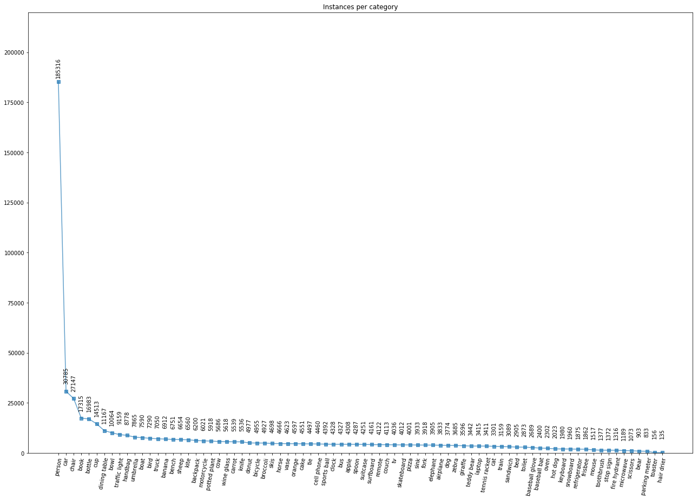
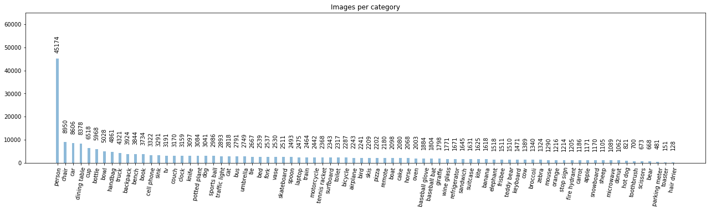
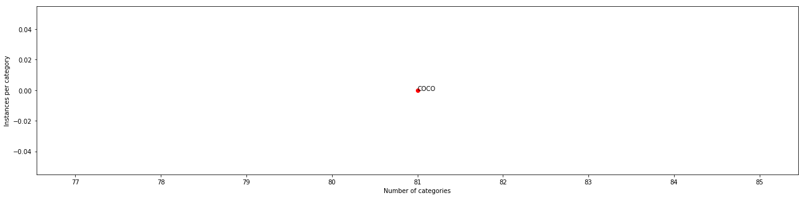

```python
'''
# Inspect Image Annotation Data created by VIA tool
Inspect and visualize data loading and pre-processing code.
'''
import os
import sys
import random
import math
import collections
import numpy as np
import matplotlib.pyplot as plt
import matplotlib.patches as patches

# Root directory of the project
ROOT_DIR = os.path.abspath("../../")

# Import Mask RCNN
sys.path.append(ROOT_DIR)  # To find local version of the library


from importlib import import_module
from ods import get_dnncfg
from ods import ODS
import core.utils as odsutils


%matplotlib inline
```

    Using TensorFlow backend.


```python
'''
## Load YAML file as easy dictionary object
'''
def yaml_load(fileName):
  import yaml
  from easydict import EasyDict as edict
  fc = None
  with open(fileName, 'r') as f:
    # fc = edict(yaml.load(f))
    fc = edict(yaml.safe_load(f))

  return fc


def get_cfgmap(cfgfile, datacfg):
  cfgmap = {
      'source':datacfg.NAME
      ,'cfgfile':cfgfile
      ,'datacfg':datacfg
    }
  return cfgmap


def load_dataset_cfg(cfgfiles):
  '''
  ## load_dataset_cfg
  '''
  ccfg = []
  for cfgfile in cfgfiles:
    datacfg = odsutils.yaml_load(cfgfile)
    cfgmap = get_cfgmap(cfgfile, datacfg)
    ccfg.append(cfgmap)

  return ccfg


def get_dataset_dnncfg(datacfg, subset = "train"):
    '''
    ## Load configurations file and create config object
    '''
    from importlib import import_module
    from core.InferenceConfig import InferenceConfig
    
    print("datacfg.DATACLASS: {}".format(datacfg.DATACLASS))

    mod = import_module(datacfg.DATACLASS)
    modcls = getattr(mod, datacfg.DATACLASS)
    
    dataset = modcls(datacfg.NAME)
    dataset.load_data(subset, datacfg)
    dataset.prepare()

    class_names = [ i['name'] for i in dataset.class_info]
    num_classes = len(dataset.class_info)
    datacfg.CLASSES = class_names
    datacfg.CONFIG.NAME = dataset.name
    datacfg.CONFIG.NUM_CLASSES = num_classes

    dnncfg = InferenceConfig(datacfg.CONFIG)
    
    return dataset, dnncfg


def get_dataset_names(ccfg):
  ds_names = [i['source'] for i in ccfg]
  return ds_names


def get_dataset_cfg(ccfg, name=None):
  print("ods:get_dataset_cfg---------------------------->")

  ds_cfgs = []
  
  # if not ccfg or len(ccfg) < 1:
  #   return ds_cfgs

  if name:
    ds_names = get_dataset_names(ccfg)
    ds_index = [i for i, j in enumerate(ds_names) if j == name]
    print("ds_index:{}".format(ds_index))
    if len(ds_index) > 0:
      # ds_cfgs = [ccfg[l]['datacfg'] for l in ds_index]
      ds_cfgs = {ccfg[k]['source']:ccfg[k]['datacfg'] for k in ds_index}
  else:
    ds_cfgs = {l['source']:l['datacfg'] for k,l in enumerate(ccfg)}

  return ds_cfgs

```


```python
'''
TBD:
* Images Stats:
    - total
    - dimensions: max, min, mean
* Annotations Stats:
    - total
    - area
'''

'''
## Configurations
Configurations are defined in `.yml` file
'''
'''
## Configurations
Configurations are defined in `.yml` file
'''
cfgroot = 'cfg'
cfgroot = 'cfg-dev'
cfgroot = 'cfg-local'

cfgfilename = 'hmd-cfg.yml'
cfgfilename = 'tsd-cfg.yml'
cfgfilename = 'road-cfg.yml'

cfgfilename = 'road-asphalt_both_side-cfg.yml'
cfgfilename = 'crosstrain-cfg-120319-1.yml'
cfgfilename = 'balloon-cfg.yml'
cfgfilename = 'coco_things-cfg.yml'

cfgfile = os.path.join(cfgroot, cfgfilename)
print("cfgfile:{}".format(cfgfile))

datacfg = yaml_load(cfgfile)
print(datacfg)
ccfg = None
error = False
dataset_cfg = None

## TBD: raise error
if 'DATASET_CFG' in datacfg:
  dataset_cfg = datacfg.DATASET_CFG
if dataset_cfg:
  ccfg = load_dataset_cfg(dataset_cfg)
else:
  error = True
  print("Empty DATASET_CFG! Please fix the configuration file: {}".format(cfgfile))

cifilepath = os.path.join(odsutils.getBasePath(cfgfile),'classinfo-'+os.path.basename(cfgfile)+'.json')

print("datacfg: {}".format(datacfg))
print("ccfg: {}".format(ccfg))
```

    cfgfile:cfg-local/coco_things-cfg.yml
    {'WEIGHTS': None, 'PROBLEM_ID': 'coco', 'AI_DATA': '/home/nikhil/Documents/ai-ml-dl-data', 'DATA_READ_THRESHOLD': -1, 'DATACLASS': 'HmdDataset', 'DEFAULT_DATASET_YEAR': '2014', 'RETURN_COCO': False, 'TRAIN_MODE': 'training', 'CLASSES': ['person', 'bicycle', 'car', 'motorcycle', 'airplane,', 'bus', 'train', 'truck', 'boat', 'traffic light,', 'fire hydrant', 'stop sign', 'parking meter', 'bench', 'bird,', 'cat', 'dog', 'horse', 'sheep', 'cow', 'elephant', 'bear,', 'zebra', 'giraffe', 'backpack', 'umbrella', 'handbag', 'tie,', 'suitcase', 'frisbee', 'skis', 'snowboard', 'sports ball,', 'kite', 'baseball bat', 'baseball glove', 'skateboard,', 'surfboard', 'tennis racket', 'bottle', 'wine glass', 'cup,', 'fork', 'knife', 'spoon', 'bowl', 'banana', 'apple,', 'sandwich', 'orange', 'broccoli', 'carrot', 'hot dog', 'pizza,', 'donut', 'cake', 'chair', 'couch', 'potted plant', 'bed,', 'dining table', 'toilet', 'tv', 'laptop', 'mouse', 'remote,', 'keyboard', 'cell phone', 'microwave', 'oven', 'toaster,', 'sink', 'refrigerator', 'book', 'clock', 'vase', 'scissors,', 'teddy bear', 'hair drier', 'toothbrush'], 'ANNOTATIONS': {'VAL': '/home/nikhil/Documents/ai-ml-dl-data/data/ms-coco/annotations/instances_val2014.json', 'TRAIN': '/home/nikhil/Documents/ai-ml-dl-data/data/ms-coco/annotations/instances_train2014.json'}, 'CONFIG': {'IMAGE_MAX_DIM': 1280, 'GPU_COUNT': 1, 'IMAGE_MIN_DIM': 720, 'IMAGES_PER_GPU': 1, 'DETECTION_MIN_CONFIDENCE': 0.9}, 'LOG_DIR': '/home/nikhil/Documents/ai-ml-dl-data/logs/mask_rcnn', 'COCO_WEIGHTS_PATH': None, 'ALLOWED_IMAGE_TYPE': ['.pdf', '.png', '.jpg', '.jpeg', '.gif'], 'NUM_CLASSES': 81, 'DB_DIR': '/home/nikhil/Documents/ai-ml-dl-data/data/ms-coco', 'ALLOWED_FILE_TYPE': ['.txt', '.csv', '.yml', '.json'], 'IMAGES': {'VAL': None, 'TRAIN': None}, 'WEIGHTS_PATH': '/home/nikhil/Documents/ai-ml-dl-data/data/matterport/object_detection_segmentation/1/mask_rcnn/weights/mask_rcnn_coco.h5', 'ALLOWED_VIDEO_TYPE': ['.mp4'], 'IMAGENET_WEIGHTS_PATH': None, 'DEFAULT_TASK': 'instances', 'NAME': 'coco', 'LOAD_WEIGHTS': {'EXCLUDE': ['mrcnn_class_logits', 'mrcnn_bbox_fc', 'mrcnn_bbox', 'mrcnn_mask'], 'BY_NAME': True}, 'ID': 'coco', 'RETURN_HMD': None, 'CLASS_MAP': None, 'CLASS_IDS': None, 'AUTO_DOWNLOAD': False, 'SPLITS': ['train', 'val'], 'DEVICE': '/gpu:0', 'SCHEDULES': [{'EPOCHS': 40, 'LAYERS': 'heads', 'LEARNING_RATE': 0.001}, {'EPOCHS': 120, 'LAYERS': '4+', 'LEARNING_RATE': 0.001}, {'EPOCHS': 160, 'LAYERS': 'all', 'LEARNING_RATE': 0.0001}], 'ANNON_TYPE': 'coco', 'LABELS': None, 'TEST_MODE': 'inference'}
    Empty DATASET_CFG! Please fix the configuration file: cfg-local/coco_things-cfg.yml
    datacfg: {'WEIGHTS': None, 'PROBLEM_ID': 'coco', 'AI_DATA': '/home/nikhil/Documents/ai-ml-dl-data', 'DATA_READ_THRESHOLD': -1, 'DATACLASS': 'HmdDataset', 'DEFAULT_DATASET_YEAR': '2014', 'RETURN_COCO': False, 'TRAIN_MODE': 'training', 'CLASSES': ['person', 'bicycle', 'car', 'motorcycle', 'airplane,', 'bus', 'train', 'truck', 'boat', 'traffic light,', 'fire hydrant', 'stop sign', 'parking meter', 'bench', 'bird,', 'cat', 'dog', 'horse', 'sheep', 'cow', 'elephant', 'bear,', 'zebra', 'giraffe', 'backpack', 'umbrella', 'handbag', 'tie,', 'suitcase', 'frisbee', 'skis', 'snowboard', 'sports ball,', 'kite', 'baseball bat', 'baseball glove', 'skateboard,', 'surfboard', 'tennis racket', 'bottle', 'wine glass', 'cup,', 'fork', 'knife', 'spoon', 'bowl', 'banana', 'apple,', 'sandwich', 'orange', 'broccoli', 'carrot', 'hot dog', 'pizza,', 'donut', 'cake', 'chair', 'couch', 'potted plant', 'bed,', 'dining table', 'toilet', 'tv', 'laptop', 'mouse', 'remote,', 'keyboard', 'cell phone', 'microwave', 'oven', 'toaster,', 'sink', 'refrigerator', 'book', 'clock', 'vase', 'scissors,', 'teddy bear', 'hair drier', 'toothbrush'], 'ANNOTATIONS': {'VAL': '/home/nikhil/Documents/ai-ml-dl-data/data/ms-coco/annotations/instances_val2014.json', 'TRAIN': '/home/nikhil/Documents/ai-ml-dl-data/data/ms-coco/annotations/instances_train2014.json'}, 'CONFIG': {'IMAGE_MAX_DIM': 1280, 'GPU_COUNT': 1, 'IMAGE_MIN_DIM': 720, 'IMAGES_PER_GPU': 1, 'DETECTION_MIN_CONFIDENCE': 0.9}, 'LOG_DIR': '/home/nikhil/Documents/ai-ml-dl-data/logs/mask_rcnn', 'COCO_WEIGHTS_PATH': None, 'ALLOWED_IMAGE_TYPE': ['.pdf', '.png', '.jpg', '.jpeg', '.gif'], 'NUM_CLASSES': 81, 'DB_DIR': '/home/nikhil/Documents/ai-ml-dl-data/data/ms-coco', 'ALLOWED_FILE_TYPE': ['.txt', '.csv', '.yml', '.json'], 'IMAGES': {'VAL': None, 'TRAIN': None}, 'WEIGHTS_PATH': '/home/nikhil/Documents/ai-ml-dl-data/data/matterport/object_detection_segmentation/1/mask_rcnn/weights/mask_rcnn_coco.h5', 'ALLOWED_VIDEO_TYPE': ['.mp4'], 'IMAGENET_WEIGHTS_PATH': None, 'DEFAULT_TASK': 'instances', 'NAME': 'coco', 'LOAD_WEIGHTS': {'EXCLUDE': ['mrcnn_class_logits', 'mrcnn_bbox_fc', 'mrcnn_bbox', 'mrcnn_mask'], 'BY_NAME': True}, 'ID': 'coco', 'RETURN_HMD': None, 'CLASS_MAP': None, 'CLASS_IDS': None, 'AUTO_DOWNLOAD': False, 'SPLITS': ['train', 'val'], 'DEVICE': '/gpu:0', 'SCHEDULES': [{'EPOCHS': 40, 'LAYERS': 'heads', 'LEARNING_RATE': 0.001}, {'EPOCHS': 120, 'LAYERS': '4+', 'LEARNING_RATE': 0.001}, {'EPOCHS': 160, 'LAYERS': 'all', 'LEARNING_RATE': 0.0001}], 'ANNON_TYPE': 'coco', 'LABELS': None, 'TEST_MODE': 'inference'}
    ccfg: None


```python
'''
inspect data
'''

subset = "train"
print("inspect_data---------------------------->{}".format(subset))

# class_names = self.get_class_names(datacfg, cifilepath)
# print("class_names: {}".format(class_names))
# dataset, dnncfg = get_dataset_dnncfg(datacfg, subset)
# dnncfg.display()

mod = import_module(datacfg.DATACLASS)
modcls = getattr(mod, datacfg.DATACLASS)

ods = ODS()

dataset, num_classes, num_images, class_names, total_stats, total_verify = ods.get_dataset_instance(modcls, subset, datacfg, ccfg)

print("class_names: {}".format(class_names))
print("len(class_names): {}".format(len(class_names)))
print("num_classes: {}".format(num_classes))
print("num_images: {}".format(num_images))


```

    inspect_data---------------------------->train
    ODS::get_dataset_instance::-------------------------------->
    load_data::subset:--------------------------------> train
    load_data:-----> coco
    load_data::fname: load_json_coco
    HmdDataset::load_json_coco::-------------------------------->
    CocoDataset: self.dataclass: <HmdDataset.HmdDataset object at 0x7f7cccebb748>
    CocoDataset::load_data: datacfg: {'WEIGHTS': None, 'PROBLEM_ID': 'coco', 'AI_DATA': '/home/nikhil/Documents/ai-ml-dl-data', 'DATA_READ_THRESHOLD': -1, 'DATACLASS': 'HmdDataset', 'DEFAULT_DATASET_YEAR': '2014', 'RETURN_COCO': False, 'TRAIN_MODE': 'training', 'CLASSES': ['person', 'bicycle', 'car', 'motorcycle', 'airplane,', 'bus', 'train', 'truck', 'boat', 'traffic light,', 'fire hydrant', 'stop sign', 'parking meter', 'bench', 'bird,', 'cat', 'dog', 'horse', 'sheep', 'cow', 'elephant', 'bear,', 'zebra', 'giraffe', 'backpack', 'umbrella', 'handbag', 'tie,', 'suitcase', 'frisbee', 'skis', 'snowboard', 'sports ball,', 'kite', 'baseball bat', 'baseball glove', 'skateboard,', 'surfboard', 'tennis racket', 'bottle', 'wine glass', 'cup,', 'fork', 'knife', 'spoon', 'bowl', 'banana', 'apple,', 'sandwich', 'orange', 'broccoli', 'carrot', 'hot dog', 'pizza,', 'donut', 'cake', 'chair', 'couch', 'potted plant', 'bed,', 'dining table', 'toilet', 'tv', 'laptop', 'mouse', 'remote,', 'keyboard', 'cell phone', 'microwave', 'oven', 'toaster,', 'sink', 'refrigerator', 'book', 'clock', 'vase', 'scissors,', 'teddy bear', 'hair drier', 'toothbrush'], 'ANNOTATIONS': {'VAL': '/home/nikhil/Documents/ai-ml-dl-data/data/ms-coco/annotations/instances_val2014.json', 'TRAIN': '/home/nikhil/Documents/ai-ml-dl-data/data/ms-coco/annotations/instances_train2014.json'}, 'CONFIG': {'IMAGE_MAX_DIM': 1280, 'GPU_COUNT': 1, 'IMAGE_MIN_DIM': 720, 'IMAGES_PER_GPU': 1, 'DETECTION_MIN_CONFIDENCE': 0.9}, 'LOG_DIR': '/home/nikhil/Documents/ai-ml-dl-data/logs/mask_rcnn', 'COCO_WEIGHTS_PATH': None, 'ALLOWED_IMAGE_TYPE': ['.pdf', '.png', '.jpg', '.jpeg', '.gif'], 'NUM_CLASSES': 81, 'DB_DIR': '/home/nikhil/Documents/ai-ml-dl-data/data/ms-coco', 'ALLOWED_FILE_TYPE': ['.txt', '.csv', '.yml', '.json'], 'IMAGES': {'VAL': None, 'TRAIN': None}, 'WEIGHTS_PATH': '/home/nikhil/Documents/ai-ml-dl-data/data/matterport/object_detection_segmentation/1/mask_rcnn/weights/mask_rcnn_coco.h5', 'ALLOWED_VIDEO_TYPE': ['.mp4'], 'IMAGENET_WEIGHTS_PATH': None, 'DEFAULT_TASK': 'instances', 'NAME': 'coco', 'LOAD_WEIGHTS': {'EXCLUDE': ['mrcnn_class_logits', 'mrcnn_bbox_fc', 'mrcnn_bbox', 'mrcnn_mask'], 'BY_NAME': True}, 'ID': 'coco', 'RETURN_HMD': None, 'CLASS_MAP': None, 'CLASS_IDS': None, 'AUTO_DOWNLOAD': False, 'SPLITS': ['train', 'val'], 'DEVICE': '/gpu:0', 'SCHEDULES': [{'EPOCHS': 40, 'LAYERS': 'heads', 'LEARNING_RATE': 0.001}, {'EPOCHS': 120, 'LAYERS': '4+', 'LEARNING_RATE': 0.001}, {'EPOCHS': 160, 'LAYERS': 'all', 'LEARNING_RATE': 0.0001}], 'ANNON_TYPE': 'coco', 'LABELS': None, 'TEST_MODE': 'inference'}
    annFileName: /home/nikhil/Documents/ai-ml-dl-data/data/ms-coco/annotations/instances_train2014.json
    image_dir: /home/nikhil/Documents/ai-ml-dl-data/data/ms-coco/train2014
    loading annotations into memory...
    Done (t=8.92s)
    creating index...
    index created!
    DATA_READ_THRESHOLD: -1
    name,index,v,class_name: coco,1,1,person
    name,index,v,class_name: coco,2,2,bicycle
    name,index,v,class_name: coco,3,3,car
    name,index,v,class_name: coco,4,4,motorcycle
    name,index,v,class_name: coco,5,5,airplane
    name,index,v,class_name: coco,6,6,bus
    name,index,v,class_name: coco,7,7,train
    name,index,v,class_name: coco,8,8,truck
    name,index,v,class_name: coco,9,9,boat
    name,index,v,class_name: coco,10,10,traffic light
    name,index,v,class_name: coco,11,11,fire hydrant
    name,index,v,class_name: coco,12,13,stop sign
    name,index,v,class_name: coco,13,14,parking meter
    name,index,v,class_name: coco,14,15,bench
    name,index,v,class_name: coco,15,16,bird
    name,index,v,class_name: coco,16,17,cat
    name,index,v,class_name: coco,17,18,dog
    name,index,v,class_name: coco,18,19,horse
    name,index,v,class_name: coco,19,20,sheep
    name,index,v,class_name: coco,20,21,cow
    name,index,v,class_name: coco,21,22,elephant
    name,index,v,class_name: coco,22,23,bear
    name,index,v,class_name: coco,23,24,zebra
    name,index,v,class_name: coco,24,25,giraffe
    name,index,v,class_name: coco,25,27,backpack
    name,index,v,class_name: coco,26,28,umbrella
    name,index,v,class_name: coco,27,31,handbag
    name,index,v,class_name: coco,28,32,tie
    name,index,v,class_name: coco,29,33,suitcase
    name,index,v,class_name: coco,30,34,frisbee
    name,index,v,class_name: coco,31,35,skis
    name,index,v,class_name: coco,32,36,snowboard
    name,index,v,class_name: coco,33,37,sports ball
    name,index,v,class_name: coco,34,38,kite
    name,index,v,class_name: coco,35,39,baseball bat
    name,index,v,class_name: coco,36,40,baseball glove
    name,index,v,class_name: coco,37,41,skateboard
    name,index,v,class_name: coco,38,42,surfboard
    name,index,v,class_name: coco,39,43,tennis racket
    name,index,v,class_name: coco,40,44,bottle
    name,index,v,class_name: coco,41,46,wine glass
    name,index,v,class_name: coco,42,47,cup
    name,index,v,class_name: coco,43,48,fork
    name,index,v,class_name: coco,44,49,knife
    name,index,v,class_name: coco,45,50,spoon
    name,index,v,class_name: coco,46,51,bowl
    name,index,v,class_name: coco,47,52,banana
    name,index,v,class_name: coco,48,53,apple
    name,index,v,class_name: coco,49,54,sandwich
    name,index,v,class_name: coco,50,55,orange
    name,index,v,class_name: coco,51,56,broccoli
    name,index,v,class_name: coco,52,57,carrot
    name,index,v,class_name: coco,53,58,hot dog
    name,index,v,class_name: coco,54,59,pizza
    name,index,v,class_name: coco,55,60,donut
    name,index,v,class_name: coco,56,61,cake
    name,index,v,class_name: coco,57,62,chair
    name,index,v,class_name: coco,58,63,couch
    name,index,v,class_name: coco,59,64,potted plant
    name,index,v,class_name: coco,60,65,bed
    name,index,v,class_name: coco,61,67,dining table
    name,index,v,class_name: coco,62,70,toilet
    name,index,v,class_name: coco,63,72,tv
    name,index,v,class_name: coco,64,73,laptop
    name,index,v,class_name: coco,65,74,mouse
    name,index,v,class_name: coco,66,75,remote
    name,index,v,class_name: coco,67,76,keyboard
    name,index,v,class_name: coco,68,77,cell phone
    name,index,v,class_name: coco,69,78,microwave
    name,index,v,class_name: coco,70,79,oven
    name,index,v,class_name: coco,71,80,toaster
    name,index,v,class_name: coco,72,81,sink
    name,index,v,class_name: coco,73,82,refrigerator
    name,index,v,class_name: coco,74,84,book
    name,index,v,class_name: coco,75,85,clock
    name,index,v,class_name: coco,76,86,vase
    name,index,v,class_name: coco,77,87,scissors
    name,index,v,class_name: coco,78,88,teddy bear
    name,index,v,class_name: coco,79,89,hair drier
    name,index,v,class_name: coco,80,90,toothbrush
    Total Images: 82081
    Total Annotations: 604907
    Total Classes: 80
    -------
    total_stats, total_verify are in the following format: [Image, Annotation, Classes]
    return...: dataset, num_classes, num_images, class_names, total_stats, total_verify
    
    num_classes: 81
    num_images: 82081
    class_names: ['BG', 'person', 'bicycle', 'car', 'motorcycle', 'airplane', 'bus', 'train', 'truck', 'boat', 'traffic light', 'fire hydrant', 'stop sign', 'parking meter', 'bench', 'bird', 'cat', 'dog', 'horse', 'sheep', 'cow', 'elephant', 'bear', 'zebra', 'giraffe', 'backpack', 'umbrella', 'handbag', 'tie', 'suitcase', 'frisbee', 'skis', 'snowboard', 'sports ball', 'kite', 'baseball bat', 'baseball glove', 'skateboard', 'surfboard', 'tennis racket', 'bottle', 'wine glass', 'cup', 'fork', 'knife', 'spoon', 'bowl', 'banana', 'apple', 'sandwich', 'orange', 'broccoli', 'carrot', 'hot dog', 'pizza', 'donut', 'cake', 'chair', 'couch', 'potted plant', 'bed', 'dining table', 'toilet', 'tv', 'laptop', 'mouse', 'remote', 'keyboard', 'cell phone', 'microwave', 'oven', 'toaster', 'sink', 'refrigerator', 'book', 'clock', 'vase', 'scissors', 'teddy bear', 'hair drier', 'toothbrush']
    total_stats: {'coco': [82081, 604907, 80]}
    total_verify: [82081, 604907, 80]
    
    ODS::------xx-------xxx-------xx----->
    
    
    class_names: ['BG', 'person', 'bicycle', 'car', 'motorcycle', 'airplane', 'bus', 'train', 'truck', 'boat', 'traffic light', 'fire hydrant', 'stop sign', 'parking meter', 'bench', 'bird', 'cat', 'dog', 'horse', 'sheep', 'cow', 'elephant', 'bear', 'zebra', 'giraffe', 'backpack', 'umbrella', 'handbag', 'tie', 'suitcase', 'frisbee', 'skis', 'snowboard', 'sports ball', 'kite', 'baseball bat', 'baseball glove', 'skateboard', 'surfboard', 'tennis racket', 'bottle', 'wine glass', 'cup', 'fork', 'knife', 'spoon', 'bowl', 'banana', 'apple', 'sandwich', 'orange', 'broccoli', 'carrot', 'hot dog', 'pizza', 'donut', 'cake', 'chair', 'couch', 'potted plant', 'bed', 'dining table', 'toilet', 'tv', 'laptop', 'mouse', 'remote', 'keyboard', 'cell phone', 'microwave', 'oven', 'toaster', 'sink', 'refrigerator', 'book', 'clock', 'vase', 'scissors', 'teddy bear', 'hair drier', 'toothbrush']
    len(class_names): 81
    num_classes: 81
    num_images: 82081


```python
name = dataset.name
datacfg.CLASSES = class_names
datacfg.CONFIG.NAME = name
datacfg.CONFIG.NUM_CLASSES = num_classes

dnncfg = get_dnncfg(datacfg.CONFIG)
```

    
    Configurations:
    BACKBONE                       resnet101
    BACKBONE_STRIDES               [4, 8, 16, 32, 64]
    BATCH_SIZE                     1
    BBOX_STD_DEV                   [0.1 0.1 0.2 0.2]
    COMPUTE_BACKBONE_SHAPE         None
    DETECTION_MAX_INSTANCES        100
    DETECTION_MIN_CONFIDENCE       0.9
    DETECTION_NMS_THRESHOLD        0.3
    FPN_CLASSIF_FC_LAYERS_SIZE     1024
    GPU_COUNT                      1
    GRADIENT_CLIP_NORM             5.0
    IMAGES_PER_GPU                 1
    IMAGE_CHANNEL_COUNT            3
    IMAGE_MAX_DIM                  1280
    IMAGE_META_SIZE                93
    IMAGE_MIN_DIM                  720
    IMAGE_MIN_SCALE                0
    IMAGE_RESIZE_MODE              square
    IMAGE_SHAPE                    [1280 1280    3]
    LEARNING_MOMENTUM              0.9
    LEARNING_RATE                  0.001
    LOSS_WEIGHTS                   {'rpn_bbox_loss': 1.0, 'mrcnn_class_loss': 1.0, 'mrcnn_mask_loss': 1.0, 'mrcnn_bbox_loss': 1.0, 'rpn_class_loss': 1.0}
    MASK_POOL_SIZE                 14
    MASK_SHAPE                     [28, 28]
    MAX_GT_INSTANCES               100
    MEAN_PIXEL                     [123.7 116.8 103.9]
    MINI_MASK_SHAPE                (56, 56)
    NAME                           coco
    NUM_CLASSES                    81
    POOL_SIZE                      7
    POST_NMS_ROIS_INFERENCE        1000
    POST_NMS_ROIS_TRAINING         2000
    PRE_NMS_LIMIT                  6000
    ROI_POSITIVE_RATIO             0.33
    RPN_ANCHOR_RATIOS              [0.5, 1, 2]
    RPN_ANCHOR_SCALES              (32, 64, 128, 256, 512)
    RPN_ANCHOR_STRIDE              1
    RPN_BBOX_STD_DEV               [0.1 0.1 0.2 0.2]
    RPN_NMS_THRESHOLD              0.7
    RPN_TRAIN_ANCHORS_PER_IMAGE    256
    STEPS_PER_EPOCH                1000
    TOP_DOWN_PYRAMID_SIZE          256
    TRAIN_BN                       False
    TRAIN_ROIS_PER_IMAGE           200
    USE_MINI_MASK                  True
    USE_RPN_ROIS                   True
    VALIDATION_STEPS               50
    WEIGHT_DECAY                   0.0001
    
    


```python
'''
Illustrate the datastructures that enables cross-training across multiple datasets at the same time.
In nutshell, class_ids list need to map to the respective dataset source and within that source
to the respective classname
'''
print("dataset.sources: \n{}".format(dataset.sources))
print("--------------")
print("dataset.class_info:\n{}".format(dataset.class_info))
print("--------------")
print("dataset.class_names:\n{}".format(dataset.class_names))
print("--------------")
print("dataset.class_ids:\n{}".format(dataset.class_ids))

print("--------------")
print("classname_from_source_map: \n{}".format(dataset.classname_from_source_map))

print("--------------")
print("classname_from_sourcename_map: \n{}".format(dataset.classname_from_sourcename_map))

print("--------------")
print("class_from_source_map: \n{}".format(dataset.class_from_source_map))
# print("image_from_source_map: \n{}".format(dataset.image_from_source_map))

print("--------------")
class_names_ids = dict(zip(dataset.class_names, dataset.class_ids))
print("class_names_ids: \n{}".format(class_names_ids))
```

    dataset.sources: 
    ['', 'coco']
    --------------
    dataset.class_info:
    [{'source': '', 'name': 'BG', 'id': 0}, {'source': 'coco', 'name': 'person', 'id': 1}, {'source': 'coco', 'name': 'bicycle', 'id': 2}, {'source': 'coco', 'name': 'car', 'id': 3}, {'source': 'coco', 'name': 'motorcycle', 'id': 4}, {'source': 'coco', 'name': 'airplane', 'id': 5}, {'source': 'coco', 'name': 'bus', 'id': 6}, {'source': 'coco', 'name': 'train', 'id': 7}, {'source': 'coco', 'name': 'truck', 'id': 8}, {'source': 'coco', 'name': 'boat', 'id': 9}, {'source': 'coco', 'name': 'traffic light', 'id': 10}, {'source': 'coco', 'name': 'fire hydrant', 'id': 11}, {'source': 'coco', 'name': 'stop sign', 'id': 13}, {'source': 'coco', 'name': 'parking meter', 'id': 14}, {'source': 'coco', 'name': 'bench', 'id': 15}, {'source': 'coco', 'name': 'bird', 'id': 16}, {'source': 'coco', 'name': 'cat', 'id': 17}, {'source': 'coco', 'name': 'dog', 'id': 18}, {'source': 'coco', 'name': 'horse', 'id': 19}, {'source': 'coco', 'name': 'sheep', 'id': 20}, {'source': 'coco', 'name': 'cow', 'id': 21}, {'source': 'coco', 'name': 'elephant', 'id': 22}, {'source': 'coco', 'name': 'bear', 'id': 23}, {'source': 'coco', 'name': 'zebra', 'id': 24}, {'source': 'coco', 'name': 'giraffe', 'id': 25}, {'source': 'coco', 'name': 'backpack', 'id': 27}, {'source': 'coco', 'name': 'umbrella', 'id': 28}, {'source': 'coco', 'name': 'handbag', 'id': 31}, {'source': 'coco', 'name': 'tie', 'id': 32}, {'source': 'coco', 'name': 'suitcase', 'id': 33}, {'source': 'coco', 'name': 'frisbee', 'id': 34}, {'source': 'coco', 'name': 'skis', 'id': 35}, {'source': 'coco', 'name': 'snowboard', 'id': 36}, {'source': 'coco', 'name': 'sports ball', 'id': 37}, {'source': 'coco', 'name': 'kite', 'id': 38}, {'source': 'coco', 'name': 'baseball bat', 'id': 39}, {'source': 'coco', 'name': 'baseball glove', 'id': 40}, {'source': 'coco', 'name': 'skateboard', 'id': 41}, {'source': 'coco', 'name': 'surfboard', 'id': 42}, {'source': 'coco', 'name': 'tennis racket', 'id': 43}, {'source': 'coco', 'name': 'bottle', 'id': 44}, {'source': 'coco', 'name': 'wine glass', 'id': 46}, {'source': 'coco', 'name': 'cup', 'id': 47}, {'source': 'coco', 'name': 'fork', 'id': 48}, {'source': 'coco', 'name': 'knife', 'id': 49}, {'source': 'coco', 'name': 'spoon', 'id': 50}, {'source': 'coco', 'name': 'bowl', 'id': 51}, {'source': 'coco', 'name': 'banana', 'id': 52}, {'source': 'coco', 'name': 'apple', 'id': 53}, {'source': 'coco', 'name': 'sandwich', 'id': 54}, {'source': 'coco', 'name': 'orange', 'id': 55}, {'source': 'coco', 'name': 'broccoli', 'id': 56}, {'source': 'coco', 'name': 'carrot', 'id': 57}, {'source': 'coco', 'name': 'hot dog', 'id': 58}, {'source': 'coco', 'name': 'pizza', 'id': 59}, {'source': 'coco', 'name': 'donut', 'id': 60}, {'source': 'coco', 'name': 'cake', 'id': 61}, {'source': 'coco', 'name': 'chair', 'id': 62}, {'source': 'coco', 'name': 'couch', 'id': 63}, {'source': 'coco', 'name': 'potted plant', 'id': 64}, {'source': 'coco', 'name': 'bed', 'id': 65}, {'source': 'coco', 'name': 'dining table', 'id': 67}, {'source': 'coco', 'name': 'toilet', 'id': 70}, {'source': 'coco', 'name': 'tv', 'id': 72}, {'source': 'coco', 'name': 'laptop', 'id': 73}, {'source': 'coco', 'name': 'mouse', 'id': 74}, {'source': 'coco', 'name': 'remote', 'id': 75}, {'source': 'coco', 'name': 'keyboard', 'id': 76}, {'source': 'coco', 'name': 'cell phone', 'id': 77}, {'source': 'coco', 'name': 'microwave', 'id': 78}, {'source': 'coco', 'name': 'oven', 'id': 79}, {'source': 'coco', 'name': 'toaster', 'id': 80}, {'source': 'coco', 'name': 'sink', 'id': 81}, {'source': 'coco', 'name': 'refrigerator', 'id': 82}, {'source': 'coco', 'name': 'book', 'id': 84}, {'source': 'coco', 'name': 'clock', 'id': 85}, {'source': 'coco', 'name': 'vase', 'id': 86}, {'source': 'coco', 'name': 'scissors', 'id': 87}, {'source': 'coco', 'name': 'teddy bear', 'id': 88}, {'source': 'coco', 'name': 'hair drier', 'id': 89}, {'source': 'coco', 'name': 'toothbrush', 'id': 90}]
    --------------
    dataset.class_names:
    ['BG', 'person', 'bicycle', 'car', 'motorcycle', 'airplane', 'bus', 'train', 'truck', 'boat', 'traffic light', 'fire hydrant', 'stop sign', 'parking meter', 'bench', 'bird', 'cat', 'dog', 'horse', 'sheep', 'cow', 'elephant', 'bear', 'zebra', 'giraffe', 'backpack', 'umbrella', 'handbag', 'tie', 'suitcase', 'frisbee', 'skis', 'snowboard', 'sports ball', 'kite', 'baseball bat', 'baseball glove', 'skateboard', 'surfboard', 'tennis racket', 'bottle', 'wine glass', 'cup', 'fork', 'knife', 'spoon', 'bowl', 'banana', 'apple', 'sandwich', 'orange', 'broccoli', 'carrot', 'hot dog', 'pizza', 'donut', 'cake', 'chair', 'couch', 'potted plant', 'bed', 'dining table', 'toilet', 'tv', 'laptop', 'mouse', 'remote', 'keyboard', 'cell phone', 'microwave', 'oven', 'toaster', 'sink', 'refrigerator', 'book', 'clock', 'vase', 'scissors', 'teddy bear', 'hair drier', 'toothbrush']
    --------------
    dataset.class_ids:
    [ 0  1  2  3  4  5  6  7  8  9 10 11 12 13 14 15 16 17 18 19 20 21 22 23
     24 25 26 27 28 29 30 31 32 33 34 35 36 37 38 39 40 41 42 43 44 45 46 47
     48 49 50 51 52 53 54 55 56 57 58 59 60 61 62 63 64 65 66 67 68 69 70 71
     72 73 74 75 76 77 78 79 80]
    --------------
    classname_from_source_map: 
    {'coco.58': 'hot dog', 'coco.85': 'clock', 'coco.32': 'tie', 'coco.81': 'sink', 'coco.72': 'tv', 'coco.55': 'orange', 'coco.38': 'kite', 'coco.10': 'traffic light', 'coco.80': 'toaster', 'coco.4': 'motorcycle', 'coco.3': 'car', 'coco.5': 'airplane', 'coco.20': 'sheep', 'coco.18': 'dog', 'coco.70': 'toilet', 'coco.90': 'toothbrush', 'coco.64': 'potted plant', 'coco.42': 'surfboard', 'coco.35': 'skis', 'coco.15': 'bench', 'coco.31': 'handbag', 'coco.51': 'bowl', 'coco.76': 'keyboard', 'coco.33': 'suitcase', 'coco.25': 'giraffe', '.0': 'BG', 'coco.50': 'spoon', 'coco.22': 'elephant', 'coco.79': 'oven', 'coco.7': 'train', 'coco.19': 'horse', 'coco.89': 'hair drier', 'coco.40': 'baseball glove', 'coco.27': 'backpack', 'coco.82': 'refrigerator', 'coco.8': 'truck', 'coco.54': 'sandwich', 'coco.61': 'cake', 'coco.57': 'carrot', 'coco.23': 'bear', 'coco.73': 'laptop', 'coco.39': 'baseball bat', 'coco.37': 'sports ball', 'coco.67': 'dining table', 'coco.47': 'cup', 'coco.56': 'broccoli', 'coco.9': 'boat', 'coco.24': 'zebra', 'coco.53': 'apple', 'coco.11': 'fire hydrant', 'coco.1': 'person', 'coco.63': 'couch', 'coco.2': 'bicycle', 'coco.62': 'chair', 'coco.41': 'skateboard', 'coco.77': 'cell phone', 'coco.21': 'cow', 'coco.43': 'tennis racket', 'coco.59': 'pizza', 'coco.6': 'bus', 'coco.17': 'cat', 'coco.88': 'teddy bear', 'coco.49': 'knife', 'coco.28': 'umbrella', 'coco.65': 'bed', 'coco.86': 'vase', 'coco.78': 'microwave', 'coco.60': 'donut', 'coco.16': 'bird', 'coco.75': 'remote', 'coco.84': 'book', 'coco.14': 'parking meter', 'coco.48': 'fork', 'coco.87': 'scissors', 'coco.46': 'wine glass', 'coco.52': 'banana', 'coco.74': 'mouse', 'coco.44': 'bottle', 'coco.36': 'snowboard', 'coco.13': 'stop sign', 'coco.34': 'frisbee'}
    --------------
    classname_from_sourcename_map: 
    {'coco.clock': 75, 'coco.giraffe': 24, 'coco.hot dog': 53, 'coco.cup': 42, 'coco.cat': 16, 'coco.boat': 9, 'coco.cell phone': 68, 'coco.umbrella': 26, 'coco.parking meter': 13, 'coco.laptop': 64, 'coco.zebra': 23, 'coco.bird': 15, 'coco.sandwich': 49, 'coco.kite': 34, 'coco.stop sign': 12, 'coco.dog': 17, 'coco.fork': 43, 'coco.hair drier': 79, 'coco.truck': 8, 'coco.fire hydrant': 11, 'coco.tv': 63, 'coco.elephant': 21, 'coco.keyboard': 67, 'coco.toothbrush': 80, 'coco.frisbee': 30, 'coco.train': 7, 'coco.suitcase': 29, 'coco.handbag': 27, 'coco.baseball glove': 36, 'coco.bus': 6, 'coco.apple': 48, 'coco.bicycle': 2, 'coco.skateboard': 37, 'coco.pizza': 54, 'coco.tie': 28, 'coco.sheep': 19, 'coco.cow': 20, 'coco.snowboard': 32, 'coco.tennis racket': 39, 'coco.knife': 44, 'coco.vase': 76, 'coco.wine glass': 41, '.BG': 0, 'coco.motorcycle': 4, 'coco.cake': 56, 'coco.carrot': 52, 'coco.couch': 58, 'coco.book': 74, 'coco.remote': 66, 'coco.toilet': 62, 'coco.scissors': 77, 'coco.sports ball': 33, 'coco.toaster': 71, 'coco.backpack': 25, 'coco.oven': 70, 'coco.banana': 47, 'coco.bench': 14, 'coco.orange': 50, 'coco.broccoli': 51, 'coco.bowl': 46, 'coco.car': 3, 'coco.surfboard': 38, 'coco.dining table': 61, 'coco.potted plant': 59, 'coco.bottle': 40, 'coco.horse': 18, 'coco.teddy bear': 78, 'coco.chair': 57, 'coco.bear': 22, 'coco.mouse': 65, 'coco.baseball bat': 35, 'coco.bed': 60, 'coco.sink': 72, 'coco.airplane': 5, 'coco.traffic light': 10, 'coco.microwave': 69, 'coco.spoon': 45, 'coco.person': 1, 'coco.donut': 55, 'coco.refrigerator': 73, 'coco.skis': 31}
    --------------
    class_from_source_map: 
    {'coco.58': 53, 'coco.85': 75, 'coco.32': 28, 'coco.81': 72, 'coco.72': 63, 'coco.55': 50, 'coco.38': 34, 'coco.10': 10, 'coco.80': 71, 'coco.4': 4, 'coco.3': 3, 'coco.5': 5, 'coco.20': 19, 'coco.18': 17, 'coco.70': 62, 'coco.90': 80, 'coco.64': 59, 'coco.42': 38, 'coco.35': 31, 'coco.15': 14, 'coco.31': 27, 'coco.51': 46, 'coco.76': 67, 'coco.33': 29, 'coco.25': 24, '.0': 0, 'coco.50': 45, 'coco.22': 21, 'coco.79': 70, 'coco.7': 7, 'coco.19': 18, 'coco.89': 79, 'coco.40': 36, 'coco.27': 25, 'coco.82': 73, 'coco.8': 8, 'coco.54': 49, 'coco.61': 56, 'coco.57': 52, 'coco.23': 22, 'coco.73': 64, 'coco.39': 35, 'coco.37': 33, 'coco.67': 61, 'coco.47': 42, 'coco.56': 51, 'coco.9': 9, 'coco.24': 23, 'coco.53': 48, 'coco.11': 11, 'coco.1': 1, 'coco.63': 58, 'coco.2': 2, 'coco.62': 57, 'coco.41': 37, 'coco.77': 68, 'coco.21': 20, 'coco.43': 39, 'coco.59': 54, 'coco.6': 6, 'coco.17': 16, 'coco.88': 78, 'coco.49': 44, 'coco.28': 26, 'coco.65': 60, 'coco.86': 76, 'coco.78': 69, 'coco.60': 55, 'coco.16': 15, 'coco.75': 66, 'coco.84': 74, 'coco.14': 13, 'coco.48': 43, 'coco.87': 77, 'coco.46': 41, 'coco.52': 47, 'coco.74': 65, 'coco.44': 40, 'coco.36': 32, 'coco.13': 12, 'coco.34': 30}
    --------------
    class_names_ids: 
    {'sheep': 19, 'boat': 9, 'teddy bear': 78, 'dining table': 61, 'orange': 50, 'cat': 16, 'bird': 15, 'scissors': 77, 'hot dog': 53, 'frisbee': 30, 'hair drier': 79, 'cell phone': 68, 'handbag': 27, 'bicycle': 2, 'knife': 44, 'BG': 0, 'tennis racket': 39, 'baseball glove': 36, 'microwave': 69, 'vase': 76, 'keyboard': 67, 'toothbrush': 80, 'remote': 66, 'zebra': 23, 'bear': 22, 'traffic light': 10, 'broccoli': 51, 'person': 1, 'kite': 34, 'toilet': 62, 'banana': 47, 'suitcase': 29, 'cake': 56, 'elephant': 21, 'bed': 60, 'backpack': 25, 'bottle': 40, 'toaster': 71, 'tv': 63, 'sink': 72, 'fork': 43, 'refrigerator': 73, 'car': 3, 'potted plant': 59, 'apple': 48, 'donut': 55, 'airplane': 5, 'clock': 75, 'couch': 58, 'stop sign': 12, 'snowboard': 32, 'bench': 14, 'cow': 20, 'chair': 57, 'bowl': 46, 'skis': 31, 'parking meter': 13, 'sandwich': 49, 'train': 7, 'wine glass': 41, 'skateboard': 37, 'book': 74, 'pizza': 54, 'surfboard': 38, 'cup': 42, 'motorcycle': 4, 'dog': 17, 'giraffe': 24, 'laptop': 64, 'tie': 28, 'fire hydrant': 11, 'bus': 6, 'spoon': 45, 'oven': 70, 'carrot': 52, 'sports ball': 33, 'umbrella': 26, 'truck': 8, 'mouse': 65, 'baseball bat': 35, 'horse': 18}


```python
ii=dataset.image_info
total_ann = 0
total_ann_per_classname = {}
total_stats_per_classname = {}

stats = {
    'classname':[]
    ,'total_ann':[]
    ,'total_img':[]
}
for instances in ii:
    ann=instances['annotations']
    total_ann += len(instances['annotations'])
    for cti in ann:
        ct=cti['category_id']
        iid=cti['image_id']
        classname = dataset.classname_from_source_map["coco."+str(ct)]
        if classname not in total_stats_per_classname:
            total_ann_per_classname[classname] = 0
            total_stats_per_classname[classname] = {
                'total_ann':0
                ,'total_img':set()
            }
            
        total_ann_per_classname[classname] += 1
        total_stats_per_classname[classname]['total_ann'] += 1
        total_stats_per_classname[classname]['total_img'].add(str(iid))

for classname in total_stats_per_classname.keys():
    total_stats_per_classname[classname]['total_img'] = len(total_stats_per_classname[classname]['total_img'])
    total_ann = total_stats_per_classname[classname]['total_ann']
    total_img = total_stats_per_classname[classname]['total_img']
    stats['classname'].append(classname)
    stats['total_ann'].append(total_ann)
    stats['total_img'].append(total_img)

assert len(stats['classname']) == len(stats['total_ann']) == len(stats['total_img'])


# print(ld)
#print(total_ann)
print(total_stats_per_classname)
print(stats)

```

    {'sheep': {'total_img': 1105, 'total_ann': 6654}, 'toilet': {'total_img': 2317, 'total_ann': 2873}, 'dining table': {'total_img': 8378, 'total_ann': 11167}, 'orange': {'total_img': 1216, 'total_ann': 4597}, 'cat': {'total_img': 2818, 'total_ann': 3301}, 'bird': {'total_img': 2241, 'total_ann': 7290}, 'hot dog': {'total_img': 821, 'total_ann': 2023}, 'train': {'total_img': 2464, 'total_ann': 3159}, 'frisbee': {'total_img': 1511, 'total_ann': 1862}, 'hair drier': {'total_img': 128, 'total_ann': 135}, 'cell phone': {'total_img': 3322, 'total_ann': 4460}, 'handbag': {'total_img': 4861, 'total_ann': 8778}, 'bicycle': {'total_img': 2287, 'total_ann': 4955}, 'knife': {'total_img': 3097, 'total_ann': 5536}, 'boat': {'total_img': 2098, 'total_ann': 7590}, 'kite': {'total_img': 1625, 'total_ann': 6560}, 'broccoli': {'total_img': 1340, 'total_ann': 4927}, 'scissors': {'total_img': 673, 'total_ann': 1073}, 'vase': {'total_img': 2530, 'total_ann': 4623}, 'keyboard': {'total_img': 1471, 'total_ann': 1980}, 'cow': {'total_img': 1389, 'total_ann': 5686}, 'horse': {'total_img': 2068, 'total_ann': 4666}, 'zebra': {'total_img': 1324, 'total_ann': 3685}, 'bear': {'total_img': 668, 'total_ann': 903}, 'traffic light': {'total_img': 2893, 'total_ann': 9159}, 'mouse': {'total_img': 1290, 'total_ann': 1517}, 'person': {'total_img': 45174, 'total_ann': 185316}, 'teddy bear': {'total_img': 1510, 'total_ann': 3442}, 'banana': {'total_img': 1618, 'total_ann': 6912}, 'suitcase': {'total_img': 1631, 'total_ann': 4251}, 'cake': {'total_img': 2080, 'total_ann': 4551}, 'elephant': {'total_img': 1518, 'total_ann': 3905}, 'sports ball': {'total_img': 2986, 'total_ann': 4392}, 'couch': {'total_img': 3170, 'total_ann': 4113}, 'backpack': {'total_img': 3924, 'total_ann': 6200}, 'bottle': {'total_img': 5968, 'total_ann': 16983}, 'toaster': {'total_img': 151, 'total_ann': 156}, 'tv': {'total_img': 3191, 'total_ann': 4036}, 'tennis racket': {'total_img': 2368, 'total_ann': 3411}, 'fork': {'total_img': 2537, 'total_ann': 3918}, 'refrigerator': {'total_img': 1671, 'total_ann': 1875}, 'car': {'total_img': 8606, 'total_ann': 30785}, 'potted plant': {'total_img': 3084, 'total_ann': 5918}, 'apple': {'total_img': 1171, 'total_ann': 4308}, 'donut': {'total_img': 1062, 'total_ann': 4977}, 'airplane': {'total_img': 2243, 'total_ann': 3833}, 'clock': {'total_img': 3159, 'total_ann': 4328}, 'bed': {'total_img': 2539, 'total_ann': 2905}, 'stop sign': {'total_img': 1214, 'total_ann': 1372}, 'snowboard': {'total_img': 1170, 'total_ann': 1960}, 'bench': {'total_img': 3844, 'total_ann': 6751}, 'microwave': {'total_img': 1089, 'total_ann': 1189}, 'chair': {'total_img': 8950, 'total_ann': 27147}, 'bowl': {'total_img': 5028, 'total_ann': 10064}, 'skis': {'total_img': 2209, 'total_ann': 4698}, 'parking meter': {'total_img': 481, 'total_ann': 833}, 'baseball glove': {'total_img': 1884, 'total_ann': 2689}, 'umbrella': {'total_img': 2749, 'total_ann': 7865}, 'remote': {'total_img': 2180, 'total_ann': 4122}, 'wine glass': {'total_img': 1771, 'total_ann': 5618}, 'skateboard': {'total_img': 2511, 'total_ann': 4012}, 'book': {'total_img': 3734, 'total_ann': 17315}, 'pizza': {'total_img': 2202, 'total_ann': 4001}, 'surfboard': {'total_img': 2343, 'total_ann': 4161}, 'cup': {'total_img': 6518, 'total_ann': 14513}, 'motorcycle': {'total_img': 2442, 'total_ann': 6021}, 'dog': {'total_img': 3041, 'total_ann': 3774}, 'giraffe': {'total_img': 1798, 'total_ann': 3596}, 'baseball bat': {'total_img': 1804, 'total_ann': 2400}, 'fire hydrant': {'total_img': 1205, 'total_ann': 1316}, 'bus': {'total_img': 2791, 'total_ann': 4327}, 'sandwich': {'total_img': 1645, 'total_ann': 3089}, 'spoon': {'total_img': 2493, 'total_ann': 4287}, 'oven': {'total_img': 2003, 'total_ann': 2302}, 'carrot': {'total_img': 1186, 'total_ann': 5539}, 'sink': {'total_img': 3291, 'total_ann': 3933}, 'toothbrush': {'total_img': 700, 'total_ann': 1377}, 'truck': {'total_img': 4321, 'total_ann': 7050}, 'tie': {'total_img': 2667, 'total_ann': 4497}, 'laptop': {'total_img': 2475, 'total_ann': 3415}}
    {'total_img': [1105, 2317, 8378, 1216, 2818, 2241, 821, 2464, 1511, 128, 3322, 4861, 2287, 3097, 2098, 1625, 1340, 673, 2530, 1471, 1389, 2068, 1324, 668, 2893, 1290, 45174, 1510, 1618, 1631, 2080, 1518, 2986, 3170, 3924, 5968, 151, 3191, 2368, 2537, 1671, 8606, 3084, 1171, 1062, 2243, 3159, 2539, 1214, 1170, 3844, 1089, 8950, 5028, 2209, 481, 1884, 2749, 2180, 1771, 2511, 3734, 2202, 2343, 6518, 2442, 3041, 1798, 1804, 1205, 2791, 1645, 2493, 2003, 1186, 3291, 700, 4321, 2667, 2475], 'classname': ['sheep', 'toilet', 'dining table', 'orange', 'cat', 'bird', 'hot dog', 'train', 'frisbee', 'hair drier', 'cell phone', 'handbag', 'bicycle', 'knife', 'boat', 'kite', 'broccoli', 'scissors', 'vase', 'keyboard', 'cow', 'horse', 'zebra', 'bear', 'traffic light', 'mouse', 'person', 'teddy bear', 'banana', 'suitcase', 'cake', 'elephant', 'sports ball', 'couch', 'backpack', 'bottle', 'toaster', 'tv', 'tennis racket', 'fork', 'refrigerator', 'car', 'potted plant', 'apple', 'donut', 'airplane', 'clock', 'bed', 'stop sign', 'snowboard', 'bench', 'microwave', 'chair', 'bowl', 'skis', 'parking meter', 'baseball glove', 'umbrella', 'remote', 'wine glass', 'skateboard', 'book', 'pizza', 'surfboard', 'cup', 'motorcycle', 'dog', 'giraffe', 'baseball bat', 'fire hydrant', 'bus', 'sandwich', 'spoon', 'oven', 'carrot', 'sink', 'toothbrush', 'truck', 'tie', 'laptop'], 'total_ann': [6654, 2873, 11167, 4597, 3301, 7290, 2023, 3159, 1862, 135, 4460, 8778, 4955, 5536, 7590, 6560, 4927, 1073, 4623, 1980, 5686, 4666, 3685, 903, 9159, 1517, 185316, 3442, 6912, 4251, 4551, 3905, 4392, 4113, 6200, 16983, 156, 4036, 3411, 3918, 1875, 30785, 5918, 4308, 4977, 3833, 4328, 2905, 1372, 1960, 6751, 1189, 27147, 10064, 4698, 833, 2689, 7865, 4122, 5618, 4012, 17315, 4001, 4161, 14513, 6021, 3774, 3596, 2400, 1316, 4327, 3089, 4287, 2302, 5539, 3933, 1377, 7050, 4497, 3415]}


```python
iArr = {}
for i in range(len(stats["total_img"])):
  iArr[stats["total_img"][i]] = {"classname":stats["classname"][i],"total_img":stats["total_img"][i],"total_ann":stats["total_ann"][i]}
sortedVal = sorted(iArr,reverse=True)

sorted_img = {"classname":[],"total_img":[],"total_ann":[]}
for i in range(len(sortedVal)):
  sorted_img["classname"].append(iArr[sortedVal[i]]["classname"])
  sorted_img["total_img"].append(iArr[sortedVal[i]]["total_img"])
  sorted_img["total_ann"].append(iArr[sortedVal[i]]["total_ann"])

iArr1 = {}
for i in range(len(stats["total_ann"])):
  iArr1[stats["total_ann"][i]] = {"classname":stats["classname"][i],"total_img":stats["total_img"][i],"total_ann":stats["total_ann"][i]}
sortedVal1 = sorted(iArr1,reverse=True)

sorted_ann = {"classname":[],"total_img":[],"total_ann":[]}
for i in range(len(sortedVal1)):
  sorted_ann["classname"].append(iArr1[sortedVal1[i]]["classname"])
  sorted_ann["total_img"].append(iArr1[sortedVal1[i]]["total_img"])
  sorted_ann["total_ann"].append(iArr1[sortedVal1[i]]["total_ann"])

# print("stats",stats)
# print("sorted_img", sorted_img)
# print("sorted_ann",sorted_ann)
```


```python
labels=sorted_ann['classname']
total_ann=sorted_ann['total_ann']
x_pos_labels = np.arange(len(labels))
plt.plot(x_pos_labels, total_ann, 's-' , alpha=0.7)
plt.ylim(0,220000)
plt.xticks(x_pos_labels, labels, rotation=80, fontsize=10)
plt.title('Instances per category')
plt.rcParams["figure.figsize"] = [22,15]  
for a,b in zip(x_pos_labels, total_ann):
    c=b+10000
    plt.text(a, c, str(b),rotation='vertical',ha='center')
```





```python
labels=sorted_img['classname']
total_img=sorted_img['total_img']
# total_img.sort(reverse = True)
x_pos_labels = np.arange(len(labels))
plt.bar(x_pos_labels, total_img, align='center', alpha=0.5, width =0.35)
plt.ylim(0,65000)
plt.xticks(x_pos_labels, labels, rotation=80)
plt.title('Images per category')
plt.rcParams["figure.figsize"] = [22,5]  
for a,b in zip(x_pos_labels, total_img):
    c=b+8000
    plt.text(a, c, str(b),rotation='vertical',ha='center')
```





```python
summary_header = ['min','max','avg','median']
print("summary-------->")
for i in ['total_ann', 'total_img']:
    print("{}: ------->".format(i))
    print("{}".format(summary_header))
    summary = [np.min(stats[i]), np.max(stats[i]), np.average(stats[i]), np.median(stats[i])]
    print("{}".format(summary))

```

    summary-------->
    total_ann: ------->
    ['min', 'max', 'avg', 'median']
    [135, 185316, 7561.3375, 4269.0]
    total_img: ------->
    ['min', 'max', 'avg', 'median']
    [128, 45174, 3012.9375, 2225.0]


```python
total_ann_verify = 0
total_ann_per_classname = stats["total_ann"]
instances_per_category = []
labels = []
for i,v in enumerate(total_ann_per_classname):
    print("i,v, total_ann_per_classname[v]: {},{},{}".format(i,v, total_ann_per_classname[v]))
    total_ann_verify += total_ann_per_classname[v]
    instances_per_category.append(total_ann_per_classname[v])
    labels.append(v)
        
print("total_ann_verify: {}".format(total_ann_verify))
print("instances_per_category: {}".format(instances_per_category))
print("labels: {}".format(labels))

# verify_ipl = dict(zip(labels,instances_per_category))
# print(verify_ipl)
# print(verify_ipl == total_ann_per_classname)

```


    ---------------------------------------------------------------------------

    IndexError                                Traceback (most recent call last)

    <ipython-input-14-db4beb7fc7a1> in <module>
          4 labels = []
          5 for i,v in enumerate(total_ann_per_classname):
    ----> 6     print("i,v, total_ann_per_classname[v]: {},{},{}".format(i,v, total_ann_per_classname[v]))
          7     total_ann_verify += total_ann_per_classname[v]
          8     instances_per_category.append(total_ann_per_classname[v])


    IndexError: list index out of range


```python
no_of_category=len(dataset.class_names)
total_no_of_instance_per_category = np.sum(instances_per_category)
print(total_no_of_instance_per_category)

plt.plot(no_of_category,total_no_of_instance_per_category, 'ro')
plt.ylabel("Instances per category")
plt.xlabel("Number of categories")
plt.rcParams["figure.figsize"] = [7,4] 
plt.text(no_of_category,total_no_of_instance_per_category,"COCO" )
plt.show()

```

    0.0





```python
print(len(dataset.image_info))

per_of_images=0
coco_stats = {
    'no_of_category': no_of_category,
    'total_no_of_instance_per_category':total_no_of_instance_per_category,
    'total_ann_per_classname':total_ann_per_classname
}
print(coco_stats)

```

    82081
    {'total_no_of_instance_per_category': 0.0, 'total_ann_per_classname': [6654, 2873, 11167, 4597, 3301, 7290, 2023, 3159, 1862, 135, 4460, 8778, 4955, 5536, 7590, 6560, 4927, 1073, 4623, 1980, 5686, 4666, 3685, 903, 9159, 1517, 185316, 3442, 6912, 4251, 4551, 3905, 4392, 4113, 6200, 16983, 156, 4036, 3411, 3918, 1875, 30785, 5918, 4308, 4977, 3833, 4328, 2905, 1372, 1960, 6751, 1189, 27147, 10064, 4698, 833, 2689, 7865, 4122, 5618, 4012, 17315, 4001, 4161, 14513, 6021, 3774, 3596, 2400, 1316, 4327, 3089, 4287, 2302, 5539, 3933, 1377, 7050, 4497, 3415], 'no_of_category': 81}

